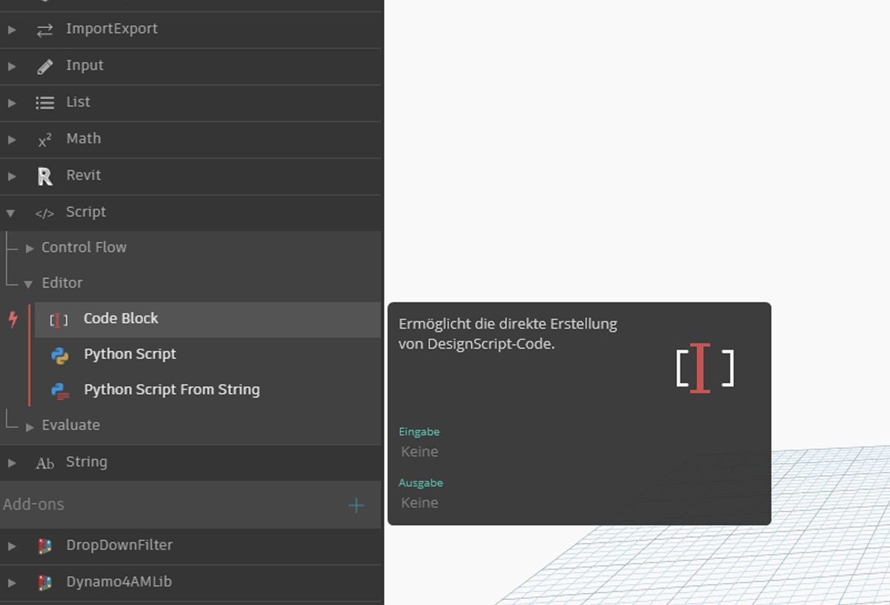

## Was ist ein Codeblock?

Codeblöcke geben Zugang zu DesignScript, der Programmiersprache, die Dynamo zugrunde liegt. DesignScript ist eine völlig neu entwickelte, leicht lesbare und knappe Programmiersprache speziell für experimentelle Arbeitsabläufe, die sowohl sofortiges Feedback für kleine Codeabschnitte als auch Skalierungsmöglichkeiten für umfangreiche und komplexe Interaktionen bietet. DesignScript ist zugleich das Kernstück der Engine, die die meisten Funktionen von Dynamo "hinter den Kulissen" steuert. Für fast jede Funktion in Dynamo-Blöcken und -Interaktionen ist eine entsprechende Funktion in der Skriptsprache vorhanden. Aus diesem Grund stehen einzigartige Möglichkeiten für einen nahtlosen Übergang zwischen Block-Interaktionen und Skripterstellung zur Verfügung.  Blöcke können automatisch in Textsyntax konvertiert werden, etwa um Anfängern den Einstieg in DesignScript zu erleichtern oder um ganz einfach größere
Abschnitte eines Diagramms auf kleinerem Raum zusammenzufassen. Hierfür steht die Funktion Block zu Code zur Verfügung, die im Abschnitt [DesignScript-Syntax](7-2_Design-Script-syntax.md) genauer beschrieben wird. Benutzer mit umfassender Erfahrung können in Codeblöcken unter Verwendung vieler Standardparadigmen der Codeerstellung benutzerdefinierte Mashups bestehender Funktionen sowie eigene Beziehungen erstellen. Benutzer, die über einige Erfahrung verfügen, aber keine Experten sind, finden zahlreiche Shortcuts und Codeabschnitte, mit deren Hilfe sie schneller an ihren Entwürfen arbeiten können. Der Begriff "Codeblock" mag zwar für Benutzer ohne Programmierkenntnisse etwas zu fachspezifisch wirken, die Codeblöcke selbst sind jedoch benutzerfreundlich und robust. Für den Einstieg können Codeblöcke mit einem Minimum an Codeerstellung effizient eingesetzt werden, während Benutzer mit fortgeschrittenen Kenntnissen Skriptdefinitionen definieren und
gegebenenfalls an anderer Stelle in einer Dynamo-Definition erneut aufrufen können.

### Codeblock: kurzer Überblick

Codeblöcke sind, kurz zusammengefasst, eine Oberfläche für Textskripts innerhalb einer Umgebung für visuelles Skripting. Sie können für Zahlen, Zeichenfolgen, Formeln und andere Datentypen verwendet werden. Die Codeblock-Funktion wurde für Dynamo entwickelt. Sie können daher beliebige Variable im Codeblock definieren, die anschließend automatisch den Eingaben des Blocks hinzugefügt werden:

Bei Codeblöcken kann der Benutzer flexibel entscheiden, wie die Eingaben festgelegt werden sollen. Die folgenden Abbildungen zeigen verschiedene Möglichkeiten zum Erstellen eines einfachen Punkts mit den Koordinaten *(10, 5, 0)*: 

Während Sie weitere Funktionen aus der Bibliothek kennenlernen, erweist sich eventuell die Eingabe von "Point.ByCoordinates" als leichter und schneller als die Suche nach dem passenden Block in der Bibliothek. Wenn Sie beispielsweise *"Point."* eingeben, zeigt Dynamo eine Liste möglicher Funktionen an, die auf einen Punkt angewendet werden können. Dadurch gestaltet sich die Skripterstellung intuitiver und die Anwendung von Funktionen in Dynamo ist leichter zu erlernen.

### Erstellen von Codeblock-Blöcken

Der Codeblock befindet sich unter *Core > Input > Actions > Code Block*. Sie können den Codeblock jedoch auch wesentlich schneller durch einfaches Doppelklicken im Ansichtsbereich aufrufen. Dieser Block wird so häufig verwendet, dass ihm uneingeschränkte Doppelklickfunktionen zugewiesen wurden.

### Zahlen, Zeichenfolgen und Formeln

Codeblöcke können auch flexibel für unterschiedliche Datentypen eingesetzt werden. Die Benutzer können rasch Zahlen, Zeichenfolgen und Formeln definieren und der Codeblock liefert die gewünschte Ausgabe.

Die folgende Abbildung zeigt, dass der "herkömmliche" Ablauf für diese Angaben etwas umständlich ist: Der Benutzer sucht in der Benutzeroberfläche nach dem gewünschten Block, fügt diesen im Ansichtsbereich hinzu und gibt die Daten ein. Einen Codeblock hingegen kann der Benutzer durch Doppelklicken im Ansichtsbereich aufrufen, um anschließend den benötigten Datentyp in der entsprechenden Syntax einzugeben. 

> Die Blöcke *number*, *string* und *formula* sind drei Beispiele für Dynamo-Blöcke, die im Vergleich zu *Code Block* als veraltet betrachtet werden könnten.

