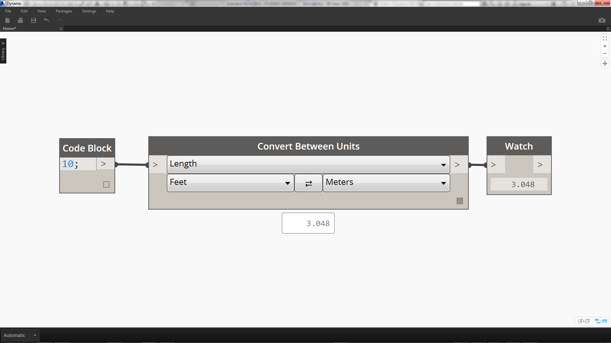

## Bearbeiten

Zu den leistungsstarken Funktionen von Dynamo gehört die Möglichkeit zum Bearbeiten von Parametern auf parametrischer Ebene. Sie können beispielsweise die Parameter eines Arrays aus Elementen mithilfe eines generativen Algorithmus oder der Ergebnisse einer Simulation steuern. Auf diese Weise können Sie einer Gruppe von Exemplaren aus derselben Familie benutzerdefinierte Eigenschaften im Revit-Projekt zuweisen.

### Typen- und Exemplarparameter


> 1. Exemplarparameter definieren die Öffnung der Elemente in der Dachoberfläche mit einem Öffnungsanteil zwischen 0.1 und 0.4.
2. Typenparameter werden auf sämtliche Elemente der Oberfläche angewendet, da diese zum selben Familientyp gehören. So kann beispielsweise das Material der einzelnen Elemente durch einen Typenparameter gesteuert werden.


> 1. Wenn Sie zuvor schon Revit-Familien eingerichtet haben, beachten Sie, dass Sie einen Parametertyp (Zeichenfolge, Zahl, Bemaßung usw.) zuweisen müssen. Achten Sie darauf, beim Zuweisen von Parametern in Dynamo den richtigen Datentyp zu verwenden.
2. Sie können Dynamo auch zusammen mit parametrischen Abhängigkeiten verwenden, die in den Eigenschaften einer Revit-Familie festgelegt wurden.

Rufen Sie sich zunächst ins Gedächtnis zurück, dass in Revit Typen- und Exemplarparameter verwendet werden. Beide können in Dynamo bearbeitet werden. In der folgenden Übung verwenden Sie jedoch Exemplarparameter.

Anmerkung: Während Sie das breite Spektrum der Verwendungsmöglichkeiten für die Parameterbearbeitung kennenlernen, müssen Sie in manchen Fällen eventuell sehr zahlreiche Revit-Elemente mit Dynamo bearbeiten. Solche Vorgänge können sehr *rechenintensiv* sein und laufen deshalb eventuell nur langsam ab. Bei der Bearbeitung zahlreicher Elemente kann es daher sinnvoll sein, die Ausführung von Revit-Vorgängen mithilfe der Funktion Anhalten vorübergehend zu unterbrechen, während Sie das Diagramm entwickeln. Weitere Informationen zum Anhalten von Blöcken finden Sie im entsprechenden Abschnitt im Kapitel [Körper](../05_Geometry-for-Computational-Design/5-6_solids.md#freezing).

#### Einheiten

In Dynamo werden ab Version 0.8 grundsätzlich keine Einheiten verwendet. Dadurch bleibt Dynamo als abstrakte visuelle Programmierumgebung erhalten. Dynamo-Blöcke, die mit Revit-Bemaßungen interagieren, referenzieren die Einheiten aus dem Revit-Projekt. Wenn Sie beispielsweise einen in Revit einen Längenparameter aus Dynamo festlegen, entspricht dessen Zahlenwert in Dynamo den Vorgabeeinheiten im Revit-Projekt. Für die unten stehende Übung werden Meter verwendet.



> Verwenden Sie zur schnellen Konvertierung von Einheiten den Block *Convert Between Units*. Dies ist ein sehr hilfreiches Werkzeug zum Konvertieren von Längen-, Flächen- und Volumeneinheiten nach Bedarf.

### Übungslektion

> Laden Sie die zu dieser Übungslektion gehörigen Beispieldateien herunter (durch Rechtsklicken und Wahl der Option Save Link As). Eine vollständige Liste der Beispieldateien finden Sie im Anhang.

> 1. [Editing.dyn](datasets/8-3/Editing.dyn)
2. [ARCH-Editing-BaseFile.rvt](datasets/8-3/ARCH-Editing-BaseFile.rvt)

In dieser Übung bearbeiten Sie Revit-Elemente, ohne geometrische Operationen in Dynamo auszuführen. In diesem Fall importieren Sie keine Dynamo-Geometrie, sondern bearbeiten lediglich Parameter in einem Revit-Projekt. Dies ist eine Übung zu Grundlagen. Benutzer mit fortgeschrittenen Revit-Kenntnissen sollten beachten, dass hier zwar die Exemplarparameter eines Körpers behandelt werden, mithilfe derselben Logik jedoch auch Arrays von Elementen umfassend angepasst werden können. Für diesen Vorgang wird der Element.SetParameterByName-Block verwendet.


> Beginnen Sie mit der Revit-Beispieldatei für diesen Abschnitt. Die Trägerelemente und adaptiven Fachwerkbinder aus dem vorigen Abschnitt wurden entfernt. Thema dieser Übung ist ein parametrisches Gerüst in Revit und seine Bearbeitung in Dynamo.

> 1. Wenn Sie das Gebäude in Revit unter Körper auswählen, wird in der Eigenschaftenpalette eine Reihe von Exemplarparametern angezeigt.


> 1. Wählen Sie den Gebäudekörper mithilfe des *Select Model Element*-Blocks aus.
2. Sie können sämtliche Parameter dieses Körpers mithilfe des *Element.Paramaters*-Blocks abrufen. Dazu gehören Typen- und Exemplarparameter.


> 1. Im *Element.Parameters*-Block können Sie die Zielparameter suchen. Sie können stattdessen auch die Eigenschaftenpalette aus dem vorigen Schritt anzeigen, um die Namen der zu bearbeitenden Parameter zu wählen. In diesem Fall suchen Sie nach den Parametern, die sich auf die großräumigen geometrischen Veränderungen des Gebäudekörpers auswirken.
2. Sie nehmen mithilfe des *Element.SetParameterByName*-Blocks Änderungen am Revit-Element vor.
3. Definieren Sie in einem *Code Block* eine Liste der benötigten Parameter, jeweils in Anführungszeichen eingeschlossen, um sie als Zeichenfolgen zu kennzeichnen. Dies ist auch möglich, indem Sie mehrere Eingaben eines List.Create-Blocks jeweils mit *String*-Blöcken verbinden. Mithilfe des Codeblocks erreichen Sie dies jedoch schneller und einfacher. Achten Sie darauf, dass jede Zeichenfolge genau dem Namen in Revit entspricht, wobei die Groß- und Kleinschreibung beachtet werden muss: ```{"BldgWidth","BldgLength","BldgHeight", "AtriumOffset", "InsideOffset","LiftUp"};```.


> 1. Darüber hinaus müssen Sie Werte für die einzelnen Parameter festlegen. Fügen Sie sechs *Integer Slider*-Blöcke in den Ansichtsbereich ein und weisen Sie ihnen die Namen der entsprechenden Parameter in der Liste zu. Legen Sie außerdem in den einzelnen Schiebereglern die in der Abbildung oben gezeigten Werte fest. Dies sind die folgenden Werte (von oben nach unten: ```62, 92, 25, 22, 8, 12```.
2. Definieren Sie einen weiteren *Code Block* mit einer Liste von derselben Länge wie die Liste der Parameternamen. In diesem Fall geben Sie dabei Variablennamen (ohne Anführungszeichen) an, wodurch Eingaben für den *Code Block* gebildet werden. Verbinden Sie die *Schieberegler* mit den dazugehörigen Eingaben: ```{bw,bl,bh,ao,io.lu};```.
3. Verbinden Sie den *Code Block* mit dem *Element.SetParameterByName**-Block. Ist die Option Automatisch ausführen aktiviert, werden die Ergebnisse sofort angezeigt.

**Anmerkung: Diese Demonstration kann nur mit Exemplarparametern, nicht jedoch mit Typenparametern durchgeführt werden.*

 Viele dieser Parameter sind genau wie in Revit voneinander abhängig. Dabei können manche Kombinationen selbstverständlich zu ungültiger Geometrie führen. Dieses Problem können Sie mithilfe definierter Formeln in den Parametereigenschaften beheben. Sie können stattdessen auch eine ähnliche Logik mit mathematischen Operationen in Dynamo einrichten. (Sie könnten dies als Zusatzübung ausprobieren.)

> 1. Mit der folgenden Kombination erhalten Sie ein recht originelles Design für den Gebäudekörper: ```100, 92, 100, 25, 13, 51.4```.


> 1. Kopieren Sie für diese Aufgabe das Diagramm, um mit der Fassadenverglasung zu arbeiten, an der das Fachwerksystem angebracht werden soll. In diesem Fall isolieren Sie vier Parameter: ```{"DblSkin_SouthOffset","DblSkin_MidOffset","DblSkin_NorthOffset","Facade Bend Location"};```.
2. Erstellen Sie darüber hinaus *Number Slider*-Blöcke und ändern Sie ihre Namen in die der entsprechenden Parameter. Weisen Sie den ersten drei Schiebereglern (von oben nach unten) die Domäne [0,10], dem letzten Schieberegler *Facade Bend Location* hingegen die Domäne [0,1] zu. Diese Werte sollten von oben nach unten, mit den folgenden Angaben beginnen (wobei diese hier beliebig gewählt wurden): ```2.68, 2.64, 2.29, 0.5```.
3. Definieren Sie einen neuen *Code Block * und verbinden Sie die Schieberegler: ```{so,mo,no,fbl};```


> 1. Indem Sie die Werte der *Schieberegler* für diesen Teil des Diagramms ändern, können Sie die Fassadenverglasung erheblich verstärken: ```9.98, 10.0, 9.71, 0.31```.

