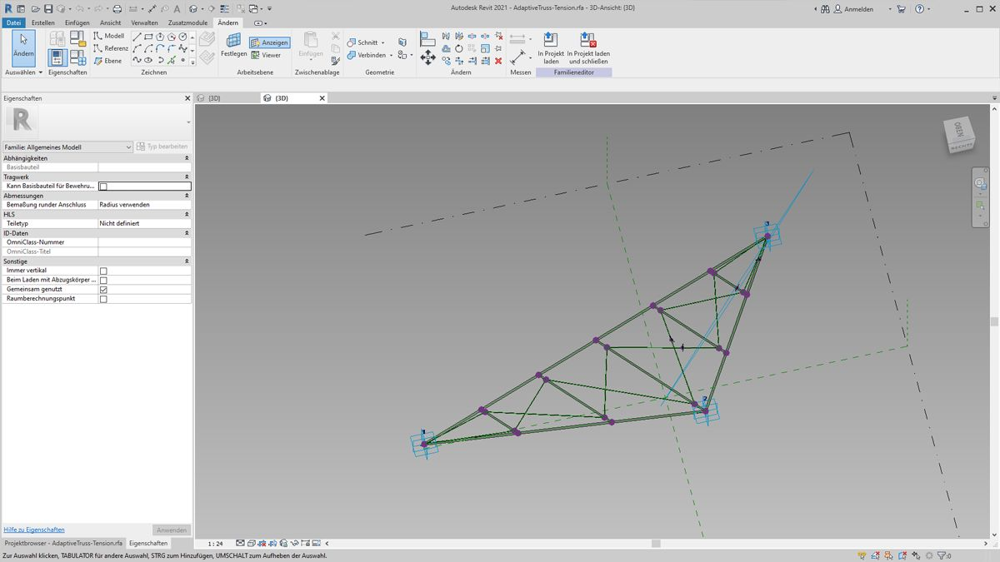
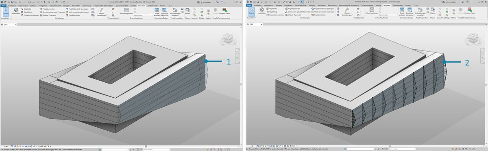
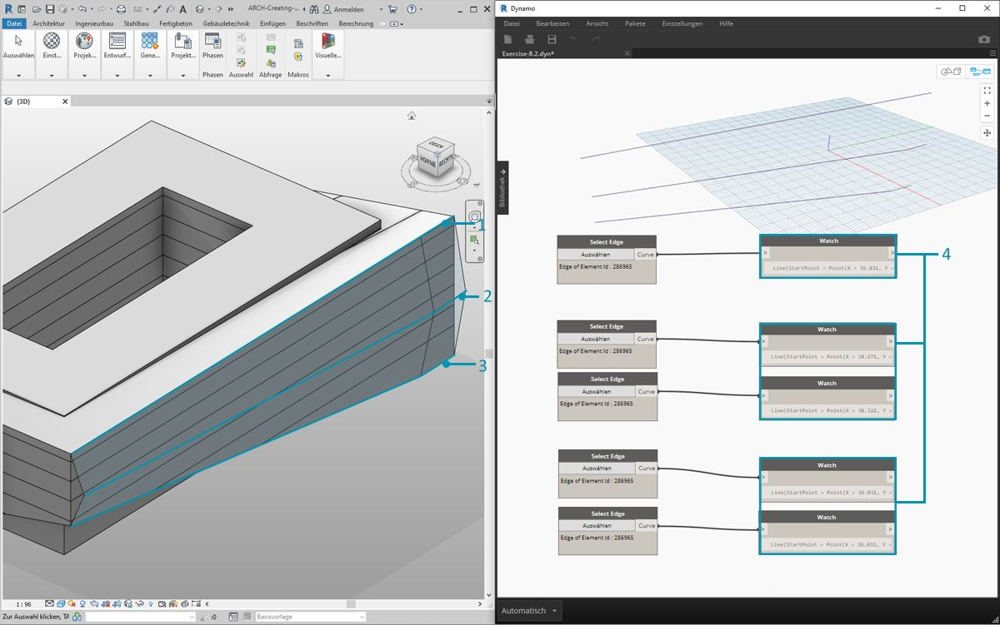
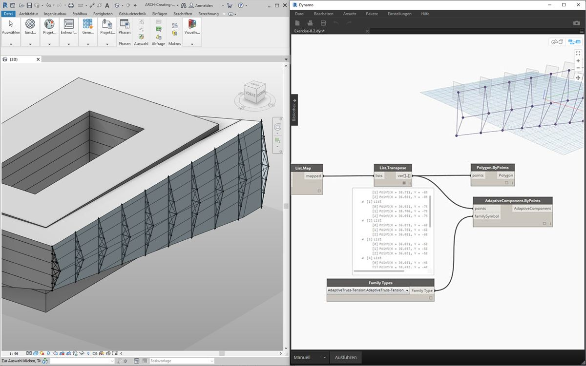
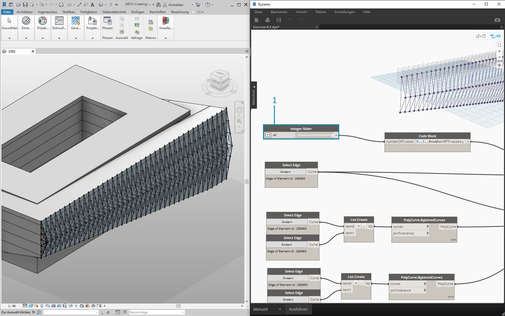
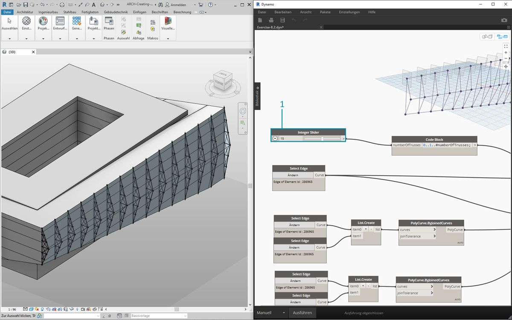
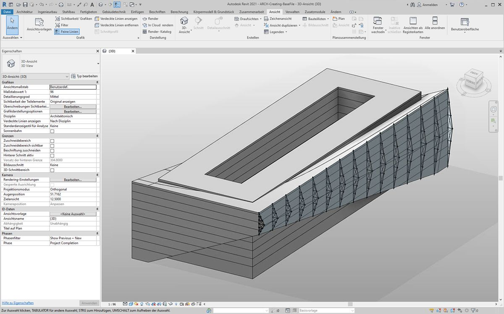
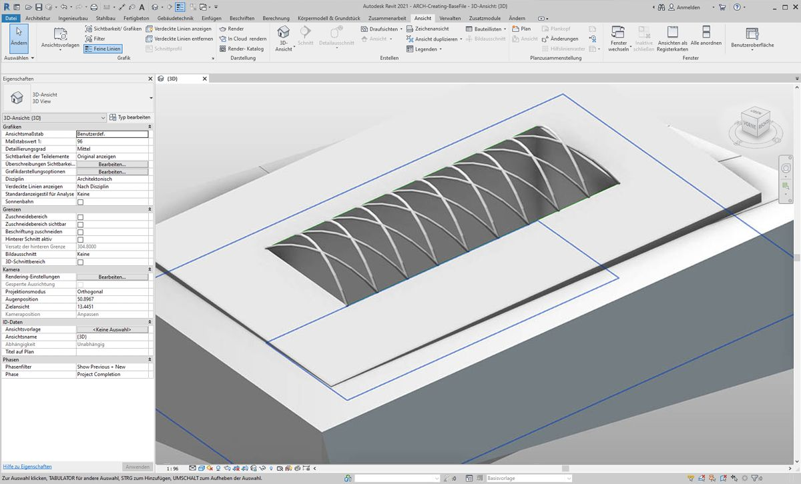
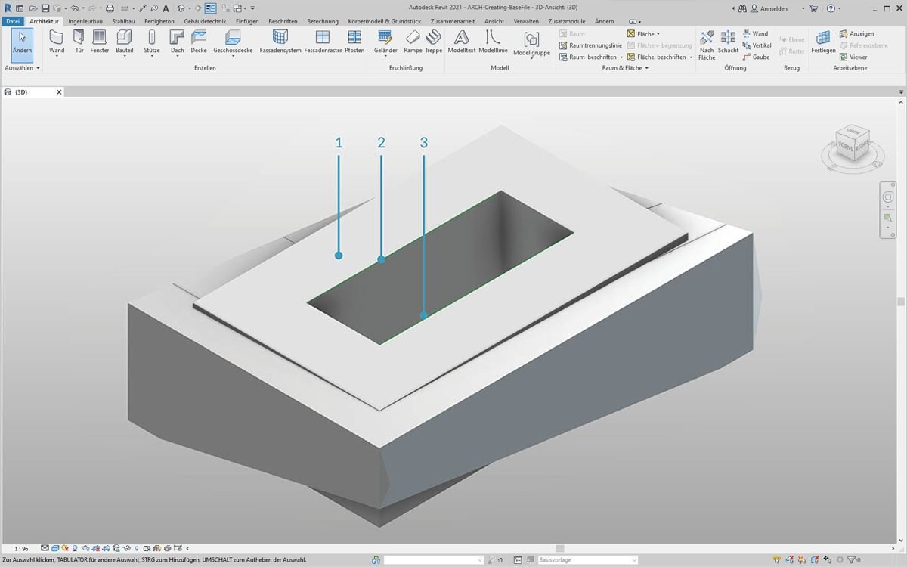

## Erstellen

Sie können in Dynamo Arrays von Revit-Elementen mit uneingeschränkter parametrischer Steuerung erstellen. Die Revit-Blöcke in Dynamo ermöglichen das Importieren von Elementen aus allgemeiner Geometrie in spezifische Kategorietypen (z. B. Wände und Geschossdecken). In diesem Abschnitt importieren Sie Elemente mit flexiblen Parametern für adaptive Bauteile.


### Adaptive Bauteile

Ein adaptives Bauteil ist eine flexible Familienkategorie, die sich für generative Anwendungen eignet. Bei der Instanziierung können Sie ein komplexes geometrisches Element erstellen, das durch die Positionen adaptiver Punkte gesteuert wird.



> Dieses Beispiel zeigt ein adaptives Bauteil mit drei Punkten im Familieneditor. Es dient zum Erstellen eines durch die Positionen der einzelnen adaptiven Punkte gesteuerten Fachwerkbinders. In der folgenden Übung erstellen Sie mithilfe dieses Bauteils eine Reihe von Fachwerkbindern an einer Fassade.

#### Prinzipien der Interoperabilität

Adaptive Bauteile bieten ein gutes Beispiel für optimale Verfahren zur Interoperabilität. Sie können eine Reihe adaptiver Bauteile erstellen, indem Sie die zugrunde liegenden adaptiven Punkte definieren. Wenn Sie diese Daten in andere Programme übertragen, haben Sie die Möglichkeit, die Geometrie auf einfache Daten zu reduzieren. Dabei liegt eine ähnliche Logik zugrunde wie beim Importieren und Exportieren in Programmen wie Excel.

Angenommen, ein Berater für die Fassaden benötigt Angaben zur Position der Fachwerkelemente, möchte jedoch nicht die vollständig ausgearbeitete Geometrie analysieren. Zur Vorbereitung der Fertigung kann der Berater die Position der adaptiven Punkte ermitteln und daraus Geometrie für ein Programm wie Inventor neu generieren.

In der folgenden Übung richten Sie einen Arbeitsablauf ein, der Ihnen Zugriff auf alle diese Daten gibt und zugleich die Definition zum Erstellen von Revit-Elementen festlegt. In diesem Prozess führen Sie Konzeption, Dokumentation und Fertigung zu einem nahtlosen Arbeitsablauf zusammen. Damit erhalten Sie einen intelligenteren und effizienteren Prozess zur Interoperabilität.

#### Mehrere Elemente und Listen


In der unten stehenden Übung wird gezeigt, wie Dynamo Daten für die Erstellung von Revit-Elementen referenziert. Um mehrere adaptive Bauteile zu generieren, definieren Sie eine Liste von Listen, wobei jede Liste drei Punkte enthält, die für die Punkte im adaptiven Bauteil stehen. Beachten Sie dies, während die Datenstrukturen in Dynamo verwaltet werden.

### Übungslektion

> Laden Sie die zu dieser Übungslektion gehörigen Beispieldateien herunter (durch Rechtsklicken und Wahl der Option Save Link As). Eine vollständige Liste der Beispieldateien finden Sie im Anhang.

> 1. [Creating.dyn](datasets/8-4/Creating.dyn)
2. [ARCH-Creating-BaseFile.rvt](datasets/8-4/ARCH-Creating-BaseFile.rvt)



> Beginnen Sie mit der Beispieldatei für diesen Abschnitt (oder verwenden Sie weiterhin die Revit-Datei aus dem vorigen Abschnitt). Derselbe Revit-Körper wird angezeigt.

> 1. Dies ist der Zustand beim Öffnen der Datei.
2. Dies ist das Fachwerksystem, das Sie mit Dynamo erstellt haben, wobei eine intelligente Verknüpfung mit dem Revit-Körper genutzt wird.



> Sie haben bereits mit den Blöcken *Select Model Element* und *Select Face* gearbeitet. Hier verwenden Sie *Select Edge* und arbeiten damit eine Ebene tiefer in der Geometriehierarchie. Stellen Sie für die Ausführung des Dynamo-Solver die Option *Automatisch* ein, damit das Diagramm laufend gemäß den Änderungen in der Revit-Datei aktualisiert wird. Die Kante, die Sie auswählen, ist dynamisch mit der Topologie des Revit-Elements verbunden. Solange die Topologie* unverändert bleibt, bleibt die Verknüpfung zwischen Revit und Dynamo erhalten.

> 1. Wählen Sie die oberste Kurve der verglasten Fassade aus. Diese erstreckt sich über die gesamte Länge des Gebäudes. Falls Sie bei der Auswahl der Kante Schwierigkeiten haben, können Sie in Revit den Mauszeiger auf die Kante setzen und die *Tabulatortaste* drücken, bis die gewünschte Kante hervorgehoben wird.
2. Wählen Sie über zwei *Select Edge*-Blöcke die beiden Kanten für den Vorsprung in der Mitte der Fassade aus.
3. Wiederholen Sie dies für die Kanten am unteren Ende der Fassade in Revit.
4. In den *Watch*-Blöcken wird angezeigt, dass in Dynamo jetzt Linien vorhanden sind. Diese werden automatisch in Dynamo-Geometrie konvertiert, da die Kanten selbst keine Revit-Elemente sind. Diese Kurven sind die Referenzen, die zum Instanziieren der adaptiven Fachwerkbinder entlang der Fassade verwendet werden.

**Anmerkung: Um eine konsistente Topologie zu erhalten, wird hier ein Modell verwendet, dem keine zusätzlichen Flächen oder Kanten hinzugefügt wurden. Sie können zwar mithilfe von Parametern seine Form ändern, seine Struktur bleibt jedoch einheitlich.*


> Als Erstes müssen Sie die Kurven verbinden und zu einer Liste zusammenführen. Dadurch *gruppieren* Sie die Kurven, um geometrische Operationen durchführen zu können.

> 1. Erstellen Sie eine Liste für die beiden Kurven in der Mitte der Fassade.
2. Verbinden Sie die beiden Kurven zu einer Polykurve, indem Sie die *List.Create*-Komponente mit einem *Polycurve.ByJoinedCurves*-Block verbinden.
3. Erstellen Sie eine Liste für die beiden Kurven am unteren Rand der Fassade.
4. Verbinden Sie die beiden Kurven zu einer Polykurve, indem Sie die *List.Create*-Komponente mit einem *Polycurve.ByJoinedCurves*-Block verbinden.
5. Führen Sie schließlich die drei Hauptkurven (eine Linie und zwei Polykurven) zu einer Liste zusammen.


> Danach verwenden Sie die oberste der Kurven, die eine über die gesamte Länge der Fassade verlaufende Linie ist. Sie erstellen entlang dieser Linie Ebenen, die die in der Liste zusammengefassten Kurven schneiden.

> 1. Definieren Sie in einem *Code Block* einen Bereich mit der Syntax ```0..1..#numberOfTrusses;```.
2. Verbinden Sie einen *Integer Slider * mit der Eingabe des Codeblocks. Dessen Werte geben naheliegenderweise die Anzahl der Fachwerkbinder an. Beachten Sie, dass der Schieberegler die Anzahl der Einträge in einem von *0* bis *1* definierten Bereich steuert.
3. Verbinden Sie den *Code Block* mit der *param*-Eingabe eines *Curve.PlaneAtParameter*-Blocks und verbinden Sie die obere Kante mit der *curve*-Eingabe. Damit erhalten Sie zehn Ebenen, die gleichmäßig über die Länge der Fassade verteilt sind.


> Eine Ebene ist ein abstraktes Geometrieelement, das für einen unendlichen zweidimensionalen Raum steht. Ebenen eignen sich ausgezeichnet zum Erstellen von Konturen und Schnitten wie in diesem Schritt gezeigt.

> 1. Verwenden Sie als Nächstes den *Geometry.Intersect*-Block: Verbinden Sie *Curve.PlaneAtParameter* mit der *entity*-Eingabe von *Geometry.Intersect*. Verbinden Sie den *List.Create*-Block mit der *geometry*-Eingabe. Im Dynamo-Ansichtsfenster werden daraufhin die Schnittpunkte der einzelnen Kurven mit den definierten Ebenen angezeigt.


> Die Ausgabe ist eine Liste aus Listen von Listen. Sie enthält zu viele Listen für diesen Verwendungszweck. Sie müssen die Liste teilweise vereinfachen. Dazu müssen Sie die zweithöchste Ebene der Liste ansteuern und das Ergebnis vereinfachen. Verwenden Sie dazu die *List.Map*-Operation, die im Kapitel zu Listen in diesem Handbuch beschrieben wird.

> 1. Verbinden Sie den *Geometry.Intersect*-Block mit der list-Eingabe von *List.Map*.
2. Verbinden Sie einen *Flatten*-Block mit der f(x)-Eingabe von *List.Map*. Als Ergebnis erhalten Sie drei Listen, jeweils mit so vielen Einträgen, wie Fachwerkbinder erstellt werden sollen.
3. Sie müssen diese Daten ändern. Für die Instanziierung des Fachwerkbinders benötigen Sie dieselbe Anzahl adaptiver Punkte wie in der Familie definiert. Dieses adaptive Bauteil weist drei Punkte auf. Sie benötigen also anstelle von drei Listen mit je zehn Einträgen (numberOfTrusses) zehn Listen mit je drei Einträgen. Auf diese Weise können Sie 10 adaptive Bauteile erstellen.
4. Verbinden Sie den *List.Map*-Block mit einem *List.Transpose*-Block. Damit werden die gewünschten Daten ausgegeben.
5. Um sich zu vergewissern, dass Sie die richtigen Daten erhalten haben, fügen Sie im Ansichtsbereich einen *Polygon.ByPoints*-Block hinzu und überprüfen Sie das Ergebnis in der Dynamo-Vorschau.


> Ordnen Sie jetzt die adaptiven Bauteile in einem Array an, wobei Sie dasselbe Verfahren verwenden wie beim Erstellen der Polygone.

> 1. Fügen Sie im Ansichtsbereich einen *AdaptiveComponent.ByPoints*-Block hinzu und verbinden Sie den *List.Transpose*-Block mit der *points*-Eingabe.
2. Wählen Sie in einem *Family Types*-Block die *AdaptiveTruss*-Familie und verbinden Sie den Block mit der *familySymbol*-Eingabe des *AdaptiveComponent.ByPoints*-Blocks.



> In Revit sind jetzt die zehn Fachwerkbinder gleichmäßig über die Länge der Fassade verteilt zu sehen.



> 1. Testen Sie das Diagramm: Erhöhen Sie den Wert für *numberOfTrusses* auf *40*, indem Sie den Wert im *Integer Slider* ändern. Sie erhalten zahlreiche Fachwerkbinder: Dies mag nicht sonderlich realistisch wirken, es zeigt jedoch, dass die parametrische Verknüpfung funktionstüchtig ist.



> 1. Wählen Sie einen angemessenen mittleren Wert für das Fachwerksystem, indem Sie *15* für *numberOfTrusses* festlegen.



> Führen Sie abschließend einen weiteren Test durch: Indem Sie in Revit den Körper auswählen und seine Exemplarparameter bearbeiten, können Sie die Form des Gebäudes ändern und beobachten, wie die Fachwerkbinder angepasst werden. Denken Sie daran, dass dieses Dynamo-Diagramm geöffnet sein muss, damit die Aktualisierung sichtbar ist. Sobald das Diagramm geschlossen wird, geht die Verknüpfung verloren.

### DirectShape-Elemente

Mit DirectShape steht ein weiteres Verfahren zum Importieren parametrischer Dynamo-Geometrie in Revit zur Verfügung. Kurz zusammengefasst: Das DirectShape-Element und die dazugehörigen Klassen ermöglichen es, extern erstellte geometrische Formen in einem Revit-Dokument zu speichern. Zu dieser Geometrie können geschlossene Körper oder Netze gehören. DirectShape ist in erster Linie für den Import von Formen aus anderen Formaten wie z. B. IFC oder STEP vorgesehen, die nicht genügend Informationen zum Erstellen eines "echten" Revit-Elements zur Verfügung stehen. Die DirectShape-Funktionen eignen sich genau wie bei IFC- und STEP-Arbeitsabläufen auch zum Importieren mit Dynamo erstellter Geometrie als echte Elemente in Revit-Projekte.

Die folgende Übung zeigt den Ablauf für den Import von Dynamo-Geometrie als DirectShape in ein Revit-Projekt. Mithilfe dieses Verfahrens können Sie die Kategorie, das Material und den Namen der importierten Geometrie zuweisen, wobei die parametrische Verknüpfung mit dem Dynamo-Diagramm erhalten bleibt.

### Übungslektion

> Laden Sie die zu dieser Übungslektion gehörigen Beispieldateien herunter (durch Rechtsklicken und Wahl der Option Save Link As). Eine vollständige Liste der Beispieldateien finden Sie im Anhang.

> 1. [DirectShape.dyn](datasets/8-4/DirectShape.dyn)
2. [ARCH-DirectShape-BaseFile.rvt](datasets/8-4/ARCH-DirectShape-BaseFile.rvt)


> Öffnen Sie als Erstes die Beispieldatei für diese Lektion: ARCH-DirectShape-BaseFile.rvt.

> 1. Die 3D-Ansicht zeigt den Gebäudekörper aus der letzten Lektion.
2. Entlang der Kante des Foyers verläuft eine Referenzkurve, die Sie in Dynamo referenzieren werden.
3. Entlang der gegenüberliegenden Kante des Foyers verläuft eine zweite Referenzkurve, die ebenfalls in Dynamo referenziert werden soll.


> 1. Zum Referenzieren der Geometrie in Dynamo verwenden Sie *Select Model Element* für die einzelnen Elemente in Revit. Wählen Sie den Körper in Revit aus und importieren Sie die Geometrie mithilfe von *Element.Faces* in Dynamo. Dadurch wird der Körper in der Dynamo-Vorschau angezeigt.
2. Importieren Sie eine der Referenzkurven mithilfe von *Select Model Element* und *CurveElement.Curve* in Dynamo.
3. Importieren Sie die andere Referenzkurve mithilfe von *Select Model Element* und *CurveElement.Curve* in Dynamo.


> 1. Wenn Sie das Beispieldiagramm verkleinern und nach rechts schwenken, sehen Sie eine große Gruppe von Blöcken. Diese stehen für die geometrischen Operationen, mit denen die in der Dynamo-Vorschau gezeigte Gitterkonstruktion für das Dach generiert wird. Diese Blöcke wurden mithilfe der Funktion *Block zu Code* erstellt, die im Abschnitt zu [Codeblöcken](../07_Code-Block/7-2_Design-Script-syntax.md#Node) dieses Handbuchs beschrieben wird.
2. Diese Konstruktion wird im Wesentlichen durch drei Parameter gesteuert: Diagonal Shift, Camber und Radius.


> Vergrößern Sie die Darstellung der Parameter für dieses Diagramm. Indem Sie mit diesen experimentieren, erhalten Sie unterschiedliche Geometrie.


> 1. Fügen Sie im Ansichtsbereich einen *DirectShape.ByGeometry*-Block hinzu. Dieser Block weist die vier Eingaben **geometry, category, material** und **name** auf.
2. Die Geometrie ist der Körper, der mithilfe des Diagrammteils für die Geometrieerstellung erstellt wird.
3. Die category-Eingabe wird mithilfe der Dropdown-Liste im *Categories*-Block gewählt. Verwenden Sie hier "Tragwerk".
4. Die material-Eingabe wird über das Array von Blöcken darüber ausgewählt. In diesem Fall kann allerdings auch einfach die Vorgabe definiert werden.



> Nachdem Sie Dynamo ausgeführt haben, befindet sich die importierte Geometrie im Revit-Projekt auf dem Dach. Dabei handelt es sich nicht um ein allgemeines Modell, sondern ein Tragwerkselement. Die parametrische Verknüpfung mit Dynamo bleibt erhalten.



> 1. Experimentieren Sie mit dem Dynamo-Diagramm, indem Sie für den Parameter Diagonal Shift den Wert -2 festlegen. Wenn Sie anschließend Dynamo erneut ausführen, wird eine neue DirectShape importiert.

