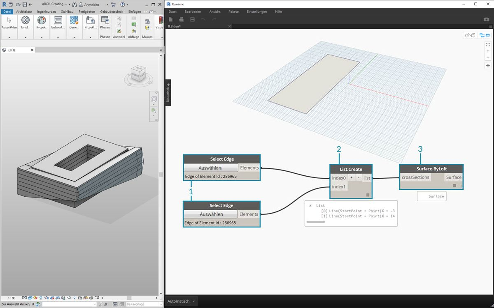
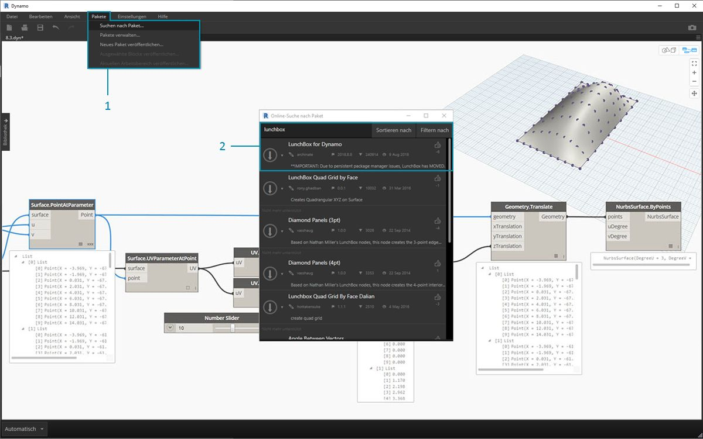
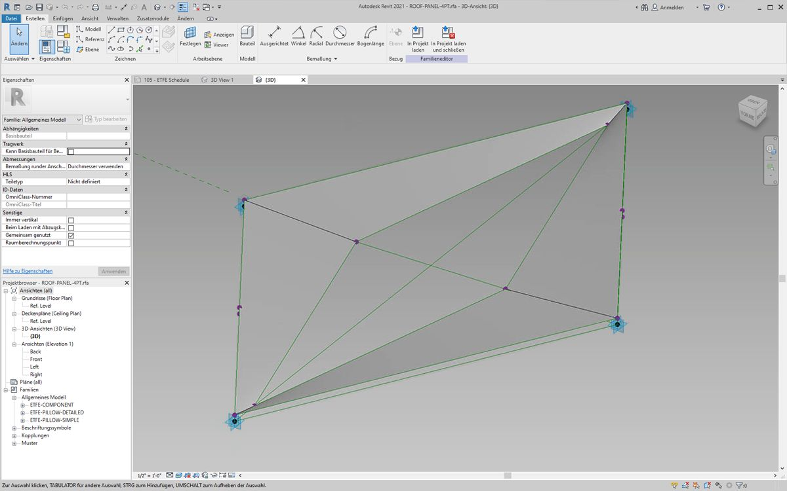
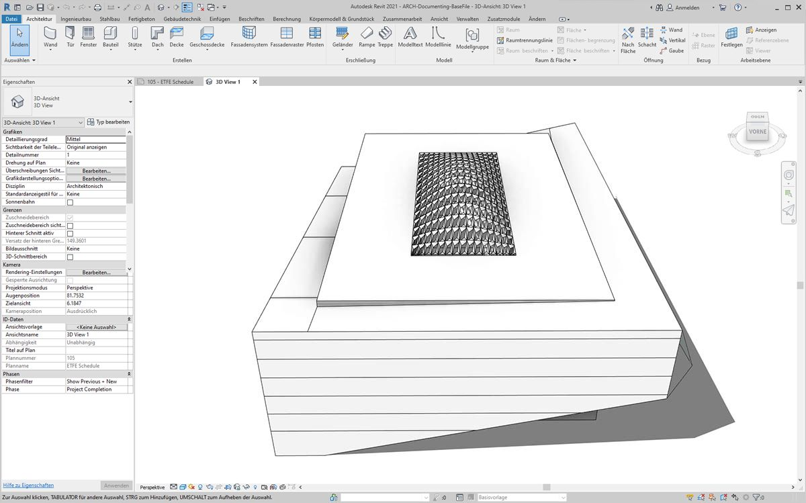
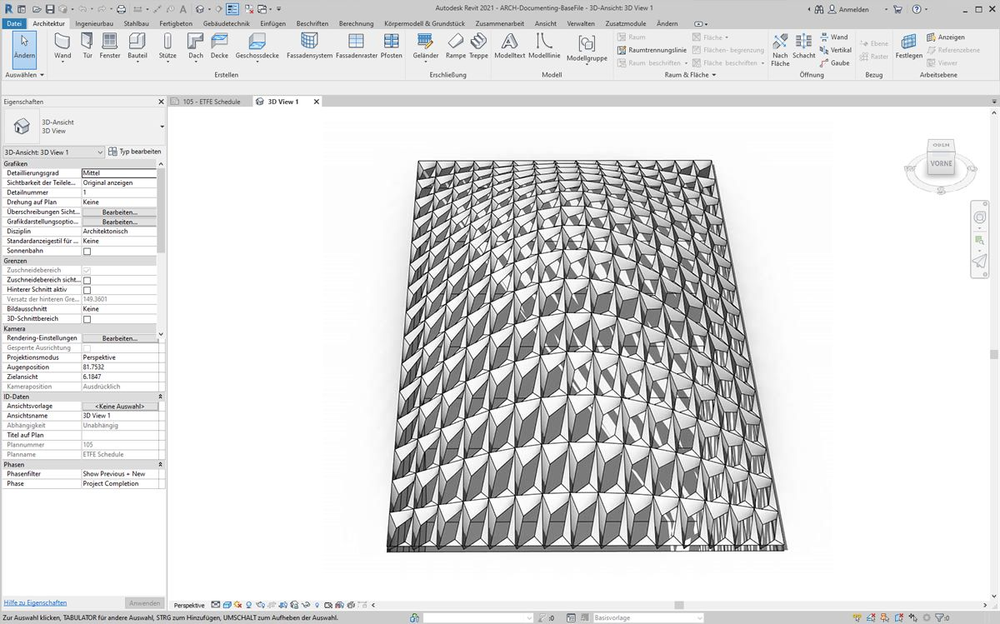
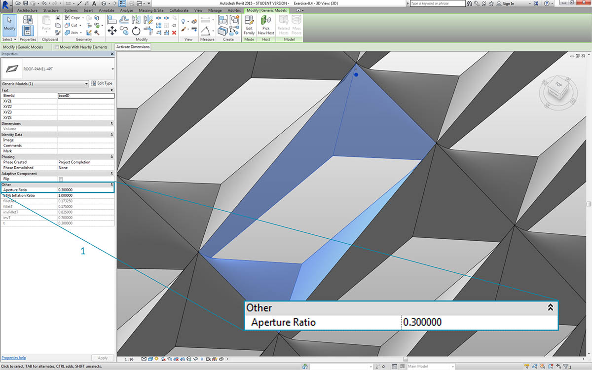
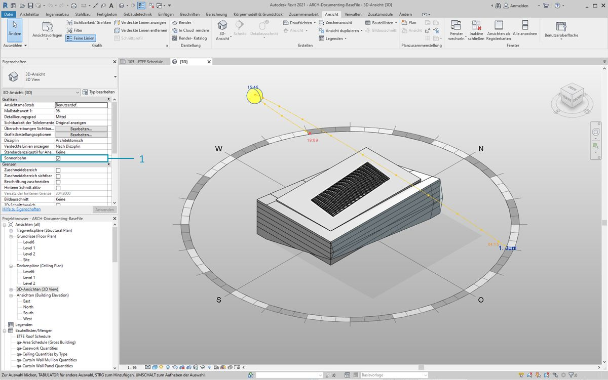
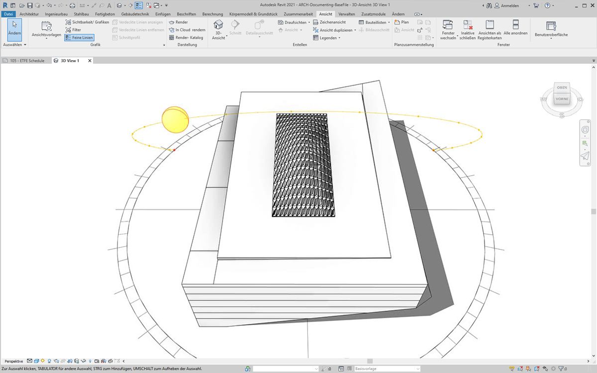
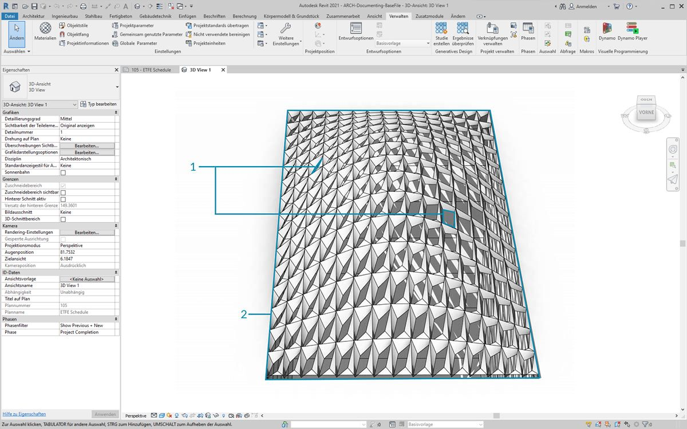

## Anpassen

Bis hierher wurde die Bearbeitung eines einfachen Gebäudekörpers behandelt. Im Folgenden wird die Verknüpfung zwischen Revit und Dynamo am Beispiel der Bearbeitung zahlreicher Elemente in ein und demselben Vorgang ausführlicher erläutert. Anpassungen in größerem Rahmen sind etwas komplizierter, da für die Datenstrukturen komplexere Listenoperationen durchgeführt werden müssen. Deren Ausführung folgt jedoch grundsätzlich denselben Prinzipien. Im Folgenden werden einige Analysemöglichkeiten ausgehend von einer Gruppe adaptiver Bauteile beschrieben.

#### Punktposition

Angenommen, Sie haben eine Gruppe adaptiver Bauteile erstellt und möchten deren Parameter anhand ihrer Punktpositionen bearbeiten. Mithilfe dieser Punkte könnten Sie z. B. einen Parameter für die Dicke in Verbindung mit der Fläche des Elements steuern. Oder Sie könnten einen Parameter für die Opazität in Abhängigkeit von der Sonneneinstrahlung im Jahresverlauf steuern. Dynamo ermöglicht die Verbindung zwischen Analysen und Parametern in wenigen einfachen Schritten. Die folgende Übung zeigt eine grundlegende Version hiervon.


> Fragen Sie die adaptiven Punkte eines ausgewählten adaptiven Bauteils mithilfe des *AdaptiveComponent.Locations*-Blocks ab. Dadurch können Sie eine abstrakte Version eines Revit-Elements für die Analyse nutzen.

Indem Sie die Positionen der Punkte adaptiver Bauteile extrahieren, können Sie eine Reihe von Analysen für dieses Element ausführen. Mithilfe eines adaptiven Bauteils mit vier Punkten können Sie beispielsweise die Ebenenabweichung eines gegebenen Dachelements analysieren.

#### Analyse der Solarausrichtung


> Ordnen Sie mithilfe der Neuzuordnungsfunktion einen Datensatz einem Parameterbereich zu. Dies ist eines der wichtigsten Werkzeuge für parametrische Modelle, wie in der unten folgenden Übung gezeigt.

In Dynamo können Sie über die Positionen der Punkte von adaptiven Bauteilen eine optimale Ebene für jedes einzelne Element erstellen. Darüber hinaus können Sie den Sonnenstand aus der Revit-Datei abfragen und die Ausrichtung der Ebene relativ zur Sonne mit derjenigen anderer adaptiver Bauteile vergleichen. In der folgenden Übung richten Sie dies ein, indem Sie eine algorithmische Dachform erstellen.

### Übungslektion

> Laden Sie die zu dieser Übungslektion gehörigen Beispieldateien herunter (durch Rechtsklicken und Wahl der Option "Save Link As"). Eine vollständige Liste der Beispieldateien finden Sie im Anhang.

> 1. [Customizing.dyn](datasets/8-5/Customizing.dyn)
2. [ARCH-Customizing-BaseFile.rvt](datasets/8-5/ARCH-Customizing-BaseFile.rvt)

In dieser Übung entwickeln Sie die im vorigen Abschnitt entwickelten Verfahren weiter. In diesem Fall definieren Sie eine parametrische Oberfläche aus Revit-Elementen, instanziieren adaptive Bauteile mit vier Punkten und bearbeiten diese anschließend anhand ihrer Ausrichtung relativ zur Sonne.



> 1. Beginnen Sie, indem Sie mithilfe eines *Select Edge*-Blocks zwei Kanten auswählen. Die beiden Kanten sind die Längsseiten des Foyers.
2. Fassen Sie die beiden Kanten mithilfe eines *List.Create*-Blocks in einer Liste zusammen.
3. Erstellen Sie mithilfe eines *Surface.ByLoft*-Blocks eine Oberfläche zwischen den beiden Kanten.


> 1. Definieren Sie in einem *Code Block* einen Bereich von 0 bis 1 mit 10 gleichmäßig verteilten Werten: ```0..1..#10;```.
2. Verbinden Sie den *Code Block* mit den *u*- und *v*-Eingaben eines *Surface.PointAtParameter*-Blocks und verbinden Sie den *Surface.ByLoft*-Block mit der *surface*-Eingabe. Klicken Sie mit der rechten Maustaste auf den Block und ändern Sie die *Vergitterung* in *Kreuzprodukt*. Dadurch erhalten Sie ein Raster aus Punkten auf der Oberfläche.

Die Punkte in diesem Raster werden als Steuerpunkte für eine parametrisch definierte Oberfläche genutzt. Als Nächstes extrahieren Sie die u- und v-Positionen dieser Punkte, damit Sie sie mit einer parametrischen Formel verbinden und dabei die bestehende Datenstruktur beibehalten können. Dies ist durch Abfragen der Parameterpositionen der eben erstellten Punkte möglich.


> 1. Fügen Sie einen *Surface.ParameterAtPoint*-Block in den Ansichtsbereich ein und verbinden Sie seine Eingaben wie oben gezeigt.
2. Fragen Sie die *u*-Werte dieser Parameter mithilfe eines *UV.U*-Blocks ab.
3. Fragen Sie die *v*-Werte dieser Parameter mithilfe eines *UV.V*-Blocks ab.
4. Die Ausgaben zeigen die *u*- bzw. *v*-Werte der einzelnen Punkte in der Oberfläche. Dadurch erhalten Sie für beide Werte jeweils einen Bereich zwischen *0* und *1* in der benötigten Datenstruktur. Jetzt können Sie einen parametrischen Algorithmus anwenden.


> 1. Fügen Sie im Ansichtsbereich einen *Code Block* hinzu und geben Sie den folgenden Code ein: ```Math.Sin(u*180)*Math.Sin(v*180)*w;```. Mit dieser parametrischen Funktion wird aus der flachen Oberfläche eine durch Sinusfunktionen definierte Wölbung erstellt.
2. Die *u*-Eingabe wird mit *UV.U* verbunden.
3. Die *v*-Eingabe wird mit *UV.V* verbunden.
4. Die *w*-Eingabe steht für die *Amplitude* der Form. Verbinden Sie daher einen *Number Slider* mit ihr.


> 1. Dadurch erhalten Sie eine Liste mit durch den Algorithmus definierten Werten. Verwenden Sie diese Werteliste, um die Punkte nach oben, d. h. in *+Z*-Richtung, zu verschieben. Hierfür verwenden Sie *Geometry.Translate*: Verbinden Sie den *Code Block* mit *zTranslation* und *Surface.PointAtParameter* mit der *geometry*-Eingabe. Die neuen Punkte sollten in der Dynamo-Vorschau angezeigt werden.
2. Schließlich erstellen Sie eine Oberfläche, indem Sie den Block aus dem vorigen Schritt mit der points-Eingabe eines *NurbsSurface.ByPoints*-Blocks verbinden. Damit haben Sie eine parametrische Oberfläche erstellt. Wenn Sie den Schieberegler ziehen, können Sie beobachten, wie die Oberfläche sich wölbt und abflacht.

Diese parametrische Oberfläche muss jetzt in Felder unterteilt werden, damit adaptive Bauteile mit vier Punkten darauf angeordnet werden können. Dynamo verfügt nicht über integrierte Funktionen zum Unterteilen von Oberflächen. Suchen Sie daher in der Community nach geeigneten Dynamo-Paketen.



> 1. Wechseln Sie zu *Pakete > Suchen nach Paket*.
2. Suchen Sie nach *LunchBox* und laden Sie *LunchBox for Dynamo* herunter. Die hier enthaltenen Werkzeuge sind äußerst hilfreich bei geometrischen Operationen wie dieser.


> 1. Nach dem Herunterladen haben Sie vollen Zugriff auf die LunchBox-Suite. Suchen Sie nach *Quad Grid* und wählen Sie *LunchBox Quad Grid By Face*. Verbinden Sie die parametrische Oberfläche mit der *surface*-Eingabe und legen Sie als Unterteilungen für *U* und *V* jeweils *15* fest. In der Dynamo-Vorschau sollte jetzt eine in viereckige Elemente unterteilte Oberfläche zu sehen sein.


> Wenn Sie an der Programmstruktur des *LunchBox*-Blocks interessiert sind, können Sie sie durch Doppelklicken auf den Block anzeigen.



> Kehren Sie zu Revit und zum hier verwendeten adaptiven Bauteil zurück. Ohne allzu sehr ins Einzelne zu gehen: Dies ist das zu instanziierende Dachelement. Dieses adaptive Bauteil mit vier Punkten ist eine grobe Darstellung eines EFTE-Systems. Die Öffnung des Abzugskörpers in der Mitte wird durch einen Parameter namens *ApertureRatio* gesteuert.


> 1. Da hier große Mengen von Geometrie in Revit instanziiert werden, achten Sie darauf, den Dynamo-Solver auf *Manuell* einzustellen.
2. Fügen Sie im Ansichtsbereich einen *Family Types*-Block ein und wählen Sie *"ROOF-PANEL-4PT"*.
3. Fügen Sie im Ansichtsbereich einen *AdaptiveComponent.ByPoints*-Block ein und verbinden Sie die *Panel Pts*-Ausgabe des *LunchBox Quad Grid by Face*-Blocks mit der *points*-Eingabe. Verbinden Sie den *Family Types*-Block mit der *familySymbol*-Eingabe.
4. Klicken Sie auf *Ausführen*. Revit benötigt etwas *Zeit* zum Erstellen der Geometrie. Wenn dies zu lange dauert, reduzieren Sie den *Codeblock-Wert 15* auf eine kleinere Zahl. Dadurch erhalten Sie weniger Elemente auf dem Dach.

*Anmerkung: Falls die Berechnung von Blöcken in Dynamo sehr lange dauert, können Sie die Blockfunktionen anhalten ("einfrieren") und damit die Ausführung von Revit-Vorgängen unterbrechen, während Sie Ihr Diagramm entwickeln. Weitere Informationen zum Anhalten von Blöcken finden Sie im entsprechenden Abschnitt im Kapitel [Körper](../05_Geometry-for-Computational-Design/5-6_solids.md#freezing).*



> In Revit sind die Elemente jetzt auf dem Dach angeordnet.



> Wenn Sie die Ansicht vergrößern, erhalten Sie einen genaueren Eindruck der Eigenschaften der Oberfläche.

### Analyse



> 1. Als Nächstes entwickeln Sie dies weiter, um die Öffnung der einzelnen Elemente in Abhängigkeit von der Sonneneinstrahlung an seiner Position zu steuern. Wenn Sie die Darstellung in Revit vergrößern und eines der Elemente auswählen, wird in der Eigenschaftenleiste der Parameter *Aperture Ratio* angezeigt. Die Familie wurde so eingerichtet, dass Öffnungsgrade zwischen ungefähr *0.05* und *0.45* möglich sind.



> 1. Wenn Sie die Sonnenbahn aktivieren, wird der aktuelle Sonnenstand in Revit angezeigt.


> 1. Diesen Sonnenstand können Sie mithilfe des *SunSettings.Current*-Blocks referenzieren.
2. Verbinden Sie die Sonneneinstellungen mit *Sunsetting.SunDirection*, um den Solarvektor zu erhalten.
3. Erstellen Sie ausgehend von den *Panel Pts*, aus denen Sie die adaptiven Bauteile erstellt haben, mithilfe von *Plane.ByBestFitThroughPoints* annähernde Ebenen für die Bauteile.
4. Rufen Sie die *normal* für diese Ebene ab.
5. Berechnen Sie mithilfe des *Skalarprodukts* die Sonnenrichtung. Das Skalarprodukt ist eine Formel zur Bestimmung der Parallelität oder Antiparallelität zweier Vektoren. Sie vergleichen also die Ebenennormale jedes einzelnen adaptiven Bauteils mit dem Solarvektor, um eine ungefähre Simulation des Winkels gegenüber der Sonnenstrahlung zu erhalten.
6. Ermitteln Sie *absoluten Wert* des Ergebnisses. Dadurch wird die Richtigkeit des Skalarprodukts für den Fall sichergestellt, dass die Ebenennormale in die entgegengesetzte Richtung zeigt.
7. Klicken Sie auf *Ausführen*.


> 1. Für das *Skalarprodukt* wird ein großer Zahlenbereich ausgegeben. Die relative Verteilung dieser Zahlen soll verwendet werden, ihr Bereich muss jedoch auf den geeigneten Bereich für den Parameter *Aperture Ratio*, der bearbeitet werden soll, verdichtet werden.
2. Hierfür ist *Math.RemapRange* hervorragend geeignet. Diese Funktion übernimmt eine eingegebene Liste und ordnet ihre Grenzwerte zwei Zielwerten zu.
3. Definieren Sie die Zielwerte *0.15* und *0.45* in einem *Code Block*.
4. Klicken Sie auf *Ausführen*.


> 1. Verbinden Sie die neu zugeordneten Werte mit einem *Element.SetParameterByName*-Block.
2. Verbinden Sie die Zeichenfolge *"Aperture Ratio"* mit der *parameterName*-Eingabe.
3. Verbinden Sie die *adaptiven Bauteile* mit der *element*-Eingabe.
4. Klicken Sie auf *Ausführen*.



> In Revit ist die Auswirkung des Sonnenwinkels auf die Öffnung der EFTE-Elemente auch aus größerer Entfernung zu erkennen.



> Wenn Sie die Ansicht vergrößern, ist zu sehen, dass die der Sonne zugewandten EFTE-Elemente stärker geschlossen sind. In diesem Fall soll eine Überhitzung durch Sonneneinstrahlung vermieden werden. Wenn Sie den Lichteinfall in Abhängigkeit von der Sonneneinstrahlung steuern wollten, könnten Sie dafür einfach die Domäne im *Math.RemapRange*-Block ändern.

