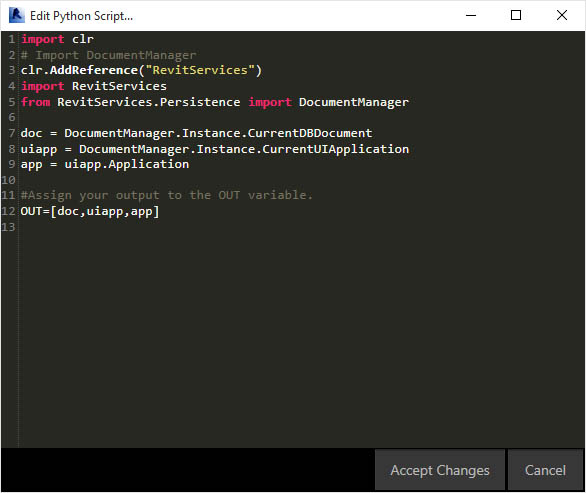
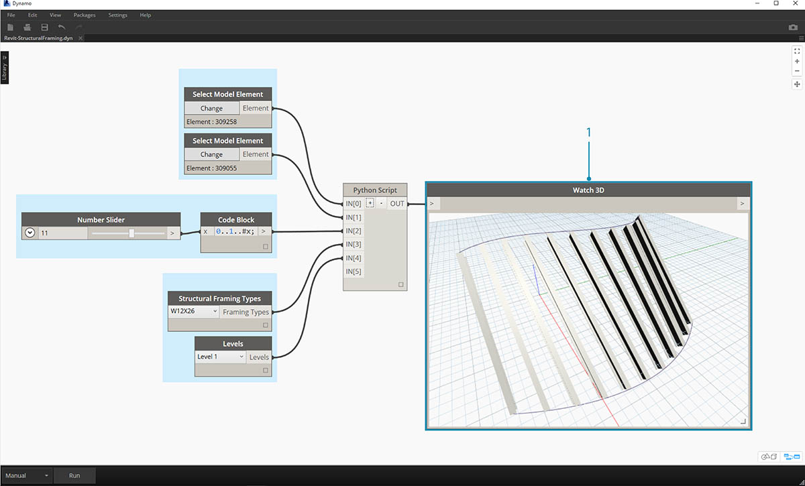

## Python und Revit

Nachdem im vorigen Abschnitt die Verwendung von Python-Skripts in Dynamo gezeigt wurde, erhalten Sie hier eine Einführung zur Einbindung von Revit-Bibliotheken in die Skriptumgebung. Rufen Sie sich kurz ins Gedächtnis zurück, dass Sie die Dynamo-Core-Blöcke mithilfe der ersten drei Zeilen im folgenden Codeabschnitt importiert haben. Um die Blöcke, Elemente und den Document Manager von Revit zu importieren, sind lediglich einige weitere Zeilen erforderlich:

```
import clr
clr.AddReference('ProtoGeometry')
from Autodesk.DesignScript.Geometry import *

# Import RevitNodes
clr.AddReference("RevitNodes")
import Revit

# Import Revit elements
from Revit.Elements import *

# Import DocumentManager
clr.AddReference("RevitServices")
import RevitServices
from RevitServices.Persistence import DocumentManager

import System
```

Dadurch erhalten Sie Zugriff auf die Revit-API und können benutzerdefinierte Skripte für beliebige Revit-Aufgaben erstellen. Die Kombination der visuellen Programmierung mit der Skripterstellung in der Revit-API bringt erhebliche Verbesserungen für die Zusammenarbeit und die Entwicklung von Werkzeugen mit sich. So könnten beispielsweise ein BIM-Manager und ein Schemaplanentwickler gemeinsam am selben Diagramm arbeiten. Bei dieser Zusammenarbeit können sie sowohl den Entwurf als auch die Realisierung des Modells verbessern.


### Plattformspezifische APIs

Mit dem Dynamo-Projekt ist beabsichtigt, die Möglichkeiten der Plattformimplementierung zu erweitern. Während Dynamo nach und nach weitere Programme in seine Palette aufnimmt, erhalten die Benutzer Zugriff auf plattformspezifische APIs aus der Python-Skriptumgebung. In diesem Abschnitt wird ein Fallbeispiel für Revit behandelt. Zukünftig sollen jedoch weitere Kapitel mit umfassenden Lernprogrammen zur Skripterstellung für andere Plattformen bereitgestellt werden. Darüber hinaus stehen jetzt zahlreiche [IronPython](http://ironpython.net/)-Bibliotheken zur Verfügung, die Sie in Dynamo importieren können.

Die folgenden Beispiele zeigen Möglichkeiten zur Implementierung Revit-spezifischer Vorgänge aus Dynamo mit Python. Eine genauere Beschreibung der Beziehung zwischen Python einerseits und Dynamo und Revit andererseits finden Sie auf der [Wiki-Seite zu Dynamo](https://github.com/DynamoDS/Dynamo/wiki/Python-0.6.3-to-0.7.x-Migration). Eine andere nützliche Ressourcen für Python und Revit ist das [Revit Python Shell](https://github.com/architecture-building-systems/revitpythonshell)-Projekt.

### Übungslektion 01

> Erstellen Sie ein neues Revit-Projekt. Laden Sie die zu dieser Übungslektion gehörige Beispieldatei herunter (durch Rechtsklicken und Wahl der Option Save Link As). Eine vollständige Liste der Beispieldateien finden Sie im Anhang. [Revit-Doc.dyn](datasets/9-5/Revit-Doc.dyn)

In diesen Übungen lernen Sie grundlegenden Python-Skripts in Dynamo für Revit kennen. Dabei liegt das Hauptaugenmerk auf der Verarbeitung von Revit-Dateien und -Elementen sowie der Kommunikation zwischen Revit und Dynamo.


> Dies ist eine einfache Methode zum Abrufen von *doc*, *uiapp* und *app* für die mit der Dynamo-Sitzung verknüpfte Revit-Datei. Programmierern, die zuvor bereits in der Revit-API gearbeitet haben, fallen eventuell die Einträge in der Liste des Watch-Blocks auf. Falls diese Einträge ungewohnt wirken, besteht kein Grund zur Beunruhigung. In den weiteren Übungen werden andere Beispiele verwendet.

Der folgende Code zeigt, wie Sie die Revit-Dienste importieren und die Dokumentdaten in Dynamo abrufen können: 

> Ein Blick auf den Python-Block in Dynamo. Im Folgenden sehen Sie den kommentierten Code.

```
import clr
# Import DocumentManager
clr.AddReference("RevitServices")
import RevitServices
from RevitServices.Persistence import DocumentManager

doc = DocumentManager.Instance.CurrentDBDocument
uiapp = DocumentManager.Instance.CurrentUIApplication
app = uiapp.Application

#Assign your output to the OUT variable
#OUT is defined as a list of three items
OUT=[doc,uiapp,app]
```

### Übungslektion 02

> Laden Sie die zu dieser Übungslektion gehörigen Beispieldateien herunter (durch Rechtsklicken und Wahl der Option Save Link As). Eine vollständige Liste der Beispieldateien finden Sie im Anhang. [Revit-ReferenceCurve.dyn](datasets/9-5/Revit-ReferenceCurve.dyn)

In dieser Übung erstellen Sie mithilfe des Python-Blocks von Dynamo eine einfache Modellkurve in Revit.


> Beginnen Sie mit der in der Abbildung oben gezeigten Gruppe von Blöcken. Sie erstellen zunächst mithilfe von Dynamo-Blöcken zwei Referenzpunkte in Revit.

> Beginnen Sie, indem Sie in Revit eine neue Entwurfskörperfamilie erstellen. Starten Sie Dynamo und erstellen Sie die Gruppe von Blöcken in der Abbildung oben. Sie erstellen zunächst mithilfe von Dynamo-Blöcken zwei Referenzpunkte in Revit.

> 1. **Wichtiger Hinweis: Achten Sie darauf, für die Ausführung von Revit-Vorgängen den Ausführungsmodus Manuell einzustellen. Andernfalls stürzt das Programm ab.**
2. Erstellen Sie einen Codeblock mit dem Wert 0.
3. Verbinden Sie diesen Wert mit den x-, y- und z-Eingaben eines ReferencePoint.ByCoordinates-Blocks.
4. Erstellen Sie drei Schieberegler mit dem Bereich zwischen -100 und 100 und der Schrittgröße 1.
5. Verbinden Sie die Schieberegler mit einem ReferencePoint.ByCoordinates-Block.
6. Fügen Sie einen Python-Block im Arbeitsbereich hinzu, klicken Sie auf die Schaltfläche +, um eine weitere Eingabe hinzuzufügen, und verbinden Sie die beiden Referenzpunkte mit den Eingaben. Öffnen Sie den Python-Block.


> Ein Blick auf den Python-Block in Dynamo. Im Folgenden sehen Sie den kommentierten Code.

> 1. **System.Array**: Für Revit wird ein System-Array (anstelle einer Python-Liste) benötigt. Hierfür genügt eine weitere Codezeile. Indem Sie sorgfältig auf die Argumenttypen achten, erleichtern Sie jedoch die Python-Programmierung in Revit.

```
import clr

# Import RevitNodes
clr.AddReference("RevitNodes")
import Revit
# Import Revit elements
from Revit.Elements import *
import System

#define inputs
startRefPt = IN[0]
endRefPt = IN[1]

#define system array to match with required inputs
refPtArray = System.Array[ReferencePoint]([startRefPt, endRefPt])
#create curve by reference points in Revit
OUT = CurveByPoints.ByReferencePoints(refPtArray)
```


> Sie haben in Dynamo zwei Referenzpunkte erstellt und diese in Python mit einer Linie verbunden. In der nächsten Übung führen Sie dies weiter.

### Übungslektion 03

> Laden Sie die Beispieldateien für diese Übungslektion herunter (durch Rechtsklicken und Wahl von Save Link As). Eine vollständige Liste der Beispieldateien finden Sie im Anhang. [Revit-StructuralFraming.zip](datasets/9-5/Revit-StructuralFraming.zip)

> Diese Übung ist relativ einfach, macht jedoch die Verbindung von Daten und Geometrie zwischen Revit und Dynamo – in beiden Richtungen – deutlich. Öffnen Sie zuerst Revit-StructuralFraming.rvt. Laden Sie anschließend Dynamo und öffnen Sie die Datei Revit-StructuralFraming.dyn.


> Diese Datei ist denkbar einfach. Sie umfasst zwei auf Ebene 1 und Ebene 2 gezeichnete Referenzkurven. Diese Kurven sollen in Dynamo übernommen werden, wobei eine Direktverknüpfung bestehen bleibt.


> Diese Datei enthält eine Gruppe von Blöcken, die mit fünf Eingaben eines Python-Blocks verbunden sind.

> 1. **Select Model Element-Blöcke**: Klicken Sie jeweils auf Auswählen.
2. **Code Block**: Geben Sie die Syntax *"0..1..#x;"* ein und verbinden Sie einen Integer Slider mit Werten zwischen 0 und 20 mit der *x*-Eingabe. Dadurch wird die Anzahl der Träger gesteuert, die zwischen den beiden Kurven gezeichnet werden sollen.
3. **Structural Framing Types**: Wählen Sie hier den vorgegebenen W12x26-Träger aus der Dropdown-Liste.
4. **Levels**: Wählen Sie die Ebene 1.


> Dieser Code in Python ist etwas komplexer, aus den darin enthaltenen Kommentaren geht jedoch hervor, wie der Prozess abläuft.

```
import clr
#import Dynamo Geometry
clr.AddReference('ProtoGeometry')
from Autodesk.DesignScript.Geometry import *
# Import RevitNodes
clr.AddReference("RevitNodes")
import Revit
# Import Revit elements
from Revit.Elements import *
import System

#Query Revit elements and convert them to Dynamo Curves
crvA=IN[0].Curves[0]
crvB=IN[1].Curves[0]

#Define input Parameters
framingType=IN[3]
designLevel=IN[4]

#Define "out" as a list
OUT=[]

for val in IN[2]:
#Define Dynamo Points on each curve
ptA=Curve.PointAtParameter(crvA,val)
ptB=Curve.PointAtParameter(crvB,val)
#Create Dynamo line
beamCrv=Line.ByStartPointEndPoint(ptA,ptB)
#create Revit Element from Dynamo Curves
beam = StructuralFraming.BeamByCurve(beamCrv,designLevel,framingType)
#convert Revit Element into list of Dynamo Surfaces
OUT.append(beam.Faces)
```


> In Revit wird eine Reihe von Trägern zwischen den beiden Kurven als Tragwerkselemente angezeigt. Anmerkung: Dies ist kein realistisches Beispiel.. Die Tragwerkselemente dienen nur als Beispiele für aus Dynamo erstellte native Revit-Exemplare. In Dynamo werden die Ergebnisse ebenfalls angezeigt. Die Träger im Watch3D-Block verweisen auf die aus den Revit-Elementen abgefragte Geometrie.

Dabei werden Daten aus der Revit-Umgebung für die Dynamo-Umgebung konvertiert. Zusammenfassung: Der Prozess läuft wie folgt ab:

1. Revit-Element auswählen
2. Revit-Element in Dynamo-Kurve konvertieren
3. Dynamo-Kurve in eine Folge von Dynamo-Punkten unterteilen
4. Dynamo-Linien mithilfe der Dynamo-Punkte zwischen den beiden Kurven erstellen.
5. Revit-Träger durch Referenzieren der Dynamo-Linien erstellen
6. Dynamo-Oberflächen durch Abfragen der Geometrie der Revit-Träger ausgeben

Dies mag etwas umständlich erscheinen. Das Skript erleichtert den Vorgang jedoch erheblich: Sie müssen jetzt lediglich die Kurve in Revit bearbeiten und den Solver erneut ausführen. (Es ist möglich, dass Sie dabei die bisherigen Träger löschen müssen.)


> Werden die Referenzkurven in Revit aktualisiert, erhalten Sie eine neue Reihe von Trägern.

