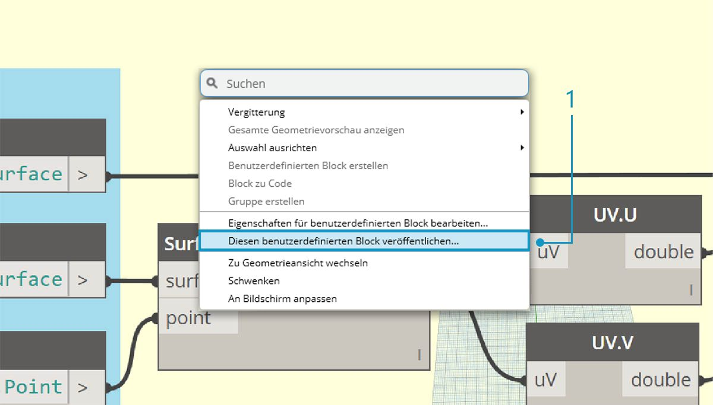
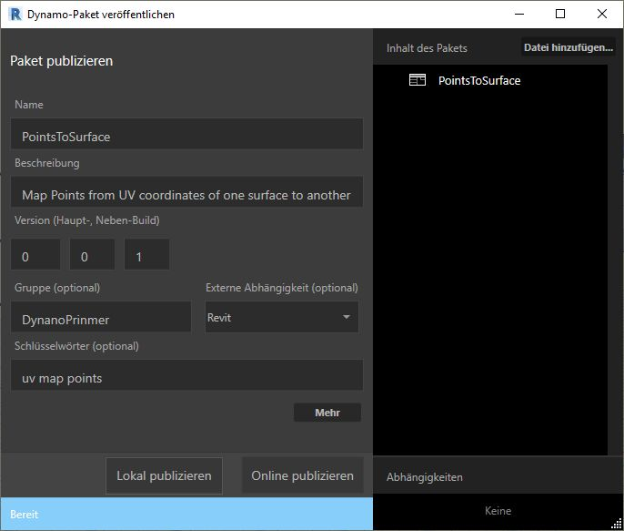
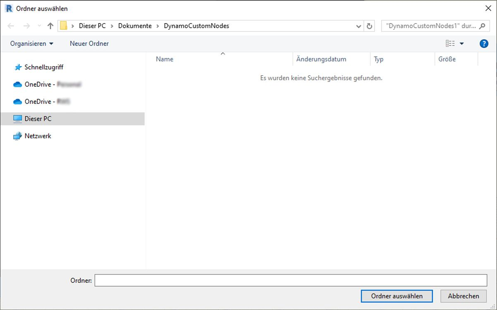
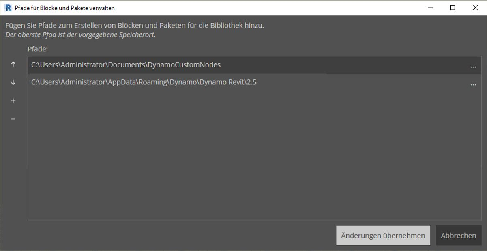
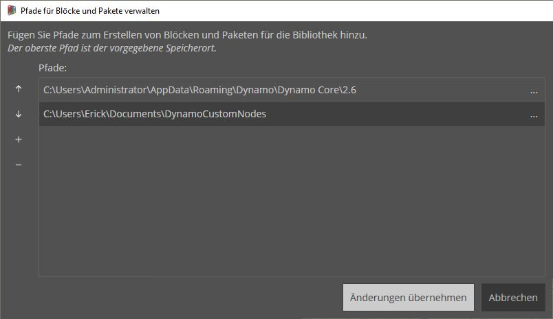
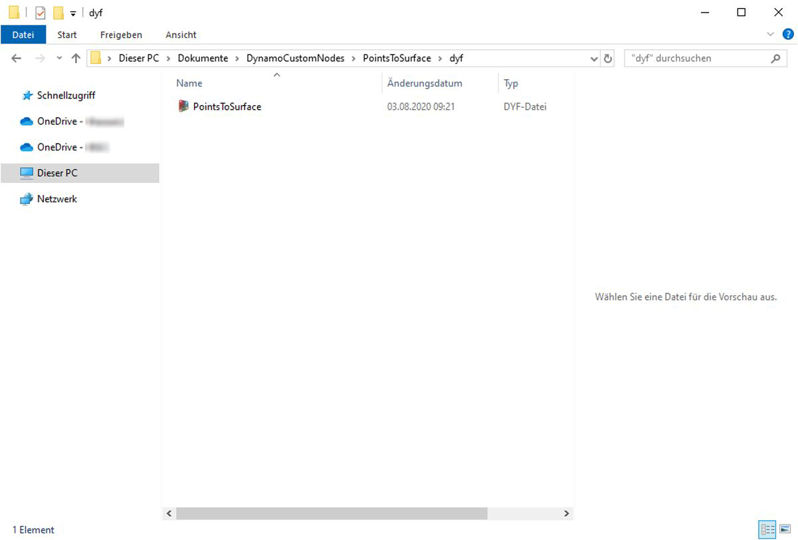

## Hinzufügen zu Ihrer Bibliothek

Sie haben einen benutzerdefinierten Block erstellt und ihn auf einen bestimmten Prozess im Dynamo-Diagramm angewendet. Da dieser Block sehr nützlich ist, möchten Sie ihn in die Dynamo-Bibliothek aufnehmen, damit er in anderen Diagrammen referenziert werden kann. Dazu müssen Sie den Block lokal veröffentlichen. Sie gehen dabei auf ähnliche Weise vor wie beim Veröffentlichen von Paketen, das im nächsten Kapitel im Detail behandelt wird.

### Lokale Veröffentlichung eines benutzerdefinierten Blocks

Verwenden Sie weiterhin den benutzerdefinierten Block, den Sie im vorigen Abschnitt erstellt haben. Indem Sie den Block lokal veröffentlichen, stellen Sie ihn in Ihrer Dynamo-Bibliothek bereit und können darauf zugreifen, wenn Sie eine neue Sitzung öffnen. Wenn ein Block nicht veröffentlicht wird, muss er für ein Dynamo-Diagramm, das diesen Block referenziert, in dessen Ordner enthalten sein (oder über *Datei > Bibliothek importieren* in Dynamo importiert werden).

> Laden Sie die zu dieser Übungslektion gehörige Beispieldatei herunter (durch Rechtsklicken und Wahl der Option Save Link As). Eine vollständige Liste der Beispieldateien finden Sie im Anhang. [PointsToSurface.dyf](datasets/10-3/PointsToSurface.dyf)

> Nachdem Sie den benutzerdefinierten PointsToSurface-Block geöffnet haben, wird das oben gezeigte Diagramm im Editor für benutzerdefinierte Blöcke von Dynamo angezeigt. Sie können einen benutzerdefinierten Block auch durch Doppelklicken im Diagrammeditor von Dynamo öffnen.

> 1. Um einen benutzerdefinierten Block lokal zu veröffentlichen, klicken Sie mit der rechten Maustaste in den Ansichtsbereich und wählen Sie *Diesen benutzerdefinierten Block veröffentlichen*.

> Geben Sie wie in der Abbildung oben gezeigt die nötigen Informationen ein und wählen Sie *Lokal publizieren*. Beachten Sie, dass das Feld Gruppe den Haupteintrag angibt, der über das Dynamo-Menü aufgerufen wird.

> Wählen Sie einen Ordner, in dem alle benutzerdefinierten Blöcke gespeichert werden sollen, die Sie lokal veröffentlichen werden. Dynamo prüft diesen Ordner jedes Mal beim Laden der Anwendung. Achten Sie daher darauf, dass der Ordner sich an einem dauerhaften Speicherort befindet. Navigieren Sie zu diesem Ordner und wählen Sie *Ordner auswählen.* Damit haben Sie den Dynamo-Block lokal veröffentlicht. Er steht jetzt jedes Mal, wenn Sie das Programm laden, im Dynamo-Werkzeugkasten zur Verfügung.

> 1. Um den Speicherort des benutzerdefinierten Blocks zu überprüfen, wechseln Sie zu *Einstellungen > Pfade für Blöcke und Pakete verwalten*.

> In diesem Fenster werden zwei Pfade angezeigt: *AppData\Roaming\Dynamo...* ist der vorgegebene Speicherort der online installierten Dynamo-Pakete. *Documents\DynamoCustomNodes...* gibt den Speicherort der von Ihnen veröffentlichten benutzerdefinierten Blöcke an.*

> 1. Es ist sinnvoll, den Pfad des lokalen Ordners in der oben gezeigten Liste nach unten zu verschieben (indem Sie den Ordnerpfad auswählen und auf den nach unten zeigenden Pfeil links neben den Pfadnamen klicken). Der zuoberst stehende Ordner ist die Vorgabe für die Installation von Paketen. Indem Sie den vorgegebenen Installationspfad für Dynamo-Pakete als Vorgabe beibehalten, stellen Sie daher sicher, dass Online-Pakete und Ihre lokal veröffentlichten Blöcke separat abgelegt werden.*

> Hier wurde die Reihenfolge der Pfadnamen vertauscht, damit Pakete unter dem Vorgabepfad von Dynamo installiert werden.

> Wenn Sie zu diesem lokalen Ordner navigieren, finden Sie den ursprünglichen benutzerdefinierten Block im Ordner *dyf*. Dies ist die Erweiterung von Dateien für benutzerdefinierte Dynamo-Blöcke. Sie können die Datei in diesem Ordner bearbeiten. Der Block wird dann in der Benutzeroberfläche aktualisiert. Sie können auch weitere Blöcke im Ordner *DynamoCustomNode* hinzufügen. Diese werden beim Neustart von Dynamo Ihrer Bibliothek hinzugefügt.

> Wenn Sie Dynamo jetzt laden, wird der Block *PointsToSurface* jedes Mal in der Gruppe *DynamoPrimer* Ihrer Dynamo-Bibliothek angezeigt.

