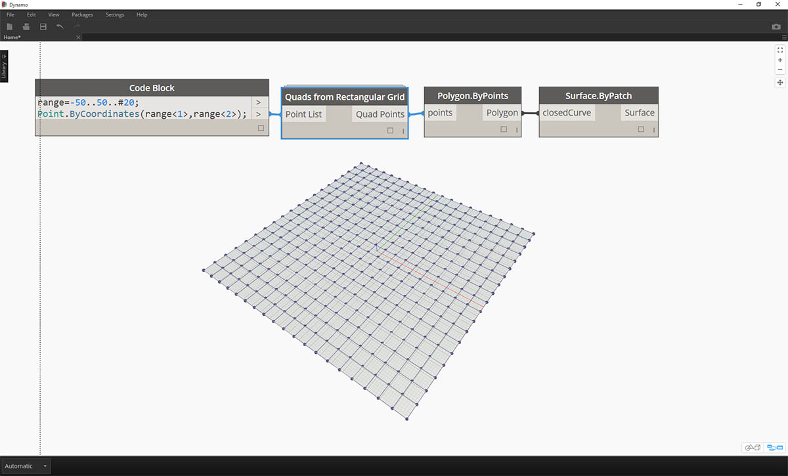
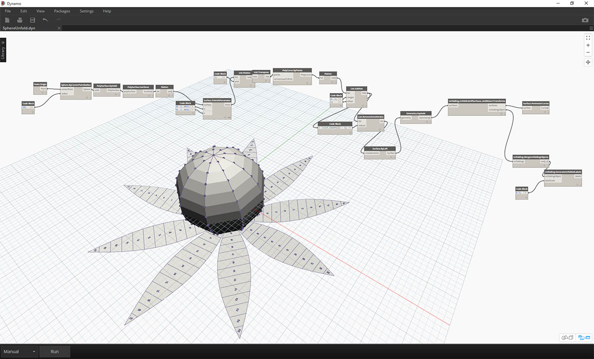

## Pakete

Ein Paket ist, kurz gesagt, eine Sammlung benutzerdefinierter Blöcke. Der Dynamo Package Manager ist ein Community-Portal, aus dem Sie beliebige Pakete herunterladen können, die online veröffentlicht wurden. Diese Toolsets werden von externen Anbietern entwickelt und stellen Erweiterungen der Hauptfunktionen von Dynamo dar. Sie stehen für alle Benutzer zur Verfügung und können durch einfaches Klicken auf eine Schaltfläche heruntergeladen werden.

Community-Engagement wie dieses ist die Grundlage des Erfolgs von Open Source-Projekten wie Dynamo. Dank der Arbeit dieser hochmotivierten externen Entwickler kann Dynamo für Arbeitsabläufe in zahlreichen verschiedenen Branchen genutzt werden. Aus diesem Grund hat das Dynamo-Team sich geschlossen bemüht, die Entwicklung und Veröffentlichung von Paketen zu vereinheitlichen. (Dies wird in den folgenden Abschnitten detaillierter beschrieben.)

### Installation eines Pakets

Die einfachste Methode zum Installieren eines Pakets ist die Verwendung des Werkzeugkastens Pakete in der Dynamo-Benutzeroberfläche. Diese Methode wird im Folgenden beschrieben. In diesem Beispiel installieren Sie ein häufig verwendetes Paket zum Erstellen viereckiger Felder in einem Raster. 

> 1. Wechseln Sie in Dynamo zu *Pakete > Suchen nach Paket*.

> Suchen Sie mithilfe der Suchleiste nach "quads from rectangular grid". Nach kurzer Zeit sollten alle Pakete, die dieser Suchabfrage entsprechen, angezeigt werden. Sie müssen in diesem Fall das erste Paket mit passendem Namen auswählen.

> 1. Klicken Sie auf den Download-Pfeil links neben dem Paketnamen. Das Paket wird installiert. Fertig!

> 1. In der Dynamo-Bibliothek wird jetzt eine weitere Gruppe namens *buildz* angezeigt. Dieser Name bezieht sich auf den [Entwickler](http://buildz.blogspot.com/) des Pakets und der benutzerdefinierte Block wird in dieser Gruppe abgelegt. Sie können ihn sofort verwenden.

> Hier wurde mithilfe einer kurzen Codeblock-Operation zum Definieren eines Rechteckrasters eine Liste rechteckiger Felder erstellt.

### Ordner in Paketen

Das Paket im vorigen Beispiel enthält nur einen benutzerdefinierten Block. Pakete, die mehrere benutzerdefinierte Blöcke und die unterstützenden Datendateien enthalten, werden jedoch auf dieselbe Weise heruntergeladen. Dies wird hier an einem umfassenderen Paket demonstriert: Dynamo Unfold.

> Beginnen Sie wie im Beispiel oben, indem Sie *Pakete > Suchen nach Paket* wählen. Suchen Sie in diesem Fall nach *DynamoUnfold* – in einem Wort geschrieben und unter Berücksichtigung der Groß- und Kleinschreibung. Wenn die Pakete angezeigt werden, laden Sie sie durch Klicken auf den Pfeil links neben dem Paketnamen herunter. Damit wird Dynamo Unfold in der Dynamo-Bibliothek installiert.

> Die Dynamo-Bibliothek enthält jetzt die Gruppe *DynamoUnfold* mit mehreren Kategorien und benutzerdefinierten Blöcken.

> Als Nächstes betrachten Sie die Dateistruktur des Pakets genauer. Wählen Sie *Pakete > Pakete verwalten* in Dynamo. Das oben gezeigte Fenster mit den beiden eben installierten Bibliotheken wird angezeigt. Klicken Sie auf die Schaltfläche rechts neben *DynamoUnfold* und wählen Sie *Stammverzeichnis anzeigen*.

> Dadurch gelangen Sie zum Stammverzeichnis des Pakets. Hier sind drei Ordner und eine Datei vorhanden.

> 1. Im Ordner *bin* werden DLL-Dateien gespeichert. Dieses Dynamo-Paket wurde mit Zero-Touch entwickelt, d. h., die benutzerdefinierten Blöcke wurden in diesem Ordner abgelegt.
2. Im Ordner *dyf* befinden sich die benutzerdefinierten Blöcke. Da dieses Paket nicht mithilfe benutzerdefinierter Dynamo-Blöcke entwickelt wurde, ist dieser Ordner in diesem Paket leer.
3. Der Ordner extra enthält alle zusätzlichen Dateien, darunter Ihre Beispieldateien.
4. Die Datei pkg ist eine einfache Textdatei, die die Einstellungen des Pakets definiert. Sie können diese Datei für den Augenblick ignorieren.

> Wenn Sie den Ordner *extra* öffnen, sehen Sie eine Reihe von Beispieldateien, die mit der Installation heruntergeladen wurden. Beispieldateien stehen nicht in allen Paketen zur Verfügung. Falls sie jedoch vorhanden sind, finden Sie sie in diesem Ordner. Öffnen Sie *SphereUnfold*.

> Nachdem Sie die Datei geöffnet und im Solver auf *Ausführen* geklickt haben, erhalten Sie das Netz einer Kugel! Beispieldateien wie diese erleichtern den Einstieg in die Arbeit mit einem neuen Dynamo-Paket.

### Dynamo Package Manager

Sie können auch online im [Dynamo Package Manager](http://dynamopackages.com/) nach Dynamo-Paketen suchen. Dies ist ein sehr effizientes Verfahren für die Suche nach Paketen, da diese im Repository nach Anzahl der Downloads und Beliebtheit sortiert werden. Sie finden auf diese Weise auch mühelos Informationen zu kürzlich erfolgten Aktualisierungen der Pakete: Manche Dynamo-Pakete unterliegen einer Versionskontrolle und es bestehen Abhängigkeiten zu Dynamo-Builds.

> Durch Klicken auf *Quads from Rectangular Grid* im Dynamo Package Manager zeigen Sie die Beschreibungen, Versionen, den Entwickler sowie eventuelle Abhängigkeiten an.

Sie können die Paketdateien auch über den Dynamo Package Manager herunterladen, der direkte Download in Dynamo ist jedoch ein nahtloserer Ablauf.

### Wo werden die Dateien lokal gespeichert?

Wenn Sie Dateien über Dynamo Package Manager herunterladen oder prüfen möchten, wo die Paketdateien abgelegt werden, wählen Sie *Einstellungen > Pfade für Blöcke und Pakete verwalten*. Durch Klicken auf die Schaltfläche mit den drei Punkten neben dem Ordner können Sie den Stammordner kopieren und den Inhalt des Pakets in Ihrem Explorer-Fenster im Detail anzeigen. Pakete werden per Vorgabe unter einem Speicherort ähnlich dem folgenden installiert: *C:/Users/[Benutzername]/AppData/Roaming/Dynamo/[Dynamo-Version]*.

### Weitere Schritte mit Paketen

Die Dynamo-Community wächst laufend und entwickelt sich dabei weiter. Besuchen Sie Dynamo Package Manager von Zeit zu Zeit, um über neue inspirierenden Entwicklungen auf dem Laufenden zu bleiben. In den folgenden Abschnitten werden Pakete eingehender behandelt, wobei sowohl auf die Perspektive des Endbenutzers eingegangen als auch die Entwicklung eigener Dynamo-Pakete behandelt wird.

