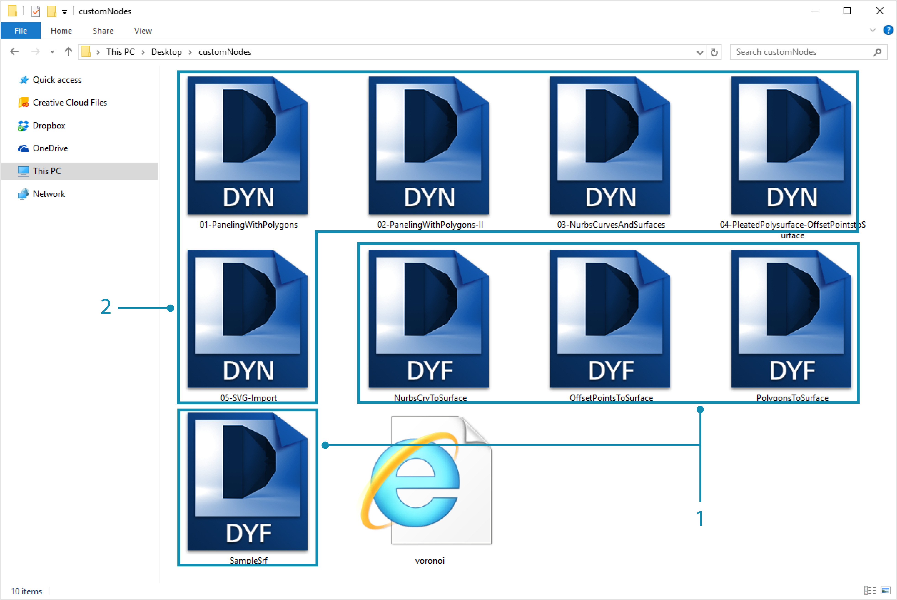
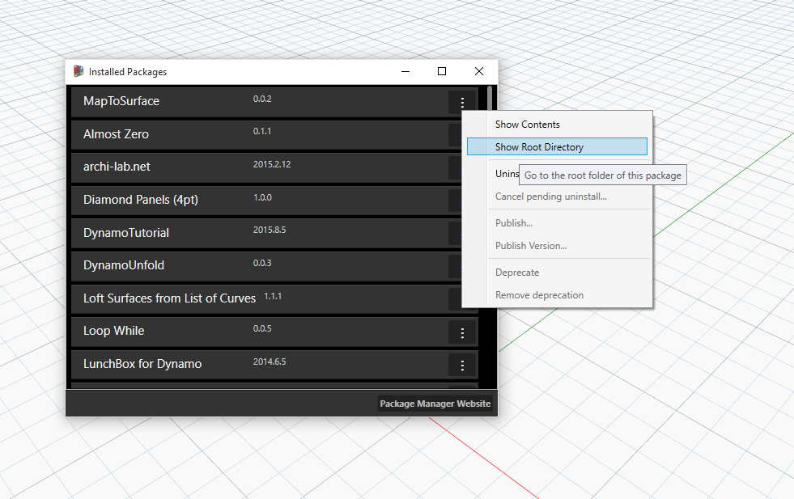

## Veröffentlichen von Paketen

In den vorigen Abschnitten wurde gezeigt, wie das *MapToSurface*-Paket sich aus benutzerdefinierten Blöcken und Beispieldateien zusammensetzt. Aber wie veröffentlichen Sie ein Paket, das lokal entwickelt wurde? Diese Fallstudie zeigt, wie Sie ein Paket aus einer Gruppe Dateien in einem lokalen Ordner veröffentlichen können.  Es gibt mehrere Möglichkeiten zum Veröffentlichen von Paketen. Im Folgenden wird der von uns empfohlene Prozess beschrieben: **Sie veröffentlichen lokal, entwickeln lokal und veröffentlichen schließlich online**. Sie beginnen mit einem Ordner, der sämtliche Dateien im Paket enthält.

### Deinstallieren eines Pakets

Bevor Sie mit der Veröffentlichung des MapToSurface-Pakets beginnen, deinstallieren Sie das Paket aus der vorigen Lektion, falls Sie es installiert haben. Dadurch vermeiden Sie, mit identischen Paketen zu arbeiten.

> Beginnen Sie, indem Sie *Pakete > Pakete verwalten* wählen.

> Wählen Sie die Schaltfläche für *MapToSurface* und wählen Sie *Deinstallieren*. Starten Sie dann Dynamo erneut. Wenn Sie beim erneuten Öffnen das Fenster *Pakete verwalten* überprüfen, darf *MapToSurface* dort nicht mehr vorhanden sein. Jetzt können Sie den Vorgang von Anfang an durchführen.

### Lokale Veröffentlichung von Paketen

*Anmerkung: Zu dem Zeitpunkt, als dieses Dokument verfasst wurde, war die Veröffentlichung von Dynamo-Paketen nur in Dynamo Studio und Dynamo for Revit aktiviert. Dynamo Sandbox verfügte nicht über Veröffentlichungsfunktionen.*

> Laden Sie die Beispieldateien für die Fallstudie zu diesem Paket herunter (durch Rechtsklicken und Wahl von Save Link As). Eine vollständige Liste der Beispieldateien finden Sie im Anhang. [MapToSurface.zip](datasets/10-4/MapToSurface.zip)

> Sie übermitteln Ihr Paket zum ersten Mal und alle Beispieldateien und benutzerdefinierten Blöcke befinden sich im selben Ordner. Nachdem dieser Ordner vorbereitet ist, können Sie jetzt auf Dynamo Package Manager hochladen.

> 1. Der Ordner enthält fünf benutzerdefinierte Blöcke (.dyf).
2. Er enthält außerdem fünf Beispieldateien (.dyn) und eine importierte Vektordatei (.svg). Diese Dateien dienen als einführende Übungen, die dem Benutzer die Arbeit mit den benutzerdefinierten Blöcken erläutern sollen.

> Klicken Sie in Dynamo zunächst auf *Pakete > Neues Paket veröffentlichen*.

> In Fenster *Paket publizieren* ist das relevante Formular im linken Bereich bereits ausgefüllt.

> 1. Durch Klicken auf *Datei hinzufügen* wurden außerdem die Dateien aus der Ordnerstruktur rechts auf dem Bildschirm hinzugefügt. (Um andere Dateien als DYF-Dateien hinzuzufügen, ändern Sie den Dateityp im Browserfenster in **Alle Dateien (*.*)"**. Beachten Sie, dass sämtliche Dateien ohne Unterscheidung zwischen benutzerdefinierten Blöcken (.dyf) und Beispieldateien (.dyn) hinzugefügt wurden. Dynamo ordnet diese Objekte beim Veröffentlichen des Pakets in Kategorien ein.
2. Im Feld Gruppe wird definiert, in welcher Gruppe die benutzerdefinierten Blöcke in der Benutzeroberfläche von Dynamo abgelegt werden.
3. Veröffentlichen Sie das Paket, indem Sie auf Lokal publizieren klicken. Achten Sie darauf, auf *Lokal publizieren* und **nicht** auf *Online publizieren* zu klicken: Es sollen keine Duplikate im Package Manager erstellt werden.

> 1. Nach der Veröffentlichung werden die benutzerdefinierten Blöcke in der Gruppe DynamoPrimer oder in Ihrer Dynamo-Bibliothek angezeigt.

> Sehen Sie jetzt im Stammverzeichnis nach, wie Dynamo das eben erstellte Paket formatiert hat. Klicken Sie dazu auf *Pakete > Pakete verwalten*.

> Klicken im Fenster zur Verwaltung von Paketen auf die drei senkrechten Punkte rechts neben *MapToSurface* und wählen Sie *Stammverzeichnis anzeigen*.

> Das Stammverzeichnis befindet sich am lokalen Speicherort des Pakets (da Sie es lokal veröffentlicht haben). Dynamo greift derzeit zum Lesen benutzerdefinierter Blöcke auf diesen Ordner zu. Aus diesem Grund müssen Sie das Verzeichnis lokal an einem dauerhaften Speicherort ablegen (d. h. nicht auf Ihrem Desktop). Der Ordner mit dem Dynamo-Paket ist wie folgt gegliedert:

> 1. Im Ordner *bin* befinden sich DLL-Dateien, die mit C#- oder Zero Touch-Bibliotheken erstellt wurden. Dieses Paket enthält keine solchen Dateien; dieser Ordner ist also in diesem Beispiel leer.
2. Im Ordner *dyf* befinden sich die benutzerdefinierten Blöcke. Wenn Sie ihn öffnen, werden alle benutzerdefinierten Blöcke (DYF-Dateien) für das Paket angezeigt.
3. Im Ordner extra befinden sich alle zusätzlichen Dateien. Dies sind wahrscheinlich Dynamo-Dateien (.dyn) oder sonstige erforderliche Zusatzdateien (.svg, .xls, .jpeg, .sat usw.).
4. Die Datei pkg ist eine einfache Textdatei, die die Einstellungen des Pakets definiert. Diese Datei wird in Dynamo automatisch erstellt, Sie können Sie jedoch bearbeiten, wenn Sie detaillierte Einstellungen benötigen.

### Online-Veröffentlichung von Paketen

> **Anmerkung: Führen Sie diesen Schritt bitte nicht aus, es sei denn, Sie möchten tatsächlich ein eigenes Paket veröffentlichen.**

> 1. Wenn das Paket zur Veröffentlichung bereit ist, wählen Sie im Fenster Pakete verwalten die Schaltfläche rechts von MapToSurface und wählen Sie *Veröffentlichen*.
2. Um ein bereits veröffentlichtes Paket zu aktualisieren, wählen Sie Version veröffentlichen. Dynamo aktualisiert dann Ihr Paket online mit den neuen Dateien im Stammverzeichnis des Pakets. Dieser einfache Schritt genügt.

### Version veröffentlichen

Wenn Sie die Dateien im Stammverzeichnis des veröffentlichten Pakets aktualisieren, können Sie über *Version veröffentlichen* im Fenster *Pakete verwalten* eine neue Version des Pakets veröffentlichen. Auf diese Weise können Sie nahtlos erforderliche Aktualisierungen Ihrer Inhalte vornehmen und sie für die Community bereitstellen. Die Funktion *Version veröffentlichen* kann nur verwendet werden, wenn Sie der Verwalter des Pakets sind.

