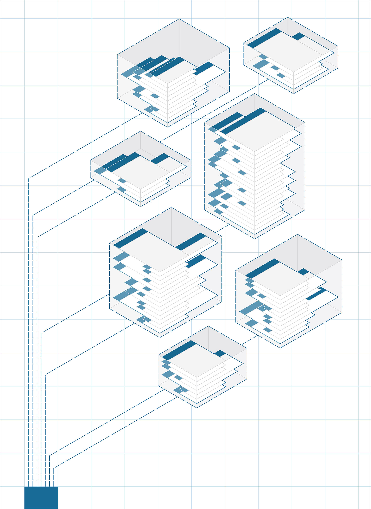

# Pakete

Nachdem Sie einige benutzerdefinierte Blöcke erstellt haben, beginnen Sie im nächsten Schritt damit, sie zu ordnen und in Form von Paketen zu veröffentlichen: eine einfache Methode, Ihre Blöcke zu speichern und in der Dynamo-Community bereitzustellen.

