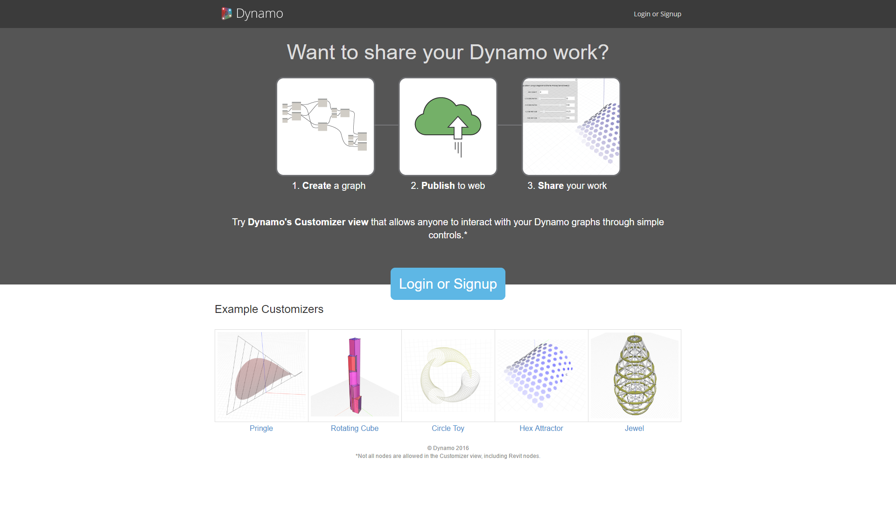

## Dynamo im Internet

In Dynamo Studio steht jetzt eine Funktion zur Übermittlung ins Internet zur Verfügung, die Ihnen die Arbeit mit Dynamo über das Internet ermöglicht. Diese Funktion ermöglicht es anderen Benutzern, über eine auf die hierfür nötigen Funktionen (zulässige Eingaben wie Schieberegler, Zahlen und boolesche Werte) beschränkte Benutzeroberfläche, die Customizer-Ansicht, mit Ihren Skripts zu interagieren. Dadurch werden Ihre Skripts für größere Benutzergruppen zugänglich, die eventuell nicht mit Dynamo oder visueller Programmierung vertraut sind.

> Dynamo im Internet

