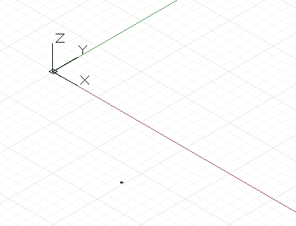
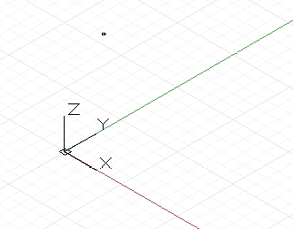

# DesignScript-Geometriegrundlagen

Das einfachste geometrische Objekt in der Dynamo-Bibliothek für Standardgeometrie ist ein Punkt. Jegliche Geometrie wird mit speziellen Funktionen namens Konstruktoren erstellt, die jeweils ein neues Exemplar dieses bestimmten Geometrietyps zurückgeben. In Dynamo beginnen Konstruktoren mit dem Namen des Objekttyps, in diesem Fall Point, gefolgt von der Konstruktionsmethode. Zum Erstellen eines dreidimensionalen Punkts, der durch die kartesischen Koordinaten x, y und z angegeben wird, verwenden Sie den Konstruktor *ByCoordinates*:



```js
// create a point with the following x, y, and z
// coordinates:
x = 10;
y = 2.5;
z = -6;

p = Point.ByCoordinates(x, y, z);
```

Konstruktoren in Dynamo sind normalerweise mit dem Präfix *By* gekennzeichnet, und wenn Sie diese Funktionen aufrufen, geben sie ein neu erstelltes Objekt des betreffenden Typs zurück. Dieses neu erstellte Objekt wird in der Variablen mit dem Namen gespeichert, der links vom Gleichheitszeichen steht.

Die meisten Objekte verfügen über viele verschiedene Konstruktoren, und mit dem Konstruktor *BySphericalCoordinates* können wir einen Punkt erstellen, der auf einer Kugel liegt und durch den Radius der Kugel, einen ersten Drehwinkel sowie einen zweiten Drehwinkel (in Grad) angegeben wird:



```js
// create a point on a sphere with the following radius,
// theta, and phi rotation angles (specified in degrees)
radius = 5;
theta = 75.5;
phi = 120.3;
cs = CoordinateSystem.Identity();

p = Point.BySphericalCoordinates(cs, radius, theta,
    phi);
```

Punkte können verwendet werden, um höherdimensionale Geometrien wie z. B. Linien zu erstellen. Mit dem Konstruktor *ByStartPointEndPoint* können wir ein Linienobjekt zwischen zwei Punkten erstellen:


```js
// create two points:
p1 = Point.ByCoordinates(3, 10, 2);
p2 = Point.ByCoordinates(-15, 7, 0.5);

// construct a line between p1 and p2
l = Line.ByStartPointEndPoint(p1, p2);
```

In ähnlicher Weise können mit Linien wiederum höherdimensionale Oberflächengeometrien erstellt werden, beispielsweise mit dem Konstruktor *Loft*, der aus einer Reihe von Linien oder Kurven eine Oberfläche zwischen diesen interpoliert.


```js
// create points:
p1 = Point.ByCoordinates(3, 10, 2);
p2 = Point.ByCoordinates(-15, 7, 0.5);

p3 = Point.ByCoordinates(5, -3, 5);
p4 = Point.ByCoordinates(-5, -6, 2);

p5 = Point.ByCoordinates(9, -10, -2);
p6 = Point.ByCoordinates(-11, -12, -4);

// create lines:
l1 = Line.ByStartPointEndPoint(p1, p2);
l2 = Line.ByStartPointEndPoint(p3, p4);
l3 = Line.ByStartPointEndPoint(p5, p6);

// loft between cross section lines:
surf = Surface.ByLoft([l1, l2, l3]);
```

Auch Oberflächen können zum Erstellen höherdimensionaler Volumenkörper-Geometrien genutzt werden, zum Beispiel durch Verdicken der Oberfläche um einen gegebenen Abstand. Vielen Objekten sind Funktionen zugewiesen, die Methoden genannt werden, und mit denen Programmierer Befehle auf das jeweilige Objekt ausführen können. Methoden, die allen Geometrien gemein sind, sind z. B. *Translate* und *Rotate*, die die Geometrie um einen gegebenen Wert verschieben oder drehen. Oberflächen haben eine Methode namens *Thicken*, die einen einzelnen Eingabewert akzeptiert, der die neue Dicke der Oberfläche angibt.


```js
p1 = Point.ByCoordinates(3, 10, 2);
p2 = Point.ByCoordinates(-15, 7, 0.5);

p3 = Point.ByCoordinates(5, -3, 5);
p4 = Point.ByCoordinates(-5, -6, 2);

l1 = Line.ByStartPointEndPoint(p1, p2);
l2 = Line.ByStartPointEndPoint(p3, p4);

surf = Surface.ByLoft([l1, l2]);

// true indicates to thicken both sides of the Surface:
solid = surf.Thicken(4.75, true);
```

Mit den *Intersection*-Befehlen können niedrigerdimensionale Geometrien aus höherdimensionalen Objekten extrahiert werden. Diese extrahierte niedrigerdimensionale Geometrie kann als Grundlage für eine höherdimensionale Geometrie in einem zyklischen Prozess des geometrischen Erstellens, Extrahierens und erneuten Erstellens dienen. In diesem Beispiel verwenden wir den generierten Volumenkörper, um eine Oberfläche zu erstellen, und nutzen anschließend die Oberfläche, um eine Kurve zu erstellen.


```js
p1 = Point.ByCoordinates(3, 10, 2);
p2 = Point.ByCoordinates(-15, 7, 0.5);

p3 = Point.ByCoordinates(5, -3, 5);
p4 = Point.ByCoordinates(-5, -6, 2);

l1 = Line.ByStartPointEndPoint(p1, p2);
l2 = Line.ByStartPointEndPoint(p3, p4);

surf = Surface.ByLoft([l1, l2]);

solid = surf.Thicken(4.75, true);

p = Plane.ByOriginNormal(Point.ByCoordinates(2, 0, 0),
    Vector.ByCoordinates(1, 1, 1));

int_surf = solid.Intersect(p);

int_line = int_surf.Intersect(Plane.ByOriginNormal(
    Point.ByCoordinates(0, 0, 0),
    Vector.ByCoordinates(1, 0, 0)));
```

