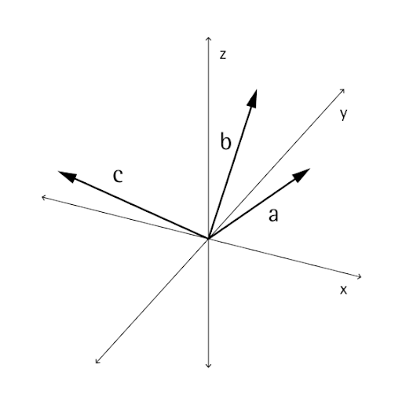

# Vektormathematik

Objekte in computergestützten Entwürfen werden selten explizit in ihrer endgültigen Position und Form erstellt, meist werden sie verschoben, gedreht und anderweitig anhand von bestehender Geometrie positioniert. Die Vektormathematik dient als eine Art geometrisches Gerüst, um der Geometrie Richtung und Ausrichtung zu verleihen sowie Bewegungen durch den dreidimensionalen Raum ohne visuelle Darstellung zu konzeptuieren.

In seiner einfachsten Form stellt ein Vektor eine Position im dreidimensionalen Raum dar. Man stellt sich ihn oft als Endpunkt eines Pfeils zwischen der Position (0, 0, 0) und der gegebenen Position vor. Vektoren können unter Verwendung des Konstruktors *ByCoordinates* erstellt werden, wobei die x-, y- und z-Position des neu erstellten Vektorobjekts angegeben wird. Beachten Sie, dass Vektoren keine geometrischen Objekte sind und nicht im Dynamo-Fenster angezeigt werden. Informationen zu einem neu erstellten oder geänderten Vektor können jedoch im Konsolenfenster gedruckt werden:


```js
// construct a Vector object
v = Vector.ByCoordinates(1, 2, 3);

s = v.X + " " + v.Y + " " + v.Z;
```

Für Vektoren ist ein Satz von mathematischen Operationen definiert, sodass Sie Objekte im dreidimensionalen Raum genauso addieren, subtrahieren, multiplizieren und anderweitig verschieben können wie reelle Zahlen im eindimensionalen Raum auf einer Zahlengeraden.

Vektoraddition ist definiert als die Summe der Komponenten von zwei Vektoren. Man kann sie sich so vorstellen, dass der resultierende Vektor aus zwei mit der Spitze des einen am Ende des anderen platzierten Vektoren entsteht. Vektoraddition wird mit der Methode *Add* durchgeführt und wird im Diagramm auf der linken Seite abgebildet.


```js
a = Vector.ByCoordinates(5, 5, 0);
b = Vector.ByCoordinates(4, 1, 0);

// c has value x = 9, y = 6, z = 0
c = a.Add(b);
```

Gleichermaßen können zwei Vektorobjekte mit der Methode *Subtract* voneinander subtrahiert werden. Vektorsubtraktion kann man sich als die Richtung vom ersten zum zweiten Vektor vorstellen.


```js
a = Vector.ByCoordinates(5, 5, 0);
b = Vector.ByCoordinates(4, 1, 0);

// c has value x = 1, y = 4, z = 0
c = a.Subtract(b);
```

Vektormultiplikation kann man sich so vorstellen, dass der Endpunkt eines Vektors in seiner eigenen Richtung um einen angegebenen Skalierungsfaktor verschoben wird.


```js
a = Vector.ByCoordinates(4, 4, 0);

// c has value x = 20, y = 20, z = 0
c = a.Scale(5);
```

Häufig ist beim Skalieren eines Vektors erwünscht, dass die Länge des resultierenden Vektors genau gleich dem skalierten Betrag ist. Dies wird einfach erreicht, indem zuerst ein Vektor normalisiert wird, also die Länge des Vektors auf genau eins festgelegt wird.


```js
a = Vector.ByCoordinates(1, 2, 3);
a_len = a.Length;

// set the a's length equal to 1.0
b = a.Normalized();
c = b.Scale(5);

// len is equal to 5
len = c.Length;
```

c weist weiterhin in dieselbe Richtung wie (1, 2, 3), hat jetzt jedoch eine Länge genau gleich 5.

In der Vektormathematik gibt es zwei weitere Methoden, die keine eindeutigen Parallelen zur eindimensionalen Mathematik aufweisen, das Kreuzprodukt und das Skalarprodukt. Das Kreuzprodukt ist eine Methode zum Erstellen eines Vektors, der sich im rechten Winkel (90 Grad) zu zwei vorhandenen Vektoren befindet. Beispielsweise ist das Kreuzprodukt der x- und y-Achsen die Z-Achse, auch wenn die beiden Eingabevektoren nicht orthogonal zueinander sein müssen. Ein Kreuzproduktvektor wird mit der Methode *Cross* berechnet.



```js
a = Vector.ByCoordinates(1, 0, 1);
b = Vector.ByCoordinates(0, 1, 1);

// c has value x = -1, y = -1, z = 1
c = a.Cross(b);
```

Eine weitere, wenn auch fortgeschrittenere Funktion der Vektormathematik ist das Skalarprodukt. Das Skalarprodukt zwischen zwei Vektoren ist eine reelle Zahl (kein Vektorobjekt), die mit dem Winkel zwischen zwei Vektoren zusammenhängt, jedoch nicht exakt diesem Winkel entspricht. Ein hilfreiche Eigenschaft des Skalarprodukts besteht darin, dass das Skalarprodukt zweier Vektoren nur genau dann 0 ist, wenn sie lotrecht zueinander stehen. Das Skalarprodukt wird mit der Methode *Dot* berechnet.


```js
a = Vector.ByCoordinates(1, 2, 1);
b = Vector.ByCoordinates(5, -8, 4);

// d has value -7
d = a.Dot(b);
```

