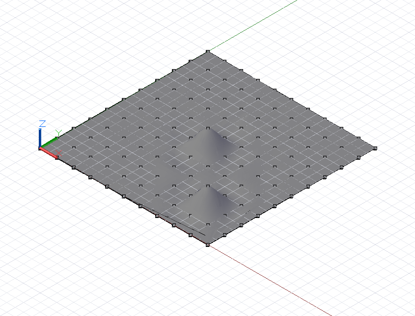
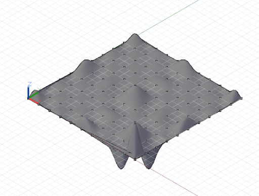
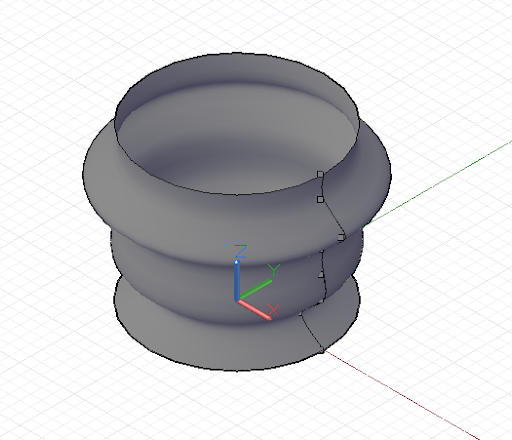

# Oberflächen: Interpolation, Steuerpunkte, Erhebung, Drehung

Die zweidimensionale Entsprechung zur NurbsCurve ist die NurbsSurface, und wie die Freiform-NurbsCurve können NurbsSurfaces mit zwei grundlegenden Methoden konstruiert werden: durch Eingabe eines Satzes von Basispunkten, zwischen denen Dynamo interpoliert, oder durch explizites Angeben der Steuerpunkte der Oberfläche. Ebenso wie Freiformkurven sind interpolierte Oberflächen nützlich, wenn ein Konstrukteur die präzise Form kennt, die eine Oberfläche aufweisen soll, oder ein Entwurf erfordert, dass die Oberfläche durch Abhängigkeitspunkte führt. Mit Steuerpunkten erstellte Oberflächen wiederum können dann nützlich sein, wenn es um experimentelle Entwürfe mit unterschiedlichen Glättungsgraden geht.

Zum Erstellen einer interpolierten Oberfläche generieren Sie einfach eine zweidimensionale Punktsammlung als Annäherung an die Form einer Oberfläche. Die Sammlung muss rechteckig sein, also nicht gezackt. Die Methode *NurbsSurface.ByPoints* erstellt eine Oberfläche aus diesen Punkten.



```js
// python_points_1 is a set of Points generated with
// a Python script found in Chapter 12, Section 10

surf = NurbsSurface.ByPoints(python_points_1);
```

Freiform-NurbsSurfaces können auch erstellt werden, indem die zugrunde liegenden Steuerpunkte einer Oberfläche angegeben werden. Wie bei NurbsCurves kann man sich die Steuerpunkte als Darstellung eines vierseitigen Netzes mit geraden Segmenten vorstellen, das je nach dem Grad der Oberfläche zur endgültigen Oberflächenform geglättet wird. Um eine NurbsSurface aus Steuerpunkten zu erstellen, schließen Sie zwei zusätzliche Parameter in *NurbsSurface.ByPoints* ein, die den Grad der zugrunde liegenden Kurven in beide Richtungen der Oberfläche angeben.


```js
// python_points_1 is a set of Points generated with
// a Python script found in Chapter 12, Section 10

// create a surface of degree 2 with smooth segments
surf = NurbsSurface.ByPoints(python_points_1, 2, 2);
```

Wir können den Grad der NurbsSurface erhöhen, um die resultierende Oberflächengeometrie zu ändern:



```js
// python_points_1 is a set of Points generated with
// a Python script found in Chapter 12, Section 10

// create a surface of degree 6
surf = NurbsSurface.ByPoints(python_points_1, 6, 6);
```

Genauso wie Oberflächen durch Interpolation zwischen einer Reihe eingegebener Punkte erstellt werden können, können sie auch durch Interpolation zwischen einem Satz von Basiskurven erstellt werden. Dieser Ansatz wird als Erhebung bezeichnet. Eine Erhebungskurve wird mit dem Konstruktor *Surface.ByLoft* und einer Sammlung von Eingabekurven als einzigem Parameter erstellt.


```js
// python_points_2, 3, and 4 are generated with
// Python scripts found in Chapter 12, Section 10

c1 = NurbsCurve.ByPoints(python_points_2);
c2 = NurbsCurve.ByPoints(python_points_3);
c3 = NurbsCurve.ByPoints(python_points_4);

loft = Surface.ByLoft([c1, c2, c3]);
```

Rotationsflächen sind ein weiterer Typ von Oberflächen, die durch Sweeping einer Basiskurve um eine Mittelachse erstellt werden. Wenn interpolierte Oberflächen zweidimensional analog zu interpolierten Kurven sind, dann sind Rotationsflächen zweidimensional analog zu Kreisen und Bogen.

Rotationsflächen werden definiert durch eine Basiskurve, die die „Kante“ der Oberfläche darstellt, einen Achsenursprung, der den Basispunkt der Oberfläche bildet, eine Achsenrichtung, die die Kernrichtung vorgibt, einen Sweeping-Startwinkel sowie einen Sweeping-Endwinkel. Diese Parameter werden als Eingabe für den Konstruktor *Surface.Revolve* verwendet.



```js
pts = {};
pts[0] = Point.ByCoordinates(4, 0, 0);
pts[1] = Point.ByCoordinates(3, 0, 1);
pts[2] = Point.ByCoordinates(4, 0, 2);
pts[3] = Point.ByCoordinates(4, 0, 3);
pts[4] = Point.ByCoordinates(4, 0, 4);
pts[5] = Point.ByCoordinates(5, 0, 5);
pts[6] = Point.ByCoordinates(4, 0, 6);
pts[7] = Point.ByCoordinates(4, 0, 7);

crv = NurbsCurve.ByPoints(pts);

axis_origin = Point.ByCoordinates(0, 0, 0);
axis = Vector.ByCoordinates(0, 0, 1);

surf = Surface.ByRevolve(crv, axis_origin, axis, 0,
    360);
```

