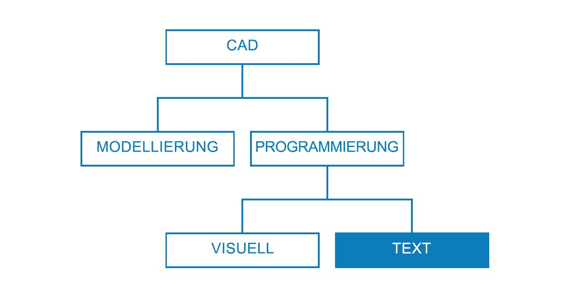
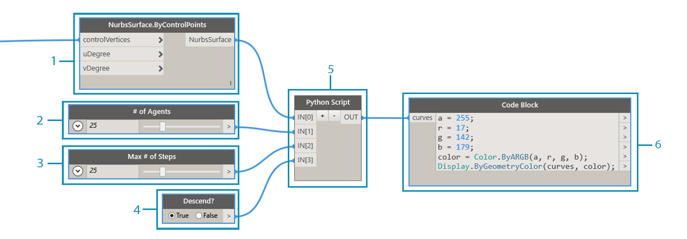

## Vorgehensweisen zur Skripterstellung

Die textbasierte Skripterstellung innerhalb der Umgebung für visuelle Skripterstellung ermöglicht leistungsstarke und visuelle Beziehungen mithilfe von DesignScript, Python und ZeroTouch (C#). Die Benutzer können in ein und demselben Arbeitsbereich Elemente wie Eingabe-Schieberegler bereitstellen, umfangreiche Abläufe in DesignScript zusammenfassen sowie in Python oder C# auf leistungsstarke Werkzeuge und Bibliotheken zugreifen. Diese Vorgehensweisen können bei effizientem Einsatz die Möglichkeiten zur benutzerdefinierten Anpassung, die Verständlichkeit und die Effizienz des gesamten Programms erheblich steigern. Die im Folgenden beschriebenen Richtlinien helfen Ihnen dabei, Ihre visuellen Skripts um Textskripte zu ergänzen.



### Wann sollten Skripts verwendet werden?

Mit Textskripts können Sie komplexere Beziehungen erstellen als durch visuelle Programmierung, jedoch sind beiden Verfahren auch zahlreiche Funktionen gemeinsam. Dies ist sinnvoll, da Blöcke letzten Endes vorgefertigter Code sind. Es ist wahrscheinlich möglich, ein ganzes Dynamo-Programm in DesignScript oder Python zu schreiben. Die visuellen Skripte kommen jedoch zum Einsatz, weil die Benutzeroberfläche mit Blöcken und Drähten eine intuitive Darstellung des Ablaufs in grafischer Form bietet. Indem Sie sich klarmachen, inwiefern die Möglichkeiten von Textskripts über diejenigen visueller Skripts hinausgehen, erhalten Sie eine wichtige Grundlage für die Entscheidung, wann Textskripts verwendet werden sollten, ohne dabei die intuitive Arbeitsweise mit Blöcken und Drähten aufgeben zu müssen. Die folgenden Richtlinien beschreiben, wann und in welcher Sprache Skripts erstellt werden sollten.

**Verwenden Sie Textskripts für:**

* Schleifen

* Rekursionen

* Zugriff auf externe Bibliotheken

**Wählen Sie eine Sprache:**

|
|Schleifen|Rekursionen|Zusammenfassen von Blöcken|Ext. Bibliotheken|Kurzschreibweisen|
| -- | -- | -- | -- | -- | -- |
|**DesignScript**|Ja|Ja|Ja|Nein|Ja|
|**Python**|Ja|Ja|Teilweise|Ja|Nein|
|**ZeroTouch (C#)**|Nein|Nein|Nein|Ja|Nein|

> Unter [Referenz für die Skripterstellung](http://primer.dynamobim.org/en/12_Best-Practice/12-3_Scripting-Reference.html) ist aufgelistet, worauf Sie mit welcher Dynamo-Bibliothek zugreifen können.

### Parametrischer Denkansatz

Bei der Skripterstellung in Dynamo, einer zwangsläufig parametrischen Umgebung, ist es sinnvoll, Ihren Code bezogen auf die Blöcke und Drähte zu strukturieren, in denen er zum Einsatz kommt. Betrachten Sie den Block mit Ihrem Textskript als einen normalen Block wie andere Blöcke im Programm mit spezifischen Eingaben, einer Funktion und einer erwarteten Ausgabe. Dadurch stellen Sie dem Code im Block direkt eine kleine Gruppe von Variablen zur Verarbeitung zur Verfügung, was für ein ordnungsgemäßes parametrisches System entscheidend ist. Im Folgenden finden Sie einige Richtlinien für eine bessere Integration von Code in ein visuelles Programm.

**Identifizieren der externen Variablen:**

* Versuchen Sie, die gegebenen Parameter in der Designaufgabe so festzulegen, dass Sie ein Modell direkt auf Basis dieser Daten konstruieren können.

* Identifizieren Sie die Variablen, bevor Sie mit dem Erstellen von Code beginnen:

* Eine auf das absolut Notwendige beschränkte Gruppe von Eingaben

* Die beabsichtigte Ausgabe

* Konstanten



> Vor dem Schreiben des Codes wurden mehrere Variablen festgelegt.

> 1. Die in der Simulation dem Regen ausgesetzte Oberfläche.
2. Die gewünschte Anzahl Regentropfen (Agents).
3. Die von den Regentropfen zurückgelegte Strecke.
4. Umschalten zwischen steilstmöglichem Pfad und Überqueren der Oberfläche.
5. Python-Block mit der entsprechenden Anzahl Eingaben.
6. Ein Codeblock, mit dem die zurückgegebenen Kurven blau gefärbt werden.

**Entwerfen der internen Beziehungen:**

* Das parametrische Prinzip ermöglicht die Bearbeitung bestimmter Parameter oder Variablen, um das Endergebnis einer Gleichung zu ändern oder zu beeinflussen.

* Versuchen Sie stets, Objekte in Ihrem Skript, die logisch miteinander verbunden sind, als Funktionen voneinander zu definieren. Auf diese Weise wird bei einer Änderung eines der Objekte auch das andere proportional dazu aktualisiert.

* Beschränken Sie die Anzahl der Eingaben, indem Sie nur die wichtigsten Parameter bereitstellen:

* Wenn eine Gruppe von Parametern aus Parametern auf einer höheren Hierarchieebene abgeleitet werden kann, stellen Sie nur die übergeordneten Parameter als Skripteingaben bereit. Auf diese Weise vereinfachen Sie die Benutzeroberfläche des Skripts und machen dieses dadurch benutzerfreundlicher.


> Die Codemodule aus dem Beispiel unter [Python-Block](http://primer.dynamobim.org/en/09_Custom-Nodes/9-4_Python.html).

> 1. Eingaben.
2. Interne Variablen für das Skript.
3. Eine Schleife, die diese Eingaben und Variablen für ihre Funktion nutzt.
> Tipp: Wenden Sie für den Prozess dieselbe Sorgfalt an wie für die Lösung.

**Vermeiden von Wiederholungen (das DRY-Prinzip – Don't repeat yourself):**

* Falls es mehrere Möglichkeiten für denselben Vorgang in Ihrem Skript gibt, werden die doppelt vorhandenen Darstellungen schließlich asynchron, was die Wartung extrem schwierig macht, die Faktorisierung verschlechtert und interne Widersprüche verursacht.

* Das DRY-Prinzip besagt, dass jede für jede Information genau eine eindeutige und maßgebliche Darstellung im System vorhanden sein muss.

* Wird dieses Prinzip erfolgreich angewendet, erfolgen Änderungen an allen verbundenen Elementen in Ihrem Skript in vorhersehbarer und einheitlicher Weise und Elemente, die nicht miteinander verbunden sind, haben keine logischen Auswirkungen aufeinander.

```
### BAD
for i in range(4):
for j in range(4):
point = Point.ByCoordinates(3*i, 3*j, 0)
points.append(point)
```

```
### GOOD
count = IN[0]
pDist = IN[1]

for i in range(count):
for j in range(count):
point = Point.ByCoordinates(pDist*i, pDist*j, 0)
points.append(point)
```

> Tipp: Bevor Sie Objekte in Ihrem Skript duplizieren (wie die Konstante im obigen Beispiel), überlegen Sie, ob Sie stattdessen eine Verknüpfung zur Quelle erstellen können.

### Modulares Strukturieren

Mit zunehmender Länge und Komplexität des Codes ist das Grundkonzept bzw. der Gesamtalgorithmus immer schwieriger zu entziffern. Es wird zudem schwieriger, zu verfolgen, welche spezifischen Vorgänge ablaufen (und wo dies geschieht), bei Fehlfunktionen den Fehler zu finden, anderen Code zu integrieren und Entwicklungsaufgaben zuzuweisen. Um diese Probleme zu vermeiden, ist es sinnvoll, Code in Modulen zu erstellen: Bei diesem Organisationsverfahren wird Code anhand der jeweils ausgeführten Aufgaben aufgegliedert. Im Folgenden finden Sie einige Tipps, die es Ihnen erleichtern sollen, durch Modularisierung leichter zu verwaltende Skripts zu erstellen.

**Schreiben von Code in Modulen:**

* Ein Modul ist eine Sammlung von Code, der eine bestimmte Aufgabe ausführt, ähnlich wie ein Dynamo-Block im Arbeitsbereich.

* Dabei kann es sich um beliebigen Code handeln, der visuell von angrenzendem Code abgetrennt sollte (eine Funktion, eine Klasse, eine Gruppe von Eingaben oder die von Ihnen importierten Bibliotheken).

* Durch die Entwicklung von Code in Form von Modulen können Sie sowohl die visuellen, intuitiven Eigenschaften von Blöcken als auch die komplexen Beziehungen nutzen, die nur mit Textskripts zu erreichen sind.


> Diese Schleifen rufen eine Klasse namens „agent“ auf, die in dieser Übung entwickelt wird.

> 1. Ein Code-Modul, das den Startpunkt jedes Agents definiert.
2. Ein Code-Modul, das den Agent aktualisiert.
3. Ein Code-Modul, das den Pfad zeichnet, dem der Agent folgt.

**Erkennen der Wiederverwendung von Code:**

* Wenn Sie feststellen, dass Ihr Code dieselbe (oder eine sehr ähnliche) Aufgabe an mehr als einer Stelle ausführt, suchen Sie nach Möglichkeiten, ihn zu einer Funktion zusammenzufassen, die aufgerufen werden kann.

* „Manager“-Funktionen steuern den Programmablauf und enthalten in erster Linie Aufrufe an „Worker“-Funktionen, die Details auf unteren Ebenen, etwa das Verschieben von Daten zwischen Strukturen, verarbeiten.


> In diesem Beispiel werden Kugeln erstellt, deren Radien und Farben vom Z-Wert ihrer Mittelpunkte abhängig sind.

> 1. Zwei übergeordnete „Worker“-Funktionen zum Erstellen von Kugeln mit Radien und mit Anzeigefarben anhand des Z-Werts des Mittelpunkts.
2. Eine übergeordnete „Manager“-Funktion, die die beiden „Worker“-Funktionen kombiniert. Durch Aufrufen dieser Funktion werden beide darin enthaltenen Funktionen aufgerufen.

**Beschränken der Anzeige auf das Nötige:**

* Die Schnittstelle eines Moduls gibt die vom Modul bereitgestellten und benötigten Elemente an.

* Nachdem Sie die Schnittstellen zwischen den Einheiten definiert haben, kann die detaillierte Entwicklung jeder Einheit separat erfolgen.

**Möglichkeit zum Trennen bzw. Ersetzen:**

* Module erkennen oder berücksichtigen einander nicht.

**Allgemeine Formen der Modularisierung :**

* Codegruppierung:

```
# IMPORT LIBRARIES
import random
import math
import clr
clr.AddReference('ProtoGeometry')
from Autodesk.DesignScript.Geometry import *

# DEFINE PARAMETER INPUTS
surfIn = IN[0]
maxSteps = IN[1]
```

* Funktionen:

```
def get_step_size():
area = surfIn.Area
stepSize = math.sqrt(area)/100
return stepSize

stepSize = get_step_size()
```

* Klassen:

```
class MyClass:
i = 12345

def f(self):
return 'hello world'

numbers = MyClass.i
greeting = MyClass.f
```

### Laufendes Testen

Es ist sinnvoll, während der Entwicklung von Textskripts in Dynamo laufend zu überprüfen, ob die tatsächlich erstellten Funktionen Ihren Erwartungen entsprechen. Dadurch stellen Sie sicher, dass unvorhergesehene Ereignisse wie Syntaxfehler, logische Diskrepanzen, falsche Werte, regelwidrige Ausgaben usw.nicht erst zum Schluss alle zusammen, sondern direkt bei ihrem Auftreten schnell erkannt und korrigiert werden. Da die Textskripts sich innerhalb der Blöcke im Ansichtsbereich befinden, sind sie bereits in den Datenfluss des visuellen Programms integriert. Die laufende Überwachung des Skripts gestaltet sich dadurch so einfach wie das Zuweisen von Daten für die Ausgabe, die Ausführung des Programms und die Auswertung des Skriptergebnisses über einen Beobachtungsblock. Im Folgenden finden Sie einige Tipps für die laufende Überwachung Ihrer Skripts, während Sie sie konstruieren.

**Testen Sie während der Entwicklung:**

* Wenn Sie eine Gruppe von Funktionen erstellt haben:

* Überprüfen Sie Ihren Code aus distanzierter Sicht.

* Seien Sie dabei kritisch. Ist die Funktionsweise für einen Teamkollegen verständlich? Brauche ich das wirklich? Kann diese Funktion effizienter durchgeführt werden? Werden unnötige Duplikate oder Abhängigkeiten erstellt?

* Führen Sie rasch Tests durch, um sich zu überzeugen, dass plausible Daten zurückgegebenen werden.

* Weisen Sie die aktuellsten Daten, mit denen Sie arbeiten, in Ihrem Skript als Ausgabedaten zu, damit der Block bei einer Aktualisierung des Skripts immer relevante Daten ausgibt:


> Testen des Beispielcodes aus dem [Python-Block](http://primer.dynamobim.org/en/09_Custom-Nodes/9-4_Python.html).

> 1. Überprüfen Sie, ob alle Kanten des Volumenkörpers als Kurven zurückgegeben werden, damit ein Begrenzungsrahmen darum erstellt wird.
2. Überprüfen Sie, ob die Count-Eingaben in Ranges konvertiert werden.
3. Überprüfen Sie, ob Koordinatensysteme in dieser Schleife ordnungsgemäß verschoben und gedreht wurden.

**Vorwegnehmen von Grenzfällen:**

* Geben Sie während der Skripterstellung die Mindest- und Höchstwerte der Eingabeparameter innerhalb ihrer zugewiesenen Domäne an, um zu testen, ob das Programm auch unter extremen Bedingungen funktioniert.

* Überprüfen Sie auch dann, wenn das Programm mit seinen Extremwerten funktioniert, ob es unbeabsichtigte Nullwerte oder leere Werte zurückgibt.

* Bugs und Fehler, die auf grundlegende Probleme mit dem Skript hinweisen, werden zuweilen nur in solchen Grenzfällen erkennbar.

* Ermitteln Sie die Fehlerursache, und entscheiden Sie, ob sie intern behoben werden muss oder ob zur Vermeidung des Problems eine Parameterdomäne neu definiert werden muss.

> Tipp: Gehen Sie stets davon aus, dass die Benutzer jede mögliche Kombination sämtlicher für sie bereitgestellten Eingabewerte verwenden werden. Auf diese Weise vermeiden Sie unangenehme Überraschungen.

### Effiziente Fehlersuche

Debugging ist der Prozess der Beseitigung von Fehlern („Bugs“) in Ihrem Skript. Bugs können Fehler, Ineffizienzen, Ungenauigkeiten oder beliebige nicht beabsichtigte Ergebnisse sein. Um einen Bug zu beheben, kann ein einfacher Schritt wie die Korrektur eines falsch geschriebenen Variablennamens genügen, es können jedoch auch tiefergehende, die Struktur des Skripts betreffende Probleme vorhanden sein. Im Idealfall erkennen Sie solche potenziellen Probleme frühzeitig, indem Sie das Skript während des Erstellens testen, eine Garantie für Fehlerfreiheit ist dadurch jedoch nicht gegeben. Im Folgenden werden einige der oben genannten optimalen Verfahren genauer beschrieben, um Ihnen die systematische Beseitigung von Bugs zu erleichtern.

**Verwenden Sie den Beobachtungsblock:**

* Überprüfen Sie die an verschiedenen Stellen des Codes zurückgegebenen Daten, indem Sie ihn ähnlich wie beim Testen des Programms der OUT-Variablen zuweisen:

**Schreiben Sie aussagekräftige Kommentare:**

* Das Debugging eines Codemoduls ist erheblich einfacher, wenn das beabsichtigte Ergebnis klar beschrieben ist.

```
# Loop through X and Y
for i in range(xCount):
for j in range(yCount):

# Rotate and translate the coordinate system
toCoord = fromCoord.Rotate(solid.ContextCoordinateSystem.Origin,Vector.ByCoordinates(0,0,1),(90*(i+j%seed)))
vec = Vector.ByCoordinates((xDist*i),(yDist*j),0)
toCoord = toCoord.Translate(vec)

# Transform the solid from the source coord system to the target coord system and append to the list
solids.append(solid.Transform(fromCoord,toCoord))
```

> Normalerweise wäre dies ein Übermaß an Kommentaren und leeren Zeilen, beim Debugging kann es jedoch hilfreich sein, den Code in überschaubare Abschnitte aufzuteilen.

**Nutzen Sie die Modularität des Codes:**

* Die Ursache eines Problems kann gezielt auf bestimmte Module zurückgeführt werden.

* Nachdem Sie das fehlerhafte Modul identifiziert haben, lässt sich das Problem wesentlich leichter beheben.

* Wenn ein Programm geändert werden muss, ist Code, der in Form von Modulen entwickelt wurde, erheblich leichter zu ändern.

* Sie können neue oder korrigierte Module in ein bestehendes Programm einfügen und sich dabei darauf verlassen, dass der Rest des Programms unverändert bleibt.


> Debuggen der Beispieldatei aus dem [Python-Block](http://primer.dynamobim.org/en/09_Custom-Nodes/9-4_Python.html).

> 1. Die Eingabegeometrie gibt einen Begrenzungsrahmen zurück, der größer ist als sie selbst, wie durch Zuweisen von xDist und yDist zu OUT zu erkennen ist.
2. Die Kantenkurven der Eingabegeometrie geben einen passenden Begrenzungsrahmen mit den richtigen Entfernungen für xDist und yDist zurück.
3. Das zur Behebung des Problems mit den xDist- und yDist-Werten eingefügte Codemodul.

### Übung – Steilstmöglicher Pfad

> Laden Sie die zu dieser Übungslektion gehörige Beispieldatei herunter (durch Rechtsklicken und Wahl der Option Save Link As). Eine vollständige Liste der Beispieldateien finden Sie im Anhang. [SteepestPath.dyn](datasets/13-1/SteepestPath.dyn)

In dieser Übung schreiben Sie unter Beachtung der optimalen Verfahren für Textskripts ein Skript zur Simulation von Regen. Im Kapitel „Strategien für Diagramme“ war es möglich, optimale Verfahren auf ein unstrukturiertes visuelles Programm anzuwenden. Bei Textskripts ist dies jedoch wesentlich schwieriger. Logische Beziehungen, die in Textskripts erstellt werden, sind weniger sichtbar und können in unzureichend strukturiertem Code kaum unterschieden werden. Die Leistungsfähigkeit der Textskripts bringt einen größeren Organisationsbedarf mit sich. Hier werden die einzelnen Schritte gezeigt und während des ganzen Vorgangs die optimalen Verfahren angewendet.


> Das auf eine durch einen Attraktor verformte Oberfläche angewendete Skript.

Als Erstes müssen Sie die benötigten Dynamo-Bibliotheken importieren. Indem Sie dies zu Anfang durchführen, erhalten Sie globalen Zugriff auf Dynamo-Funktionen in Python.


> Sie müssen hier sämtliche Bibliotheken importieren, die Sie verwenden möchten.

Anschließend müssen Sie die Eingaben und die Ausgabe definieren, die als Eingabeanschlüsse am Block angezeigt werden. Diese externen Eingaben sind die Grundlage für das Skript und der Schlüssel zum Erstellen einer parametrischen Umgebung.


> Sie müssen Eingaben definieren, die Variablen im Python-Skript entsprechen, und die gewünschte Ausgabe bestimmen:

> 1. Die Oberfläche, über die die Bewegung nach unten erfolgen soll.
2. Die Anzahl der Agents, die sich bewegen sollen.
3. Die maximale Anzahl an Schritten, die die Agents ausführen dürfen.
4. Eine Option, mit der entweder der kürzeste Weg abwärts auf der Oberfläche oder eine seitliche Bewegung gewählt werden kann.
5. Der Python-Block mit Eingabe-IDs, die den Eingaben im Skript (IN[0], IN[1]) entsprechen.
6. Ausgabekurven, die in einer anderen Farbe angezeigt werden können.

Erstellen Sie jetzt unter Beachtung des Modularitätsprinzips den Hauptteil des Skripts. Die Simulation des kürzesten Wegs abwärts auf einer Oberfläche ausgehend von unterschiedlichen Startpunkten ist eine größere Aufgabe, die mehrere Funktionen erfordert. Anstatt die verschiedenen Funktionen im Verlauf des ganzen Skripts aufzurufen, können Sie den Code modularisieren, indem Sie sie in einer einzigen Klasse, dem Agent, sammeln. Die verschiedenen Funktionen dieser Klasse – des „Moduls“ – können über unterschiedliche Variablen aufgerufen oder sogar in einem anderen Skripts wiederverwendet werden.


> Sie müssen eine Klasse bzw. eine Vorlage für einen Agent definieren, der eine Abwärtsbewegung über eine Oberfläche darstellt, wobei bei jedem Schritt der Bewegung jeweils die Richtung mit der maximalen Neigung gewählt wird:

> 1. Name.
2. Globale, allen Agents gemeinsame Attribute.
3. Exemplarattribute, die für jeden Agent spezifisch sind.
4. Eine Funktion zum Ausführen eines Schritts.
5. Eine Funktion zum Katalogisieren der Position jedes Schritts in einer Liste für den Pfad.

Initialisieren Sie die Agents, indem Sie ihre Startpositionen definieren. Dies ist eine gute Gelegenheit, das Skript zu testen und sicherzustellen, dass die Agent-Klasse funktioniert.


> Sie müssen alle Agents, deren Abwärtsbewegung über die Oberfläche Sie beobachten möchten, instanziieren und ihre Anfangsattribute definieren.

> 1. Eine neue, leere Pfadliste.
2. Ausgangspunkt der Bewegung über die Oberfläche.
3. Die Liste der Agents wird als Ausgabe zugewiesen, um zu überprüfen, was das Skript hier zurückgibt. Die richtige Anzahl der Agents wird zurückgegeben, das Skript muss jedoch später erneut getestet werden, um die zurückgegebene Geometrie zu prüfen.

Aktualisieren Sie die einzelnen Agents bei jedem Schritt.


> Anschließend müssen Sie eine verschachtelte Schleife starten, wobei die Position für jeden Agent und jeden Schritt aktualisiert und in der jeweiligen Pfadliste aufgezeichnet wird. Bei jedem Schritt wird außerdem geprüft, ob der Agent einen Punkt auf der Oberfläche erreicht hat, von dem aus keine weiteren Abwärtsschritte mehr möglich sind. Ist diese Bedingung erfüllt, wird die Bewegung des Agent beendet.

Nachdem die Agents vollständig aktualisiert sind, können Sie Geometrie ausgeben, durch die sie dargestellt werden.


> Nachdem alle Agents entweder den Endpunkt ihrer Abwärtsbewegung erreicht oder die maximale Anzahl Schritte ausgeführt haben, erstellen Sie eine Polykurve durch die Punkte in ihrem Pfad und geben die Polykurvenpfade aus.

Das Skript zur Ermittlung der steilstmöglichen Pfade.


> 1. Voreinstellung zur Simulation von Regen auf der zugrunde liegenden Oberfläche.
2. Die Agents können umgeschaltet werden, sodass sie nicht die steilstmöglichen Pfade suchen, sondern die Oberfläche überqueren.


> Das vollständige Python-Textskript.

