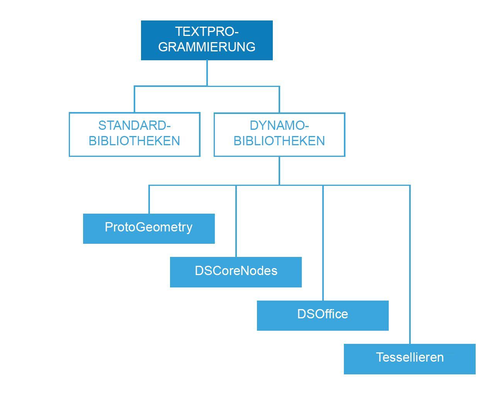

## Referenz für die Skripterstellung

Diese Referenzseite bietet ausführlichere Informationen zu Codebibliotheken, Beschriftungen und Stil aus den optimalen Verfahren, die unter „Vorgehensweisen zur Skripterstellung“ beschrieben wurden. Zur Verdeutlichung der im Folgenden beschriebenen Konzepte wird hier Python verwendet, es gelten jedoch dieselben Prinzipien sowohl in Python als auch in C# (Zerotouch), allerdings mit unterschiedlicher Syntax.

### Wahl geeigneter Bibliotheken

Standardbibliotheken sind außerhalb von Dynamo verfügbar und liegen in den Programmiersprachen Python und C# (Zerotouch) vor. Dynamo verfügt darüber hinaus über eigene Bibliotheken, die direkt seiner Blockhierarchie entsprechen und es dem Benutzer ermöglichen, alle Abläufe, die aus Blöcken und Drähten konstruiert werden können, auch in Form von Code zu erstellen. Der folgende Leitfaden zeigt, worauf Sie in den einzelnen Dynamo-Bibliotheken Zugriff erhalten und wann Sie eine Standardbibliothek verwenden sollten.



**Standardbibliotheken und Dynamo-Bibliotheken**

* Standardbibliotheken in Python und C# können zum Erstellen erweiterter Daten- und Ablaufsstrukturen in der Dynamo-Umgebung genutzt werden.
* Dynamo-Bibliotheken entsprechen direkt der Blockhierarchie zum Erstellen von Geometrie und anderer Dynamo-Objekte.

**Dynamo-Bibliotheken**

* ProtoGeometry
* Funktionen: Bogen, Begrenzungsrahmen, Kreis, Kegel, Koordinatensystem, Quader, Kurve, Zylinder, Kante, Ellipse, elliptischer Bogen, Fläche, Geometrie, Spirale, Indexgruppe, Linie, Netz, NURBS-Kurve, NURBS-Oberfläche, Ebene, Punkt, Polygon, Rechteck, Volumenkörper, Kugel, Oberfläche, Topologie, TSpline, UV, Vektor, Scheitelpunkt.
* Importverfahren: ```import Autodesk.DesignScript.Geometry```
* **Beachten Sie bei der Verwendung von ProtoGeometry in Python oder C#**, dass Sie hierbei nicht verwaltete Objekte erstellen, deren Speicher manuell verwaltet werden muss, wie weiter unten im Abschnitt **Nicht verwaltete Objekte** genauer beschrieben.

* DSCoreNodes
* Funktionen: Farbe, Farbbereich 2D, Datum und Uhrzeit, Zeitraum, IO, Formel, Logik, Liste, mathematische Funktionen, Quadtree, Zeichenfolge, Thread.
* Importverfahren: ```import DSCore```

* Tessellieren
* Funktionen: konvexe Hülle, Delaunay, Voronoi.
* Importverfahren: ```import Tessellation```

* DSOffice
* Funktion: Excel.
* Importverfahren: ```import DSOffice```

### Sorgfältige Kennzeichnung

Beim Erstellen von Skripts werden Elemente wie Variablen, Typen, Funktionen und andere Objekte laufend mit IDs gekennzeichnet. Durch dieses System der symbolischen Schreibweise können Sie beim Entwickeln von Algorithmen ganz einfach über Beschriftungen, die in der Regel aus einer Folge von Zeichen bestehen, auf Informationen verweisen. Die aussagekräftige Benennung von Elementen spielt eine wichtige Rolle beim Erstellen von Code, den sowohl andere Benutzer als auch Sie selbst zu einem späteren Zeitpunkt problemlos lesen und verstehen können. Beachten Sie beim Benennen von Elementen in Ihrem Skript die folgenden Tipps:

**Sie können Abkürzungen verwenden, müssen diese jedoch in einem Kommentar erläutern:**

```
### BAD
csfX = 1.6
csfY= 1.3
csfZ = 1.0
```

```
### GOOD
# column scale factor (csf)
csfX = 1.6
csfY= 1.3
csfZ = 1.0
```

**Vermeiden Sie überzählige Beschriftungen:**

```
### BAD
import car
seat = car.CarSeat()
tire = car.CarTire()
```

```
### GOOD
import car
seat = car.Seat()
tire = car.Tire()
```

**Verwenden Sie für Variablennamen positive anstatt negativer Logik :**

```
### BAD
if 'mystring' not in text:
print 'not found'
else:
print 'found'
print 'processing'
```

```
### GOOD
if 'mystring' in text:
print 'found'
print 'processing'
else:
print 'not found'
```

**Geben Sie der „Rückwärtsschreibweise“ den Vorzug:**

```
### BAD
agents = …
active_agents = …
dead_agents ...
```

```
### GOOD
agents = …
agents_active = …
agents_dead = ...
```

> Dies ist unter dem Aspekt der Struktur sinnvoller.

**Verwenden Sie Aliases zur Verkürzung überlanger und häufig wiederholter Ketten:**

```
### BAD
from RevitServices.Persistence import DocumentManager

DocumentManager = DM

doc = DM.Instance.CurrentDBDocument
uiapp = DM.Instance.CurrentUIApplication
```

```
### GOOD
from RevitServices.Persistence import DocumentManager as DM

doc = DM.Instance.CurrentDBDocument
uiapp = DM.Instance.CurrentUIApplication
```

> Aliases führen rasch zu verwirrenden und nicht standardmäßigen Programmen.

**Verwenden Sie nur die erforderlichen Wörter:**

```
### BAD
rotateToCoord = rotateFromCoord.Rotate(solid.ContextCoordinateSystem.Origin,Vector.ByCoordinates(0,0,1),5)
```

```
### GOOD
toCoord = fromCoord.Rotate(solid.ContextCoordinateSystem.Origin,Vector.ByCoordinates(0,0,1),5)
```

> „Man muss die Dinge so einfach wie möglich machen. Aber nicht einfacher.“ – Albert Einstein

### Einheitlicher Stil

Im Allgemeinen gibt es beim Programmieren von Anwendungen jeder Art mehrere Möglichkeiten. Ihr „persönlicher Stil“ beim Schreiben von Skripts ist daher das Ergebnis zahlloser Detailentscheidungen für oder gegen einzelne Schritte während der Arbeit. Wie leserlich und leicht zu warten Ihr Code ist, ist dennoch gleichermaßen das direkte Ergebnis seiner internen Kohärenz und der Einhaltung allgemeiner Stilkonventionen. Als Faustregel gilt, dass Code, der an zwei unterschiedlichen Stellen gleich aussieht, auch dieselbe Funktion ausführen muss. Die folgenden Tipps sollen beim Schreiben von verständlichem und einheitlichem Code helfen.

**Namenskonventionen:** (Wählen Sie eine der folgenden Konventionen für jede Art von Element in Ihrem Code und behalten Sie sie konsequent bei.)

* Variablen, Funktionen, Methoden, Pakete, Module:<br xmlns="http://www.w3.org/1999/xhtml"/>```lower_case_with_underscores```

* Objektklassen und Ausnahmen:<br xmlns="http://www.w3.org/1999/xhtml"/>```CapWords```

* Geschützte Methoden und interne Funktionen:<br xmlns="http://www.w3.org/1999/xhtml"/>```_single_leading_underscore(self, ...)```

* Private Methoden:<br xmlns="http://www.w3.org/1999/xhtml"/>```__double_leading_underscore(self, ...)```

* Konstanten:<br xmlns="http://www.w3.org/1999/xhtml"/>```ALL_CAPS_WITH_UNDERSCORES```

> Tipp: Vermeiden Sie Variablen, die aus nur einem Buchstaben bestehen (insbesondere L, O, I), ausgenommen in sehr kurzen Blöcken, wenn die Bedeutung unmissverständlich aus dem unmittelbaren Kontext hervorgeht.

**Verwendung leerer Zeilen:**

* Fügen Sie vor und nach Definitionen von Funktionen auf oberster Ebene und von Klassen je zwei leere Zeilen ein.

* Schließen Sie Methodendefinitionen innerhalb einer Klasse in einfache leere Zeilen ein.

* Zusätzliche leere Zeilen können (in Maßen) dazu verwendet werden, Gruppen zusammengehöriger Funktionen voneinander zu trennen.

**Vermeiden Sie überflüssigen Leerraum an den folgenden Stellen:**

* direkt in runden, geschweiften oder eckigen Klammern:

```
### BAD
function( apples[ 1 ], { oranges: 2 } )
```

```
### GOOD:
function(apples[1], {oranges: 2})
```

* unmittelbar vor einem Komma, Semikolon oder Doppelpunkt:

```
### BAD
if x == 2 : print x , y ; x , y = y , x
```

```
### GOOD
if x == 2: print x, y; x, y = y, x
```

* unmittelbar vor der öffnenden Klammer am Anfang der Liste der Argumente für einen Funktionsaufruf:

```
### BAD
function (1)
```

```
### GOOD
function(1)
```

* unmittelbar vor der öffnenden Klammer am Anfang von Indizierungen und Teilbereichen:

```
### BAD
dict ['key'] = list [index]
```

```
### GOOD
dict['key'] = list[index]
```

* Fügen Sie vor und nach diesen Binäroperatoren immer jeweils ein Leerzeichen ein:

```
assignment ( = )
augmented assignment ( += , -= etc.)
comparisons ( == , < , > , != , <> , <= , >= , in , not in , is , is not )
Booleans ( and , or , not )
```

**Beachten Sie die Länge:**

* Sie sollte ca. 79 Zeichen möglichst nicht überschreiten.

* Indem Sie die Breite der benötigten Editor-Fenster beschränken, können Sie mehrere Dateien nebeneinander anzeigen. Dies ist besonders bei der Verwendung von Codeprüfungs-Tools hilfreich, die die beiden Versionen in benachbarten Spalten zeigen.

* Lange Zeilen können umbrochen und auf mehrere Zeilen verteilt werden, indem Sie Ausdrücke in Klammern setzen:

**Vermeiden Sie allzu offensichtliche und überflüssige Kommentare:**

* Durch weniger Kommentare erhalten Sie zuweilen leichter lesbaren Code. Dies gilt insbesondere, wenn Sie infolgedessen auf aussagekräftige Symbolnamen achten müssen.

* Durch sinnvolle Arbeitsgewohnheiten beim Schreiben von Code benötigen Sie weniger Kommentare:

```
### BAD
# get the country code
country_code = get_country_code(address)

# if country code is US
if (country_code == 'US'):
# display the form input for state
print form_input_state()
```

```
### GOOD
# display state selection for US users
country_code = get_country_code(address)
if (country_code == 'US'):
print form_input_state()
```

> Tipp: Kommentare beantworten die Frage nach dem Warum, Code nach dem Wie.

**Checken Sie Open Source-Code aus:**

* Open Source-Projekte werden durch die Zusammenarbeit vieler Entwickler vorangetrieben. In diesen Projekten ist die leichte Verständlichkeit des Codes unverzichtbar, damit das Team so effizient wie möglich zusammenarbeiten kann. Aus diesem Grund empfiehlt es sich, den Quellcode dieser Projekte durchzusehen und aus der Arbeitsweise dieser Entwickler Anregungen zu schöpfen.

* Verbessern Sie Ihre Konventionen:

* Überprüfen Sie für jede einzelne Konvention. ob sie für den aktuellen Verwendungszweck geeignet ist.

* Kommt es zu Beeinträchtigungen der Funktionsfähigkeit/Effizienz?

### Standards für C# (Zerotouch)

**Auf den folgenden Wiki-Seiten finden Sie Anweisungen zum Schreiben von C# für Zerotouch und wie Sie zu Dynamo beitragen können:**

* Im folgenden Wiki werden allgemeine Coding-Standards zum Dokumentieren und Testen des Codes beschrieben: [https://github.com/DynamoDS/Dynamo/wiki/Coding-Standards](https://github.com/DynamoDS/Dynamo/wiki/Coding-Standards)

* Im folgenden Wiki wird speziell auf Namenskonventionen für Bibliotheken, Kategorien, Blocknamen, Anschlussnamen und Abkürzungen eingegangen: [https://github.com/DynamoDS/Dynamo/wiki/Naming-Standards](https://github.com/DynamoDS/Dynamo/wiki/Naming-Standards)

**Nicht verwaltete Objekte:**

Wenn Sie die Geometriebibliothek von Dynamo *(ProtoGeometry)* in Python oder C# verwenden, werden von Ihnen erstellte Geometrieobjekte nicht durch die virtuelle Maschine verwaltet, und der Speicher für viele dieser Objekte muss manuell bereinigt werden. Zum Bereinigen nativer oder nicht verwalteter Objekte können Sie die **Dispose**-Methode oder das **using**-Schlüsselwort verwenden. Einen Überblick hierzu finden Sie in diesem Wiki-Eintrag: [https://github.com/DynamoDS/Dynamo/wiki/Zero-Touch-Plugin-Development#dispose--using-statement](https://github.com/DynamoDS/Dynamo/wiki/Zero-Touch-Plugin-Development#dispose--using-statement).

Sie müssen nur diejenigen nicht verwalteten Ressourcen beseitigen, die Sie nicht in das Diagramm ausgeben und auf die keine Verweise gespeichert werden. Für den Rest dieses Abschnitts werden diese Objekte als *temporäre Geometrie* bezeichnet. Das Codebeispiel unten zeigt ein Beispiel für diese Klasse von Objekten. Diese Zerotouch C#-Funktion namens **singleCube** gibt einen einzelnen Würfel zurück, erstellt jedoch während ihrer Ausführung 10.000 zusätzliche Würfel. Nehmen Sie an, dass diese zusätzliche Geometrie als temporäre Geometrie zur Konstruktion verwendet wurde.

**Diese Zerotouch-Funktion bringt Dynamo mit großer Wahrscheinlichkeit zum Absturz.** Es wurden 10.000 Volumenkörper erstellt, jedoch nur einer davon gespeichert, und nur dieser wurde zurückgegeben. Stattdessen sollten alle temporären Würfel ausgenommen derjenige, der zurückgegeben werden soll, beseitigt werden. Der zurückzugebende Würfel darf nicht beseitigt werden, da er an das Diagramm weitergeleitet und von anderen Blöcken verwendet werden soll.

```
public Cuboid singleCube(){

var output = Cuboid.ByLengths(1,1,1);

for(int i = 0; i<10000;i++){
output = Cuboid.ByLengths(1,1,1);
}
return output;
}
```

Der feste Code sieht ungefähr so aus:

```
public Cuboid singleCube(){

var output = Cuboid.ByLengths(1,1,1);
var toDispose = new List<Geometry>();

for(int i = 0; i<10000;i++){
toDispose.Add(Cuboid.ByLengths(1,1,1));
}

foreach(IDisposable item in toDispose ){
item.Dispose();
}

return output;
}
```

Im Allgemeinen muss nur Geometrie der Typen ```Surface```, ```Curve```, ```Solid``` usw. beseitigt werden. Sie können jedoch zur Sicherheit alle Geometrietypen (```Vector```, ```Point```, ```CoordinateSystem```) beseitigen.

