

# Index: Blöcke

##### Dieser Index enthält weitere Informationen zu allen in dieser Einführung verwendeten Blöcken sowie zu anderen Komponenten, die für Sie eventuell nützlich sind. Dabei ist dies nur eine Einführung in die über 500 Blöcke, die in Dynamo zur Verfügung stehen.

## Integrierte Funktionen

||||
| -- | -- | -- |
||**Count**Gibt die Anzahl der Elemente in der angegebenen Liste zurück.|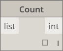|
||**Flatten**Gibt die vereinfachte 1D-Liste aus der multidimensionalen Eingabeliste zurück.||
||**Map**Ordnet einen Wert für einen Eingabebereich zu.||

## Core

#### Core.Color

||||
| -- | -- | -- |

||Erstellen||

||**Color.ByARGB**Erstellt eine Farbe über Alpha-, Rot-, Grün- und Blau-Komponenten.||
||**Color Range**Ruft eine Farbe aus einem Farbverlauf zwischen einer Anfangs- und einer Endfarbe ab.||

||Aktionen||

||**Color.Brightness**Ruft den Helligkeitswert für die Farbe ab.|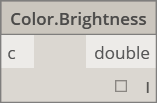|
||**Color.Components**Listet die Komponenten für die Farbe in der Reihenfolge Alpha, Rot, Grün, Blau auf.||
||**Color.Saturation**Ruft den Sättigungswert für die Farbe ab.||
||**Color.Hue**Ruft den Farbtonwert für die Farbe ab.||

||Abfrage||

||**Color.Alpha**Alpha-Komponente der Farbe ermitteln: 0 bis 255.|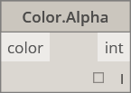|
||**Color.Blue**Blaue Komponente der Farbe ermitteln: 0 bis 255.||
||**Color.Green**Grüne Komponente der Farbe ermitteln: 0 bis 255.||
||**Color.Red**Rote Komponente der Farbe ermitteln: 0 bis 255.||

#### Core.Display

||||
| -- | -- | -- |

||Erstellen||

||**Display.ByGeometryColor**Zeigt die Geometrie mithilfe einer Farbe an.||

#### Core.Input

||||
| -- | -- | -- |

||Aktionen||

||**Boolean**Auswahl zwischen True und False.||
||**Code Block**Ermöglicht die direkte Erstellung von DesignScript-Code.||
||**Directory Path**Ermöglicht die Auswahl einen Verzeichnisses auf dem System, um seinen Pfad abzurufen.|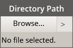|
||**File Path**Ermöglicht die Auswahl einer Datei auf dem System, um ihren Dateinamen abzurufen.|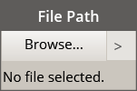|
||**Integer Slider**Ein Schieberegler zur Erzeugung ganzzahliger Werte.||
||**Number** Erstellt eine Zahl.||
||**Number Slider** Ein Schieberegler zur Erzeugung numerischer Werte.|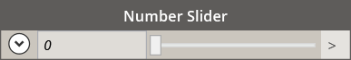|
||**String**Erstellt eine Zeichenfolge.||

#### Core.List

||||
| -- | -- | -- |

||Erstellen||

|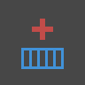|**List.Create**Erstellt eine neue Liste aus der angegebenen Eingaben.|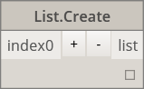|
||**List.Combine**Wendet einen Kombinator auf jedes Element in zwei Folgen an.||
|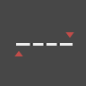|**Number Range**Erstellt eine Folge von Zahlen im angegebenen Bereich.||
||**Number Sequence**Erstellt eine Folge von Zahlen.||

||Aktionen||

||**List.Chop**Zerlegt eine Liste in eine Gruppe von Listen, jeweils mit der angegebenen Anzahl an Einträgen.||
||**List.Count**Ruft die Anzahl der Elemente in der angegebenen Liste ab.||
||**List.Flatten**Vereinfacht eine verschachtelte Liste von Listen um eine bestimmte Anzahl von Ebenen.||
||**List.FilterByBoolMask**Filtert eine Sequenz durch Abrufen entsprechender Indizes in einer separaten Liste boolescher Werte.|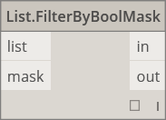|
||**List.GetItemAtIndex**Ruft ein Element aus der angegebenen Liste am angegebenen Index ab.|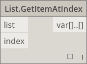|
||**List.Map**Wendet eine Funktion für alle Elemente einer Liste an und erstellt aus den Ergebnissen eine neue Liste.||
||**List.Reverse**Erstellt eine neue Liste mit den Elementen der angegebenen Liste, jedoch in umgekehrter Reihenfolge.||
|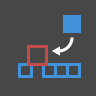|**List.ReplaceItemAtIndex**Ersetzt ein Element am angegebenen Index in der angegebenen Liste.|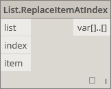|
||**List.ShiftIndices**Verschiebt die Indizes in der Liste um den angegebenen Betrag nach rechts.||
||**List.TakeEveryNthItem**Ruft unter Einhaltung des angegebenen Versatzes Elemente aus der angegebenen Liste ab, deren Indizes Vielfache des angegebenen Werts sind.||
||**List.Transpose**Vertauscht Zeilen und Spalten in einer Liste von Listen. Wenn einige Zeilen kürzer als die übrigen sind, werden Nullwerte als Platzhalter in das resultierende Array eingefügt, sodass dieses immer rechteckig ist.||

#### Core.Logic

||||
| -- | -- | -- |

||Aktionen||

||**If**Bedingte Anweisung. Prüft den Booleschen Wert des eingegebenen Tests. Wenn der eingegebene Test den Wert True hat, wird als Ergebnis der zur Alternative True gehörige Wert ausgegeben, andernfalls der zur Alternative False gehörige Wert.|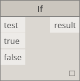|

#### Core.Math

||||
| -- | -- | -- |

||Aktionen||

||**Math.Cos**Ermittelt den Kosinus eines Winkels.||
||**Math.DegreesToRadians**Konvertiert einen Winkel in Grad in einen Winkel in Bogenmaß.||
||**Math.Pow**Potenziert eine Zahl mit dem angegebenen Wert.|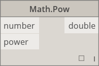|
||**Math.RadiansToDegrees**Konvertiert einen Winkel in Bogenmaß in einen Winkel in Grad.||
|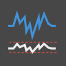|**Math.RemapRange**Passt den Bereich einer Liste von Zahlen an, wobei deren Verteilung erhalten bleibt.|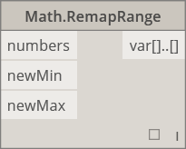|
|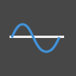|**Math.Sin**Ermittelt den Sinus eines Winkels.||

#### Core.Object

||||
| -- | -- | -- |

||Aktionen||

||**Object.IsNull**Bestimmt, ob das angegebene Objekt Null ist.|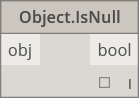|

#### Core.Scripting

||||
| -- | -- | -- |

||Aktionen||

|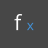|**Formula**Wertet mathematische Formeln aus. Dabei wird NCalc für die Auswertung verwendet. Weitere Informationen finden Sie unter [http://ncalc.codeplex.com](http://ncalc.codeplex.com).|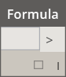|

#### Core.String

||||
| -- | -- | -- |

||Aktionen||

||**String.Concat**Verkettet mehrere Zeichenfolgen zu einer einzigen Zeichenfolge.|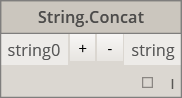|
||**String.Contains**Bestimmt, ob die angegebene Zeichenfolge die angegebene Teilzeichenfolge enthält.||
||**String.Join**Verkettet mehrere Zeichenfolgen zu einer einzigen Zeichenfolge und fügt dabei das angegebene Trennzeichen zwischen den einzelnen verbundenen Zeichenfolgen ein.||
||**String.Split**Teilt eine einzelne Zeichenfolge in eine Liste von Zeichenfolgen auf, wobei die Unterteilungen durch die angegebenen Trennzeichenfolgen bestimmt werden.|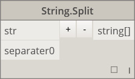|
||**String.ToNumber**Konvertiert eine Zeichenfolge in einen integer- oder double-Wert.||

#### Core.View

||||
| -- | -- | -- |

||Aktionen||

||**View.Watch**Visualisierung der Ausgabe des Blocks||
||**View.Watch 3D**Zeigt eine dynamische Vorschau der Geometrie an.||

## Geometrie

#### Geometry.Circle

||||
| -- | -- | -- |

||Erstellen||

||**Circle.ByCenterPointRadius**Erstellt einen Kreis durch Eingabe von Mittelpunkt und Radius in der XY-Ebene des Weltkoordinatensystems mit Welt-Z als Normaler.|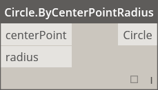|
||**Circle.ByPlaneRadius**Erstellt einen Kreis zentriert am Ursprung der Eingabeebene, innerhalb der Eingabeebene und mit dem angegebenen Radius.||

#### Geometry.CoordinateSystem

||||
| -- | -- | -- |

||Erstellen||

||**CoordinateSystem.ByOrigin**Erstellt ein CoordinateSystem mit Ursprung am eingegebenen Punkt mit X- und Y-Achse als X- und Y-Achse des WKS.||
||**CoordinateSystem.ByCyclindricalCoordinates**Erstellt ein CoordinateSystem mit den angegebenen zylindrischen Koordinatenparametern in Bezug auf das angegebene Koordinatensystem.|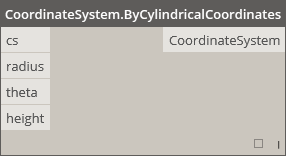|

#### Geometry.Cuboid

||||
| -- | -- | -- |

||Erstellen||

||**Cuboid.ByLengths**(Ursprung)Erstellt einen Quader mit Mittelpunkt am Eingabepunkt und Angaben für Breite, Länge und Höhe.||

#### Geometry.Curve

||||
| -- | -- | -- |

||Aktionen||

||**Curve.Extrude** (Abstand)Extrudiert eine Kurve in Richtung des Normalenvektors.|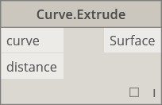|
||**Curve.PointAtParameter**Ruft einen Punkt auf der Kurve am angegebenen Parameter zwischen StartParameter() und EndParameter() ab.||

#### Geometry.Geometry

||||
| -- | -- | -- |

||Aktionen||

||**Geometry.DistanceTo**Ruft den Abstand zwischen dieser und anderer Geometrie ab.||
||**Geometry.Explode**Trennt zusammengesetzte oder nicht getrennte Elemente in die Teile, aus denen sie bestehen.||
||**Geometry.ImportFromSAT**Liste der importierten Geometrien||
||**Geometry.Rotate** (basePlane)Dreht ein Objekt um einen angegebenen Winkel in Grad um den Ursprung und die Normale der Ebene.||
||**Geometry.Translate**Verschiebt Geometrie beliebigen Typs um die angegebenen Entfernung in die angegebene Richtung.|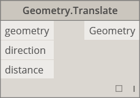|

#### Geometry.Line

||||
| -- | -- | -- |

||Erstellen||

||**Line.ByBestFitThroughPoints**Erstellt eine Linie mit der bestmöglichen Annäherung an ein Streudiagramm aus Punkten.||
||**Line.ByStartPointDirectionLength**Erstellt eine gerade Linie mit der angegebenen Länge vom Startpunkt ausgehend in Vektorrichtung.||
||**Line.ByStartPointEndPoint**Erstellt eine gerade Linie zwischen zwei eingegebenen Punkten.|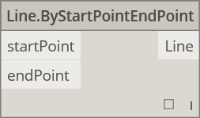|
||**Line.ByTangency**Erstellt eine zur eingegebenen Kurve tangentiale Linie am Parameterpunkt der eingegebenen Kurve.|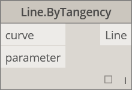|

||Abfrage||

||**Line.Direction**Die Richtung der Kurve.||

#### Geometry.NurbsCurve

||||
| -- | -- | -- |

||Erstellen||

|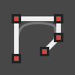|**NurbsCurve.ByControlPoints**Erstellt ein BSplineCurve über explizite Steuerpunkte.||
||**NurbsCurve.ByPoints**Erstellt eine BSplineCurve durch Interpolation zwischen Punkten.|qcomm|

#### Geometry.NurbsSurface

||||
| -- | -- | -- |

||Erstellen||

||**NurbsSurface.ByControlPoints**Erstellt eine NurbsSurface über explizite Steuerpunkte mit angegebenem U- und V-Grad.||
||**NurbsSurface.ByPoints**Erstellt eine NurbsSurface mit angegebenen interpolierten Punkten und U- und V-Graden. Die resultierende Oberfläche verläuft durch alle Punkte.||

#### Geometry.Plane

||||
| -- | -- | -- |

||Erstellen||

|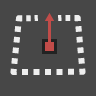|**Plane.ByOriginNormal**Erstellt eine am Ursprungspunkt zentrierte Ebene mit eingegebenem Normalenvektor.||
|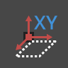|**Plane.XY**Erstellt eine Ebene in der Welt-XY-Ebene.||

#### Geometry.Point

||||
| -- | -- | -- |

||rstellen||

||**Point.ByCartesianCoordinates**Legt einen Punkt im angegebenen Koordinatensystem mithilfe dreier kartesischer Koordinaten fest.|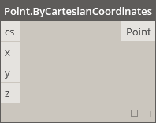|
||**Point.ByCoordinates** (2D) Legt einen Punkt in der XY-Ebene nach Angabe zweier kartesischer Koordinaten fest. Die Z-Komponente hat den Wert 0.|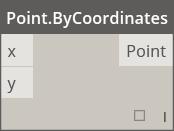|
||**Point.ByCoordinates** (3D)Legt einen Punkt nach Angabe dreier kartesischer Koordinaten fest.||
||**Point.Origin**Ruft den Ursprung ab (0,0,0).||

||ktionen||

||**Point.Add**Fügt einem Punkt einen Vektor hinzu. Dies ist identisch mit Translate(Vector).||

||Abfrage||

||**Point.X**Ruft die X-Komponente des Punkts ab.||
|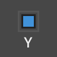|**Point.Y**Ruft die Y-Komponente des Punkts ab.||
||**Point.Z**Ruft die Z-Komponente des Punkts ab.||

#### Geometry.Polycurve

||||
| -- | -- | -- |

||Erstellen||
|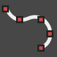|**Polycurve.ByPoints**Erstellt PolyCurve aus einer Folge von Linien durch Verbinden von Punkten. Für geschlossene Kurven muss der letzte Punkt sich an derselben Stelle befinden wie der erste.||

#### Geometry.Rectangle

||||
| -- | -- | -- |

||Erstellen||

||**Rectangle.ByWidthLength**(Ebene)Erstellt ein Rectangle zentriert am Ursprung der eingegebenen Plane mit der eingegebenen Breite (X-Achse) und Länge (Y-Achse).||

#### Geometry.Sphere

||||
| -- | -- | -- |

||Erstellen||

||**Sphere.ByCenterPointRadius**Erstellt einen kugelförmigen Volumenkörper mit dem eingegebenen Punkt als Mittelpunkt und dem angegebenen Radius.|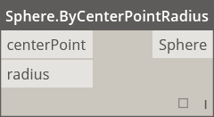|

#### Geometry.Surface

||||
| -- | -- | -- |

||Erstellen||

||**Surface.ByLoft**Erstellt eine Oberfläche durch Erhebung zwischen den eingegebenen Querschnittskurven.||
||**Surface.ByPatch**Erstellt eine Oberfläche durch Ausfüllen des Bereichs innerhalb einer durch die eingegebenen Kurven definierten geschlossenen Begrenzung.||

||Aktionen||

||**Surface.Offset**Versetzt die Oberfläche in Richtung ihrer Normalen um den angegebenen Abstand.||
||**Surface.PointAtParameter**Gibt den Punkt für die angegebenen U- und V-Parameter zurück.||
||**Surface.Thicken**Wandelt eine Oberfläche durch Extrusion in Richtung ihrer Normalen auf beiden Seiten in einen Volumenkörper um.||

#### Geometry.UV

||||
| -- | -- | -- |

||Erstellen||

||**UV.ByCoordinates**Erstellt UV aus zwei double-Werten.||

#### Geometry.Vector

||||
| -- | -- | -- |

||Erstellen||

||**Vector.ByCoordinates**Bildet einen Vektor durch 3 euklidische Koordinaten.||
||**Vector.XAxis**Ruft den kanonischen Vektor der X-Achse ab (1,0,0).|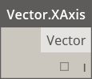|
||**Vector.YAxis**Ruft den kanonischen Vektor der Y-Achse ab (0,1,0).|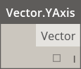|
||**Vector.ZAxis**Ruft den kanonischen Vektor der Z-Achse ab (0,0,1).|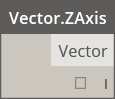|

||Aktionen||

||**Vector.Normalized**Ruft die normalisierte Version eines Vektors ab.||

## Operatoren

||||
| -- | -- | -- |
||**+**Addition|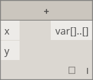|
||**-**Subtraktion||
||*****Multiplikation|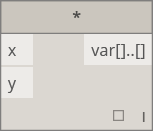|
||**/**Division||
||**%**Die ganzzahlige Division ermittelt den bei der Division der ersten Eingabe durch die zweite verbleibenden Rest.||
||**<**Kleiner als||
||**>**Größer als||
||**==**Gleichheitstest: Vergleich zweier Werte.||

