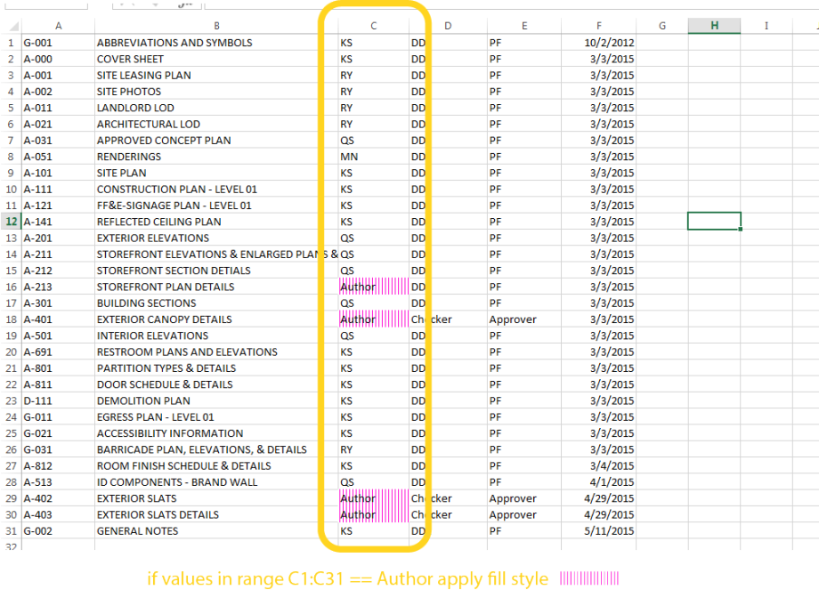
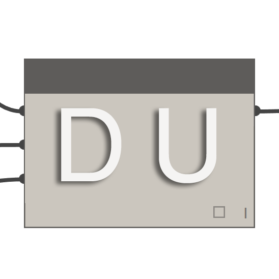
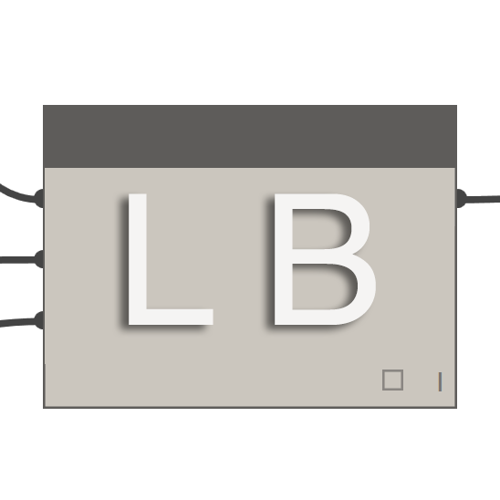
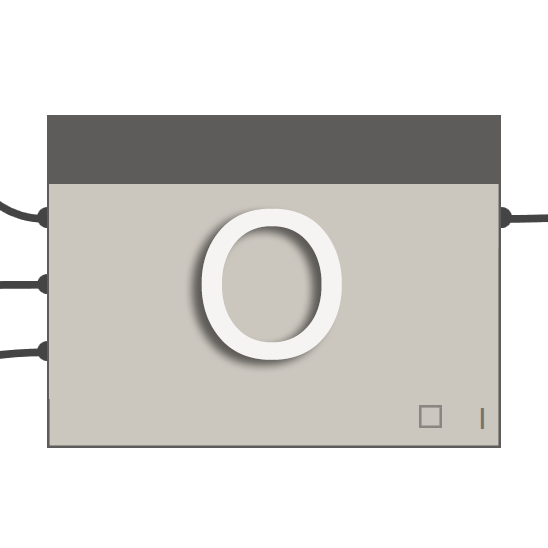

## Dynamo-Pakete

Im Folgenden sind einige der häufiger in der Dynamo-Community verwendeten Pakete aufgeführt. Entwickler sind aufgefordert, diese Liste zu ergänzen. Denken Sie daran, dass es sich bei [Dynamo Primer](https://github.com/DynamoDS/DynamoPrimer) um ein Open-Source-Projekt handelt.

||ARCHI-LAB|[Offizielle archi-lab-Website besuchen ](http://archi-lab.net/)|
| -- | -- | -- |
|archi-lab ist eine Sammlung mit über 50 benutzerdefinierten Paketen, die die Möglichkeiten zur Interaktion zwischen Dynamo und Revit erheblich erweitern. Die archi-lab-Pakete enthalten Blöcke mit höchst unterschiedlichen Funktionen von einfachen Listenoperationen bis hin zu Analysis Visualization Framework-Blöcken für Revit.||

||BIMORPH-BLÖCKE|[BimorphNodes-Wörterbuch besuchen](https://bimorph.com/bimorph-nodes/)|
| -- | -- | -- |
|BimorphNodes ist eine vielseitige Sammlung mit leistungsfähigen Versorgungsnetzwerk-Blöcken. Zu den wichtigsten Neuerungen des Pakets gehören die hoch effiziente Kollisionserkennung, Geometrieschnittpunkt-Blöcke, ImportInstance (CAD) zur Konvertierung von Kurven und Blöcken sowie Kollektoren für verknüpfte Elementen, die Einschränkungen in der Revit-API aufheben. Weitere Informationen über die gesamte Bandbreite an verfügbaren Blöcken finden Sie im Wörterbuch auf BimorphNodes.||

||BUMBLEBEE FOR DYNAMO|[Offizielle BumbleBee-Website besuchen](http://archi-lab.net/bumblebee-dynamo-and-excel-interop/)|
| -- | -- | -- |
|BumbleBee ist ein Interoperabilitäts-Plugin für Excel und Dynamo, das die Möglichkeiten von Dynamo zum Lesen und Schreiben von Excel-Dateien erheblich verbessert.||

||CLOCKWORK FOR DYNAMO|[Den GitHub von Clockwork For Dynamo besuchen](https://github.com/CAAD-RWTH/ClockworkForDynamo)|
| -- | -- | -- |
|Clockwork ist eine Sammlung benutzerdefinierter Blöcke für die visuelle Programmierumgebung von Dynamo. Es enthält viele Revit-bezogene Blöcke, aber auch zahlreiche Blöcke für verschiedene andere Zwecke wie Listenverwaltung, mathematische Operationen, Zeichenkettenoperationen, Einheitenumrechnungen, geometrische Operationen (vor allem Rahmen, Netze, Ebenen, Punkte, Oberflächen, UVs und Vektoren) und Unterteilung von Oberflächen.||

||DATA|SHAPES|[BData|Shapes auf GitHub besuchen](https://github.com/MostafaElAyoubi/Data-shapes)|
| -- | -- | -- |
|DataShapes ist ein Paket zur Erweiterung der Benutzerfunktionen von Dynamo-Skripts. Der Schwerpunkt liegt dabei auf der Bereitstellung zusätzlicher Funktionen in Dynamo Player. Weitere Informationen finden Sie auf https://data-shapes.net/. Sie möchten beeindruckende Arbeitsabläufe für Dynamo Player erstellen? Verwenden Sie dieses Paket.||

||DYNAMO SAP|[Das DynamoSAP-Projekt auf Core Studio besuchen](http://core.thorntontomasetti.com/dynamosap-is-now-open-source/)|
| -- | -- | -- |
|DynamoSAP ist eine parametrische Benutzeroberfläche für SAP2000, die auf Dynamo aufsetzt. Das Projekt versetzt Konstrukteure und Ingenieure in die Lage, strukturelle Systeme auf generative Weise in SAP zu entwickeln und zu analysieren, indem das SAP-Modell mit Dynamo betrieben wird. Das Projekt schreibt einige alltägliche Arbeitsabläufe vor, die in den eingeschlossenen Beispieldateien beschrieben sind, und bietet eine breite Palette an Möglichkeiten zur Automatisierung typischer Aufgaben in SAP.||

||DYNAMO UNFOLD|[Den GitHub von DynamoUnfold besuchen](https://github.com/mjkkirschner/DynamoUnfold)|
| -- | -- | -- |
|Diese Bibliothek erweitert die Funktionalität von Dynamo/Revit, indem Benutzer in die Lage versetzt werden, Oberflächen und Poly-Oberflächengeometrie abzuwickeln. Mithilfe dieser Bibliothek können Benutzer Oberflächen zunächst in eine planare Tessellationstopologie überführen und sie dann mithilfe der Protogeometrie-Werkzeuge von Dynamo abwickeln. Dieses Paket beinhaltet zudem einige experimentelle Blöcke und einige grundlegende Beispieldateien.||

||DYNASTRATOR|[Laden Sie Dynastrator von Package Manager herunter.](http://dynamopackages.com/)|
| -- | -- | -- |
|Importieren Sie Vektorillustrationen aus Illustrator oder dem Internet mit .svg. Auf diese Weise können Sie manuell erstellte Zeichnungen für parametrische Operationen in Dynamo importieren.||

||ENERGY ANALYSIS FOR DYNAMO|[Das Projekt Energy Analysis for Dynamo auf GitHub besuchen](https://github.com/tt-acm/EnergyAnalysisForDynamo)|
| -- | -- | -- |
|Energy Analysis for Dynamo ermöglicht die parametrische Energiemodellierung und ganzheitliche Energieanalyseabläufe in Dynamo 0.8. Energy Analysis for Dynamo ermöglicht es dem Benutzer, ein Energiemodell in Autodesk Revit zu konfigurieren, es für die Green Building Studio for DOE2-Energieanalyse einzureichen und die von der Analyse zurückgegebenen Ergebnisse weiterzuverarbeiten. Das Paket wird in Studio CORE von Thornton Tomasetti entwickelt.||

||FIREFLY FOR DYNAMO|[Firefly von Dynamo Package Manager herunterladen](http://dynamopackages.com/)|
| -- | -- | -- |
|Firefly ist eine Sammlung von Blöcken, die es Dynamo ermöglichen mit Eingabe-/Ausgabegeräten wie dem Arduino Micro Controller zu kommunizieren. Da der Datenfluss "live" erfolgt, eröffnet Firefly viele Möglichkeiten für interaktives Prototyping zwischen digitalen und physischen Welten über Webcams, Mobiltelefone, Gamecontroller, Sensoren und vielem mehr.||

||LUNCHBOX FOR DYNAMO|[Lunchbox for Dynamo auf der Proving Ground-Website besuchen](http://provingground.io/tools/lunchbox/)|
| -- | -- | -- |
|LunchBox ist eine Sammlung von wiederverwendbaren Geometrie- und Datenverwaltungsblöcken. Die Werkzeuge wurden mit Dynamo 0.8.1 und Revit 2016 getestet. Das Werkzeug enthält Blöcke für Oberflächenverkleidungen, Geometrie, Revit-Datensammlungen und vieles mehr.||

||MANTIS SHRIMP|[Offizielle Mantis Shrimp-Website besuchen](http://archi-lab.net/mantis-shrimp-getting-started/)|
| -- | -- | -- |
|Mantis Shrimp ist ein Interoperabilitätsprojekt, das Ihnen den problemlosen Import von Grasshopper- und/oder Rhino-Geometrie in Dynamo ermöglicht.||

||MESH TOOLKIT|[GitHub von Dynamo Mesh Toolkit besuchen](https://github.com/DynamoDS/Dynamo/wiki/Dynamo-Mesh-Toolkit)|
| -- | -- | -- |
|Das Dynamo Mesh Toolkit enthält viele nützliche Werkzeuge für die Arbeit mit Netzgeometrie. Zu den Funktionen dieses Pakets gehören die Möglichkeiten zum Importieren von Netzen mit externen Dateiformaten, zum Erstellen von Netzen aus bereits vorhandenen Dynamo-Geometrieobjekten und zum manuellen Erstellen von Netzen aus Scheitelpunkten und Verbindungsinformationen. Darüber hinaus enthält dieses Toolkit Werkzeuge zum Ändern und Reparieren von Netzgeometrie.||

||OPTIMO|[GitHub von Optimo besuchen](https://github.com/BPOpt/Optimo/wiki/0_-Home)|
| -- | -- | -- |
|Optimo bietet Dynamo-Benutzern die Möglichkeit, selbstdefinierte Konstruktionsprobleme mithilfe verschiedener evolutionärer Algorithmen zu optimieren. Die Benutzer können die Ziele eines Problems sowie spezielle Eignungsfunktionen definieren.||

||RHYNAMO|[Rhynamo Bitbucket besuchen](https://bitbucket.org/caseinc/rhynamo)|
| -- | -- | -- |
|Die Rhynamo-Blockbibliothek bietet Benutzern die Möglichkeit, Rhino 3DM-Dateien in Dynamo einzulesen und zu bearbeiten. Rhynamo übersetzt Rhino-Geometrie mithilfe der OpenNURBS-Bibliothek von McNeel in Geometrie, die in Dynamo verwendbar ist, und ermöglicht dadurch neue Arbeitsabläufe, mit denen Geometrie und Daten fließend zwischen Rhino und Revit ausgetauscht werden können. Dieses Paket enthält auch einige experimentelle Blöcke, die den "Live"-Zugriff auf die Rhino-Befehlszeile ermöglichen.||

||RHYTHM|[Rhythm auf GitHub besuchen](https://github.com/sixtysecondrevit/RhythmForDynamo)|
| -- | -- | -- |
|Auf den ersten Blick ist Rhythm nichts Besonderes. Es bietet keinen komplexen Code oder andere aufregende Dinge. Rhythm steht jedoch für das Ergebnis einer praktischen Denkweise und Gewissenhaftigkeit. Die Idee hinter diesem Paket besteht darin, Benutzer bei der Verwendung von Rhythm in Revit mit Dynamo zu unterstützen. Rhythm besteht in erster Linie aus sofort einsatzfähigen Dynamo-Blöcken, die in der Revit-Umgebung auf intelligente Weise genutzt werden können.||

