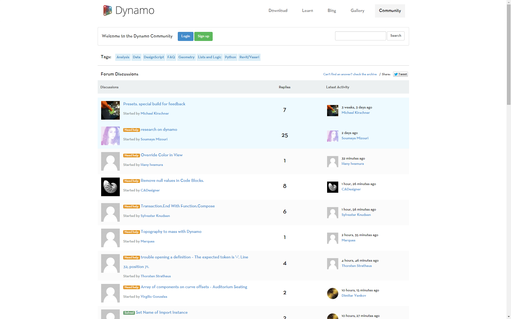

## What is Dynamo?

Dynamo is, quite literally, what you make it. Working with Dynamo may include using the application, either in connection with other Autodesk software or not, engaging a Visual Programming process, or participating in a broad community of users and contributors.

### The Application

Dynamo, the application, is software that can be downloaded and run in either stand-alone "Sandbox" mode or as a plug-in for other software like [Revit](https://www.autodesk.com/products/revit) or [Maya](https://www.autodesk.com/products/maya). It is described as:

> A visual programming tool that aims to be accessible to both non-programmers and programmers alike. It gives users the ability to visually script behavior, define custom pieces of logic, and script using various textual programming languages.

> 1. See Dynamo in action with Revit
> 2. Download the installer

### The Process

Once we've installed the application, Dynamo will enable us to work within a Visual Programming process wherein we connect elements together to define the relationships and the sequences of actions that compose custom algorithms. We can use our algorithms for a wide array of applications - from processing data to generating geometry - all in real time and without writing a lick of `code`.

> Add elements, connect, and we are off and running with creating Visual Programs.

### The Community

Dynamo wouldn't be what it is without a strong group of avid users and active contributors. Engage the community by following [the Blog](https://dynamobim.org/blog/), adding your work to the Gallery, or discussing Dynamo in [the Forum](https://forum.dynamobim.com/). More resources can be found in [the Appendix](https://primer.dynamobim.org/en/Appendix/A-1_resources.html) of Dynamo Primer.

### The Platform

Dynamo is envisioned as a visual programming tool for designers, allowing users to make tools that make use of external libraries or any Autodesk product that has an API. With Dynamo Sandbox we can develop programs in a "Sandbox" style application - but the Dynamo ecosystem continues to grow.

The source code for the project is open-source, enabling us to extend its functionality to our hearts content. Check out the project [on GitHub](https://github.com/DynamoDS/Dynamo) and browse the [Works in Progress](https://github.com/DynamoDS/Dynamo/labels/WIP) of users customizing Dynamo.

> Browse, Fork, and start extending Dynamo for your needs

### The Documentation

[Dynamo Primer](https://primer.dynamobim.org/) provides an overview basic features of Dynamo, examples to get you started, and best practices to follow as you learn. [The Dynamo Dictionary](https://dictionary.dynamobim.com/) is a searchable database that provides documentation for each node, as well as some examples and sample files.
