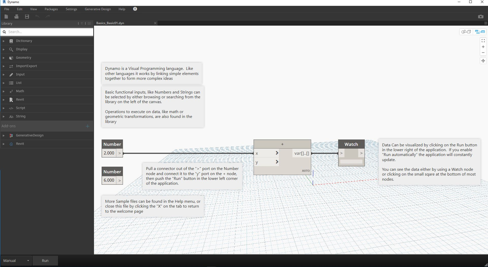

## Installing and Launching Dynamo

Dynamo is an active open-source development project with downloadable installers for both official and pre-release, i.e.. "daily build" versions. Download the official release to get started, or contribute to what Dynamo becomes through the daily builds or GitHub project.

### Downloading

To download the official released version of Dynamo, visit the [Dynamo website](http://dynamobim.com/). Start the download immediately by clicking from the homepage or browse to the dedicated download page.

> 1. Watch a video on Computational Design with Dynamo for Architecture
> 2. Or browse to the download page

Here you can download the "bleeding edge" development versions or go to the [Dynamo Github](https://github.com/DynamoDS/Dynamo) project.

> 1. Download the official release installer
> 2. Download the daily build installers
> 3. Check out custom packages from a community of developers
> 4. Get involved in the development of Dynamo on GitHub

### Installing

Browse to the directory of the downloaded installer and run the executable file. During the installation process, the setup allows you to customize the components that will be installed.

> 1. Select the Components you want to install

Here we need to decide if we want to include the components that connect Dynamo to other installed applications such as Revit. For more information on the Dynamo Platform, see **Chapter 1.2**.

### Launching

To launch Dynamo, browse to \\Program Files\Dynamo\Dynamo Revit\x.y, then select DynamoSandbox.exe. This will open the stand-alone version and present Dynamo's _Start Page_. On this page, we see the standard menus and toolbar as well as a collection of shortcuts that allow us to access file functionality or access additional resources.

> 1. Files - Start a new file or open an existing one
> 2. Recent - Scroll through your recent files
> 3. Backup - Access to your backups
> 4. Ask - Get direct access to the User Forum or Dynamo Website
> 5. Reference - Go further with additional learning resources
> 6. Code - Participate in the open-source development project
> 7. Samples - Check out the examples that come with the installation

Open the first sample file to open your first workspace and confirm Dynamo is working correctly. Click Samples > Basics > **Basics\_Basic01.dyn**.

> 1. Confirm that the Execution Bar says "Automatic" or click Run
> 2. Follow the instructions and connect the **Number** Node to the **+** Node
> 3. Confirm that this Watch Node shows a result

If this file successfully loads, you should be able to execute your first visual program with Dynamo.
