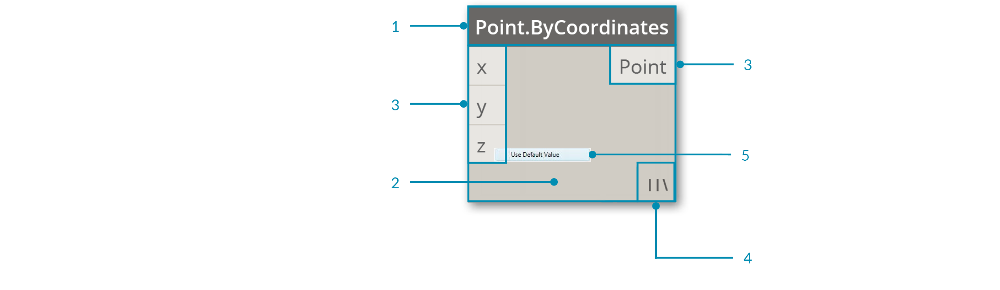
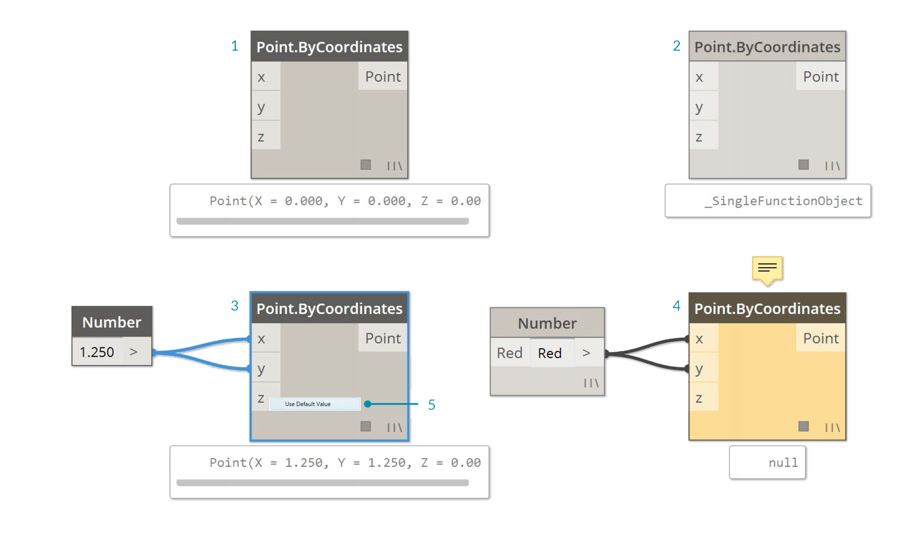
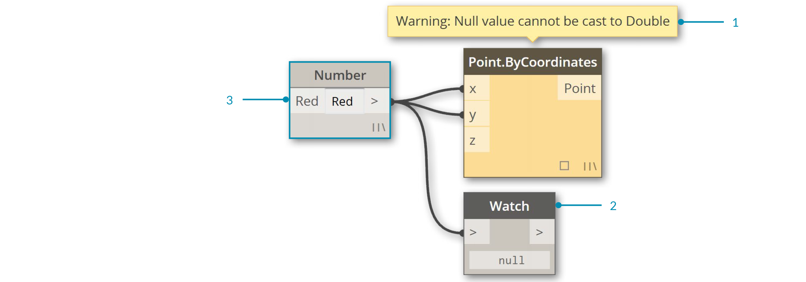

##Nodes

In Dynamo, **Nodes** are the objects you connect to form a Visual Program. Each **Node** performs an operation - sometimes that may be as simple as storing a number or it may be a more complex action such as creating or querying geometry.

###Anatomy of a Node
Most Nodes in Dynamo are composed of five parts. While there are exceptions, such as Input Nodes, the anatomy of each Node can be described as follows:

>1. Name - The Name of the Node with a Category.Name naming convention
2. Main - The main body of the Node - Right-clicking here presents options at the level of the whole Node
3. Ports (In and Out) - The receptors for Wires that supply the input data to the Node as well as the results of the Node's action
4. Data Preview - Hover or click to see a tooltip describing the results of the Node's action
5. Lacing Icon - Indicates the Lacing option specified for matching list inputs (more on that later)

### Ports
The Inputs and Outputs for Nodes are called Ports and act as the receptors for Wires. Data comes into the Node through Ports on the left and flows out of the Node after it has executed its operation on the right. Ports expect to receive data of a certain type. For instance, connecting a number such as *2.75* to the Ports on a Point By Coordinates Node will successfully result in creating a Point; however, if we supply *"Red"* to the same Port it will result in an error.

> Tip: Hover over a Port to see a tooltip containing the data type expected.

>1. Port Label
2. Tool Tip
3. Data Type

###States
Dynamo gives an indication of the state of the execution of your Visual Program by rendering Nodes with different color schemes based on each Node's status. Furthermore, hovering or right-clicking over the Name or Ports presents additional information and options.

>1. Inactive - Grey Nodes are inactive and need to be connected with Wires to be part of the Program Flow in the active Workspace
2. Active - Nodes with a Dark Grey Name background are well-connected and have all of their inputs successfully connected
3. Warning - Yellow Nodes are in an Error state
4. Selected - Currently selected Nodes have an Aqua highlight on their border
5. Default Value - Right-click on an input Port - some Nodes have default values that can be used or not used

If your Visual Program contains warning or errors, Dynamo will provide additional information about the problem. Any Node that is Yellow will also have a tooltip above the Name. Hover your mouse over the tooltip to expand it.

> Tip: With this tooltip information in hand, examine the upstream Nodes to see if the data type or data structure required is in error.

> 1. Warning Tooltip - "Null" or no data cannot be understood as a Double ie. a number
2. Use the Watch Node to examine the input data
3. Upstream the Number Node is storing "Red" not a number

