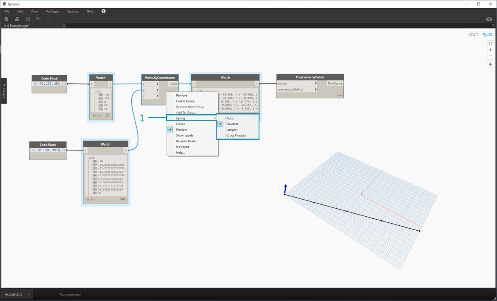
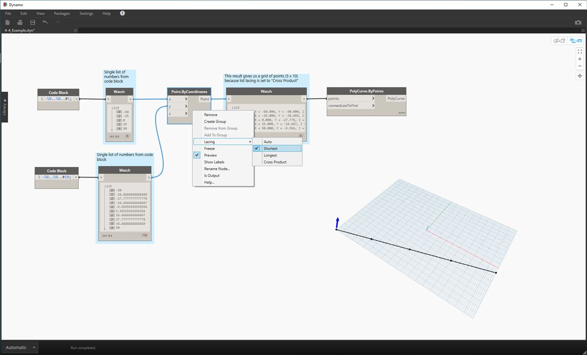
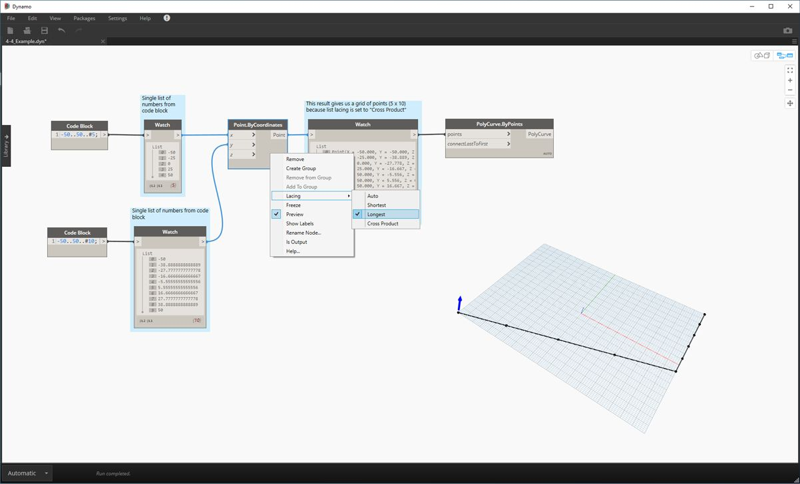
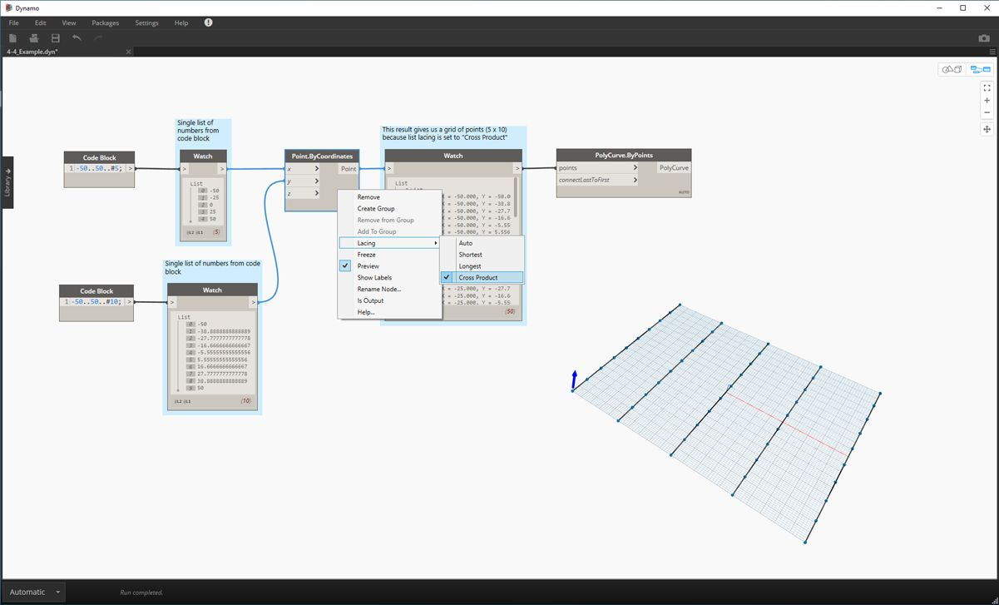

## What's a List?
A list is a collection of elements, or items.  Take a bunch of bananas, for example.  Each banana is an item within the list (or bunch). It's easier to pick up a bunch of bananas rather than each banana individually, and the same holds for grouping elements by parametric relationships in a data structure.

> Photo by [Augustus Binu](https://commons.wikimedia.org/wiki/File:Bananas_white_background_DS.jpg?fastcci_from=11404890&c1=11404890&d1=15&s=200&a=list).

When we buy groceries, we put all of the purchased items into a bag.  This bag is also a list.  If we're making banana bread, we need 3 bunches of bananas (we're making a *lot* of banana bread).  The bag represents a list of banana bunches and each bunch represents a list of bananas.  The bag is a list of lists (two-dimensional) and the banana is a list (one-dimensional).

In Dynamo, list data is ordered, and the first item in each list has an index "0".  Below, we'll discuss how lists are defined in Dynamo and how multiple lists relate to one another.

## Zero-Based Indices

One thing that might seem odd at first is that the first index of a list
is always 0; not 1. So, when we talk about the first item of a list, we actually mean
the item that corresponds to index 0.

For example, if you were to count the number of fingers we have on our right
hand, chances are that you would have counted from 1 to 5. However, if you were to put your fingers in a list, Dynamo would have given them indices from 0 to 4.  While this may seem a little strange to programming beginners, the zero-based index is standard practice in most computation systems.

Note that we still have 5 items in the list; it’s just that the list is using a zero-based
counting system. And the items being stored in the list don’t just have to be
numbers. They can be any data type that Dynamo supports, such as points,
curves, surfaces, families, etc.

Often times the easiest way to take a look at the type of data stored in a list
is to connect a watch node to another node's output. By default, the watch node automatically shows all indices to the left side of the list and displays the data items on the right.

These indices are a crucial element when working with lists.

### Inputs and Outputs
Pertaining to lists, inputs and outputs vary depending on the Dynamo node being used.  As an example, let's use a list of 5 points and connect this output to two different Dynamo nodes: *PolyCurve.ByPoints* and *Circle.ByCenterPointRadius*:

> 1. The *points* input for *PolyCurve.ByPoints* is looking for *"Point[]"*.  This represents a list of points.
2. The output for *PolyCurve.ByPoints* is a single PolyCurve created from a list of five points.
3. The *centerPoint* input for *Circle.ByCenterPointRadius* asks for *"Point"*.
4. The output for *Circle.ByCenterPointRadius* is a list of five circles, whose centers correspond to the original list of points.

The input data for *PolyCurve.ByPoints* and *Circle.ByCenterPointRadius* are the same, however the Polycurve node gives us one polycurve while the Circle node gives us 5 circles with centers at each point.  Intuitively this makes sense: the polycurve is drawn as a curve connecting the 5 points, while the circles create a different circle at each point.  So what's happening with the data?

Hovering over the *points* input for *Polycurve.ByPoints*, we see that the input is looking for *"Point[]"*. Notice the brackets at the end. This represents a list of points, and to create a polycurve, the input needs to be a list for each polycurve.  This node will therefore condense each list into one polycurve.

On the other hand, the *centerPoint* input for *Circle.ByCenterPointRadius* asks for *"Point"*.  This node looks for one point, as an item, to define the center point of the circle.  This is why we get five circles from the input data.  Recognizing these difference with inputs in Dynamo helps to better understand how the nodes are operating when managing data.

### Lacing
Data matching is a problem without a clean solution. It occurs when a node has access to differently sized inputs. Changing the data matching algorithm can lead to vastly different results.

Imagine a node which creates line segments between points (Line.ByStartPointEndPoint). It will have two input parameters which both supply point coordinates:

As you can see there are different ways in which we can draw lines between these sets of points. Lacing options are found by right-clicking the center of a node and choosing the "Lacing" menu.

### Base File
>Download the example file that accompanies this exercise (Right click and "Save Link As..."): [Lacing.dyn](datasets/6-1/Lacing.dyn). A full list of example files can be found in the Appendix.

To demonstrate the lacing operations below, we'll use this base file to define shortest list, longest list, and cross product.

 > 1. We'll change the lacing on *Point.ByCoordinates*, but won't change anything else about the graph above.

#### Shortest List
The simplest way is to connect the inputs one-on-one until one of the streams runs dry. This is called the “Shortest List” algorithm. This is the default behavior for Dynamo nodes:

> By changing the lacing to *shortest list*, we get a basic diagonal line composed of five points. Five points is the length of the lesser list, so the shortest list lacing stops after it reaches the end of one list.

#### Longest List
The “Longest List” algorithm keeps connecting inputs, reusing elements, until all streams run dry:

> By changing the lacing to *longest list*, we get a diagonal line which extends vertically.  By the same method as the concept diagram, the last item in the list of 5 items will be repeated to reach the length of the longer list.

#### Cross Product
Finally, the “Cross Product” method makes all possible connections:

> By changing the lacing to *Cross Product*, we get every combination between each list, giving us a 5x10 grid of points.  This is an equivalent data structure to the cross product as shown in the concept diagram above, except our data is now a list of lists.  By connecting a polycurve, we can see that each list is defined by its X-Value, giving us a row of vertical lines.
