## DesignScript Syntax
You may have noticed a common theme in the names of nodes in Dynamo: each node uses a *"."* syntax without spaces.  This is because the text at the top of each node respresents the actual syntax for scripting, and the *"."* (or *dot notation*) separates an element from the possible methods we can call.  This creates an easy translation from visual scripting to text-based scripting.


As a general analogy for the dot notation, how can we deal with a parametric apple in Dynamo? Below are a few methods we'll run on the apple before deciding to eat it. (Note: these are not actual Dynamo methods):

| Humanly Readible | Dot Notation | Output |
| -- | -- |
| What color is the apple? | Apple.color | red
| Is the apple ripe? | Apple.isRipe | true |
| How much does the apple weigh? | Apple.weight | 6 oz. |
| Where did the apple come from? | Apple.parent | tree |
| What does the apple create? | Apple.children | seeds |
| Is this apple locally grown? | Apple.distanceFromOrchard | 60 mi. |

I don't know about you, but judging by the outputs in the table above, this looks like one tasty apple.  I think I'll *Apple.eat() *it.

###Dot Notation in Code Block
With the apple analogy in mind, let's look at *Point.ByCoordinates* and show how we can create a point using the code block:

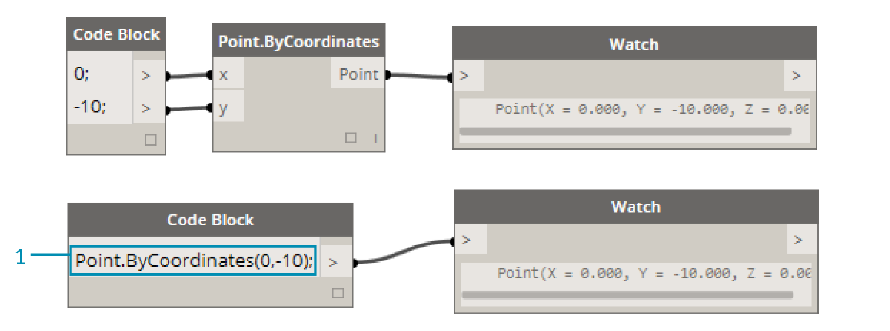
> The *code block* syntax ```Point.ByCoordinates(0,10);
```
gives the same result as a *Point.ByCoordinates* node in Dynamo, except we're able to create a point using one node.  This is more efficient than the connecting a separate node into *"X"* and *"Y"*.
1. By using *Point.ByCoordinates* in the code block, we are specifying the inputs in the same order as the out-of-the-box node *(X,Y)*.


###Calling Nodes
You can call any regular node in the library through a Code Block as long as the node isn’t a special *“UI” node*: those with a special user interface feature. For instance, you can call *Circle.ByCenterPointRadius*, but it wouldn’t make much sense to call a *Watch 3D* node.

Regular nodes (most of your library), generally come in three types:

*  **Create** -	Create (or construct) something
* **Action** -	Perform an action on something
* **Query** -	Get a property of something that already exists

You’ll find that the library is organized with these categories in mind. Methods, or nodes, of these three types are treated differently when invoked within a Code Block.

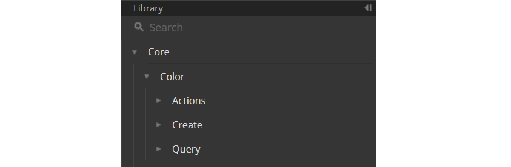

####Create
The "Create" category will construct geometry from scratch.  We input values in the code block from left-to-right.  These inputs are in the same order as the inputs on the node from top-to-bottom:

> Comparing the *Line.ByStartPointEndPoint* node and the corresponding syntax in the code block, we get the same results.

####Action

An action is something you do to an object of that type. Dynamo uses *dot notation*, common to many coding languages, to apply an action to a thing. Once you have the thing, type a dot then the name of the action. The action-type method’s input is placed in parentheses just like create-type methods, only you don’t have to specify the first input you see on the corresponding node.  Instead, we specify the element upon which we are performing the action:

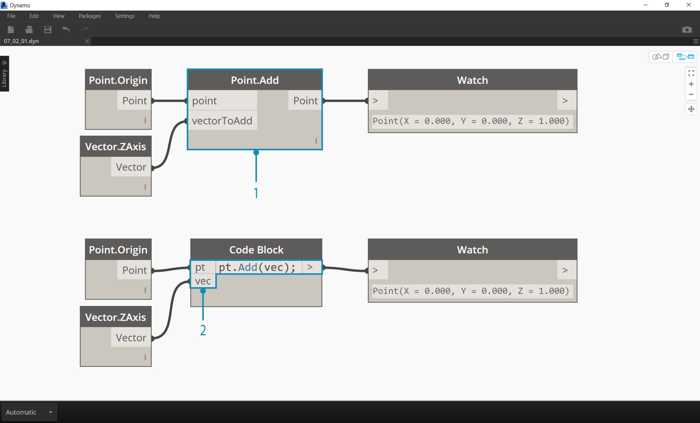


> 1. The *Point.Add *node is an action-type node, so the syntax works a little differently.
2. The inputs are (1) the *point*, and (2) the *vector* to add to it. In a *Code Block*, we've named the point (the thing) *“pt”*. To add a vector named *“vec” *to *“pt”*, we would write *pt.Add(vec)*, or: thing, dot, action. The Add action only has one input, or all the inputs from the *Point.Add *node minus the first one. The first input for the *Point.Add *node is the point itself.

####Query

Query-type methods get a property of an object. Since the object itself is the input, you don’t have to specify any inputs. No parentheses required.


### How About Lacing?
Lacing with nodes is somewhat different from lacing with code block.  With nodes, the user right clicks on the node and selects the lacing option to perform.  With code block, the user has much more control as to how the data is structured.  The code block shorthand method uses *replication guides* to set how several one-dimensional lists should be paired. Numbers in angled brackets "<>" define the hierarchy of the resulting nested list: <1>,<2>,<3>, etc.
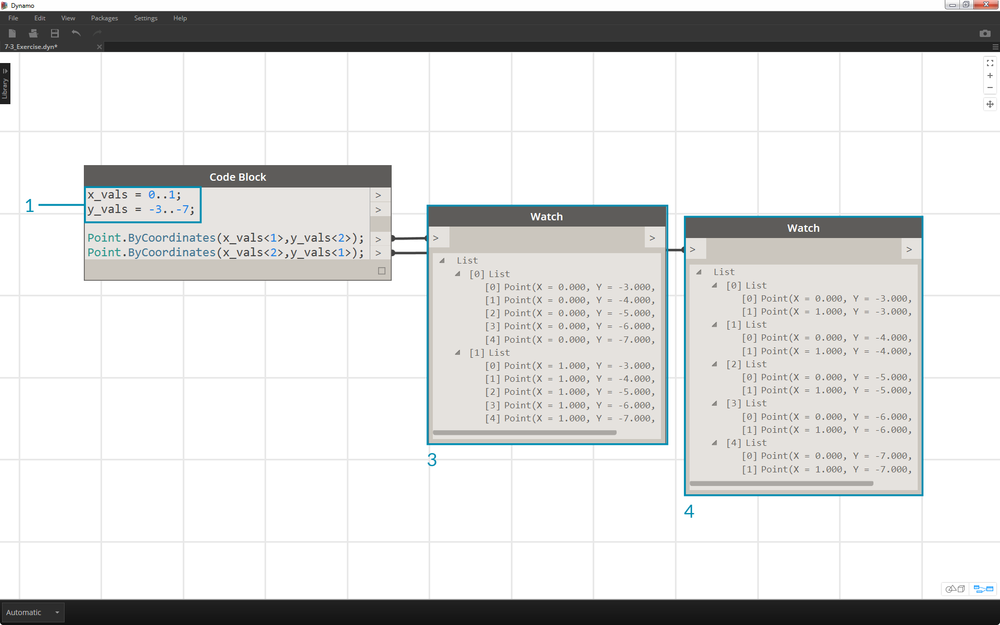

> 1. In this example, we use a shorthand to define two ranges (more on shorthand in the following section of this chapter).  In short, ```0..1;
``` is equivalent to ```{0,1}
``` and ```-3..-7
```is equivalent to ```
{-3,-4,-5,-6,-7}```. The result gives us lists of 2 x-values and 5 y-values. If we don’t use replication guides with these mismatched lists, we get a list of two points, which is the length of the shortest list. Using replication guides, we can find all of the possible combinations of 2 and 5 coordinates (or, a **Cross Product**).
2. Using the syntax ```Point.ByCoordinates(x_vals<1>,y_vals<2>);
``` we get **two** lists with **five** items in each list.
3. Using the syntax ```Point.ByCoordinates(x_vals<2>,y_vals<1>);
``` we get **five** lists with **two** items in each list.


With this notation, we can also specify which list will be dominant: 2 lists of 5 things or 5 lists of 2 things. In the example, changing the order of the replication guides makes the result a list of rows of points or a list of columns of points in a grid.

###Node to Code
While the code block methods above may take some getting used to, there is a feature in Dynamo called "Node to Code" which will make the process easier.  To use this feature,  select an array of nodes in your Dynamo graph, right-click on the canvas and select "Node to Code". Dynamo condenses these nodes into a code block, with all of the inputs and outputs!  Not only is this a great tool for learning code block, but it also allows you to work with a more efficient and parametric Dynamo graph.  We'll conclude the exercise below by using "Node to Code", so don't miss it.

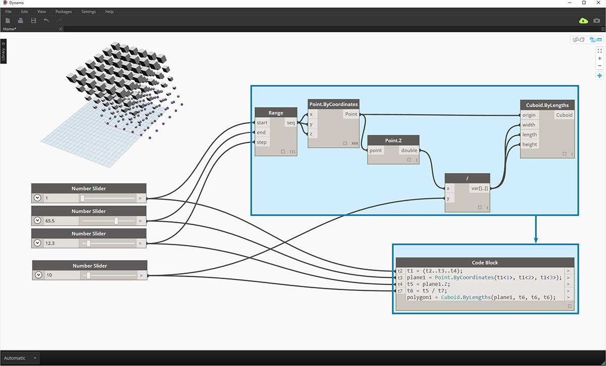

### Exercise
>Download the example file that accompanies this exercise (Right click and "Save Link As..."). A full list of example files can be found in the Appendix. [Dynamo-Syntax_Attractor-Surface.dyn](datasets/7-2/Dynamo-Syntax_Attractor-Surface.dyn)

To show the power of code block, we are going to translate an existing attractor field definition into code block form.  Working with an existing definition demonstrates how code block relates to visual scripting, and is helpful for learning DesignScript syntax.
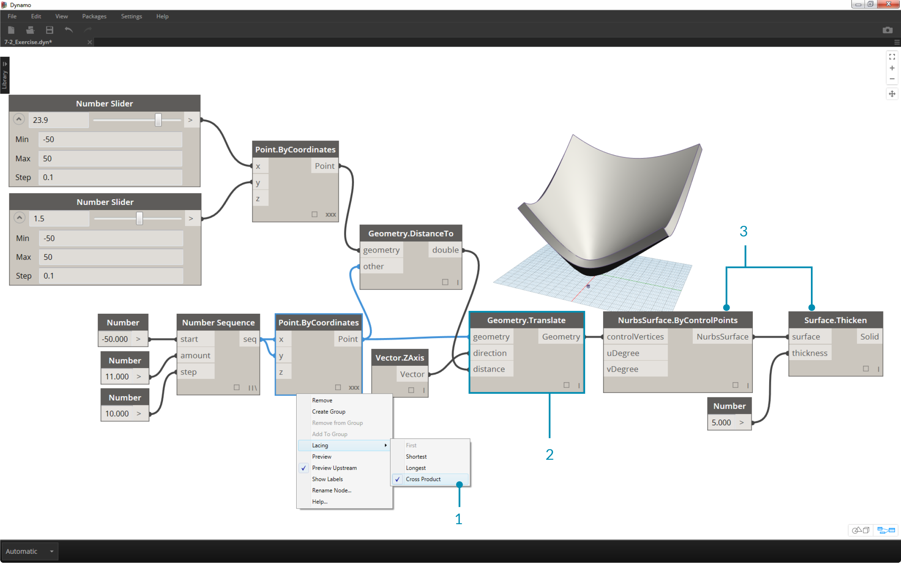
> Begin by recreating the definition in the image above (or by opening the sample file).
1. Notice that the lacing on *Point.ByCoordinates* has been set to *Cross Product*.
2. Each point in a grid is moved up in the Z direction based on its distance to the reference point.
3. A surface is recreated and thickened, creating a bulge in the geometry relative to the distance to the reference point.

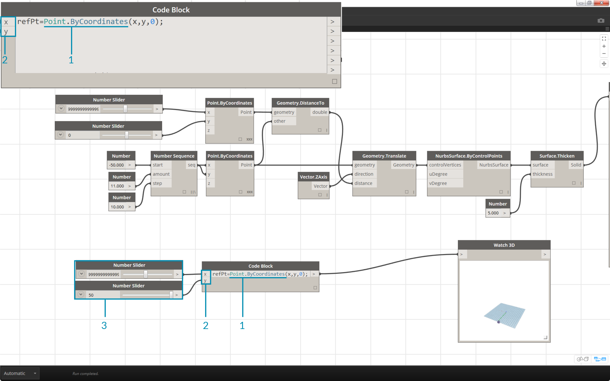
>1. Starting from the beginning, let's define the reference point first: ```Point.ByCoordinates(x,y,0);
```.  We use the same *Point.ByCoordinates* syntax as is specified on the top of the reference point node.
2. The variables *x* and *y* are inserted into the code block so that we may update these dynamically with sliders.
3.  Add some *sliders* to the *code block* inputs which range from *-50* to *50*. This way, we can span across the default Dynamo grid.

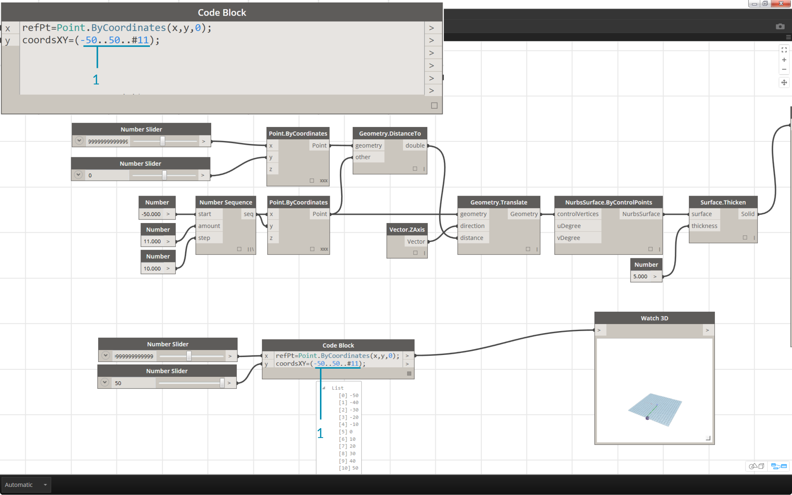
>1. In the second line of the *code block*, we define a shorthand to replace the number sequence node: ```coordsXY = (-50..50..#11);
```
.  We'll discuss this more in the next section.  For now, notice that this shorthand is equivalent to the *Number Sequence* node in the visual script.

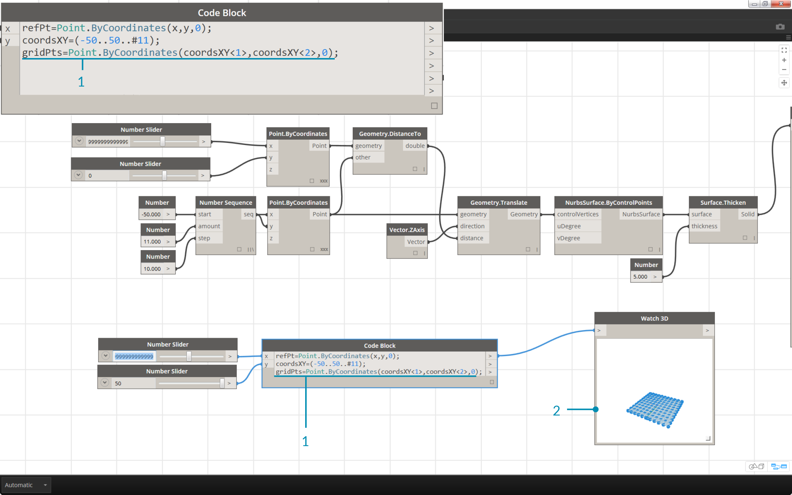
>1. Now, we want to create a grid of points from the *coordsXY* sequence.  To do this, we want to use the *Point.ByCoordinates* syntax, but also need to initiate a *Cross Product* of the list in the same manner that we did in the visual script.  To do this, we type the line: ```gridPts = Point.ByCoordinates(coordsXY<1>,coordsXY<2>,0);
```.  The angled brackets denote the cross product reference.
2. Notice in the *Watch3D* node that we have a grid of points across the Dynamo grid.

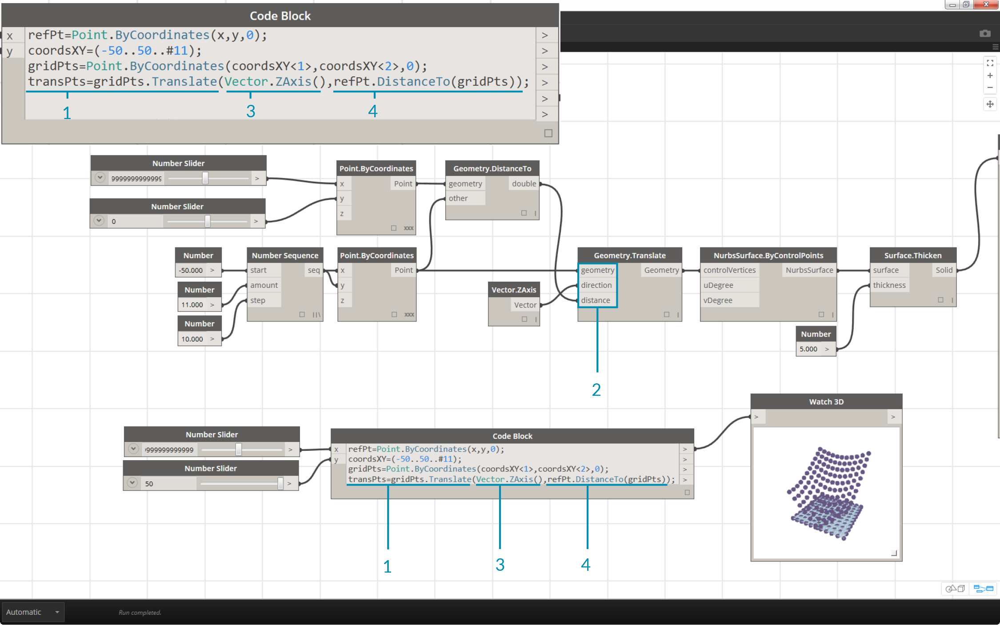
>1. Now for the tricky part: We want to move the grid of points up based on their distance to the reference point.  First, let's call this new set of points *transPts*. And since a translation is an action on an existing element, rather than using ```Geometry.Translate...
```, we use ```gridPts.Translate
```.
2. Reading from the actual node on the canvas, we see that there are three inputs.  The geometry to translate is already declared because we are performing the action on that element (with *gridPts.Translate*). The remaining two inputs will be inserted into the parentheses of the function: *direction* and *distance*.
3. The direction is simple enough, we use a ```Vector.ZAxis()
``` to move vertically.
4. The distance between the reference point and each grid point still needs to be calculated, so we do this as an action to the reference point in the same manner: ```refPt.DistanceTo(gridPts)
```
5. The final line of code gives us the translated points: ```transPts = gridPts.Translate(Vector.ZAxis(),refPt.DistanceTo(gridPts));
```

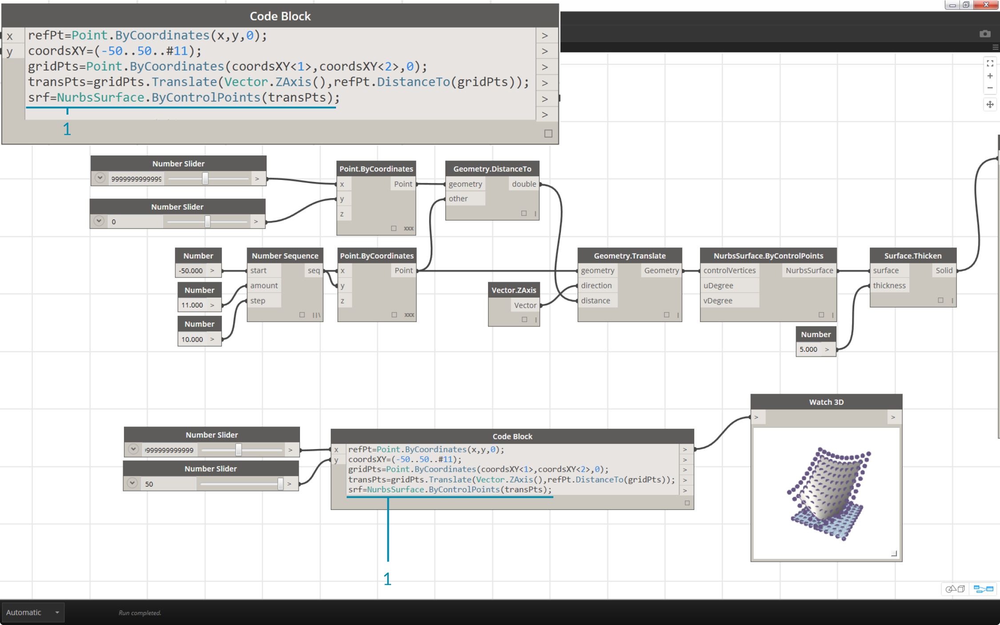
>1. We now have a grid of points with the appropriate data structure to create a Nurbs Surface.  We construct the surface using ```srf = NurbsSurface.ByControlPoints(transPts);
```


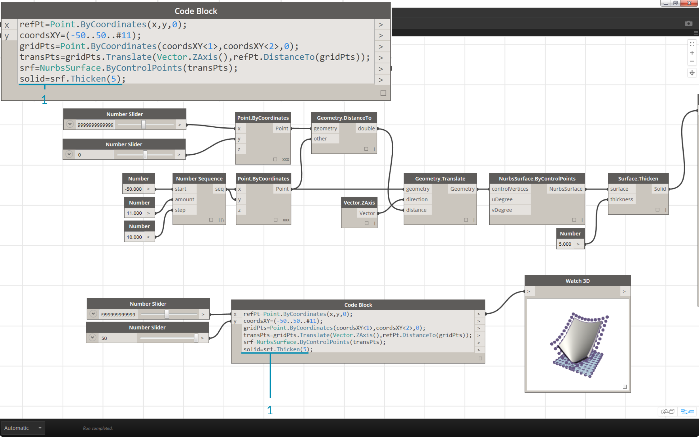
>1. And finally, to add some depth to the surface, we construct a solid using ```solid = srf.Thicken(5);
``` In this case we thickened the surface by 5 units in the code, but we could always declare this as a variable (calling it *thickness* for example) and then control that value with a slider.


###Simplify the Graph with "Node to Code"
The "Node to Code" feature automates the entire exercise that we just completed with the click of a button.  Not only is this powerful for creating custom definitions and reusable code blocks, but it is also a really helpful tool to learn how to script in Dynamo:

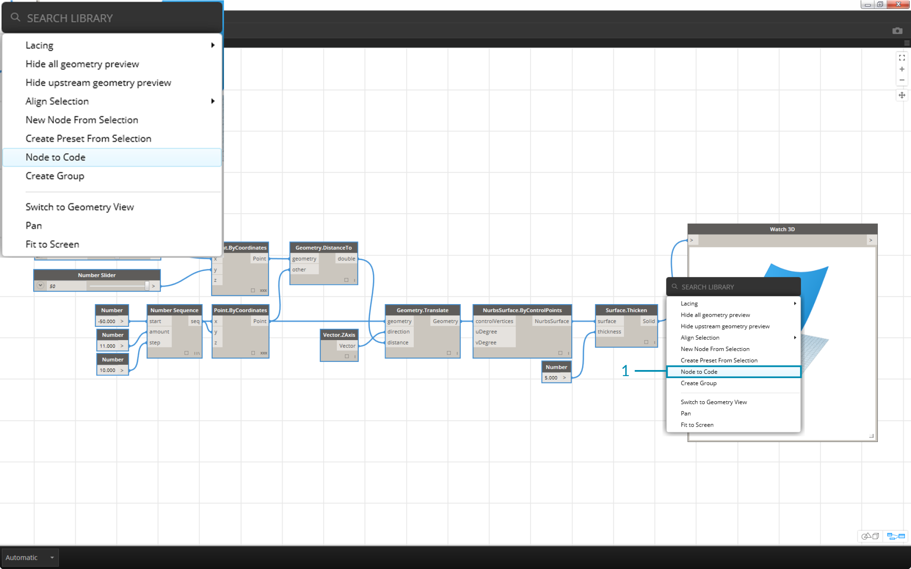
> 1. Start with the existing visual script from step 1 of the exercise. Select all of the nodes, right click on the canvas, and select *"Node to Code"*.  Simple as that.

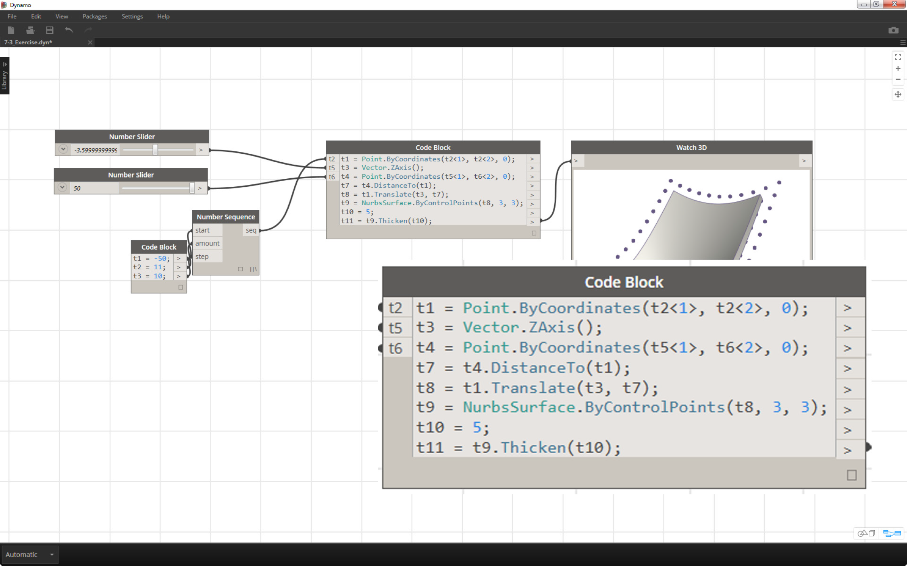
> Dynamo has automated a text based version of the visual graph, lacing and all. Test this out on your visual scripts and release the power of the code block!

