## Customizing
While we previously looked at editing a basic building mass, we want to dive deeper into the Dynamo/Revit link by editing a large number of elements in one go. Customizing on a large scale becomes more complex as data structures require more advanced list operations.  However, the underlying principles behind their execution is fundamentally the same.  Let's study some opportunities for analysis from a set of adaptive components.

#### Point Location
Suppose we've created a range of adaptive components and want to edit parameters based on their point locations.  The points, for example, could drive a thickness parameter which is related to the area of the element. Or, they could drive an opacity parameter related to solar exposure throughout the year. Dynamo allows the connection of analysis to parameters in a few easy steps, and we'll explore a basic version in the exercise below.

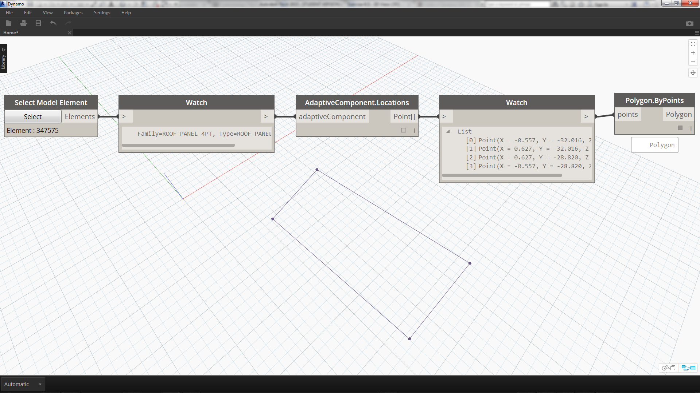
> Query the adaptive points of a selected adaptive component by using the *AdaptiveComponent.Locations* node.  This allows us to work with an abstracted version of a Revit element for analysis.

By extracting the point location of adaptive components, we can run a range of analysis for that element.  A four-point adaptive component will allow you to study the deviation from plane for a given panel for example.

#### Solar Orientation Analysis

> Use remapping to map a set of a data into a parameter range.  This is fundamental tool used in a parametric model, and we'll demonstrate it in the exercise below.

Using Dynamo, the point locations of adaptive components can be used to create a best-fit plane each element.  We can also query the sun position in the Revit file and study the plane's relative orientation to the sun in comparison to other adaptive components.  Let's set that up in the exercise below by creating an algorithmic roofscape.

### Exercise
>Download the example files that accompanies this exercise (Right click and "Save Link As..."). A full list of example files can be found in the Appendix.
1. [Customizing.dyn](datasets/8-5/Customizing.dyn)
2. [ARCH-Customizing-BaseFile.rvt](datasets/8-5/ARCH-Customizing-BaseFile.rvt)


This exercise will expand on the techniques demonstrated in the previous section.  In this case, we are defining a parametric surface from Revit elements, instantiating four-point adaptive components and then editing them based on orientation to the sun.

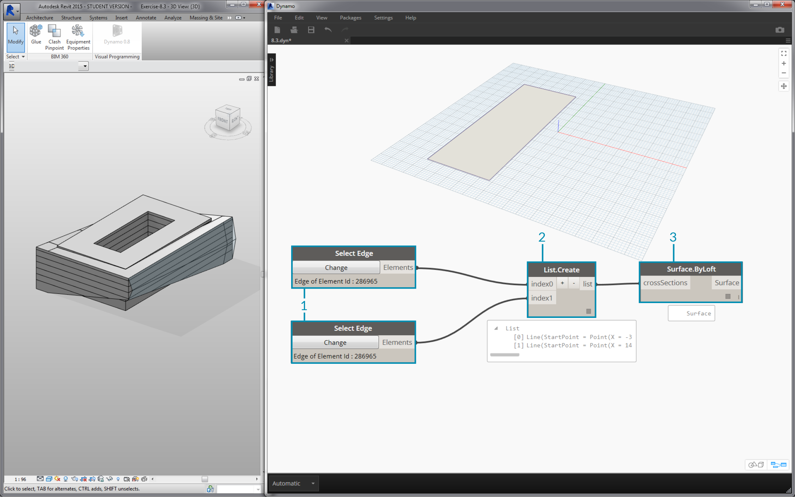
> 1. Beginning by selecting two edges with the *"Select Edge"* node.  The two edges are the long spans of the atrium.
2.  Combine the two edges into one list with the *List.Create* node.
3. Create a surface between the two edges with a *Surface.ByLoft*.

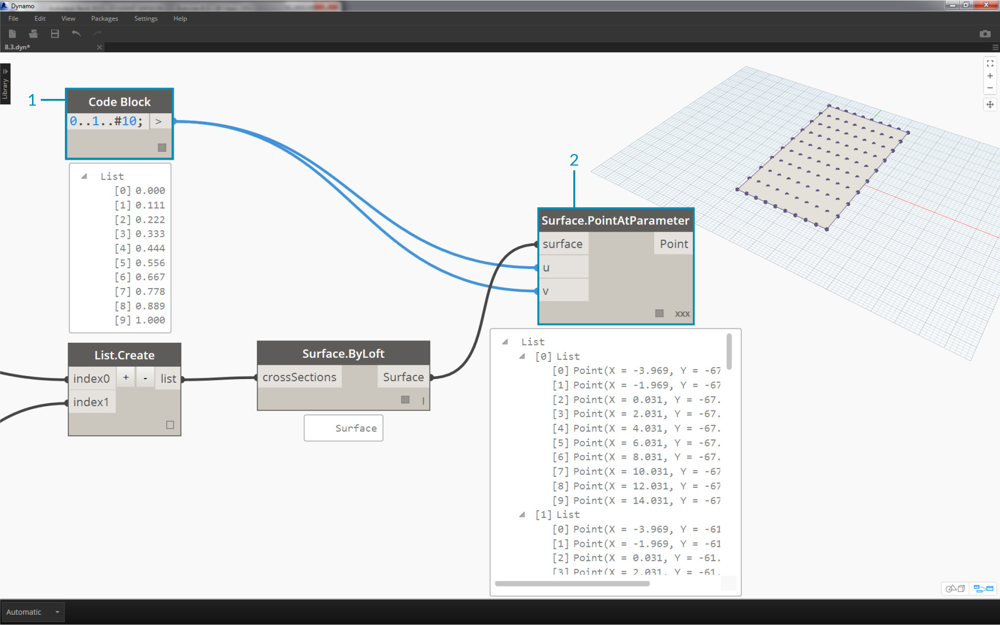
> 1. Using *code block*, define a range from 0 to 1 with 10 evenly spaced values: ```0..1..#10;
```
2. Plug the *code block* into the *u *and *v* inputs of a *Surface.PointAtParameter* node, and plug the *Surface.ByLoft* node into the *surface* input.  Right click the node and change the *lacing* to *Cross Product*.  This will give a gird of points on the surface.

This grid of points serves as the control points for a parametrically defined surface.  We want to extract the u and v positions of each one of these points so that we can plug them into a parametric formula and keep the same data structure.  We can do this by querying the parameter locations of the points we just created.

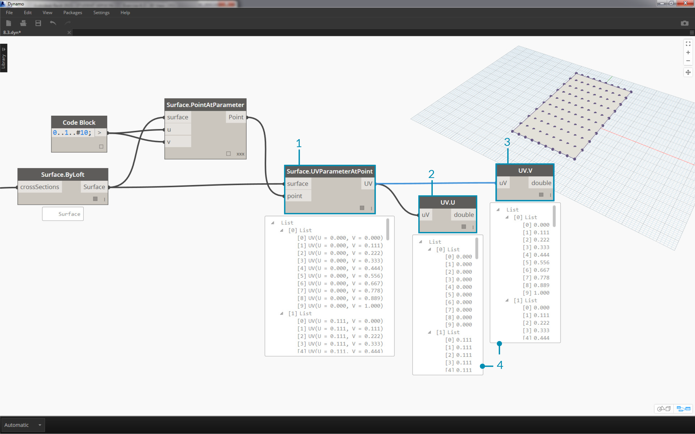
> 1. Add a *Surface.ParameterAtPoint* node to the canvas, connect the inputs as shown above.
2. Query the *u* values of these parameters with the *UV.U* node.
3. Query the *v* values of these parameters with the *UV.V *node.
4. The outputs show the corresponding *u* and *v* values for every point of the surface.  We now have a range from *0* to *1* for each value, in the proper data structure, so we're ready to apply a parametric algorithm.


> 1. Add a *code block* to the canvas and enter the code: ```
Math.Sin(u*180)*Math.Sin(v*180)*w;``` This is a parametric function which creates a sine mound from a flat surface.
2. The *u* input connects to *UV.U*.
3. The *v* input connects to *UV.V*.
4. The *w* input represents the *amplitude* of the shape, so we attach a *number slider* to it.


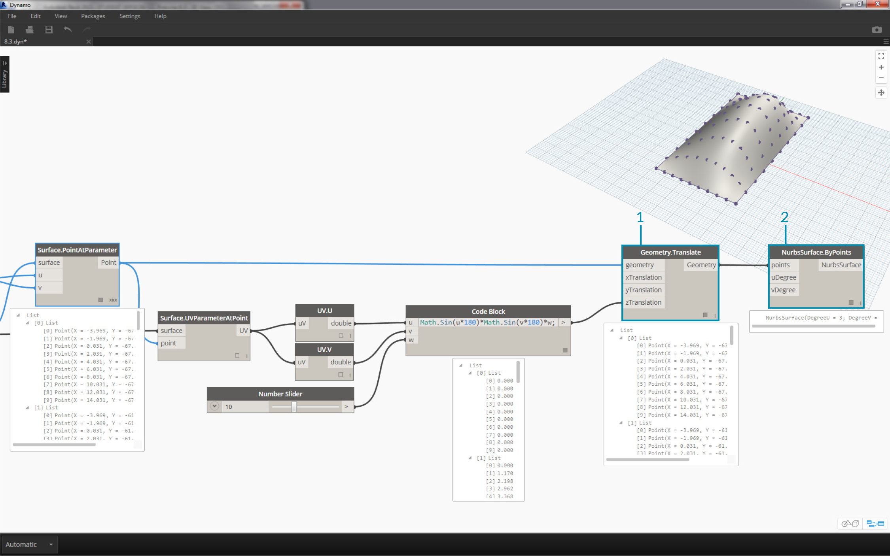
> 1. Now, we have a list of values as defined by the algorithm.  Let's use this list of values to move the points up in the *+Z* direction.  Using *Geometry.Translate*, plug the *code block *into *zTranslation* and the *Surface.PointAtParameter* into the *geometry* input. You should see the new points displayed in the Dynamo preview.
2. Finally, we create a surface with the *NurbsSurface.ByPoints* node, plugging the node from the previous step into the points input.  We have ourselves a parametric surface.  Feel free to drag the slider to watch the mound shrink and grow.

With the parametric surface, we want to define a way to panelize it in order to array four-point adaptive components.  Dynamo does not have out-of-the-box functionality for surface panelization, so we can look to the community for helpful Dynamo packages.

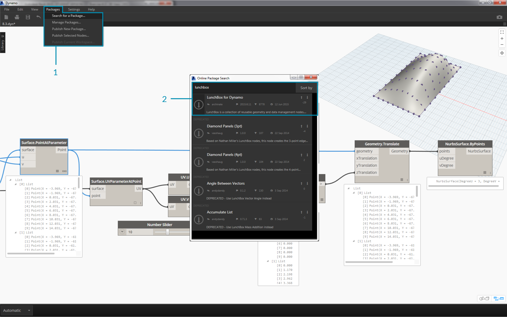
> 1. Go to *Packages>Search for a Package...*
2. Search for *"LunchBox"* and download *"LunchBox for Dynamo"*. This is a really helpful set of tools for geometry operations such as this.


> 1. After downloading, you now have full access to the LunchBox suite.  Search for *"Quad Grid"* and select *"LunchBox Quad Grid By Face"*.  Plug the parametric surface into the *surface* input and set the *U* and *V* divisions to *15*.  You should see a quad-paneled surface in your Dynamo preview.

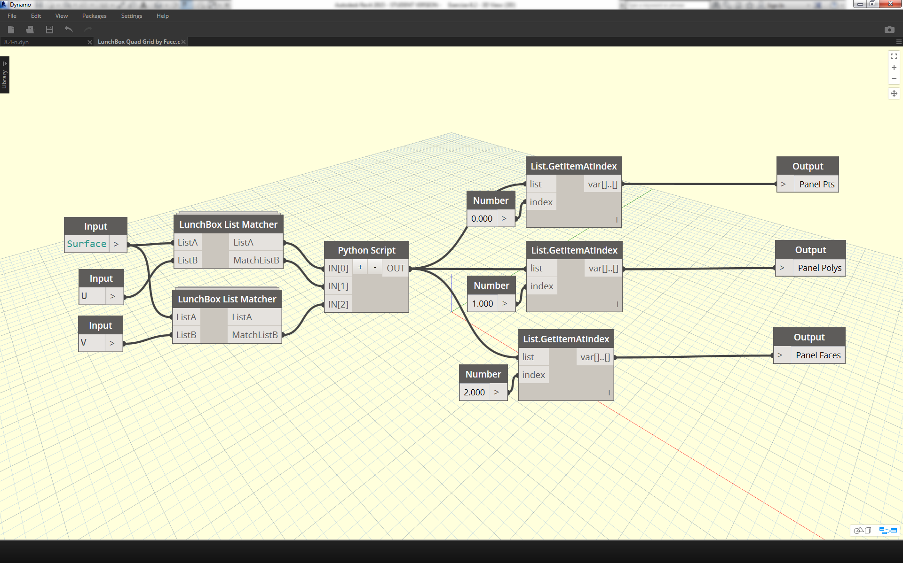
> If you're curious about its setup, you can double click on the *Lunch Box* node and see how it's made.

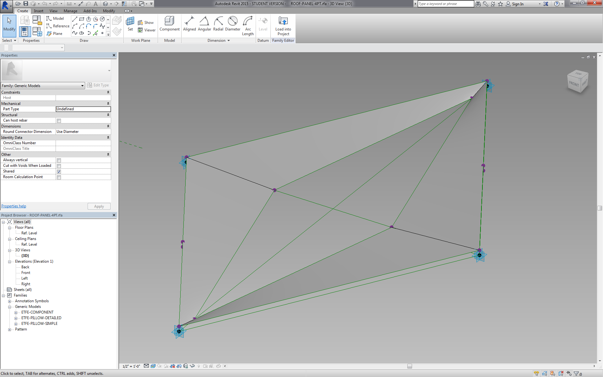
> Back in Revit, let's take a quick look at the adaptive component we're using here.  No need to follow along, but this is the roof panel we're going to instantiate.  It is a four-point adaptive component which is a crude representation of an ETFE system.  The aperture of the center void is on a parameter called *"ApertureRatio"*.

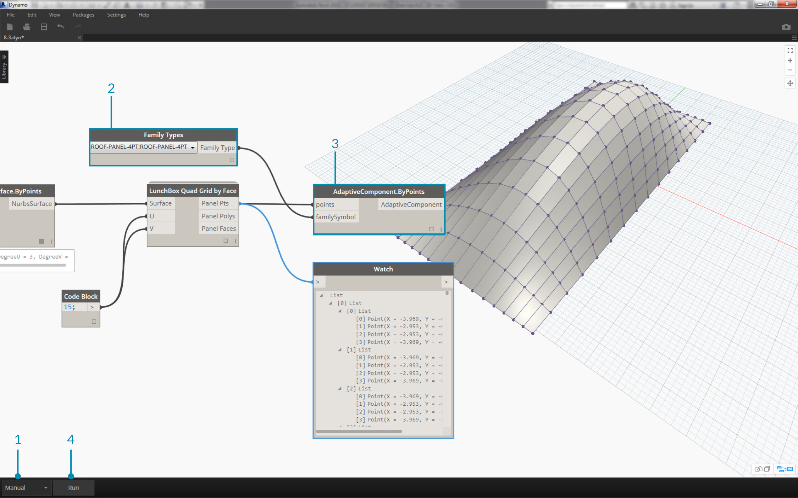
> 1. We're about to instantiate a lot of geometry in Revit, so make sure to turn the Dynamo solver to *"Manual"*.
2. Add a *Family Types* node to the canvas and select *"ROOF-PANEL-4PT"*.
3. Add an *AdaptiveComponent.ByPoints* node to the canvas, connect *Panel Pts* from the *"LunchBox Quad Grid by Face"* output into the *points* input.  Connect the *Family Types* node to the *familySymbol* input.
4. Hit *Run*.  Revit will have to *think* for a bit while the geometry is being created.  If it takes too long, reduce the *code block's '15'* to a lower number.  This will reduce the number of panels on the roof.

*Note: If Dynamo is taking a long time to calculate nodes, you may want to use the "freeze" node functionality in order to pause the execution of Revit operations while you develop your graph. For more information on freezing nodes, check out the "Freezing" section in the [solids chapter](../05_Geometry-for-Computational-Design/5-6_solids.md#freezing).*


> Back in Revit, we have the array of panels on the roof.


> Zooming in, we can get a closer look at their surface qualities.

###Analysis

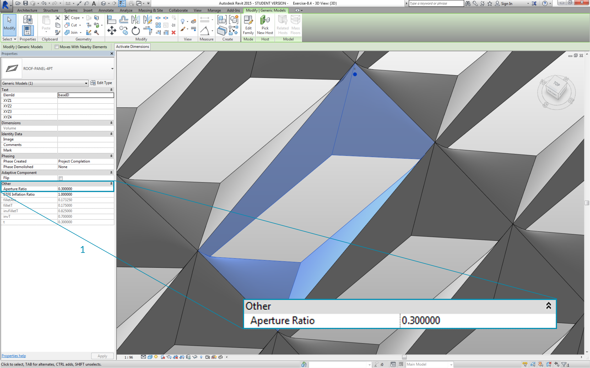
> 1. Continuing from the previous step, let's go further and drive the aperture of each panel based on its exposure to the sun.  Zooming into Revit and select one panel, we see in the properties bar that there is a parameter called *"Aperture Ratio"*.  The family is setup so that the aperture ranges, roughly, from *0.05* to *0.45*.

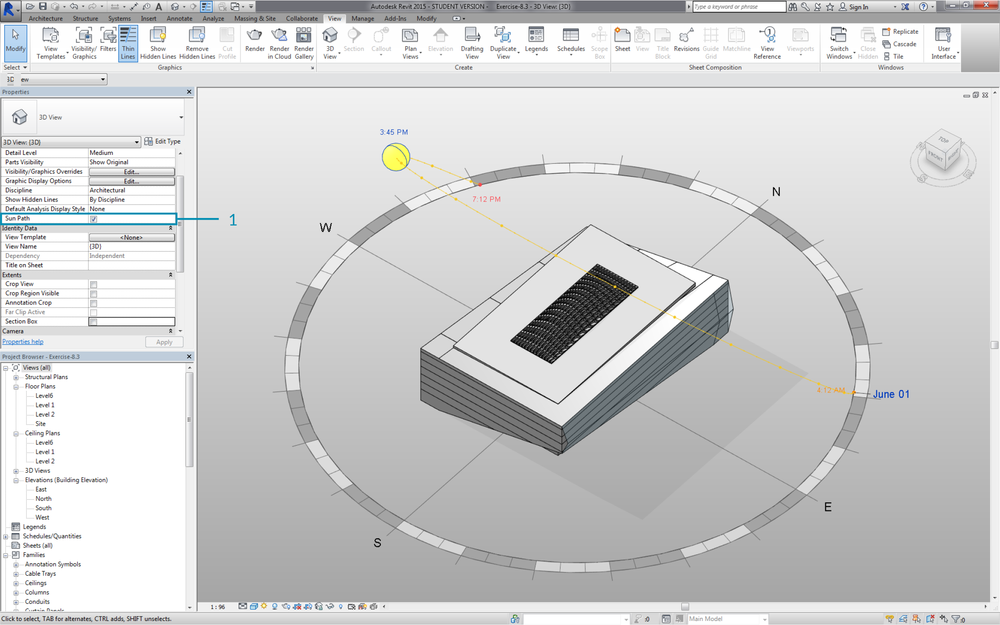
> 1. If we turn on the solar path, we can see the current sun location in Revit.

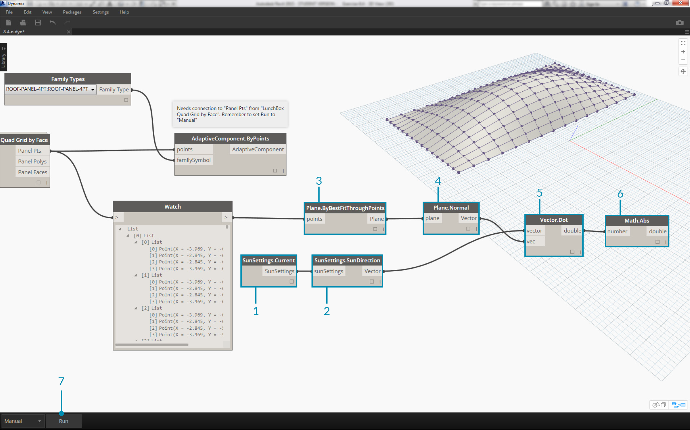
> 1. We can reference this sun location using the *SunSettings.Current* node.
2. Plug the Sun settings into *Sunsetting.SunDirection* to get the solar vector.
3. From the *Panel Pts* used to create the adaptive components, use *Plane.ByBestFitThroughPoints* to approximate a plane for the component.
4. Query the *normal* of this plane.
5. Use the *dot product* to calculate solar orientation. The dot product is a formula which determines how parallel or anti-parallel two vectors may be.  So we're taking the plane normal of each adaptive component and comparing it to the solar vector to roughly simulate solar orientation.
6. Take the *absolute value* of the result. This ensures that the dot product is accurate if the plane normal is facing the reverse direction.
7. Hit *Run*.


> 1. Looking at the *dot product*, we have a wide range of numbers.  We want to use their relative distribution, but we need to condense the numbers into the appropriate range of the *"Aperture Ratio"* parameter we plan to edit.
2. The *Math.RemapRange* is a great tool for this.  It takes an input list and remaps its bounds into two target values.
3. Define the target values as *0.15* and *0.45* in a *code block*.
4. Hit *Run*.


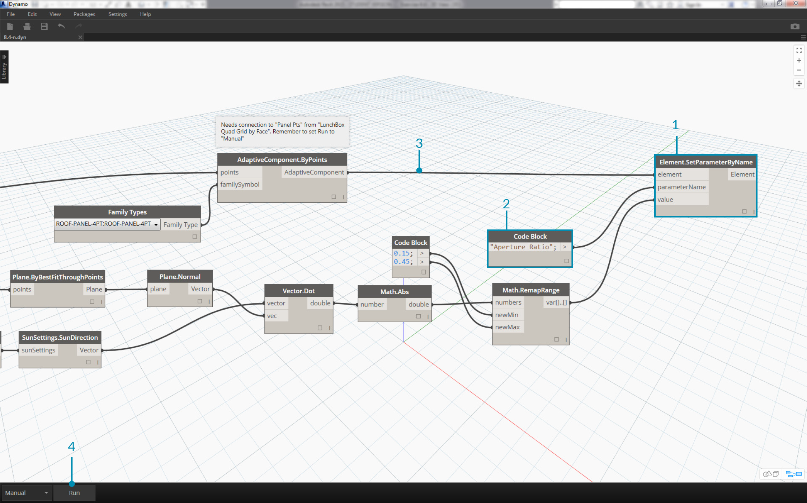
> 1. Connect the remapped values into a *Element.SetParameterByName* node.
2. Connect the string *"Aperture Ratio"* into the *parameterName* input.
3. Connect the *adaptive components* into the *element* input.
4. Hit *Run*.


> Back in Revit, from a distance we can make out the affect of the solar orientation on the aperture of the ETFE panels.


> Zooming in, we see that the ETFE panels are more closed as the face the sun. Our target here is to reduce overheating from solar exposure.  If we wanted to let in more light based on solar exposure, we just have to switch the domain on *Math.RemapRange*.


