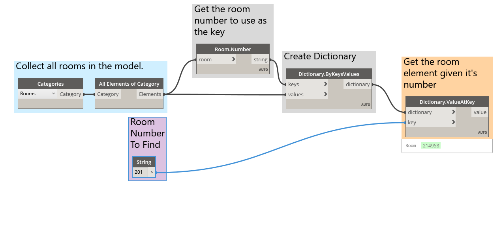
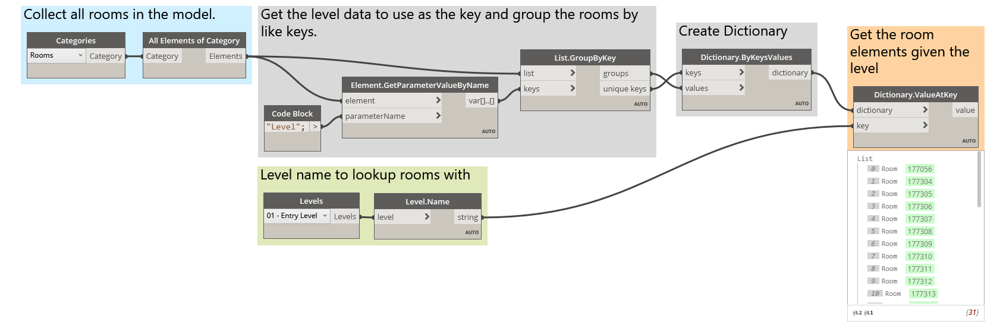

# Dictionaries - Revit Use-Cases

Have you ever wanted to look up something in Revit by a piece of data that it has?
#### Chances are if you have you've done something like this:

In the image above we are collecting all of the rooms in the Revit model, getting the index of the room we want (by room number), and finally grabbing the room at the index.

#### With Dictionaries this workflow looks like this:

Additionally dictionaries offer amazing support for similar keys. Like obtaining all rooms at a given level.

The opportunities for Dictionary use are really endless. The ability to relate your BIM data in Revit to the element itself poses a variety of use cases.

Here is a video demonstrating the value of looking up rooms in this manner as well.
https://www.youtube.com/watch?v=wSR-6nDymu0
