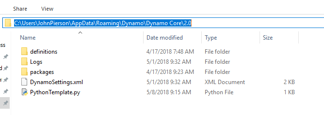
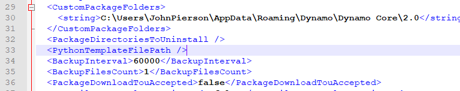

<style>
img{display:block;margin-left: auto;   margin-right: auto }
</style>

## Python Templates

With Dynamo 2.0 we have the ability to specify a default template `(.py extension)` to use when opening the python window for the first time. This has been a long-desired request as this expedites the usage of Python within Dynamo. Having the ability to use a template allows us to have default imports ready to go when we want to develop a custom Python script.

The location for this template is in the `APPDATA` location for your Dynamo install.

This is typically as follows `( %appdata%\Dynamo\Dynamo Core\{version}\ )`.




### Setting Up The Template

In order to utilize this functionality we need to add the following line in our `DynamoSettings.xml` file. _(Edit in notepad)_



Where we see `<PythonTemplateFilePath />`, we can simply replace this with the following:
```
<PythonTemplateFilePath>
<string>C:\Users\CURRENTUSER\AppData\Roaming\Dynamo\Dynamo Core\2.0\PythonTemplate.py</string>
</PythonTemplateFilePath>
```

_Note: replace CURRENTUSER with your username_

Next we need to build a template with the functionality that we want to use built-in. In our case lets embed the Revit related imports and some of the other typical items when working with Revit.

You can start a blank notepad document and paste the following code inside:
```
import clr

clr.AddReference('RevitAPI')
from Autodesk.Revit.DB import *
from Autodesk.Revit.DB.Structure import *

clr.AddReference('RevitAPIUI')
from Autodesk.Revit.UI import *

clr.AddReference('System')
from System.Collections.Generic import List

clr.AddReference('RevitNodes')
import Revit
clr.ImportExtensions(Revit.GeometryConversion)
clr.ImportExtensions(Revit.Elements)

clr.AddReference('RevitServices')
import RevitServices
from RevitServices.Persistence import DocumentManager
from RevitServices.Transactions import TransactionManager

doc = DocumentManager.Instance.CurrentDBDocument
uidoc=DocumentManager.Instance.CurrentUIApplication.ActiveUIDocument

#Preparing input from dynamo to revit
element = UnwrapElement(IN[0])

#Do some action in a Transaction
TransactionManager.Instance.EnsureInTransaction(doc)

TransactionManager.Instance.TransactionTaskDone()

OUT = element
```
Once that is done, save this file as `PythonTemplate.py` in the `APPDATA` location.

### Python Script Behavior After

Ater the python template is defined, Dynamo will look for this each time a Python node is placed. If it is not found it will look like the default Python window.


If the Python template is found (like our Revit one for example) you will see all of the default items you built in.


Additional information regarding this great addition (by Radu Gidei) can be found here.
https://github.com/DynamoDS/Dynamo/pull/8122
