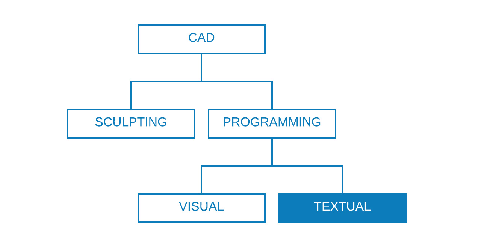
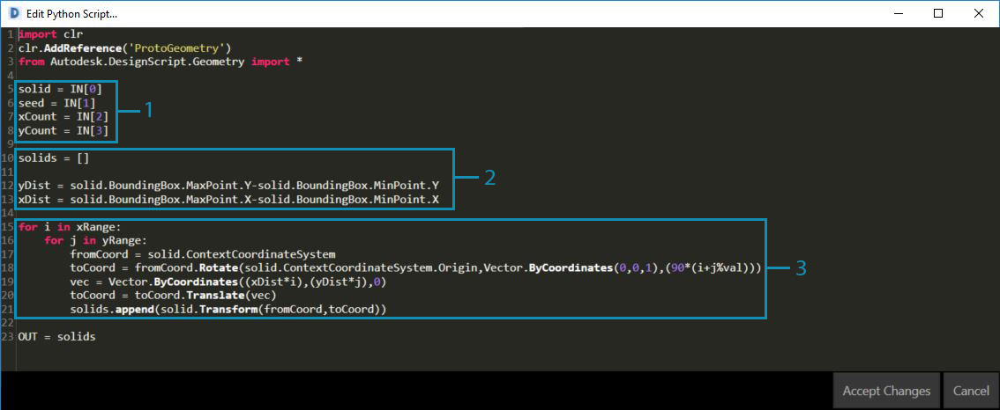
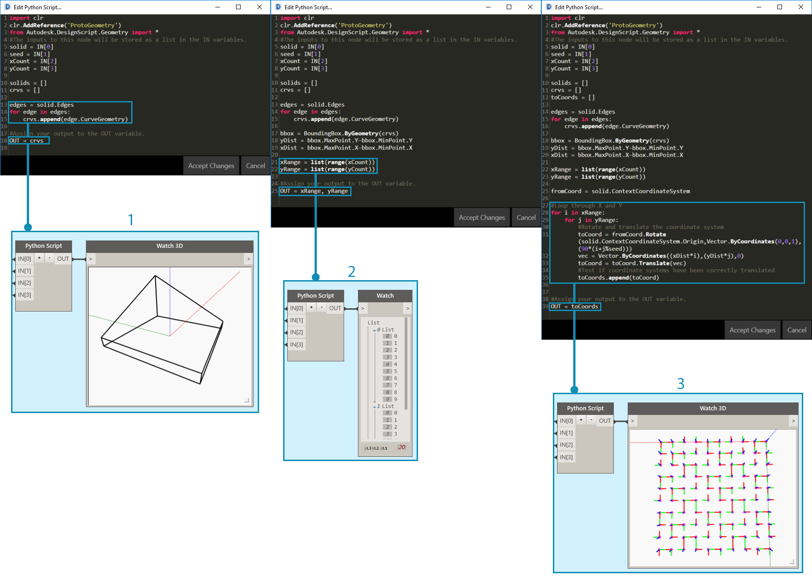
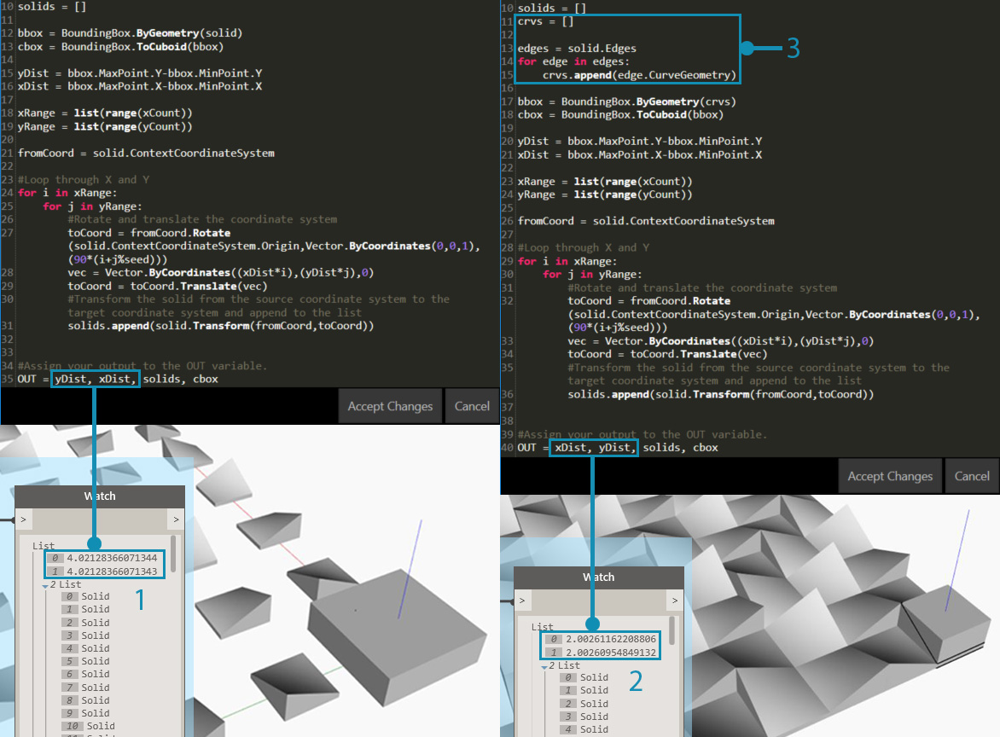

## Scripting Strategies

Text-based scripting within the visual-scripting environment enables powerful and visual relationships using DesignScript, Python, and ZeroTouch (C#). The user can expose elements such as input sliders, condense large operations into DesignScript, and access powerful tools and libraries through Python or C# all within the same workspace. If managed effectively, combining these strategies can lend a great deal of customization, clarity, and efficiency to the overall program. The following are a set of guidelines to help you augment your visual-script with text-script.



### Know When to Script

Text-scripting can establish relationships of a higher complexity than visual programming, yet their capabilities also overlap significantly. This makes sense because nodes are effectively pre-packaged code, and we could probably write an entire Dynamo program in DesignScript or Python. However, we use visual-scripting because the interface of nodes and wires creates an intuitive flow of graphic information. Knowing where text-scripting's capabilities go beyond visual-scripting will give you major clues to when it should be used without foregoing the intuitive nature of nodes and wires. The following are guidelines on when to script and which language to use.

**Use text-scripting for:**

* Looping

* Recursion

* Accessing external libraries

**Choose a language:**

|  | Looping | Recursion | Condense Nodes | Ext. Libraries | Shorthand |
| -- | -- |
| **DesignScript** | Yes | Yes | Yes | No | Yes |
| **Python** | Yes | Yes | Partially | Yes | No |
| **ZeroTouch (C#)** | No | No | No | Yes | No |

> Refer to [Scripting Reference](http://dynamoprimer.com/en/12_Best-Practice/12-3_Scripting-Reference.html) for a list of what each Dynamo library gives you access to.

### Think Parametrically

When scripting in Dynamo, an inevitably parametric environment, it is wise to structure your code relative to the framework of nodes and wires it will be living in. Consider the node containing your text-script as though it is any other node in the program with a few specific inputs, a function, and an expected output. This immediately gives your code inside the node a small set of variables from which to work, the key to a clean parametric system. Here are some guidelines for better integrating code into a visual program.

**Identify the external variables:**

* Try to determine the given parameters in your design problem so that you can construct a model that directly builds off that data.

* Before writing code, identify the variables:

  * A minimal set of inputs

  * The intended output

  * Constants


> Several variables have been established prior to writing code.
>
> 1. The surface we will simulate rainfall on.
> 2. The number of rain drops \(agents\) we want.
> 3. How far we want the rain drops to travel.
> 4. Toggle between descending the steepest path versus traversing the surface.
> 5. Python Node with the respective number of inputs.
> 6. A Code Block to make the returned curves blue.

**Design the internal relationships:**

* Parametricism allows for certain parameters or variables to be edited in order to manipulate or alter the end result of an equation or system.

* Whenever entities in your script are logically related, aim to define them as functions of each other. This way when one is modified, the other can update proportionally.

* Minimize number of inputs by only exposing key parameters:

  * If a set of parameters can be derived from more parent parameters, only expose the parent parameters as script inputs. This increases the usability of your script by reducing the complexity of its interface.



> The code "modules" from the example in [Python Node](http://dynamoprimer.com/en/09_Custom-Nodes/9-4_Python.html).

> 1. Inputs.
> 2. Variables internal to the script.
> 3. A loop that uses these inputs and variables to perform its function.

> Tip: Place as much emphasis on the process as you do on the solution.

**Don't repeat yourself \(the DRY principle\):**

* When you have multiple ways to express the same thing in your script, at some point the duplicate representations will fall out of sync which can lead to maintenance nightmares, poor factoring, and internal contradictions.

* The DRY principle is stated as "Every piece of knowledge must have a single, unambiguous, authoritative representation within a system":

  * When this principle is successfully applied, all the related elements in your script change predictably and uniformly and all the unrelated elements do not have logical consequences on each other.

```
### BAD
for i in range(4):
  for j in range(4):
    point = Point.ByCoordinates(3*i, 3*j, 0)
    points.append(point)
```

```
### GOOD
count = IN[0]
pDist = IN[1]

for i in range(count):
  for j in range(count):
    point = Point.ByCoordinates(pDist*i, pDist*j, 0)
    points.append(point)
```

> Tip: Before duplicating entities in your script (such as constant in the example above), ask yourself if you can link to the source instead.

### Structure Modularly

As your code gets longer and more complex the “big idea”, or overarching algorithm becomes increasingly illegible. It also becomes more difficult to keep track of what \(and where\) specific things happen, find bugs when things go wrong, integrate other code, and assign development tasks. To avoid these headaches it’s wise to write code in modules, an organizational strategy that breaks up code based on the task it executes. Here are some tips for making your scripts more manageable by way of modularization.

**Write code in modules:**

* A "module" is a group of code that performs a specific task, similar to a Dynamo Node in the workspace.

* This can be anything that should be visually separated from adjacent code \(a function, a class, a group of inputs, or the libraries you are importing\).

* Developing code in modules harnesses the visual, intuitive quality of Nodes as well as the complex relationships that only text-scripting can achieve.


> These loops call a class named "agent" that we will develop in the exercise.

> 1. A code module that defines the start point of each agent.
> 2. A code module that updates the agent.
> 3. A code module that draws a trail for the agent's path.

**Spotting code re-use:**

* If you find that your code does the same \(or very similar\) thing in more than once place, find ways to cluster it into a function that can be called.

* "Manager" functions control program flow and primarily contain calls to "Worker" functions that handle low-level details, like moving data between structures.


> This example creates spheres with radii and color based on the Z value of the center points.

> 1. Two "worker" parent functions: one that creates spheres with radii and display colors based the centerpoint's Z value.
> 2. A "manager" parent function that combines the two worker functions. Calling this will call both functions inside it.

**Only show what needs to be seen:**

* A module interface expresses the elements that are provided and required by the module.

* Once the interfaces between the units have been defined, the detailed design of each unit can proceed separately.

**Separability/Replaceability:**

* Modules don’t know or care about each other.

**General forms of modularization:**

* Code Grouping:

  ```
  # IMPORT LIBRARIES
  import random
  import math
  import clr
  clr.AddReference('ProtoGeometry')
  from Autodesk.DesignScript.Geometry import *

  # DEFINE PARAMETER INPUTS
  surfIn = IN[0]
  maxSteps = IN[1]
  ```

* Functions:

  ```
  def get_step_size():
    area = surfIn.Area
    stepSize = math.sqrt(area)/100
    return stepSize

  stepSize = get_step_size()
  ```

* Classes:

  ```
  class MyClass:
    i = 12345

    def f(self):
      return 'hello world'

  numbers = MyClass.i
  greeting = MyClass.f
  ```

### Flex Continuously

While developing text-scripts in Dynamo, it is wise to constantly make sure that what is actually being created is in line with what you are expecting. This will ensure that unforeseen events-- syntax errors, logical discrepancies, value inaccuracies, anomalous outputs etc.-- are quickly discovered and dealt with as they surface rather than all at once at the end. Because text-scripts live inside nodes on the canvas, they are already integrated into the data flow of your visual program. This makes the successive monitoring of your script as simple as assigning data to be outputted, running the program, and evaluating what flows out of the script using a Watch Node. Here are some tips for continuously inspecting your scripts as you construct them.

**Test as you go:**

* Whenever you complete a cluster of functionality:

  * Step back and inspect your code.

  * Be critical. Could a collaborator understand what this is doing? Do I need to do this? Can this function be done more efficiently? Am I creating unnecessary duplicates or dependencies?

  * Quickly test to make sure it is returning data that “makes sense”.

* Assign the most recent data you are working with in your script as the output so that the node is always outputting relevant data when the script updates:



> Flexing the example code from [Python Node](http://dynamoprimer.com/en/09_Custom-Nodes/9-4_Python.html).

> 1. Check that all edges of the solid are being returned as curves to create a bounding box around.
> 2. Check that our Count inputs are successfully being converted to Ranges.
> 3. Check that coordinate systems have been properly translated and rotated in this loop.

**Anticipate “edge cases”:**

* While scripting, crank your input parameters to the minimum and maximum values of their allotted domain to check if the program still functions under extreme conditions.

* Even if the program is functioning at its extremes, check if it is returning unintended null/empty/zero values.

* Sometimes bugs and errors that reveal some underlying problem with your script will only surface during these edge cases.

  * Understand what is causing the error and then decide if it needs to be fixed internally or if a parameter domain needs to be redefined to avoid the problem.

> Tip: Always assume the that the user will use every combination of every input value that has been exposed to him/her. This will help eliminate unwanted surprises.

### Debug Efficiently

Debugging is the process of eliminating "bugs" from your script. Bugs can be errors, inefficiencies, inaccuracies, or any unintended results. Addressing a bug can be as simple as correcting a misspelled variable name to more pervasive, structural problems with your script. Ideally, flexing your script as you build it will help to catch these potential issues early, though this is no guarantee of it being bug-free. The following is a review of several best practices from above to help you address bugs systematically.

**Use the watch bubble:**

* Check the data returned at different places in the code by assigning it to the OUT variable, similar to the concept of flexing the program.

**Write meaningful comments:**

* A module of code will be much easier to debug if its intended outcome is clearly described.

```py
# Loop through X and Y
for i in range(xCount):
  for j in range(yCount):
    
    # Rotate and translate the coordinate system
    toCoord = fromCoord.Rotate(solid.ContextCoordinateSystem.Origin,Vector.ByCoordinates(0,0,1),(90*(i+j%seed)))
    vec = Vector.ByCoordinates((xDist*i),(yDist*j),0)
    toCoord = toCoord.Translate(vec)
    
    # Transform the solid from the source coord system to the target coord system and append to the list
    solids.append(solid.Transform(fromCoord,toCoord))
```

> Normally this would be an excessive amount of commenting and blank lines, but when debugging it can be useful to break things down into manageable pieces.

**Leverage the code's modularity:**

* The source of an issue can be isolated to certain modules.

* Once the faulty module has been identified, fixing the problem is considerably simpler.

* When a program must be modified, code that has been developed in modules will be much easier to change:

  * You can insert new or debugged modules into an existing program with the confidence that the rest of the program will not change.



> Debugging the example file from [Python Node](http://dynamoprimer.com/en/09_Custom-Nodes/9-4_Python.html).

> 1. The input geometry is returning a bounding box larger that itself, as we can see from assigning xDist and yDist to OUT.
> 2. The edge curves of the input geometry return an appropriate bounding box with correct distances for xDist and yDist.
> 3. The code "module" we've inserted to address the xDist and yDist value issue.

### Exercise - Steepest Path

> Download the example file that accompanies this exercise \(Right click and "Save Link As..."\). A full list of example files can be found in the Appendix. [SteepestPath.dyn](datasets/12-1/SteepestPath.dyn)

With our best practices for text-scripting in mind, let's write a rain simulation script. While we were able to apply best practices to a disorganized visual program in Graph Strategies, it is far more difficult to do that with text-scripting. Logical relationships established in text-scripting are less visible and can be almost impossible to untangle in messy code. With the power of text-scripting comes a larger responsibility in organization. We will walk through each step and apply best practices along the way.


> Our script applied to an attractor-deformed surface.

The first thing we need to do is import the necessary Dynamo libraries. Doing this first will give global access to Dynamo functionality in Python. 


> All the libraries we intend on using need to be imported here.

Next we need to define the script's inputs and output, which will display as input ports on the node. These external inputs are the foundation for our script and the key to establishing a parametric environment.


> We need to define inputs that correspond to variables in the Python script and determine a desired output:
>
> 1. The surface we want to walk down.
> 2. The number of agents we want to walk.
> 3. The maximum number of steps the agents are allowed to take.
> 4. An option to take the shortest path down the surface or traverse it.
> 5. The Python Node with input identifiers that correspond to inputs in the script (IN[0], IN[1]).
> 6. Output curves that can be displayed with a different color.

Now let's employ the practice of modularity and create the body of our script. Simulating the shortest path down a surface for multiple start points is a significant task that will require several functions. Rather than call the different functions throughout the script, we can modularize our code by collecting them into a single class, our agent. The different functions of this class or "module" can be called with different variables or even reused in another script. 


> We will need to define a class, or blueprint, for an agent with the intention of walking down a surface by choosing to travel in the steepest possible direction each time it takes a step:
>
> 1. Name.
> 2. Global attributes that all the agents share.
> 3. Instance attributes that are unique to each agent.
> 4. A function for taking a step.
> 5. A function for cataloging the position of each step to a trail list.

Let's initialize the agents by defining their start location. This is a good opportunity to flex our script and make sure the agent class is working. 


> We will need to instantiate all the agents we want to observe walk down the surface and define their initial attributes:
>
> 1. A new empty trail list.
> 2. Where they will start their journey on the surface.
> 3. We've assigned the agents list as the output to check what the script is returning here. The correct number of agents is being returned, but we'll need to flex the script again later on to verify the geometry it returns.

Update each agent at each step.


> We will then need to enter a nested loop where for each agent and for each step, we update and record their position into their trail list. At each step we will also make sure the agent hasn’t reached a point on the surface where it cannot take another step which will allow it to descend. If that condition is met, we will end that agent's trip.

Now that our agents have been fully updated, let's return geometry that represents them.


> After all the agents have either reached their limit of descent or their maximum number of steps we will create a polycurve through the points in their trail list and output the polycurve trails.

Our script for finding the steepest paths.


> 1. A preset that simulates rainfall on the underlying surface.
> 2. Rather than finding the steepest path, the agents can be toggled to traverse the underlying surface.


> The full Python text-script.