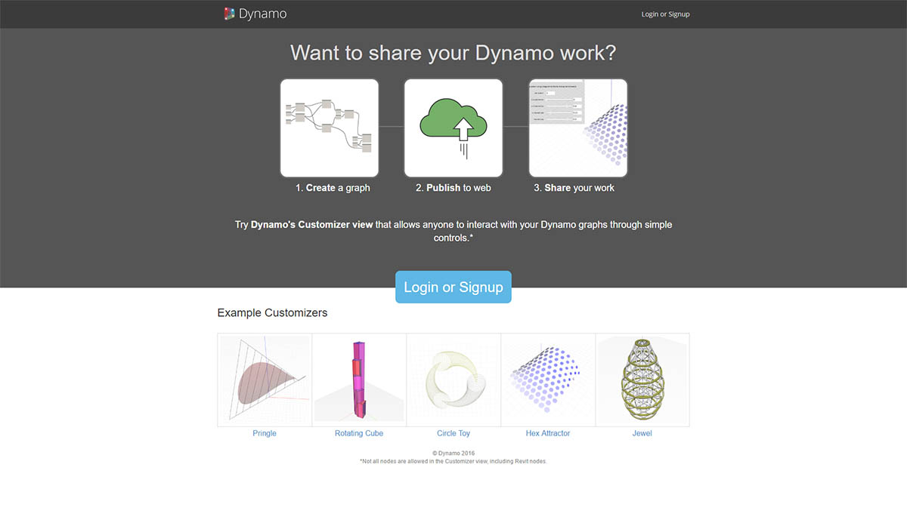

# Dynamo Web Experience

You can now experience Dynamo on the web beginning with the 'Send to Web' feature available in Dynamo Studio. The 'Send to Web' feature allows others to interact with your scripts via a pared down interface, the Customizer view, consisting of allowable inputs such as sliders, numbers, and booleans. This makes your scripts accessible to a wider group of users who may not be familiar with Dynamo or Visual Programming.

> Dynamo on the Web

