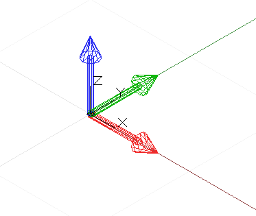
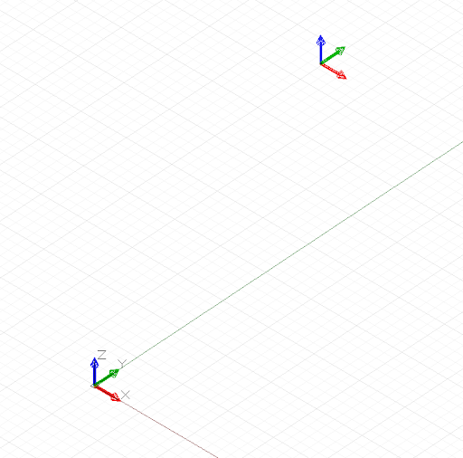
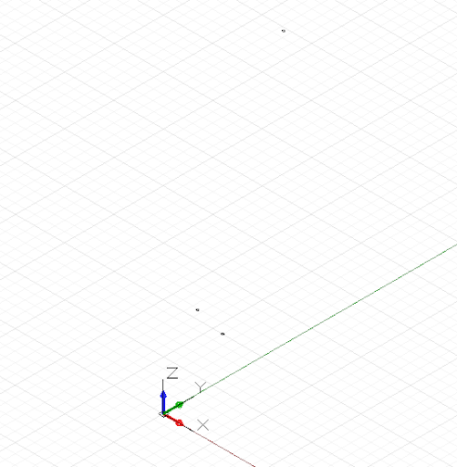
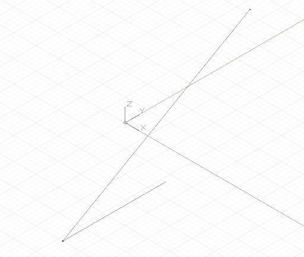
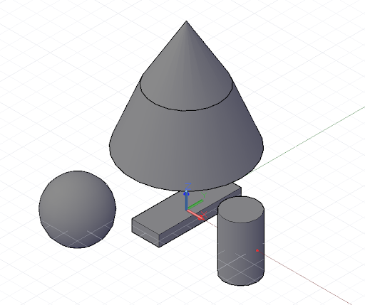

# Geometric Primitives

While Dynamo is capable of creating a variety of complex geometric forms, simple geometric primitives form the backbone of any computational design: either directly expressed in the final designed form, or used as scaffolding off of which more complex geometry is generated.

While not strictly a piece of geometry, the CoordinateSystem is an important tool for constructing geometry. A CoordinateSystem object keeps track of both position and geometric transformations such as rotation, sheer, and scaling.

Creating a CoordinateSystem centered at a point with x = 0, y = 0, z = 0, with no rotations, scaling, or sheering transformations, simply requires calling the Identity constructor:



```js
// create a CoordinateSystem at x = 0, y = 0, z = 0,
// no rotations, scaling, or sheering transformations

cs = CoordinateSystem.Identity();
```

CoordinateSystems with geometric transformations are beyond the scope of this chapter, though another constructor allows you to create a coordinate system at a specific point, *CoordinateSystem.ByOriginVectors*: 



```js
// create a CoordinateSystem at a specific location,
// no rotations, scaling, or sheering transformations
x_pos = 3.6;
y_pos = 9.4;
z_pos = 13.0;

origin = Point.ByCoordinates(x_pos, y_pos, z_pos);
identity = CoordinateSystem.Identity();

cs = CoordinateSystem.ByOriginVectors(origin,
    identity.XAxis, identity.YAxis, identity.ZAxis);
```

The simplest geometric primitive is a Point, representing a zero-dimensional location in three-dimensional space.  As mentioned earlier there are several different ways to create a point in a particular coordinate system: *Point.ByCoordinates* creates a point with specified x, y, and z coordinates; *Point.ByCartesianCoordinates* creates a point with a specified x, y, and z coordinates in a specific coordinate system; *Point.ByCylindricalCoordinates* creates a point lying on a cylinder with radius, rotation angle, and height; and *Point.BySphericalCoordinates* creates a point lying on a sphere with radius and two rotation angle.

This example shows points created at various coordinate systems:



```js
// create a point with x, y, and z coordinates
x_pos = 1;
y_pos = 2;
z_pos = 3;

pCoord = Point.ByCoordinates(x_pos, y_pos, z_pos);

// create a point in a specific coordinate system
cs = CoordinateSystem.Identity();
pCoordSystem = Point.ByCartesianCoordinates(cs, x_pos,
    y_pos, z_pos);

// create a point on a cylinder with the following
// radius and height
radius = 5;
height = 15;
theta = 75.5;

pCyl = Point.ByCylindricalCoordinates(cs, radius, theta,
    height);

// create a point on a sphere with radius and two angles

phi = 120.3;

pSphere = Point.BySphericalCoordinates(cs, radius, 
    theta, phi);
```

The next higher dimensional Dynamo primitive is a line segment, representing an infinite number of points between two end points. Lines can be created by explicitly stating the two boundary points with the constructor *Line.ByStartPointEndPoint*, or by specifying a start point, direction, and length in that direction, *Line.ByStartPointDirectionLength*.



```js
p1 = Point.ByCoordinates(-2, -5, -10);
p2 = Point.ByCoordinates(6, 8, 10);

// a line segment between two points
l2pts = Line.ByStartPointEndPoint(p1, p2); 

// a line segment at p1 in direction 1, 1, 1 with 
// length 10
lDir = Line.ByStartPointDirectionLength(p1,
    Vector.ByCoordinates(1, 1, 1), 10);
```
 
Dynamo has objects representing the most basic types of geometric primitives in three dimensions: Cuboids, created with *Cuboid.ByLengths*; Cones, created with *Cone.ByPointsRadius* and *Cone.ByPointsRadii*; Cylinders, created with *Cylinder.ByRadiusHeight*; and Spheres, created with *Sphere.ByCenterPointRadius*.



```js
// create a cuboid with specified lengths
cs = CoordinateSystem.Identity();

cub = Cuboid.ByLengths(cs, 5, 15, 2);

// create several cones
p1 = Point.ByCoordinates(0, 0, 10);
p2 = Point.ByCoordinates(0, 0, 20);
p3 = Point.ByCoordinates(0, 0, 30);

cone1 = Cone.ByPointsRadii(p1, p2, 10, 6);
cone2 = Cone.ByPointsRadii(p2, p3, 6, 0);

// make a cylinder
cylCS = cs.Translate(10, 0, 0);

cyl = Cylinder.ByRadiusHeight(cylCS, 3, 10);

// make a sphere
centerP = Point.ByCoordinates(-10, -10, 0);

sph = Sphere.ByCenterPointRadius(centerP, 5);
```