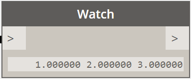
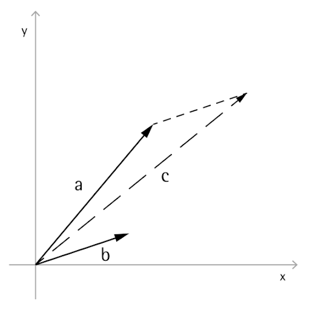
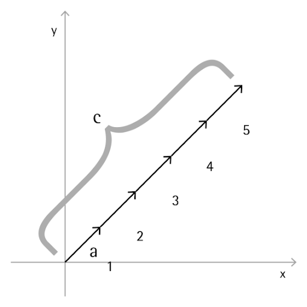
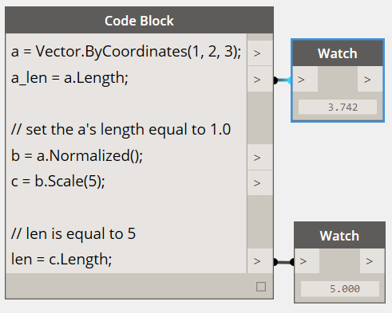
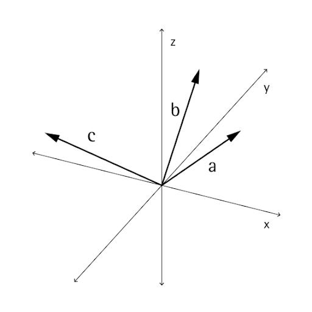
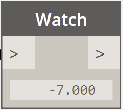

# Vector Math

Objects in computational designs are rarely created explicitly in their final position and form, and are most often translated,rotated, and otherwise positioned based off of existing geometry. Vector math serves as a kind-of geometric scaffolding to give direction and orientation to geometry, as well as to conceptualize movements through 3D space without visual representation.

At its most basic, a vector represents a position in 3D space, and is often times thought of as the endpoint of an arrow from the position (0, 0, 0) to that position. Vectors can be created with the *ByCoordinates* constructor, taking the x, y, and z position of the newly created Vector object. Note that Vector objects are not geometric objects, and don’t appear in the Dynamo window. However, information about a newly created or modified vector can be printed in the console window:



```js
// construct a Vector object
v = Vector.ByCoordinates(1, 2, 3);

s = v.X + " " + v.Y + " " + v.Z;
```

A set of mathematical operations are defined on Vector objects, allowing you to add, subtract, multiply, and otherwise move objects in 3D space as you would move real numbers in 1D space on a number line.

Vector addition is defined as the sum of the components of two vectors, and can be thought of as the resulting vector if the two component vector arrows are placed “tip to tail.” Vector addition is performed with the *Add* method, and is represented by the diagram on the left.



```js
a = Vector.ByCoordinates(5, 5, 0);
b = Vector.ByCoordinates(4, 1, 0);

// c has value x = 9, y = 6, z = 0
c = a.Add(b);
```

Similarly, two Vector objects can be subtracted from each other with the *Subtract* method. Vector subtraction can be thought of as the direction from first vector to the second vector.


```js
a = Vector.ByCoordinates(5, 5, 0);
b = Vector.ByCoordinates(4, 1, 0);

// c has value x = 1, y = 4, z = 0
c = a.Subtract(b);
```

Vector multiplication can be thought of as moving the endpoint of a vector in its own direction by a given scale factor.



```js
a = Vector.ByCoordinates(4, 4, 0);

// c has value x = 20, y = 20, z = 0
c = a.Scale(5);
```

Often it’s desired when scaling a vector to have the resulting vector’s length exactly equal to the scaled amount. This is easily achieved by first normalizing a vector, in other words setting the vector’s length exactly equal to one. 



```js
a = Vector.ByCoordinates(1, 2, 3);
a_len = a.Length;

// set the a's length equal to 1.0
b = a.Normalized();
c = b.Scale(5);

// len is equal to 5
len = c.Length;
```

c still points in the same direction as a (1, 2, 3), though now it has length exactly equal to 5.

Two additional methods exist in vector math which don’t have clear parallels with 1D math, the cross product and dot product. The cross product is a means of generating a Vector which is orthogonal (at 90 degrees to) to two existing Vectors. For example, the cross product of the x and y axes is the z axis, though the two input Vectors don’t need to be orthogonal to each other. A cross product vector is calculated with the *Cross* method.



```js
a = Vector.ByCoordinates(1, 0, 1);
b = Vector.ByCoordinates(0, 1, 1);

// c has value x = -1, y = -1, z = 1
c = a.Cross(b);
```

An additional, though somewhat more advanced function of vector math is the dot product. The dot product between two vectors is a real number (not a Vector object) that relates to, but is not exactly, the angle between two vectors. One useful properties of the dot product is that the dot product between two vectors will be 0 if and only if they are perpendicular. The dot product is calculated with the *Dot* method.



```js
a = Vector.ByCoordinates(1, 2, 1);
b = Vector.ByCoordinates(5, -8, 4);

// d has value -7
d = a.Dot(b);
```