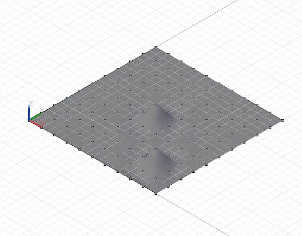
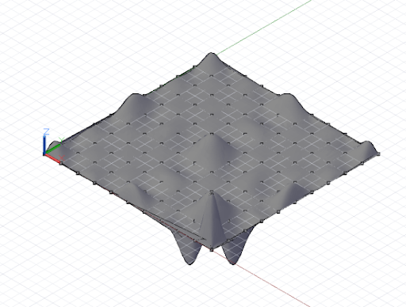
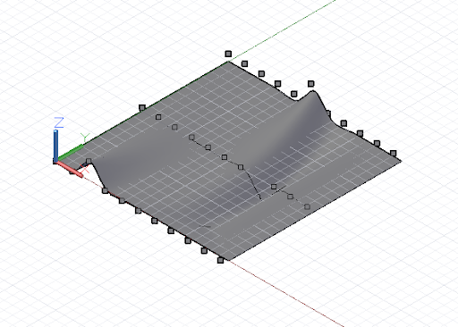

# Surfaces: Interpolated, Control Points, Loft, Revolve

The two-dimensional analog to a NurbsCurve is the NurbsSurface, and like the freeform NurbsCurve, NurbsSurfaces can be constructed with two basic methods: inputting a set of base points and having Dynamo interpolate between them, and explicitly specifying the control points of the surface. Also like freeform curves, interpolated surfaces are useful when a designer knows precisely the shape a surface needs to take, or if a design requires the surface to pass through constraint points. On the other hand, Surfaces created by control points can be more useful for exploratory designs across various smoothing levels.

To create an interpolated surface, simply generate a two-dimensional collection of points approximating the shape of a surface. The collection must be rectangular, that is, not jagged. The method *NurbsSurface.ByPoints* constructs a surface from these points.


```js
// python_points_1 is a set of Points generated with
// a Python script found in Appendix B, Section 10

surf = NurbsSurface.ByPoints(python_points_1);
```

Freeform NurbsSurfaces can also be created by specifying underlying control points of a surface. Like NurbsCurves, the control points can be thought of as representing a quadrilateral mesh with straight segments, which, depending on the degree of the surface, is smoothed into the final surface form. To create a NurbsSurface by control points, include two additional parameters to *NurbsSurface.ByPoints*, indicating the degrees of the underlying curves in both directions of the surface.



```js
// python_points_1 is a set of Points generated with
// a Python script found in Appendix B, Section 10

// create a surface of degree 2 with smooth segments
surf = NurbsSurface.ByPoints(python_points_1, 2, 2);
```

We can increase the degree of the NurbsSurface to change the resulting surface geometry:



```js
// python_points_1 is a set of Points generated with
// a Python script found in Appendix B, Section 10

// create a surface of degree 6
surf = NurbsSurface.ByPoints(python_points_1, 6, 6);
```

Just as Surfaces can be created by interpolating between a set of input points, they can be created by interpolating between a set of base curves. This is called lofting. A lofted curve is created using the *Surface.LoftFromCrossSections* constructor, with a collection of input curves as the only parameter.



```js
// python_points_2, 3, and 4 are generated with
// Python scripts found in Appendix B, Section 10

c1 = NurbsCurve.ByPoints(python_points_2);
c2 = NurbsCurve.ByPoints(python_points_3);
c3 = NurbsCurve.ByPoints(python_points_4);

loft = Surface.ByLoft([c1, c2, c3]);
```

Surfaces of revolution are an additional type of surface created by sweeping a base curve around a central axis. If interpolated surfaces are the two-dimensional analog to interpolated curves, then surfaces of revolution are the two-dimensional analog to circles and arcs. 

Surfaces of revolution are specified by a base curve, representing the “edge” of the surface; an axis origin, the base point of the surface; an axis direction, the central “core” direction; a sweep start angle; and a sweep end angle. These are used as the input to the *Surface.Revolve* constructor.


```js
pts = {};
pts[0] = Point.ByCoordinates(4, 0, 0);
pts[1] = Point.ByCoordinates(3, 0, 1);
pts[2] = Point.ByCoordinates(4, 0, 2);
pts[3] = Point.ByCoordinates(4, 0, 3);
pts[4] = Point.ByCoordinates(4, 0, 4);
pts[5] = Point.ByCoordinates(5, 0, 5);
pts[6] = Point.ByCoordinates(4, 0, 6);
pts[7] = Point.ByCoordinates(4, 0, 7);

crv = NurbsCurve.ByPoints(pts);

axis_origin = Point.ByCoordinates(0, 0, 0);
axis = Vector.ByCoordinates(0, 0, 1);

surf = Surface.ByRevolve(crv, axis_origin, axis, 0,
    360);
```


