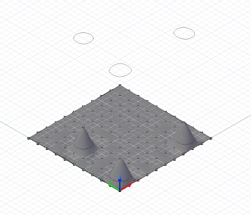

# Intersection and Trim

Many of the examples so far have focused on the construction of higher dimensional geometry from lower dimensional objects. Intersection methods allow this higher dimensional geometry to generate lower dimensional objects, while the trim and select trim commands allow script to heavily modify geometric forms after they’ve been created.

The *Intersect* method is defined on all pieces of geometry in Dynamo, meaning that in theory any piece of geometry can be intersected with any other piece of geometry. Naturally some intersections are meaningless, such as intersections involving Points, as the resulting object will always be the input Point itself. The other possible combinations of intersections between objects are outlined in the following chart. The following chart outlines the result of various intersection operations:

**Intersect**

| *With:*   | Surface | Curve | Plane        | Solid   |
|---------|---------|-------|--------------|---------|
| **Surface** | Curve   | Point | Point, Curve | Surface |
| **Curve**   | Point   | Point | Point        | Curve   |
| **Plane**   | Curve   | Point | Curve        | Curve   |
| **Solid**   | Surface | Curve | Curve        | Solid   |

The following very simple example demonstrates the intersection of a plane with a NurbsSurface. The intersection generates a NurbsCurve array, which can be used like any other NurbsCurve.



```js
// python_points_5 is a set of Points generated with
// a Python script found in Appendix B, Section 10

surf = NurbsSurface.ByPoints(python_points_5, 3, 3);

WCS = CoordinateSystem.Identity();

pl = Plane.ByOriginNormal(WCS.Origin.Translate(0, 0,
    0.5), WCS.ZAxis);

// intersect surface, generating three closed curves
crvs = surf.Intersect(pl);

crvs_moved = crvs.Translate(0, 0, 10);
```

The *Trim* method is very similar to the Intersect method, in that it is defined for almost every piece of geometry. However, there are far more limitations on *Trim* than on *Intersect*.

**Trim**

|           | *Using:* Point | Curve | Plane | Surface | Solid |
|-----------|--------------|-------|-------|---------|-------|
| *On:* Curve | Yes          | No    | No    | No      | No    |
| Polygon   | -            | No    | Yes   | No      | No    |
| Surface   | -            | Yes   | Yes   | Yes     | Yes   |
| Solid     | -            | -     | Yes   | Yes     | Yes   |

Something to note about *Trim* methods is the requirement of a “select” point, a point which determines which geometry to discard, and which pieces to keep. Dynamo finds and discards the trimmed geometry closest to the select point.


```js
// python_points_5 is a set of Points generated with
// a Python script found in Appendix B, Section 10

surf = NurbsSurface.ByPoints(python_points_5, 3, 3);

tool_pts = Point.ByCoordinates((-10..20..10)<1>,
    (-10..20..10)<2>, 1);

tool = NurbsSurface.ByPoints(tool_pts);

pick_point = Point.ByCoordinates(8, 1, 3);

result = surf.Trim(tool, pick_point);
```
