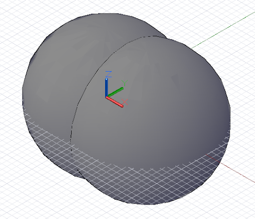

# Geometric Booleans

*Intersect*, *Trim*, and *SelectTrim* are primarily used on lower-dimensional geometry such as Points, Curves, and Surfaces.  Solid geometry on the other hand, has an additional set of methods for modifying form after their construction, both by subtracting material in a manner similar to *Trim* and combining elements together to form a larger whole.

The *Union* method takes two solid objects and creates a single solid object out of the space covered by both objects. The overlapping space between objects is combined into the final form. This example combines a Sphere and a Cuboid into a single solid Sphere-Cube shape:



```js
s1 = Sphere.ByCenterPointRadius(
    CoordinateSystem.Identity().Origin, 6);

s2 = Sphere.ByCenterPointRadius(
    CoordinateSystem.Identity().Origin.Translate(4, 0,
    0), 6);

combined = s1.Union(s2);
```

The *Difference* method, like *Trim*, subtracts away the contents of the input tool solid from the base solid. In this example we carve out a small indentation out of a sphere:


```js
s = Sphere.ByCenterPointRadius(
    CoordinateSystem.Identity().Origin, 6);

tool = Sphere.ByCenterPointRadius(
    CoordinateSystem.Identity().Origin.Translate(10, 0, 
    0), 6);

result = s.Difference(tool);
```

The *Intersect* method returns the overlapping Solid between two solid Inputs. In the following example, *Difference* has been changed to *Intersect*, and the resulting Solid is the missing void initially carved out:


```js
s = Sphere.ByCenterPointRadius(
    CoordinateSystem.Identity().Origin, 6);

tool = Sphere.ByCenterPointRadius(
    CoordinateSystem.Identity().Origin.Translate(10, 0, 
    0), 6);

result = s.Intersect(tool);
```
