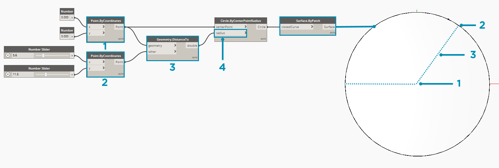

### ¿Qué es la programación visual?

El diseño suele implicar establecer relaciones visuales, sistémicas o geométricas entre las partes de un diseño. Por lo general, estas relaciones se desarrollan mediante flujos de trabajo que nos llevan del concepto al resultado mediante el uso de reglas. Quizás sin saberlo, estamos trabajando de forma algorítmica, definiendo un conjunto de acciones paso a paso que siga una lógica básica de entrada, procesamiento y salida. La programación nos permite seguir trabajando de esta forma, pero formalizando nuestros algoritmos.

### Algoritmos disponibles

Aunque ofrece algunas oportunidades interesantes, el término **algoritmo** puede dar lugar a algunas ideas erróneas. Los algoritmos pueden generar elementos inesperados, salvajes o increíbles, pero no son mágicos. De hecho, en realidad, son componentes bastantes básicos. Usemos un ejemplo tangible como una grulla de papiroflexia. Comenzaremos con un trozo de papel cuadrado (entrada), seguiremos con una serie de pasos de plegado (acciones de procesamiento) y obtendremos una grulla (salida).


Por lo tanto, ¿dónde está el algoritmo? Es el conjunto abstracto de pasos, que podemos representar de dos maneras: textualmente o gráficamente.

**Instrucciones textuales:**

1. Comience con un trozo de papel cuadrado, con la parte de color hacia arriba. Dóblelo a la mitad y ábralo. Dóblelo a la mitad por el otro lado.
2. Gire el papel por el lado blanco. Doble el papel por la mitad, pliéguelo bien y ábralo; a continuación, vuelva a doblarlo en la otra dirección.
3. Con los pliegues creados, lleve las tres esquinas superiores del modelo a la esquina inferior. Aplane el modelo.
4. Doble las pestañas triangulares de la parte superior en el centro y despliéguelo.
5. Doble la parte superior del modelo hacia abajo, pliéguelo bien y despliéguelo.
6. Abra la pestaña superior del modelo, trayéndola hacia arriba y presionando los lados del modelo hacia dentro al mismo tiempo. Aplánelo y pliéguelo bien.
7. Gire el modelo y repita los pasos 4 a 6 en el otro lado.
8. Doble las pestañas superiores en el centro.
9. Repita esta operación en el otro lado.
10. Doble ambas "patas" del modelo hacia arriba, pliegue el modelo muy bien y, a continuación, despliéguelo.
11. Doble hacia dentro las "patas" a lo largo de los pliegues que acaba de crear.
12. Doble hacia dentro un lado para crear una cabeza y, a continuación, doble hacia abajo las alas.
13. Ya tiene una grulla.

**Instrucciones gráficas:**


### Definición de programación

El uso de cualquiera de estos conjuntos de instrucciones debería dar como resultado una grulla y, si se ha seguido el proceso, ya ha aplicado un algoritmo. La única diferencia es la forma en que leemos la formalización de ese conjunto de instrucciones y que nos lleva a la **programación**. La programación, un término abreviado de *programación informática*, es el acto de formalizar el procesamiento de una serie de acciones en un programa ejecutable. Si hemos convertido las instrucciones anteriores para crear una grulla en un formato que el equipo puede leer y ejecutar, esto significa que estamos programando.

La clave y el primer obstáculo que encontramos en la programación es que debemos utilizar alguna forma de abstracción para comunicarnos eficazmente con nuestro ordenador. Esto adopta la forma de diversos lenguajes de programación, como JavaScript, Python o C. Si podemos escribir un conjunto repetible de instrucciones, como en el caso de la grulla de papiroflexia, solo necesitamos traducirlo para que lo entienda el ordenador. Estamos intentando que el ordenador cree una grulla o incluso multitud de grullas diferentes con ligeras variaciones entre ellas. Este es el poder de la programación: el ordenador ejecutará repetidamente cualquier tarea o conjunto de tareas que le asignemos, sin retrasos ni errores humanos.

#### Definición de programación visual

> Descargue el archivo de ejemplo que acompaña a este ejercicio (haga clic con el botón derecho y seleccione "Guardar vínculo como..."): [Visual Programming - Circle Through Point.dyn](datasets/1-1/Visual Programming - Circle Through Point.dyn). En el Apéndice, se incluye una lista completa de los archivos de ejemplo.

Si se le encomendase la tarea de escribir instrucciones para crear una grulla de papiroflexia, ¿cómo lo haría? ¿Lo haría con gráficos, texto o una combinación de ambos?

Si su respuesta es con gráficos, la **programación visual** es definitivamente para usted. El proceso es básicamente el mismo tanto para la programación como para la programación visual. Utilizan el mismo marco de formalización. Sin embargo, definimos las instrucciones y las relaciones de nuestro programa a través de una interfaz de usuario gráfica (o "visual"). En lugar de escribir texto vinculado a la sintaxis, conectamos nodos preconfigurados. A continuación, se incluye una comparación del mismo algoritmo ("dibujar un círculo a través de un punto") programado tanto con nodos como con código:

**Programa visual:**


**Programa textual:**

```
myPoint = Point.ByCoordinates(0.0,0.0,0.0);
x = 5.6;
y = 11.5;
attractorPoint = Point.ByCoordinates(x,y,0.0);
dist = myPoint.DistanceTo(attractorPoint);
myCircle = Circle.ByCenterPointRadius(myPoint,dist);
```

Los resultados del algoritmo:



El aspecto visual de la programación permite reducir la barrera en relación con la entrada y, con frecuencia, ofrece mayor claridad a los diseñadores. Dynamo se incluye en el paradigma de la programación visual, pero, como veremos más adelante, podemos seguir utilizando también la programación textual en la aplicación.

