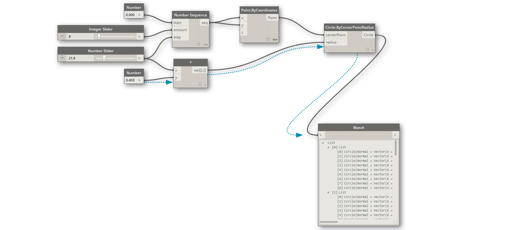

## ¿Qué es Dynamo?

Dynamo es, casi literalmente, lo que desee que sea. El trabajo con Dynamo puede incluir el uso de la aplicación junto con otro software de Autodesk o no, la implicación en un proceso de programación visual o la participación en una amplia comunidad de usuarios y colaboradores.

### La aplicación

Dynamo, la aplicación, es un software que se puede descargar y ejecutar en modo "Sandbox" autónomo o como un módulo de extensión para otro software como Revit o Maya. Se describe como:

> Una herramienta de programación visual cuyo objetivo es ser accesible tanto para los usuarios que son programadores como para los que no lo son. Proporciona a los usuarios la capacidad de definir el comportamiento visualmente con secuencias de comandos, definir lógica personalizada y definir secuencias de comandos mediante diversos idiomas de programación textual.

> 1. Vea Dynamo en acción con Revit.
> 2. Descargue el instalador.

### El proceso

Una vez instalada la aplicación, Dynamo nos permitirá trabajar en un proceso de programación visual en el que conectaremos elementos para definir las relaciones y las secuencias de acciones que componen algoritmos personalizados. Podemos utilizar nuestros algoritmos para una amplia gama de aplicaciones, desde el procesamiento de datos hasta la generación de geometría, todo en tiempo real y sin necesidad de escribir el mínimo `code`.

> Añada elementos, conéctelos y ya estaremos creando programas visuales.

### La comunidad

Dynamo no sería lo que es sin un grupo fiel de fervientes usuarios y colaboradores activos. Participe en la comunidad: siga el blog, añada su trabajo a la galería o hable de Dynamo en el foro.

### La plataforma

Dynamo es una herramienta de programación visual para diseñadores, lo que nos permite crear herramientas que utilicen bibliotecas externas o cualquier producto de Autodesk que tenga una API. Dynamo Sandbox permite desarrollar programas en una aplicación de estilo "Sandbox". Y el ecosistema de Dynamo sigue creciendo.

El código fuente del proyecto es de código abierto, lo que nos permite ampliar su funcionalidad como deseemos. Eche un vistazo al proyecto en GitHub y examine los trabajos en curso de los usuarios que personalizan Dynamo.

> Examine, bifurque y empiece a ampliar Dynamo en función de sus necesidades.
