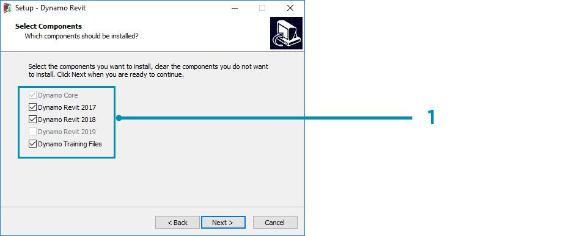
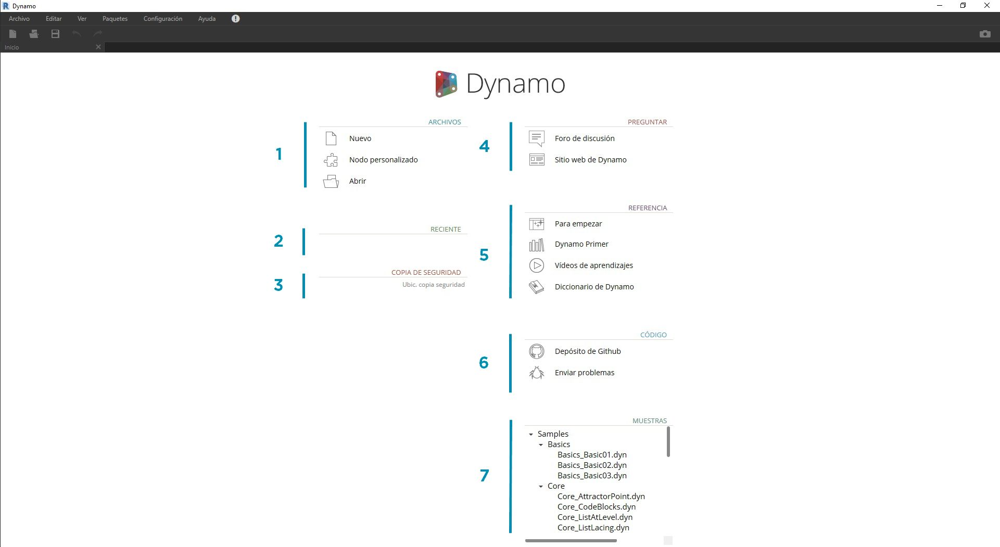
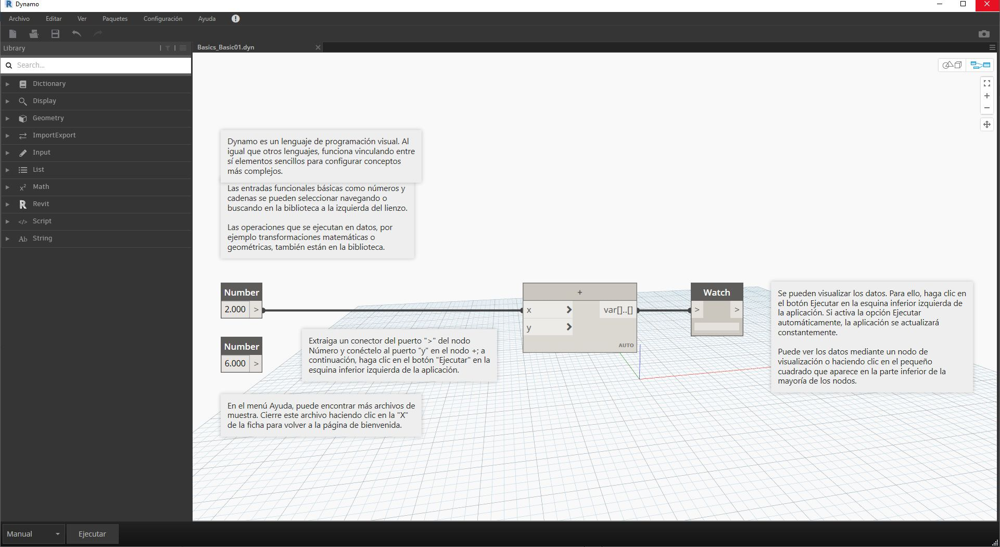

## Instalación e inicio de Dynamo

Dynamo es un proyecto de desarrollo activo de código abierto con instaladores descargables tanto para versiones oficiales como para versiones preliminares, es decir, versiones de "compilación diaria". Descargue la versión oficial para empezar o contribuya al futuro de Dynamo a través de las compilaciones diarias o del proyecto de GitHub.

### Descargando

Para descargar la versión oficial de Dynamo, visite el [sitio web de Dynamo](http://dynamobim.com/). Inicie la descarga al instante. Para ello, haga clic en la página de inicio o vaya a la página de descarga específica.

> 1. Vea un vídeo sobre el diseño computacional con Dynamo para arquitectura.
2. O vaya a la página de descarga.

Aquí puede descargar las versiones de desarrollo de "vanguardia" o acceder al proyecto de [Dynamo en GitHub](https://github.com/DynamoDS/Dynamo).

> 1. Descargue el instalador de la versión oficial.
2. Descargue los instaladores de las compilaciones diarias.
3. Consulte los paquetes personalizados de una comunidad de desarrolladores.
4. Participe en el desarrollo de Dynamo en GitHub.

### Instalación

Vaya al directorio del instalador descargado y ejecute el archivo ejecutable. Durante el proceso de instalación, puede personalizar los componentes que se van a instalar.

> 1. Seleccione los componentes que desee instalar.

Aquí debemos decidir si deseamos incluir los componentes que conectan Dynamo a otras aplicaciones instaladas, como Revit. Para obtener más información sobre la plataforma Dynamo, consulte el **capítulo 1.2**.

### Inicio

Para iniciar Dynamo, vaya a \Archivos de programa\Dynamo\Dynamo Revit\x.y y, a continuación, seleccione DynamoSandbox.exe. Se abre la versión autónoma y se muestra la *página de inicio* de Dynamo. En esta página, se muestran los menús y la barra de herramientas estándar, así como una colección de accesos directos que nos permiten acceder a las funciones de archivo o recursos adicionales.

> 1. Archivos: inicie un archivo nuevo o abra uno existente.
2. Reciente: desplácese por los archivos recientes.
3. Copia de seguridad: acceda a las copias de seguridad.
4. Preguntar: obtenga acceso directo al foro de usuarios o al sitio web de Dynamo.
5. Referencia: amplíe sus conocimientos con los recursos de aprendizaje adicionales.
6. Código: participe en el proyecto de desarrollo de código abierto.
7. Muestras: consulte los ejemplos que se incluyen en la instalación.

Abra el primer archivo de ejemplo para abrir el primer espacio de trabajo y confirmar que Dynamo funciona correctamente. Haga clic en Muestras > Basics > **Basics_Basic01.dyn**.

> 1. Confirme que la barra de ejecución indica "Automático" o haga clic en Ejecutar.
2. Siga las instrucciones y conecte el nodo **Number** al nodo **+**.
3. Confirme que este nodo Watch muestra un resultado.

Si este archivo se carga correctamente, debería poder ejecutar su primer programa visual con Dynamo.

