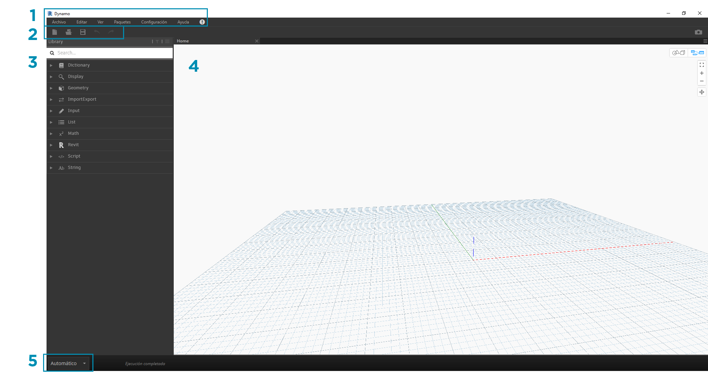
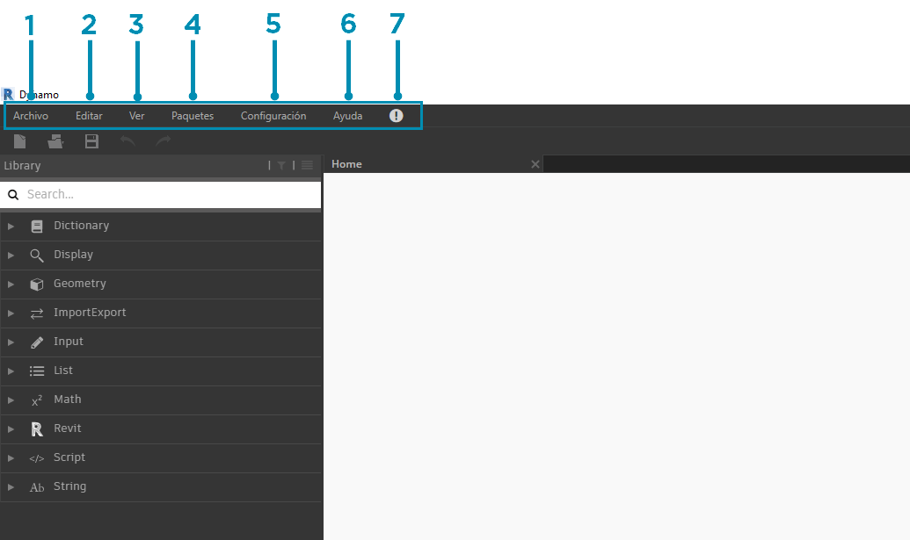
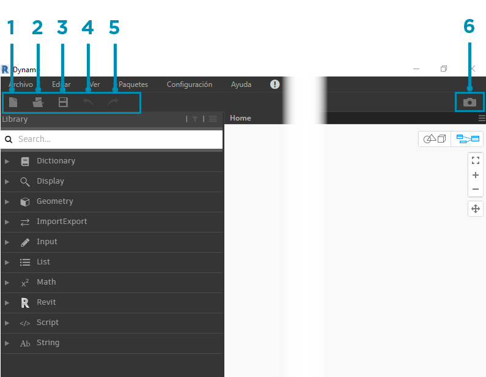
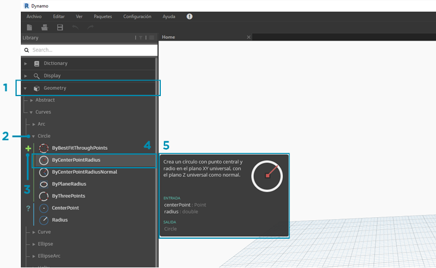
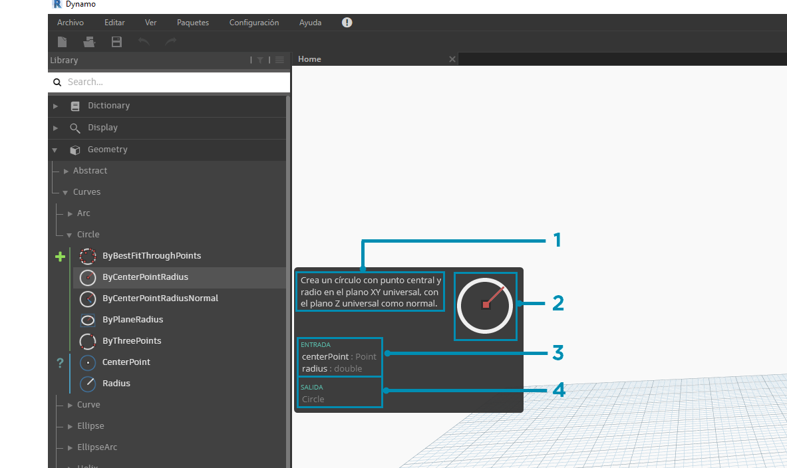
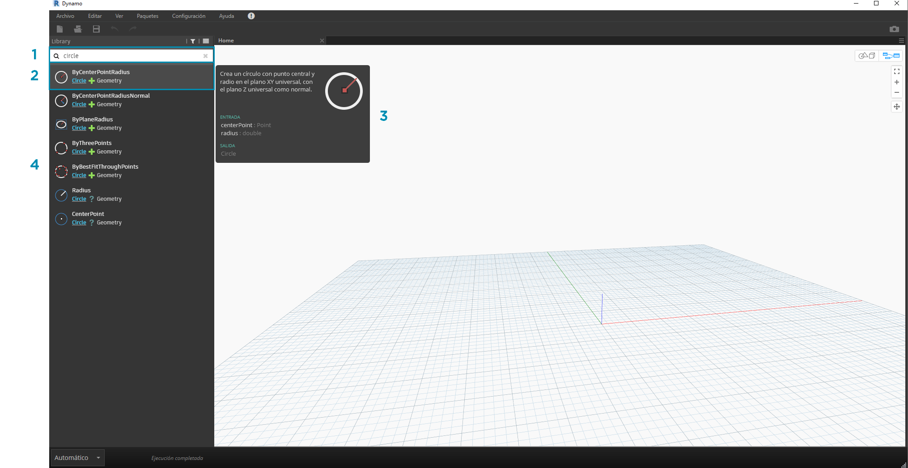
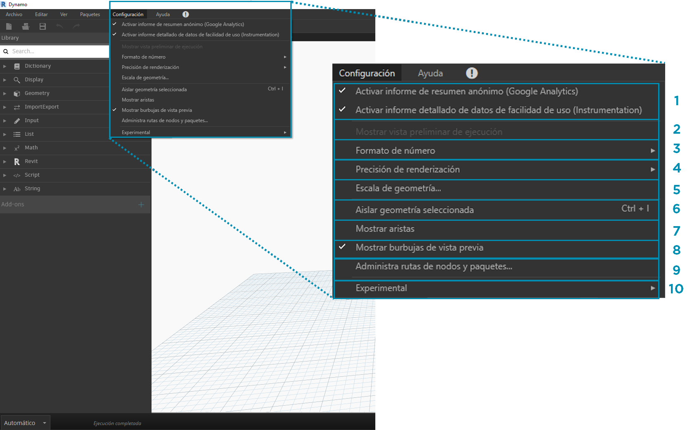
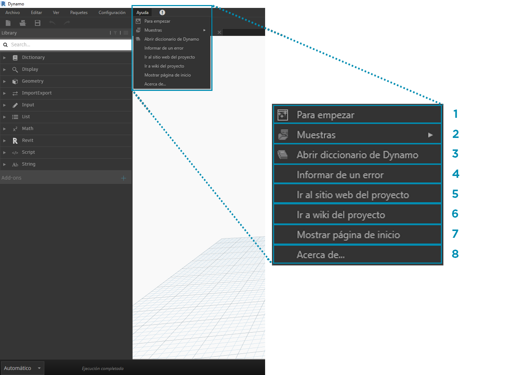

## La interfaz de usuario de Dynamo

La interfaz de usuario (IU) de Dynamo se organiza en cinco regiones principales, siendo la mayor de ellas el espacio de trabajo en el que se crean los programas visuales.

> 1. Menús
2. Barra de herramientas
3. Biblioteca
4. Espacio de trabajo
5. Barra de ejecución

Examinemos de forma más detallada la interfaz de usuario y veamos las funciones de cada región.

#### Menús

En los menús desplegables, se encuentran algunas de las funciones básicas de la aplicación Dynamo. Al igual que la mayoría del software Windows, las acciones relacionadas con la administración de archivos y las operaciones de selección y contenido se encuentran en los dos primeros menús. El resto de los menús son más específicos de Dynamo.

> 1. Archivo
2. Editar
3. Vista
4. Paquetes
5. Configuración
6. Ayuda
7. Notificaciones

#### Barra de herramientas

La barra de herramientas de Dynamo contiene una serie de botones para acceder rápidamente a los archivos, así como a los comandos Deshacer (Ctrl + Z) y Rehacer (Ctrl + Y). En el extremo derecho, hay otro botón que exporta una instantánea del espacio de trabajo, lo que resulta muy útil para la documentación y el uso compartido.

> 1. Nuevo: cree un nuevo archivo .dyn.
2. Abrir: abra un archivo .dyn (espacio de trabajo) o .dyf (nodo personalizado) existente.
3. Guardar/Guardar como: guarde el archivo .dyn o .dyf activo.
4. Deshacer: deshaga la última acción.
5. Rehacer: rehaga la siguiente acción.
6. Exportar espacio de trabajo como imagen: exporte el espacio de trabajo visible como un archivo PNG.

#### Biblioteca

La biblioteca contiene todos los nodos cargados, incluidos los nodos por defecto que se suministran con la instalación, así como los paquetes o los nodos personalizados cargados de forma adicional. Los nodos de la biblioteca se organizan de forma jerárquica en bibliotecas, categorías y, si es necesario, en subcategorías en función de si los nodos **crean** datos, ejecutan una **acción** o **consultan** datos.

##### Exploración

Por defecto, la **biblioteca** contiene ocho categorías de nodos. **Núcleo** y **Geometría** son excelentes menús para empezar a explorar, ya que contienen la mayor cantidad de nodos. La exploración a través de estas categorías es la manera más rápida de conocer la jerarquía de lo que podemos añadir a nuestro espacio de trabajo y la mejor forma de descubrir nuevos nodos que no ha utilizado antes.

> Ahora nos centraremos en la colección por defecto de nodos, pero tenga en cuenta que ampliaremos posteriormente esta biblioteca con nodos personalizados, bibliotecas adicionales y Package Manager.

> 1. Diccionario
2. Mostrar
3. Geometría
4. ImportarExportar
5. Entrada
6. Lista
7. Matemáticas
8. Revit
9. Secuencias de comandos
10. Cadena
11. Complementos

Haga clic en los menús para examinar la biblioteca. Haga clic en Geometría > Curvas > Círculo. Observe la nueva parte del menú que aparece y, en concreto, las etiquetas **Crear** y **Consultar**.

> 1. Biblioteca
2. Categoría
3. Subcategoría: Crear/Acciones/Consultar
4. Nodo
5. Descripción y propiedades del nodo: aparece al colocar el cursor sobre el icono del nodo.

En el mismo menú Círculo, coloque el cursor sobre **ByCenterPointRadius**. En la ventana, se muestra información más detallada sobre el nodo, además de su nombre e icono. Esto nos permite conocer rápidamente lo que realiza el nodo, lo que necesitará para las entradas y lo que proporcionará como salida.

> 1. Descripción: descripción del nodo en lenguaje normal.
2. Icono: versión más grande del icono en el menú Biblioteca.
3. Entrada(s): el nombre, y el tipo y la estructura de datos.
4. Salida(s): el tipo y la estructura de datos.

##### Búsqueda

Si sabe de forma relativamente específica el nodo que desea añadir al espacio de trabajo, el campo **Buscar** es la mejor herramienta. Cuando no se están modificando parámetros o especificando valores en el espacio de trabajo, el cursor está siempre presente en este campo. Si empieza a escribir, la biblioteca de Dynamo mostrará la coincidencia más precisa seleccionada (con rutas de navegación en relación con las categorías de nodos) y una lista de coincidencias alternativas de la búsqueda. Si pulsa Intro o hace clic en el elemento del navegador truncado, el nodo resaltado se añade al centro del espacio de trabajo.

> 1. Campo de búsqueda
2. Resultado más preciso/seleccionado
3. Coincidencias alternativas

### Configuración

En el menú **Configuración**, se encuentran diversas opciones de configuración, desde geométricas hasta de usuario. Aquí puede optar o no por compartir los datos de usuario con el fin de mejorar Dynamo, así como definir la precisión del separador decimal y la calidad de renderización de la geometría de la aplicación.

> 1. Activación de informes: opciones para compartir datos de usuario con el fin de mejorar Dynamo.
2. Mostrar vista preliminar de ejecución: obtenga una vista preliminar del estado de ejecución del gráfico. Los nodos programados para la ejecución se resaltarán en el gráfico.
3. Opciones de formato de número: cambie la configuración de decimales del documento.
4. Precisión de renderización: aumente o reduzca la calidad de renderización del documento.
5. Escala de geometría: seleccione el intervalo de geometría en el que está trabajando.
6. Aislar geometría seleccionada: aísle la geometría en segundo plano en función de la selección de nodos.
7. Mostrar/ocultar aristas de geometría: active o desactive las aristas de geometría 3D.
8. Mostrar/ocultar burbujas de vista previa: active o desactiva las burbujas de vista previa de datos debajo de los nodos.
9. Administrar rutas de nodos y paquetes: administre las rutas de archivos para que los nodos y los paquetes aparezcan en la biblioteca.
10. Activación de funciones experimentales: utilice las nuevas funciones de la versión beta de Dynamo.

### Ayuda

Si no sabe cómo funciona algo, consulte el menú de **Ayuda**. Aquí encontrará los archivos de ejemplo que se incluyen con la instalación, así como acceso a uno de los sitios web de referencia de Dynamo mediante el navegador de Internet. Si es necesario, compruebe la versión de Dynamo instalada y si está actualizada mediante la opción **Acerca de**.

> 1. Para empezar: una breve introducción al uso de Dynamo.
2. Muestras: archivos de ejemplo de referencia.
3. Abrir diccionario de Dynamo: recursos con documentación sobre todos los nodos.
4. Informar de un error: abra una incidencia en GitHub.
5. Ir al sitio web del proyecto: vea el proyecto de Dynamo en GitHub.
6. Ir a wiki del proyecto: visite la página wiki para obtener información sobre el desarrollo mediante la API de Dynamo con bibliotecas y herramientas.
7. Mostrar página de inicio: regrese a la página de inicio de Dynamo cuando se encuentre en un documento.
8. Acerca de: los datos de la versión de Dynamo.

