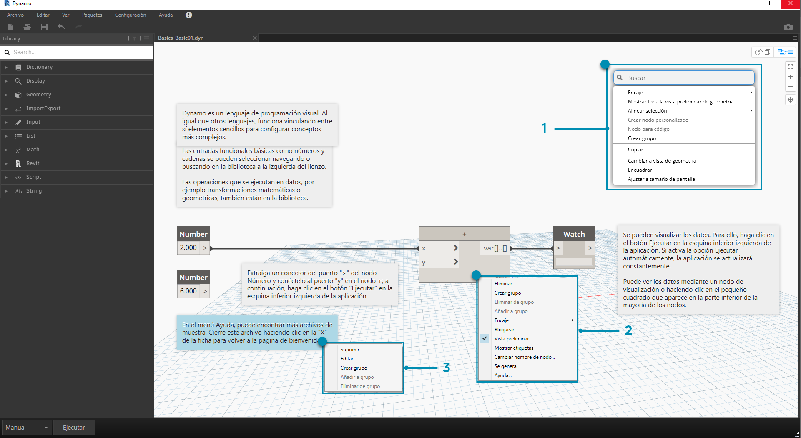
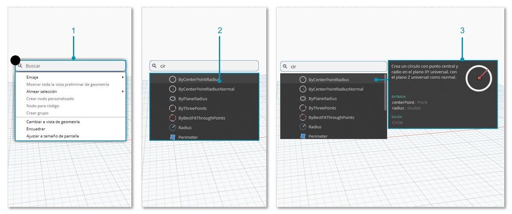

## El espacio de trabajo

El **espacio de trabajo** de Dynamo es donde se desarrollan los programas visuales, pero también es donde se obtiene una vista preliminar de la geometría resultante. Tanto si trabajamos en un espacio de trabajo de inicio como en un nodo personalizado, podemos desplazarnos con el ratón o con los botones ubicados en la parte superior derecha. Al alternar entre los modos de la parte inferior derecha, se cambia la vista preliminar por la que nos desplazamos.

> Nota: los nodos y la geometría presentan un orden de objetos, por lo que es posible que tenga objetos renderizados unos encima de otros. Esto puede resultar confuso al añadir varios nodos en una secuencia, ya que pueden renderizarse en la misma posición en el espacio de trabajo.

> 1. Fichas
2. Botones de zoom/encuadre
3. Modo de vista preliminar
4. Hacer doble clic en el espacio de trabajo.

### Fichas

La ficha activa del espacio de trabajo permite desplazarse por el programa y modificarlo. Al abrir un archivo nuevo, se abre por defecto un nuevo espacio de trabajo de **inicio**. También puede abrir un espacio de trabajo de **nodo personalizado** nuevo desde el menú Archivo o haciendo clic con el botón derecho en *Nuevo nodo por selección* cuando se seleccionen nodos (se proporcionará más información sobre esta función más adelante).

> Nota: solo puede tener un espacio de trabajo de inicio abierto cada vez. Sin embargo, puede tener abiertos varios espacios de trabajo de nodos personalizados en fichas adicionales.

### Comparación de los modos de navegación de vista preliminar 3D y de gráfico

En Dynamo, el gráfico y los resultados 3D del gráfico (si creamos geometría) se renderizan en el espacio de trabajo. Por defecto, el gráfico es la vista preliminar activa, por lo que, al utilizar los botones de navegación o el botón central del ratón para encuadrar y aplicar zoom, se desplazará a través del gráfico. Se puede alternar entre las vistas preliminares activas de tres formas:

> 1. Botones de activación y desactivación de vistas preliminares en el espacio de trabajo.
2. Hacer clic con el botón derecho en el espacio de trabajo y seleccionar *Cambiar a... Vista*.
3. Método abreviado de teclado (Ctrl + B).

El modo de navegación de vista preliminar 3D también nos permite la **manipulación directa** de puntos, como se muestra en [Para empezar](http://primer.dynamobim.org/02_Hello-Dynamo/2-6_the_quick_start_guide.html).

### Zoom para volver a centrar

Podemos encuadrar, aplicar zoom y girar alrededor de modelos fácilmente en el modo de navegación de vista preliminar 3D. Sin embargo, para ampliar de forma específica la vista de un objeto creado por un nodo de geometría, podemos utilizar el icono Aplicar zoom a todo con un único nodo seleccionado.

> 1. Seleccione el nodo correspondiente a la geometría que centrará la vista.
2. Cambie al modo de navegación de vista preliminar 3D.

> 1. Haga clic en el icono Aplicar zoom a todo situado en la parte superior derecha.
2. La geometría seleccionada se centrará dentro de la vista.

### Uso del ratón

En función del modo de vista preliminar activo, los botones del ratón funcionarán de forma diferente. En general, el botón izquierdo del ratón selecciona y especifica entradas, el botón derecho proporciona acceso a las opciones y el botón central permite desplazarse por el espacio de trabajo. Al hacer clic con el botón central, aparecerán opciones basadas en el contexto de la ubicación en la que hacemos clic.

> 1. Haga clic con el botón derecho en la espacio de trabajo.
2. Haga clic con el botón derecho en un nodo.
3. Haga clic con el botón derecho en una nota.

A continuación, se muestra una tabla de interacciones del ratón por vista preliminar:

|**Acción del ratón**|**Vista preliminar de gráfico**|**Vista preliminar 3D**|
| -- | -- | -- |
|Hacer clic con el botón izquierdo|Seleccionar|N/A|
|Hacer clic con el botón derecho|Menú contextual|Opciones de zoom|
|Hacer clic con el botón central|Encuadre|Encuadre|
|Desplazamiento|Ampliar/reducir vista|Ampliar/reducir vista|
|Hacer doble clic|Crear bloque de código|N/A|

### Búsqueda en el lienzo

Mediante la "búsqueda en el lienzo", puede aumentar considerablemente la velocidad del flujo de trabajo de Dynamo al proporcionar acceso a descripciones de nodos e información de herramientas sin alejarse de su ubicación en el gráfico. Al hacer clic con el botón derecho, puede acceder a todas las funciones útiles de la "búsqueda de biblioteca" desde cualquier ubicación del lienzo en la que esté trabajando.

> 1. Haga clic con el botón derecho en cualquier lugar del lienzo para que aparezca la función de búsqueda. Cuando la barra de búsqueda está vacía, el menú desplegable es un menú de vista preliminar.
2. A medida que escriba en la barra de búsqueda, el menú desplegable se actualizará continuamente para mostrar los resultados de búsqueda más pertinentes.
3. Coloque el cursor sobre los resultados de la búsqueda para obtener las descripciones y la información de herramientas correspondientes.

## Limpiar el diseño de nodos

La importancia de la organización del lienzo de Dynamo aumenta a medida que la compilación de archivos gana en complejidad. Aunque está disponible la herramienta **Alinear selección** para trabajar con pequeñas cantidades de nodos seleccionados, Dynamo también incluye la herramienta **Presentación de nodo de limpieza** para ayudar con la limpieza general de archivos.

#### Antes de la limpieza de nodos

> 1. Seleccione los nodos que se van a organizar automáticamente o deje todo sin seleccionar para limpiar todos los nodos del archivo.
2. La función Presentación de nodo de limpieza se encuentra en la ficha Editar.
#### Después de la limpieza de nodos

3. Los nodos se redistribuirán y se alinearán automáticamente, limpiando los nodos escalonados o solapados y alineándolos con los nodos adyacentes.

