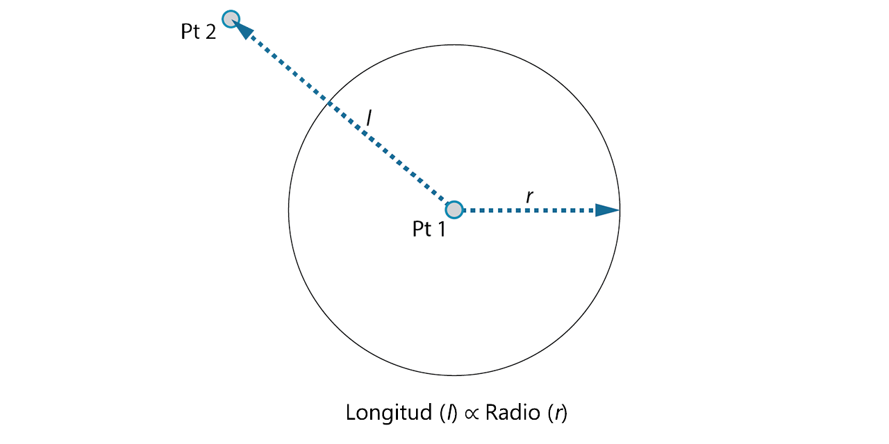

## PARA EMPEZAR

Ahora que nos hemos familiarizado con el diseño de la interfaz y la navegación por el espacio de trabajo, nuestro siguiente paso es conocer el flujo de trabajo típico para desarrollar un gráfico en Dynamo. Creemos primero un círculo de tamaño dinámico y, a continuación, creemos una matriz de círculos con radios variables.

### Definición de objetivos y relaciones

Antes de añadir cualquier elemento al espacio de trabajo de Dynamo, es fundamental conocer en detalle lo que intentamos conseguir y cuáles serán las relaciones más importantes. Recuerde que cada vez que conectamos dos nodos, estamos creando un vínculo explícito entre ellos; podemos cambiar el flujo de datos más tarde, pero, una vez conectados, debemos mantener esa relación. En este ejercicio, vamos a crear un círculo (*objetivo*) donde la entrada de radio se define mediante una distancia hasta un punto cercano (*relación*).



> Un punto que define una relación basada en la distancia se suele denominar "atractor". Aquí, la distancia a nuestro punto atractor se utilizará para especificar el tamaño del círculo.

### Adición de nodos al espacio de trabajo

Ahora que hemos dibujado un boceto de nuestros objetivos y relaciones, podemos empezar a crear el gráfico. Necesitamos los nodos que representarán la secuencia de acciones que ejecutará Dynamo. Como sabemos que estamos intentando crear un círculo, busquemos primero un nodo que realice esta acción. Mediante el campo Buscar o la exploración de la biblioteca, descubriremos que existen varias formas de crear un círculo.


> 1. Vaya a Geometría > Curvas > Círculo > **Circle.ByPointRadius**.
2. Buscar > ByCenterPointRadius...

Vamos a añadir el nodo **Circle.ByPointRadius** al espacio de trabajo haciendo clic en él en la biblioteca; esta acción debería añadir el nodo en el centro del espacio de trabajo.


> 1. El nodo Circle.ByPointandRadius de la biblioteca.
2. Al hacer clic en el nodo de la biblioteca, este se añade al espacio de trabajo.

También necesitaremos los nodos **Point.ByCoordinates**, **Number Input** y **Number Slider**.


> 1. Geometría > Puntos > Punto > **Point.ByCoordinates**
2. Geometría > Geometría > **DistanceTo**
3. Entrada > Básico > **Number**
4. Entrada > Básico > **Number Slider**

### Conexión de nodos con cables

Ahora que tenemos algunos nodos, debemos conectar los puertos de los nodos con cables. Estas conexiones definirán el flujo de datos.


> 1. De **Number** a **Point.ByCoordinates**
2. De **Number Sliders** a **Point.ByCoordinates**
3. De **Point.ByCoordinates** (2) a **DistanceTo**
4. De **Point.ByCoordinates** y **DistanceTo** a **Circle.ByCenterPointRadius**

### Ejecución del programa

Con el flujo de programa definido, solo tenemos que indicarle a Dynamo que lo ejecute. Una vez ejecutado el programa (automáticamente o al hacer clic en Ejecutar en modo manual), los datos pasarán por los cables y se mostrará la vista preliminar 3D.


> 1. (Haga clic en Ejecutar): si la barra de ejecución está en modo manual, debemos hacer clic en Ejecutar para ejecutar el gráfico.
2. Vista preliminar de nodos: al colocar el puntero sobre el cuadro situado en la esquina inferior derecha de un nodo, se mostrará un elemento emergente con los resultados.
3. Vista preliminar 3D: si alguno de los nodos crea geometría, esta aparecerá en la vista preliminar 3D.
4. La geometría de salida en el nodo de creación.

### Adición de detalles

Si el programa está en funcionamiento, debería aparecer un círculo en la vista preliminar 3D que atraviesa el punto atractor. Esto es genial, pero es posible que desee añadir más detalles o controles. Ajustemos la entrada al nodo del círculo para que podamos calibrar la influencia en el radio. Añada otro nodo **Number Slider** al espacio de trabajo y haga doble clic en un área en blanco del espacio de trabajo para añadir un nodo de **bloque de código**. Edite el campo en el bloque de código. Para ello, especifique ```X/Y```.


> 1. **Bloque de código**
2. De **DistanceTo** y **Number Slider** al **bloque de código**
3. Del **bloque de código** a **Circle.ByCenterPointRadius**

### Adición de complejidad

Un comienzo sencillo al que se le añada complejidad es una manera eficaz de desarrollar el programa de manera incremental. Una vez que esto funcione para un círculo, apliquemos la potencia del programa a varios círculos. En lugar de un punto central, si utilizamos una rejilla de puntos y acomodamos el cambio en la estructura de datos resultante, el programa creará muchos círculos, cada uno con un valor de radio exclusivo definido por la distancia calibrada al punto atractor.


> 1. Añada un nodo **Number Sequence** y sustituya las entradas de **Point.ByCoordinates**: haga clic con el botón derecho en Point.ByCoordinates y seleccione Encaje > Referencia cruzada.
2. Añada un nodo **Flatten** después de Point.ByCoordinates. Para aplanar una lista por completo, mantenga la entrada ```amt``` en el valor por defecto ```-1```.
3. La vista preliminar 3D se actualizará con una rejilla de círculos.

### Ajuste con manipulación directa

En ocasiones, la manipulación numérica no es el enfoque adecuado. Ahora puede empujar y estirar manualmente la geometría de punto al desplazarse por la vista preliminar 3D en segundo plano. También podemos controlar otra geometría construida por un punto. Por ejemplo, **Sphere.ByCenterPointRadius** también es capaz de realizar la manipulación directa. Podemos controlar la ubicación de un punto a partir de una serie de valores X, Y y Z con **Point.ByCoordinates**. Sin embargo, con el enfoque de manipulación directa, puede actualizar los valores de los controles deslizantes moviendo manualmente el punto en el modo de **navegación de vista preliminar 3D**. Esto ofrece un enfoque más intuitivo para controlar un conjunto de valores específicos que identifican la ubicación de un punto.


> 1. Para utilizar la **manipulación directa**, seleccione el panel del punto que se va a mover; aparecerán flechas sobre el punto seleccionado.
2. Cambie al modo de **navegación de vista preliminar 3D**.


> 1. Coloque el cursor sobre el punto; aparecerán los ejes X, Y y Z.
2. Haga clic y arrastre la flecha coloreada para mover el eje correspondiente; los valores de **Number Slider** se actualizarán al instante con el punto desplazado manualmente.


> 1. Tenga en cuenta que, antes de la **manipulación directa**, solo se conectó un control deslizante al componente **Point.ByCoordinates**. Al desplazar manualmente el punto en la dirección X, Dynamo generará automáticamente un nuevo componente **Number Slider** para la entrada X.

