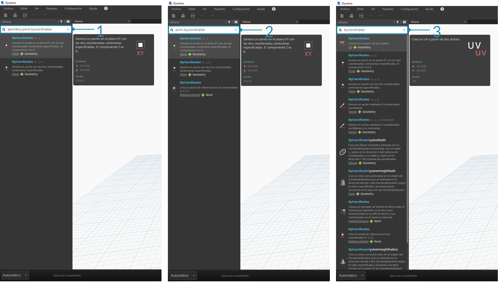

## Biblioteca de Dynamo

La **biblioteca de Dynamo** contiene los nodos que se añaden al espacio de trabajo para definir programas visuales para su ejecución. En la biblioteca, se pueden buscar nodos o desplazarse a ellos. Los nodos que se incluyen aquí, los nodos básicos instalados, los nodos personalizados que se definen y los nodos de Package Manager que se añaden a Dynamo, se organizan jerárquicamente por categoría. Revisemos esta organización y exploremos los nodos clave que utilizaremos con frecuencia.

### Biblioteca de bibliotecas

La **biblioteca** de Dynamo con la que interactuamos en la aplicación es en realidad un conjunto de bibliotecas funcionales, cada una de las cuales contiene nodos agrupados por categoría. Aunque esto puede parecer poco acertado al principio, es un marco flexible para organizar los nodos que se incluyen con la instalación por defecto de Dynamo y mejorará cuando empezamos a ampliar esta funcionalidad base con nodos personalizados y paquetes adicionales.

#### El esquema de organización

La sección **Biblioteca** de la interfaz de usuario de Dynamo se compone de bibliotecas organizadas jerárquicamente. A medida que profundizamos en la biblioteca, estamos examinando secuencialmente una biblioteca, las categorías de la biblioteca y las subcategorías de la categoría para encontrar el nodo.


> 1. La sección Biblioteca: la región de la interfaz de Dynamo.
2. Una biblioteca: una colección de categorías relacionadas como, por ejemplo, **Geometría**.
3. Una categoría: una colección de nodos relacionados como, por ejemplo, todos los relacionados con **círculos**.
4. Subcategoría: desglose de los nodos de la categoría, normalmente, por **Crear**, **Acción** o **Consultar**.
5. Un nodo: los objetos que se añaden al espacio de trabajo para realizar una acción.

#### Convenciones de nomenclatura

La jerarquía de cada biblioteca aparece reflejada en el nombre de los nodos añadidos al espacio de trabajo, que también podemos utilizar en el campo de búsqueda o con los bloques de código (que utilizan el *lenguaje de textura de Dynamo*). Además de utilizar palabras clave para intentar encontrar nodos, podemos escribir la jerarquía separada por un punto.

Al escribir distintas partes de la ubicación del nodo en la jerarquía de biblioteca con el formato ```biblioteca.categoría.nombreNodo```, se obtienen resultados diferentes:



> 1. ```biblioteca.categoría.nombreNodo```
2. ```categoría.nombreNodo```
3. ```nombreNodo``` o ```palabra clave```

Por lo general, el nombre del nodo en el espacio de trabajo se renderizará con el formato ```categoría.nombreNodo```, con algunas excepciones destacadas, sobre todo, en las categorías de entrada y vista. Tenga en cuenta la diferencia de categoría en nodos con nombres similares:


> 1. Los nodos de la mayoría de las bibliotecas incluirán el formato de categoría.
2. ```Point.ByCoordinates``` y ```UV.ByCoordinates``` tienen el mismo nombre, pero proceden de diferentes categorías.
3. Entre las excepciones destacables, se incluyen las funciones integradas, Core.Input, Core.View y los operadores.

### Nodos utilizados frecuentemente

Con cientos de nodos incluidos en la instalación básica de Dynamo, ¿cuáles son fundamentales para desarrollar nuestros programas visuales? Veamos los parámetros de nuestro programa (**entrada**), consultemos los resultados de la acción de un nodo (**visualización**) y definamos entradas o funciones mediante un acceso directo (**bloque de código**).

#### Entrada

Los nodos de entrada son el principal medio para que el usuario de nuestro programa visual (ya sea usted mismo u otro usuario) interactúe con los parámetros clave. A continuación, se indican los nodos disponibles en la categoría de entrada de la biblioteca principal:


> 1. Booleano
2. Número
3. Cadena
4. Control deslizante de número
5. Control deslizante de entero
6. Ruta de directorio
7. Ruta de archivo

#### Visualización

Los nodos de visualización, Watch, son esenciales para administrar los datos que se ejecutan a través del programa visual. Aunque puede ver el resultado de un nodo a través de la vista preliminar de datos del nodo, es posible que desee que se mantenga su visualización en un nodo **Watch** o que desee ver los resultados de la geometría a través de un nodo **Watch3D**. Ambos se encuentran en la categoría de vista de la biblioteca principal.

> Sugerencia: en ocasiones, la vista preliminar 3D puede ser molesta cuando el programa visual contiene muchos nodos. Considere la posibilidad de desactivar la opción Mostrando vista preliminar 3D en segundo plano en el menú Configuración y utilizar un nodo Watch3D para obtener una vista preliminar de la geometría.


> 1. Watch: tenga en cuenta que cuando se selecciona un elemento en el nodo Watch, este se etiquetará en las vistas preliminares 3D y Watch3D.
2. Watch3D: arrastre el pinzamiento inferior derecho para cambiar el tamaño y desplácese con el ratón de la misma forma que lo haría en la vista preliminar 3D.

#### Bloque de código

Los nodos de bloque de código, **Code Block**, se pueden utilizar para definir un bloque de código con líneas separadas por signos de punto y coma. Esto puede ser tan sencillo como ```X/Y```. También podemos utilizar bloques de código como un acceso directo para definir una entrada de número o una llamada a la función de otro nodo. La sintaxis necesaria para ello sigue la convención de nomenclatura del lenguaje textual de Dynamo, DesignScript y se describe en la sección 7.2. Vamos a crear un círculo con este acceso directo:


> 1. Haga doble clic para crear un nodo de **bloque de código**.
2. Escriba ```Circle.ByCenterPointRadius(x,y);```.
3. Si hace clic en el espacio de trabajo para borrar la selección, se deben añadir las entradas ```x``` e ```y``` automáticamente
4. Cree un nodo **Point.ByCoordinates** y un componente **Number Slider**; a continuación, conecte las entradas al bloque de código.
5. La ejecución del programa visual debe dar como resultado un círculo en la vista preliminar 3D.

