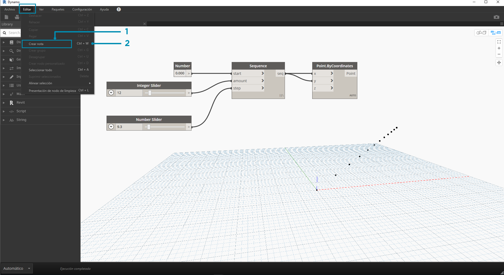

## Administración del programa

Trabajar en un proceso de programación visual puede ser una potente actividad creativa, pero en muy poco tiempo el flujo de programa y las entradas clave de usuario pueden verse eclipsados por la complejidad o la presentación del espacio de trabajo. Veamos algunos procedimientos recomendados para administrar el programa.

### Alineación

Una vez que hemos añadido varios nodos al espacio de trabajo, es posible que deseemos reorganizar el diseño de los nodos para obtener mayor claridad. Al seleccionar más de un nodo y hacer clic con el botón derecho en el espacio de trabajo, la ventana emergente incluye un menú **Alinear selección** con opciones de justificación y distribución en X e Y.

> 1. Seleccione varios nodos.
2. Haga clic con el botón derecho en el espacio de trabajo.
3. Utilice las opciones de **Alinear selección**.

### Notas

Con cierta experiencia, es posible que podamos "leer" el programa visual revisando los nombres de nodo y siguiendo el flujo de programa. Para los usuarios de todos los niveles de experiencia, es recomendable también incluir etiquetas y descripciones en lenguaje sencillo. Para ello, Dynamo presenta un nodo **Notes** con un campo de texto editable. Podemos añadir notas al espacio de trabajo de dos formas:

> 1. Vaya al menú Editar > Crear nota.
2. Utilice el método abreviado de teclado Ctrl + W.

Una vez que se ha añadido la nota al espacio de trabajo, aparece un campo de texto que nos permite editar el texto de la nota. Una vez creada, se puede editar la nota. Para ello, haga doble clic o haga clic con el botón derecho en el nodo Note.

### Agrupación

Cuando aumente el tamaño del programa visual, resultará útil identificar los pasos más grandes que se ejecutarán. Podemos resaltar conjuntos más grandes de nodos con un **grupo** para etiquetarlos con un rectángulo de color en el fondo y un título. Hay tres formas de crear un grupo con más de un nodo seleccionado:

> 1. Vaya al menú Editar > Crear grupo.
2. Utilice el acceso directo de teclado Ctrl + G.
3. Haga clic con el botón derecho en el espacio de trabajo y seleccione Crear grupo.

Una vez creado un grupo, se pueden editar sus parámetros, como el título y el color. 

> Sugerencia: el uso de las notas y los grupos es una forma eficaz de anotar el archivo y aumentar la legibilidad.

Este es nuestro programa de la sección 2.4 con notas y grupos añadidos:

> 1. Nota: "Grid Parameters" (Parámetros de rejilla)
2. Nota: "Grid Points" (Puntos de rejilla)
3. Grupo: "Create a Grid of Points" (Crear una rejilla de puntos)
4. Grupo: "Create an Attractor Point" (Crear un punto de atractor)
5. Nota: "Calibrate Distance Values" (Calibrar valores de distancia)
6. Nota: "Variable Grid of Circles" (Rejilla variable de círculos)

