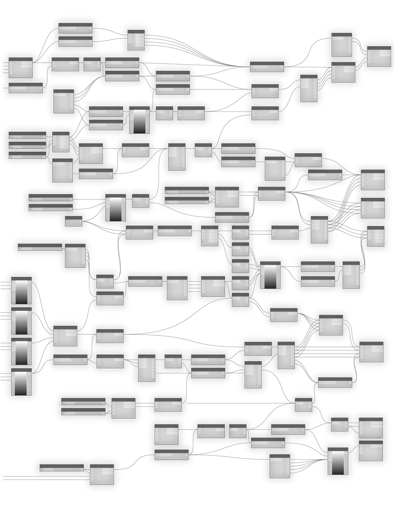

# ANATOMÍA DE UN PROGRAMA VISUAL

Dynamo permite crear programas visuales en un espacio de trabajo mediante la conexión de nodos con cables para especificar el flujo lógico del programa visual resultante. En este capítulo, se presentan los elementos de los programas visuales, la organización de los nodos disponibles en las bibliotecas de Dynamo, las piezas y los estados de los nodos, y los procedimientos recomendados para los espacios de trabajo.

