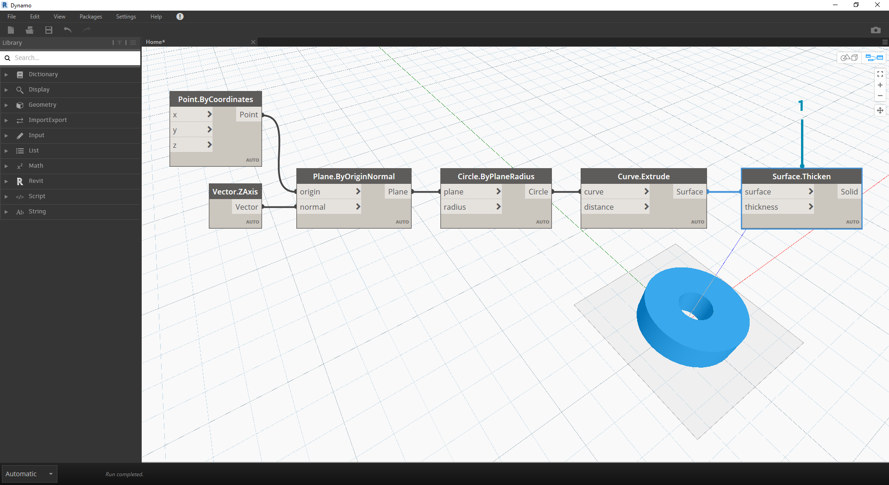
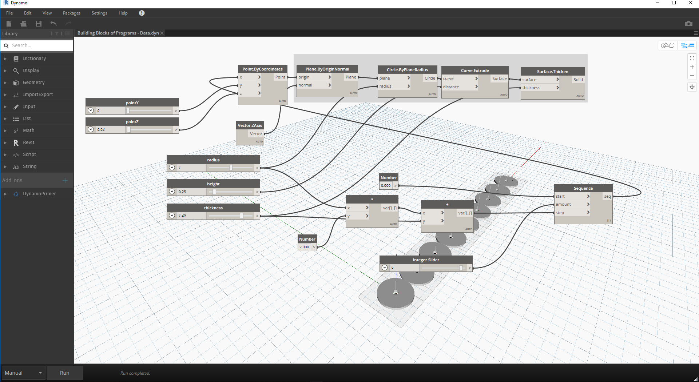

## Datos

Los datos son el contenido de nuestros programas. Viajan a través de cables proporcionando entradas a los nodos, donde se procesan y se transforman en una nueva forma de datos de salida. Revisemos la definición de los datos, cómo se estructuran y cómo utilizarlos en Dynamo.

### ¿Qué son los datos?

Los datos son un conjunto de valores de variables cualitativas o cuantitativas. La forma de datos más sencilla son números como ```0```, ```3,14``` o ```17```. Sin embargo, los datos también pueden ser de diferentes tipos: una variable que representa números cambiantes (```altura```); caracteres (```miNombre```); geometría (```Círculo```); o una lista de elementos de datos (```1,2,3,5,8,13, etc.```). Necesitamos datos que poder añadir a los puertos de entrada de los nodos de Dynamo; podemos tener datos sin acciones, pero necesitamos datos para procesar las acciones que representan nuestros nodos. Cuando se añade un nodo al espacio de trabajo, si no se le proporciona ninguna entrada, el resultado será una función y no el resultado de la acción en sí.


> 1. Datos simples.
2. Datos y una acción (un nodo); se ejecuta correctamente.
3. Una acción (un nodo) sin entradas de datos; devuelve una función genérica.

### Cuidado con el tipo "null" (nulo)

El tipo ```"null"``` representa la ausencia de datos. Aunque se trata de un concepto abstracto, es probable que esto ocurra mientras trabaja con programación visual. Si una acción no crea un resultado válido, el nodo devolverá un valor "null". Comprobar si existen valores "null" y eliminarlos de la estructura de datos es una parte crucial para crear programas sólidos.

|Icono|Nombre/sintaxis|Entradas|Salidas|
| -- | -- | -- | -- |
||Object.IsNull|obj|bool|

### Estructuras de datos

Cuando somos programadores visuales, podemos generar una gran cantidad de datos rápidamente y requerir un medio de administración de su jerarquía. Esta es la función de las estructuras de datos, los esquemas organizativos en los que almacenamos los datos. Las características específicas de las estructuras de datos y su uso varían de un lenguaje de programación a otro. En Dynamo, se añade jerarquía a los datos a través de las listas. Exploraremos esto en profundidad en capítulos posteriores, pero empecemos con algo sencillo.

Una lista representa una colección de elementos colocados en una estructura de datos:

* Tengo cinco dedos (*elementos*) en la mano (*lista*).
* Hay diez casas (*elementos*) en mi calle (*lista*).


> 1. Un nodo **Number Sequence** define una lista de números utilizando entradas *start*, *amount* y *step*. Con estos nodos, hemos creado dos listas independientes de diez números, una que abarca de *100 a 109* y otra de *0 a 9*.
2. El nodo **List.GetItemAtIndex** selecciona un elemento de una lista en un índice determinado. Al seleccionar *0*, se obtiene el primer elemento de la lista (*100* en este caso).
3. Al aplicar el mismo proceso a la segunda lista, obtenemos un valor de *0*, el primer elemento de la lista.
4. Ahora combinamos las dos listas en una mediante el nodo **List.Create**. Observe que el nodo crea una *lista de listas.* Esto cambia la estructura de los datos.
5. Al volver a utilizar **List.GetItemAtIndex**, con el índice establecido en *0*, se obtiene la primera lista de la lista de listas. Esto es lo que significa tratar una lista como un elemento, lo cual es ligeramente diferente de otros lenguajes de secuencias de comandos. En capítulos posteriores, nos adentraremos más en la manipulación de listas y la estructura de datos.

El concepto clave para comprender la jerarquía de datos en Dynamo es que **en relación con la estructura de datos, las listas se consideran elementos.** En otras palabras, Dynamo funciona con un proceso descendente para comprender las estructuras de datos. ¿Qué quiere decir esto? Veámoslo con un ejemplo.

### Uso de datos para crear una cadena de cilindros

> Descargue el archivo de ejemplo que acompaña a este ejercicio (haga clic con el botón derecho y seleccione "Guardar enlace como..."): [Building Blocks of Programs - Data.dyn](datasets/4-1/Building Blocks of Programs - Data.dyn). En el Apéndice se incluye una lista completa de los archivos de ejemplo.

En este primer ejemplo, vamos a ensamblar un cilindro vaciado que recorre la jerarquía de geometría tratada en esta sección. 

> 1. **Point.ByCoordinates:** después de añadir el nodo al lienzo, se muestra un punto en el origen de la rejilla de vista preliminar de Dynamo. Los valores por defecto de las entradas *x, y* y *z* son *0,0*, lo que nos da un punto en esta ubicación.


> 1. **Plane.ByOriginNormal:** el siguiente paso en la jerarquía de geometría es un plano. Existen varias formas de construir un plano; utilizaremos un origen y una normal para la entrada. El origen es el nodo de punto creado en el paso anterior.
2. **Vector.ZAxis**: es un vector unificado en la dirección Z. Observe que no hay entradas, solo un vector con un valor [0,0,1]. Se utiliza como la entrada *normal* para el nodo *Plane.ByOriginNormal*. Esto nos proporciona un plano rectangular en la vista preliminar de Dynamo.


> 1. **Circle.ByPlaneRadius**: ascendiendo en la jerarquía, ahora creamos una curva a partir del plano del paso anterior. Después de conectar el nodo, se obtiene un círculo en el origen. El radio predeterminado del nodo es el valor de *1*.


> 1. **Curve.Extrude**: ahora vamos a hacer que este elemento crezca dándole profundidad y añadiendo la tercera dimensión. Este nodo crea una superficie a partir de una curva extrudiéndola. La distancia por defecto en el nodo es *1*, y debería aparecer un cilindro en la ventana gráfica.



> 1. **Surface.Thicken**: este nodo nos proporciona un sólido cerrado desfasando la superficie una distancia dada y cerrando la forma. El valor de grosor por defecto es *1*, y vemos un cilindro vaciado en la ventana gráfica en línea con estos valores.


> 1. **Number Slider**: en lugar de utilizar los valores por defecto para todas estas entradas, vamos a añadir algún control paramétrico al modelo.
2. **Edición del dominio: **después de añadir el control deslizante de número al lienzo, haga clic en el signo de intercalación situado en la parte superior izquierda para ver las opciones de dominio.
3. **Min/Max/Step**: cambie los valores *min*, *max* y *step* a *0*, *2* y *0,01* respectivamente. Esto lo hacemos para controlar el tamaño de la geometría global.


> 1. Nodos **Number Slider:** en todas las entradas por defecto, copiemos y peguemos este control deslizante de número (seleccione el control deslizante, pulse Ctrl+C y, a continuación, Ctrl+V) varias veces hasta que todas las entradas con valores por defecto tengan un control deslizante. Algunos de los valores del control deslizante tendrán que ser mayores que cero para que la definición funcione (es decir, para que una superficie se engrose, se necesita una profundidad de extrusión).

Hemos creado un cilindro paramétrico vaciado con estos controles deslizantes. Pruebe a modificar algunos de estos parámetros y ver cómo la geometría se actualiza de forma dinámica en la ventana gráfica de Dynamo.


> 1. Nodos **Number Slider**: al avanzar en este ejemplo, hemos añadido muchos controles deslizantes al lienzo y debemos limpiar la interfaz de la herramienta que acabamos de crear. Haga clic con el botón derecho en un control deslizante, seleccione "Cambiar nombre..." y cambie cada control deslizante al nombre apropiado para su parámetro. Puede tomar como referencia la imagen anterior para definir los nombres.

En este punto, hemos creado un fantástico elemento de cilindro engrosado. Se trata de un objeto actualmente; veamos cómo crear una matriz de cilindros que permanezca enlazada de forma dinámica. Para ello, vamos a crear una lista de cilindros, en lugar de trabajar con un único elemento.


> 1. **Adición (+):** nuestro objetivo es añadir una fila de cilindros junto al cilindro que hemos creado. Si se desea añadir un cilindro adyacente al actual, se deben tener en cuenta el radio del cilindro y el grosor del vaciado. Para obtener este número, se añaden los dos valores de los controles deslizantes.


> Este paso es más complejo, por lo que pasaremos por él más lentamente. El objetivo final es crear una lista de números que defina las ubicaciones de cada cilindro en una fila.

> 1. **Multiplicación:** en primer lugar, deseamos multiplicar el valor del paso anterior por 2. El valor del paso anterior representa un radio y queremos mover el cilindro por el diámetro completo.
2. **Number Sequence:** creamos una matriz de números con este nodo. La primera entrada es el nodo de *multiplicación* del paso anterior en el valor *step*. El valor *start* se puede establecer en *0,0* mediante un nodo de *Number*.
3. **Control deslizante de enteros: **para el valor *amount*, conectamos un control deslizante de enteros. Esto definirá cuántos cilindros se crean.
4. **Salida**: esta lista muestra la distancia desplazada para cada cilindro de la matriz y la controlan paramétricamente los controles deslizantes originales.


> 1. Este paso es bastante sencillo: conecte la secuencia definida en el paso anterior a la entrada *x* de *Point.ByCoordinates* original. De este modo, se sustituye el control deslizante *pointX*, que se puede eliminar. Ahora vemos una matriz de cilindros en la ventana gráfica (asegúrese de que el control deslizante de enteros es mayor que 0).



> La cadena de cilindros sigue enlazada dinámicamente a todos los controles deslizantes. Mueva cada uno de los controles deslizantes para ver cómo se actualiza la definición.

