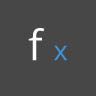

## Lógica

La **lógica** o, más específicamente, la **lógica condicional** nos permite especificar una acción o un conjunto de acciones basadas en una prueba. Tras evaluar la prueba, dispondremos de un valor booleano que representa ```Verdadero``` o ```Falso```, que podemos utilizar para controlar el flujo del programa.

### Booleanos

Las variables numéricas pueden almacenar una gran variedad de números diferentes. Las variables booleanas solo pueden almacenar dos valores denominados Verdadero o Falso, Sí o No, 1 o 0. Rara vez utilizamos booleanos para realizar cálculos debido a su rango limitado.

### Instrucciones condicionales

La instrucción "If" ("si") es un concepto clave en la programación: "Si *esto* es cierto, *eso* ocurre; de lo contrario, *otra cosa* ocurre. La acción resultante de la instrucción se rige por un valor booleano. Hay varias formas de definir una instrucción "If" en Dynamo:

|Icono|Nombre|Sintaxis|Entradas|Salidas|
| -- | -- | -- | -- | -- |
||If|If|test, true, false|resultado|
||Fórmula|IF(x,y,z)|x, y, z|resultado|
||Bloque de código|(x?y:z)|x, y, z|resultado|

Veamos un breve ejemplo de cada uno de estos tres nodos en acción utilizando la instrucción condicional "If":


> En esta imagen, el no *Boolean* se ha establecido en *Verdadero (True)*, lo que significa que el resultado es una cadena que dice: *"este es el resultado si es verdadero".* Los tres nodos que crean la instrucción *If* funcionan de la misma forma aquí.


> De nuevo, los nodos funcionan de la misma forma. Si el nodo *Boolean* se cambia a *Falso (False)*, el resultado es el número *Pi*, tal y como se define en la instrucción *If* original.

### Filtrado de una lista

> Descargue el archivo de ejemplo que acompaña a este ejercicio (haga clic con el botón derecho y seleccione "Guardar enlace como..."): [Building Blocks of Programs - Logic.dyn](datasets/4-3/Building Blocks of Programs - Logic.dyn). En el Apéndice se incluye una lista completa de los archivos de ejemplo.

Usemos la lógica para separar una lista de números en una lista de números pares y una lista de números impares.


> 1. **Number Range:** añada un rango de números al lienzo.
2. Nodos **Number:** añada tres nodos numéricos al lienzo. El valor de cada nodo numérico debe ser: *0,0* para *start*, *10,0* para *end* y *1,0* para *step*.
3. **Salida**: nuestra salida es una lista de 11 números que van del 0 al 10.
4. **Módulo (%): ** *Number Range* se conecta a *x* y *2,0* a *y*. De este modo, se calcula el resto de cada número de la lista dividido por 2. La salida de esta lista nos proporciona una lista de valores alternantes entre 0 y 1.
5. **Prueba de igualdad (==):** añada una prueba de igualdad al lienzo. Conecte la salida de *módulo* a la entrada *x* y *0,0* en la entrada *y*.
6. **Watch:** la salida de la prueba de igualdad es una lista de valores que alterna entre verdadero y falso. Estos son los valores utilizados para separar los elementos de la lista. *0* (o *true*) representa números pares y *1* (o *false*) representa números impares.
7. **List.FilterByBoolMask:** este nodo filtrará los valores en dos listas diferentes en función del valor booleano de entrada. Conecte el nodo *Number Range* original a la entrada *list* y la salida de la *prueba de igualdad* en la entrada *mask*. La salida *in* representa los valores verdaderos, mientras que la salida *out* representa los valores falsos.
8. **Watch: **como resultado, ahora tenemos una lista de números pares y una lista de números impares. Hemos utilizado operadores lógicos para separar las listas en patrones.

### De lógica a geometría

Basándonos en la lógica establecida en el primer ejercicio, vamos a aplicar esta configuración en una operación de modelado.

 Comenzaremos por donde dejamos el ejercicio anterior, con los mismos nodos. Las únicas excepciones (además de cambiar el formato son):

> 1. Los valores de entrada han cambiado.
2. Se ha desconectado la entrada list en *List.FilterByBoolMask*. Dejaremos estos nodos a un lado por ahora, pero en fases posteriores del ejercicio serán muy útiles.


> Comencemos por conectar los nodos tal como se muestra en la imagen anterior. Este grupo de nodos representa una ecuación paramétrica para definir una curva de línea. Información que debemos tener en cuenta:

> 1. El **primer control deslizante** debe tener un mínimo de 1, un máximo de 4 y un paso de 0,01.
2. El **segundo control deslizante** debe tener un mínimo de 0, un máximo de 1 y un paso de 0,01.
3. **PolyCurve.ByPoints:** si se copia el diagrama de nodos anterior, el resultado es una curva de seno en la ventana de vista preliminar de Dynamo.

El método que se sigue para las entradas es utilizar nodos numéricos para las propiedades más estáticas y controles deslizantes de número para las más flexibles. Vamos a mantener el rango de números original que definimos al principio de este paso. Sin embargo, la curva de seno que se crea aquí debe tener cierta flexibilidad. Se pueden mover estos controles deslizantes para ver cómo se actualiza la frecuencia y la amplitud de la curva.


> Vamos a saltar un poco en la definición, así que veamos el resultado final para que podamos tener como referencia lo que vamos a conseguir. Los dos primeros pasos se realizan por separado; ahora queremos conectar los dos. Utilizaremos la curva de seno base para controlar la ubicación de los componentes de cremallera y utilizaremos la lógica de verdadero/falso para alternar entre cuadros pequeños y cuadros más grandes.


> 1. **Math.RemapRange: **con la secuencia de números creada en el paso 01, vamos a crear una nueva serie de números reasignando el rango. Los números originales del paso 01 van del 0 al 100. Estos números oscilan entre 0 y 1 en las entradas *newMin* y *newMax* respectivamente.


> 1. **Curve.PointAtParameter: ** conecte *Polycurve.ByPoints* (del paso 2) a *curve* y *Math.RemapRange* a *param*. Este paso crea puntos a lo largo de la curva. Hemos reasignado los números a entre 0 y 1 porque la entrada de *param* busca valores en este rango. Un valor de *0* representa el punto inicial; un valor de *1* representa los puntos finales. Todos los números que se encuentran en medio se evalúan dentro del rango de *[0,1]*.


> 1. **List.FilterByBoolMask - ** conecte el nodo *Curve.PointAtParameter* del paso anterior a la entrada *list*.
2. **Watch**: un nodo de visualización para *in* y otro para *out* indican que hay dos listas que representan índices pares e impares. Estos puntos se ordenan de la misma forma en la curva, que se muestra en el siguiente paso.


> 1. **Cuboid.ByLengths:** reproduzca las conexiones representadas en la imagen anterior para obtener una cremallera a lo largo de la curva de seno. Un cubo es solo un cuadro, y estamos definiendo su tamaño basándonos en el punto de curva del centro del cuadro. La lógica de la división par/impar debería ser clara ahora en el modelo.


> 1. **Number Slider**: retrocediendo al principio de la definición, podemos mover el control deslizante de número y ver cómo se actualiza la cremallera. La fila superior de imágenes representa un rango de valores para el control deslizante de número superior. Es la frecuencia de la onda.
2. **Number Slider**: la fila inferior de imágenes representa un rango de valores para el control deslizante inferior. Es la amplitud de la onda.

