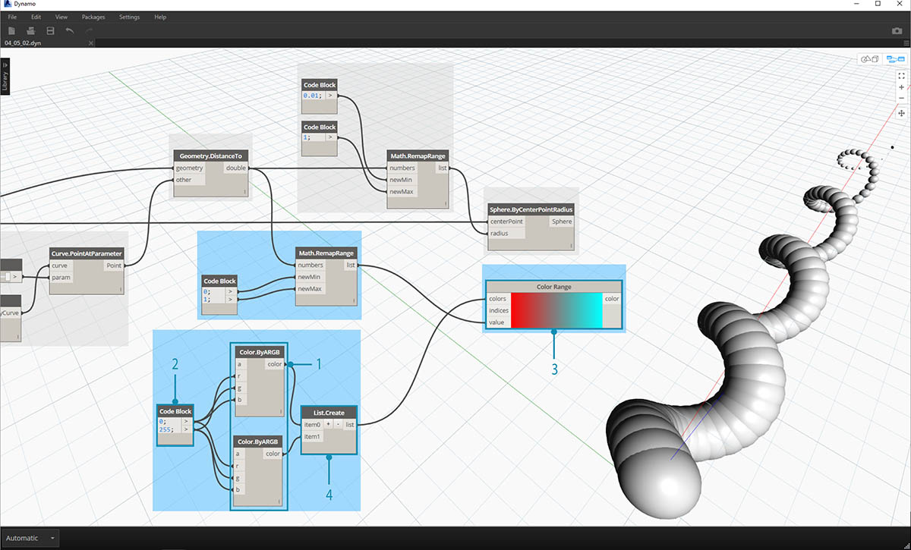
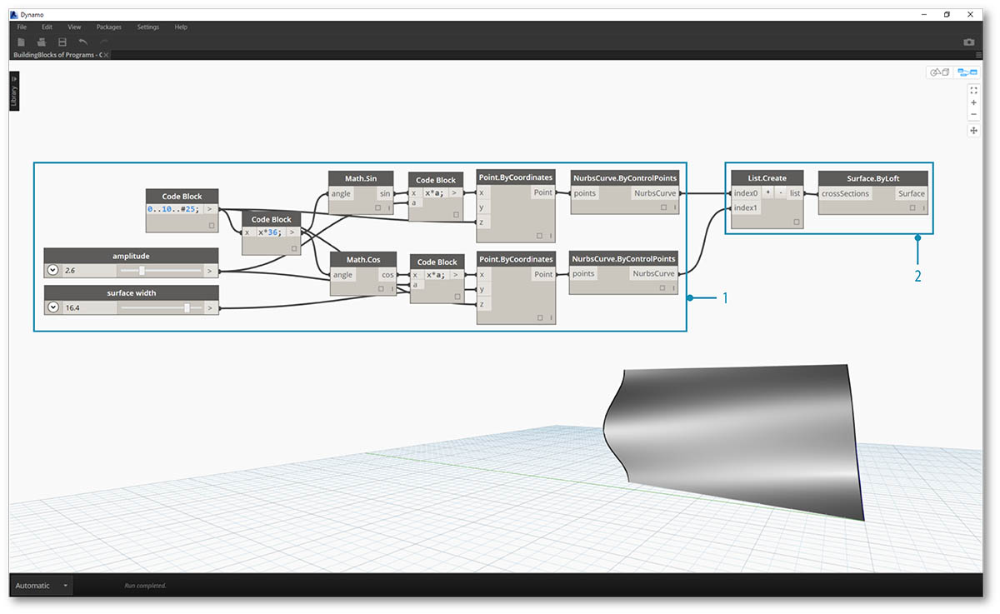
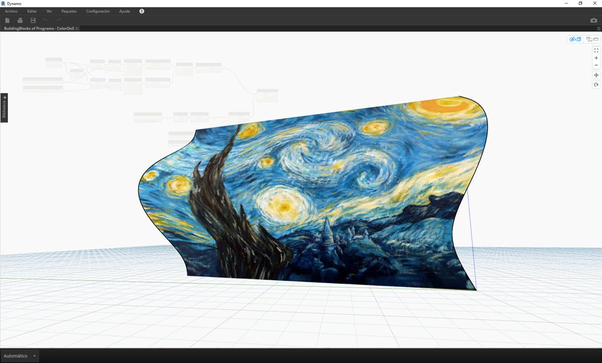

## Color

El color es un excelente tipo de datos para crear imágenes convincentes, así como para renderizar la diferencia en la salida del programa visual. Cuando se trabaja con datos abstractos y números variables, a veces es difícil ver qué se está cambiando y en qué grado. Esta es una aplicación excelente para los colores.

### Creación de colores

Los colores de Dynamo se crean con entradas de ARGB. Estas corresponden a los canales alfa, rojo, verde y azul. El canal alfa representa la *transparencia* del color, mientras que los otros tres se utilizan como colores principales para generar todo el espectro de color sincronizado.

|Icono|Nombre|Sintaxis|Entradas|Salidas|
| -- | -- | -- | -- | -- |
||Color ARGB|Color.ByARGB|A,R,G,B|color|

### Consulta de los valores de color

Los colores de la tabla siguiente consultan las propiedades utilizadas para definir el color: alfa, rojo, verde y azul. Observe que el nodo Color.Components nos proporciona las cuatro salidas diferentes, lo que hace que este nodo sea preferible para consultar las propiedades de un color.

|Icono|Nombre|Sintaxis|Entradas|Salidas|
| -- | -- | -- | -- | -- |
||Alfa|Color.Alpha|color|A|
||Rojo|Color.Red|color|R|
||Verde|Color.Green|color|G|
||Azul|Color.Blue|color|B|
||Componentes|Color.Components|color|A,R,G,B|

Los colores de la tabla siguiente corresponden al **espacio de color HSB**. La división del color en el matiz, la saturación y el brillo es, probablemente, más intuitiva en la forma en que se interpreta el color: ¿Qué color debería ser? ¿Debería ser más o menos colorido? ¿Y debería ser más o menos claro u oscuro? Este es el desglose del matiz, la saturación y el brillo respectivamente.

|Icono|Nombre de consulta|Sintaxis|Entradas|Salidas|
| -- | -- | -- | -- | -- |
||Matiz|Color.Hue|color|Matiz|
||Saturación|Color.Saturation|color|Saturación|
||Brillo|Color.Brightness|color|Brillo|

### Rango de colores

El rango de colores es similar al nodo **Remap Range** de la sección 4.2: reasigna una lista de números a otro dominio. Sin embargo, en lugar de asignarla a un dominio de *número*, la asigna a un *degradado de color* basado en números de entrada que van del 0 al 1.

El nodo actual funciona bien, pero puede resultar un poco incómodo para que todo funcione la primera vez. La mejor forma de familiarizarse con el degradado de color es probarlo de forma interactiva. Hagamos un ejercicio rápido para revisar cómo configurar un degradado con colores de salida que corresponden a números.

> 1. **Definir tres colores: **a través de un nodo Code Block, defina *rojo, verde* y *azul* mediante la conexión de las combinaciones adecuadas de *0* y *255*.
2. **Crear lista:**fusione los tres colores en una lista.
3. **Definir índices: **cree una lista para definir las posiciones de pinzamiento de cada color (de 0 a 1). Observe el valor de 0,75 para el verde. De este modo, se coloca el color verde a tres cuartos de camino en el degradado horizontal del control deslizante de rango de colores.
4. **Code Block: **valores de entrada (entre 0 y 1) para convertir en colores.

### Vista previa de color

El nodo **Display.ByGeometry** nos permite colorear la geometría en la ventana gráfica de Dynamo. Esto resulta útil para separar diferentes tipos de geometría, demostrar un concepto paramétrico o definir una leyenda de análisis para la simulación. Las entradas son sencillas: geometría y color. Para crear un degradado como el de la imagen anterior, la entrada de color se conecta al nodo **Color Range**.

### Ejercicio de color

> Descargue el archivo de ejemplo que acompaña a este ejercicio (haga clic con el botón derecho y seleccione "Guardar enlace como..."): [Building Blocks of Programs - Color.dyn](datasets/4-5/Building Blocks of Programs - Color.dyn). En el Apéndice se incluye una lista completa de los archivos de ejemplo.

Este ejercicio se centra en el control paramétrico del color en paralelo a la geometría. La geometría es una hélice básica que se define a continuación mediante el **bloque de código** (3.2.3). Esta es una forma rápida y sencilla de crear una función paramétrica y, como nuestro enfoque está en el color (en lugar de en la geometría), utilizamos el bloque de código para crear la hélice de forma eficaz sin sobrecargar el lienzo. Utilizaremos el bloque de código con más frecuencia a medida que el manual de introducción se adentre en materiales más avanzados.

> 1. **Code Block:** defina los dos bloques de código con las fórmulas mostradas anteriormente. Este es un método paramétrico rápido para crear una espiral.
2. **Point.ByCoordinates:**conecte las tres salidas del bloque de código a las coordenadas del nodo.

Ahora se muestra una matriz de puntos que crean una hélice. El siguiente paso consiste en crear una curva que atraviese los puntos para que podamos visualizar la hélice.

> 1. **PolyCurve.ByPoints:** conecte la salida *Point.ByCoordinates* en la entrada *points* del nodo. Se obtiene una curva helicoidal.
2. **Curve.PointAtParameter:** conecte la salida de *PolyCurve.ByPoints* a la entrada *curve*. La finalidad de este paso es crear un punto atractor paramétrico que se deslice a lo largo de la curva. Dado que la curva está evaluando un punto en el parámetro, necesitaremos introducir un valor en *param* entre 0 y 1.
3. **Number Slider:** después de añadirlo al lienzo, cambie el valor *mínimo* a *0,0*, el valor *máximo* a *1,0* y el valor de *paso* a *0,01*. Conecte la salida del control deslizante a la entrada *param* de *Curve.PointAtParameter*. Ahora se muestra un punto a lo largo de la longitud de la hélice representado por un porcentaje del control deslizante (0 en el punto inicial, 1 en el punto final).

Con el punto de referencia creado, ahora comparamos la distancia desde el punto de referencia a los puntos originales que definen la hélice. Este valor de distancia controlará la geometría y el color.

> 1. **Geometry.DistanceTo:** conecte la salida *Curve.PointAtParameter* a la *entrada*. Conecte *Point.ByCoordinates* a la entrada *geometry.
2. **Watch:** la salida resultante muestra una lista de las distancias desde cada punto helicoidal hasta el punto de referencia a lo largo de la curva.

El siguiente paso consiste en controlar los parámetros con la lista de distancias entre los puntos helicoidales y el punto de referencia. Utilizamos estos valores de distancia para definir los radios de una serie de esferas a lo largo de la curva. Para mantener las esferas en un tamaño adecuado, es necesario *reasignar* los valores de la distancia.

> 1. **Math.RemapRange:** conecte la salida *Geometry.DistanceTo* a la entrada numbers.
2. **Code Block:** conecte un bloque de código con un valor de *0,01* a la entrada *newMin* y un bloque de código con un valor de *1* a la entrada *newMax*.
3. **Watch:** conecte la salida *Math.RemapRange* a un nodo y la salida *Geometry.DistanceTo* a otro. Compare los resultados.

Este paso ha reasignado la lista de distancias para que tenga un rango más pequeño. Podemos editar los valores de *newMin* y *newMax* según consideremos adecuado. Los valores se reasignarán y tendrán la misma *relación de distribución* en todo el dominio.

> 1. **Sphere.ByCenterPointRadius:** conecte la salida *Math.RemapRange* a la entrada *radius* y la salida *Point.ByCoordinates* original a la entrada *centerPoint*.

> 1. **Number Slider:** cambie el valor del control deslizante de número y observe como el tamaño de las esferas se actualiza. Ahora tenemos una guía paramétrica.

El tamaño de las esferas muestra la matriz paramétrica definida por un punto de referencia a lo largo de la curva. Usaremos el mismo concepto para que el radio de la esfera controle su color.

> 1. **Color Range:** añádalo al lienzo. Al pasar el cursor sobre la entrada *value*, observamos que los números solicitados se encuentran entre 0 y 1. Es necesario volver a asignar los números de la salida *Geometry.DistanceTo* para que sean compatibles con este dominio.
2. **Sphere.ByCenterPointRadius:** por el momento, desactivemos la vista preliminar en este nodo (*clic con el botón derecho > Vista preliminar*).

> 1. **Math.RemapRange:** este proceso debería resultarle familiar. Conecte la salida de *Geometry.DistanceTo* a la entrada numbers.
2. **Code Block:** como hicimos en un paso anterior, cree un valor de *0* para la entrada *newMin* y un valor de *1* para la entrada *newMax*. Observe que en este caso podemos definir dos salidas de un bloque de código.
3. **Color Range:** conecte la salida de *Math.RemapRange* a la entrada *value*.

> 1. **Color.ByARGB:** esto es lo que haremos para crear dos colores. Aunque este proceso puede parecer incómodo, es el mismo que el utilizado con los colores RGB en otro software, solo que usamos programación visual para hacerlo.
2. **Code Block:** cree dos valores de *0* y *255*. Conecte las dos salidas a las dos entradas de *Color.ByARGB* de acuerdo con la imagen anterior (o cree sus dos colores favoritos).
3. **Color Range:** la entrada *colors* requiere una lista de colores. Se debe crear esta lista a partir de los dos colores creados en el paso anterior.
4. **List.Create:** combine los dos colores en una lista. Conecte la salida a la entrada *colors* de *Color Range*.

> 1. **Display.ByGeometryColor:** conecte *Sphere.ByCenterPointRadius* a la entrada *geometry* y *Color Range* a la entrada *color*. Ahora tenemos un degradado suave en el dominio de la curva.

> Si se cambia el valor del *control deslizante de número* que apareció anteriormente, los colores y los tamaños se actualizan. Los colores y el tamaño del radio están directamente relacionados en este caso; ahora tenemos un vínculo visual entre dos parámetros.

### Color en superficies

El nodo **Display.BySurfaceColors** nos permite asignar datos en una superficie mediante los colores. Esta función ofrece posibilidades interesantes para visualizar los datos obtenidos a través de análisis independientes como análisis solares, de energía o de proximidad. La aplicación de color a una superficie en Dynamo es similar a la aplicación de una textura a un material en otros entornos de CAD. Vamos a demostrar cómo utilizar esta herramienta en el siguiente ejercicio breve.

### Ejercicio de color en superficies

> Descargue el archivo de ejemplo que acompaña a este ejercicio (haga clic con el botón derecho y seleccione "Guardar enlace como..."): [Building Blocks of Programs - ColorOnSurface.zip](datasets/4-5/BuildingBlocks of Programs - ColorOnSurface.zip). En el Apéndice se incluye una lista completa de los archivos de ejemplo.

> En primer lugar, es necesario crear una superficie o hacer referencia a ella para utilizarla como entrada en el nodo **Display.BySurfaceColors**. En este ejemplo se realiza la solevación entre una curva seno y coseno.

> 1. Este **grupo** de nodos crea puntos a lo largo del eje Z y los desplaza en función de las funciones de seno y coseno. Las dos listas de puntos se utilizan a continuación para generar curvas NURBS.
2. **Surface.ByLoft**: genere una superficie interpolada entre las curvas NURBS de la lista.

> 1. **File Path**: seleccione un archivo de imagen para muestrear datos de píxeles.
2. Utilice **File.FromPath** para convertir la ruta de archivo en un archivo y, a continuación, páselo a **Image.ReadFromFile** para obtener una imagen para el muestreo.
3. **Image.Pixels**: introduzca una imagen y proporcione un valor de muestra para utilizarlo en las cotas X e Y de la imagen.
4. **Control deslizante**: proporcione valores de muestra para **Image.Pixels**.
5. **Display.BySurfaceColors**: asigne los valores de matriz de color de la superficie a lo largo de X e Y respectivamente.

> Vista preliminar ampliada de la superficie de salida con resolución de 400 x 300 muestras

