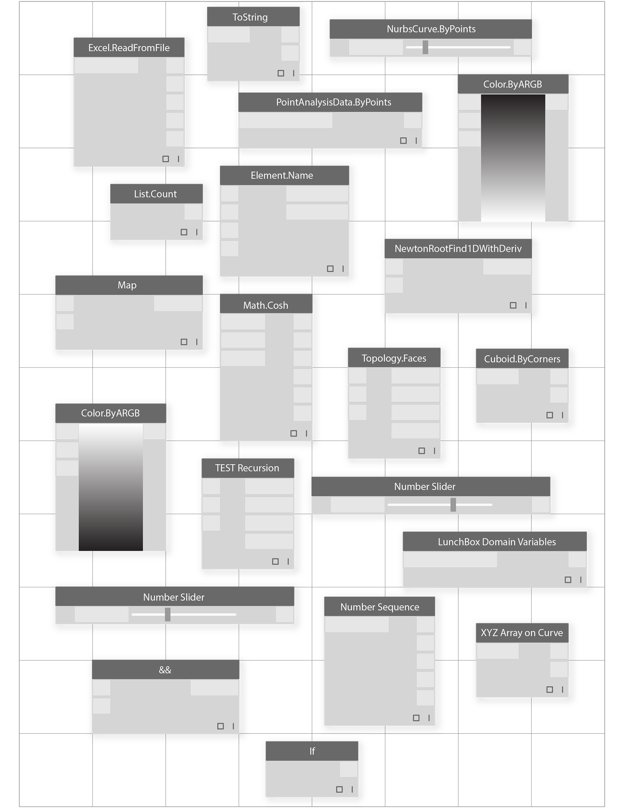

# LOS BLOQUES DE CONSTRUCCIÓN DE LOS PROGRAMAS

Una vez que estemos listos para profundizar en el desarrollo de programas visuales, necesitaremos una mejor comprensión de los componentes de construcción que utilizaremos. En este capítulo, se presentan conceptos fundamentales sobre los datos: el contenido que recorre los cables de nuestro programa de Dynamo.

