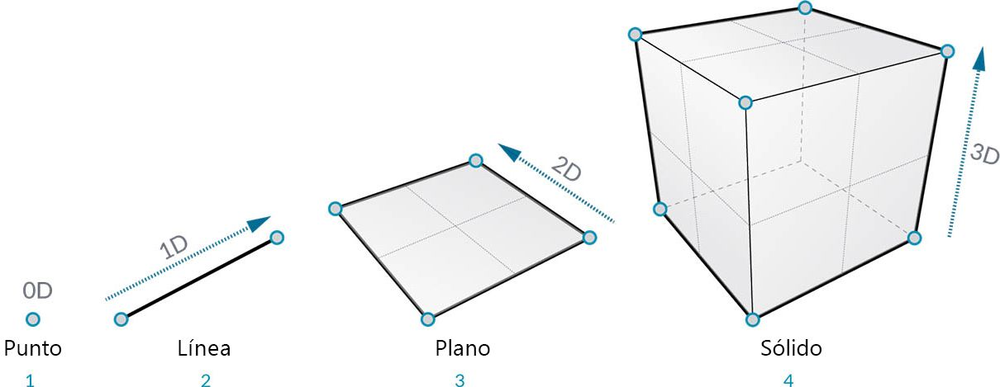
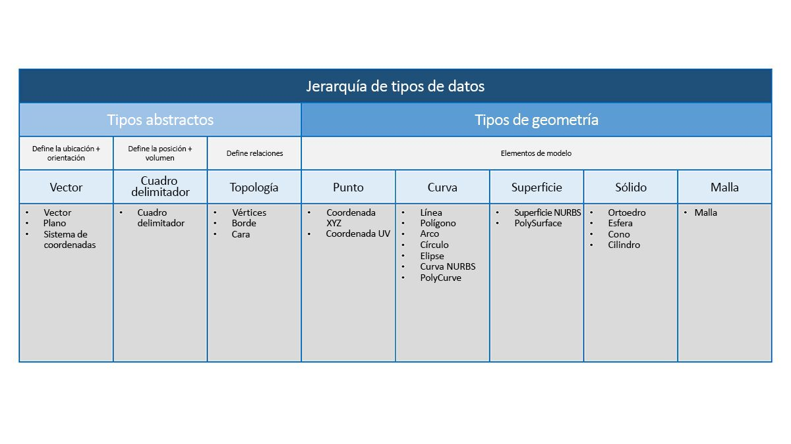

## Descripción general de la geometría
La **geometría** es el idioma del diseño. Cuando un lenguaje o un entorno de programación tienen un núcleo de geometría, podemos descubrir las posibilidades del diseño de modelos precisos y sólidos, la automatización de las rutinas de diseño y la creación de iteraciones de diseño con algoritmos.

### Conceptos básicos
La geometría se define tradicionalmente como el estudio de la forma, el tamaño y la posición relativa de las figuras y las propiedades del espacio. Este campo tiene una historia muy rica que se remonta a miles de años. Con la llegada y la popularización de la informática, disponemos de una poderosa herramienta para definir, explorar y generar geometría. Ahora es muy fácil calcular el resultado de interacciones geométricas complejas y lo hacemos de forma casi transparente.

> Si tiene curiosidad por comprobar lo diversa y compleja que puede ser la geometría mediante la potencia de su ordenador, realice una búsqueda rápida en la Web del conejito de Stanford (o "Stanford Bunny"), un modelo canónico que se utiliza para probar algoritmos.

Comprender la geometría en el contexto de los algoritmos, la informática y la complejidad puede parecer una tarea abrumadora. Sin embargo, existen algunos principios clave y relativamente sencillos que podemos establecer como base para empezar a crear aplicaciones más avanzadas:

1. La geometría se compone de **datos**: para el ordenador y Dynamo, un conejito no se diferencia mucho de un número.
2. La geometría se basa en la **abstracción**: sobre todo, los elementos geométricos se describen mediante números, relaciones y fórmulas dentro de un sistema de coordenadas espacial específico.
3. La geometría tiene una **jerarquía**: los puntos se combinan para crear líneas, las líneas se unen para crear superficies, etc.
4. La geometría describe simultáneamente **la parte y el todo**: cuando tenemos una curva, se tiene en cuenta tanto la forma como todos los posibles puntos a lo largo de ella.

En la práctica, estos principios nos indican que debemos tener en cuenta con qué tipo de geometría estamos trabajando (qué tipo de geometría, cómo se creó, etc.) para poder crear, descomponer y recomponer de forma fluida diferentes geometrías a medida que desarrollamos modelos más complejos.

### Recorrido por la jerarquía
Dediquemos un momento a observar la relación entre las descripciones abstractas y jerárquicas de la geometría. Como estos dos conceptos están relacionados, pero esto no es siempre evidente al principio, podemos encontrarnos rápidamente con un bloqueo conceptual una vez que empezamos a desarrollar flujos de trabajo o modelos más profundos. Para empezar, vamos a usar la dimensionalidad como un sencillo descriptor del "material" que modelamos. El número de dimensiones necesarias para describir una forma nos muestra cómo organizar la forma en que la geometría se organiza jerárquicamente.

> 1. Un **punto** (definido por coordenadas) no tiene ninguna dimensión asociada; son solo números que describen cada coordenada.
2. Una **línea** (definida por dos puntos) tiene ahora *una* dimensión; podemos "recorrer" la línea hacia delante (dirección positiva) o hacia atrás (dirección negativa).
3. Un **plano** (definido por dos líneas) tiene *dos* dimensiones: es posible desplazarse más a la izquierda o más a la derecha.
4. Un **cubo** (definido por dos planos) tiene *tres* dimensiones: se puede definir una posición hacia arriba o hacia abajo.

La dimensionalidad es un método práctico para empezar a organizar en categorías la geometría, pero no es necesariamente el mejor. Después de todo, no modelamos solo puntos, líneas, planos y cuadros, ¿qué ocurre si deseo utilizar un elemento curvado? Además, existe toda una categoría adicional de tipos geométricos que son totalmente abstractos; por ejemplo, definen propiedades como la orientación, el volumen o las relaciones entre las partes. No podemos realmente agarrar un vector, así que, ¿cómo lo definimos en relación con lo que vemos en el espacio? Una categorización más detallada de la jerarquía geométrica debería incluir la diferencia entre los tipos abstractos o "ayudas", que podemos agrupar por lo que ayudan a hacer, y los tipos que ayudan a describir la forma de los elementos del modelo.

### Geometría en Dynamo Sandbox

¿Cómo se refleja esto al utilizar Dynamo? Conocer los tipos de geometría y cómo se relacionan nos permitirá desplazarnos por la colección de **nodos de geometría** disponibles en la biblioteca. Los nodos de geometría se organizan alfabéticamente en lugar de jerárquicamente; aquí se muestran de forma similar a su presentación en la interfaz de Dynamo.

Además, la creación de modelos en Dynamo y la conexión de la vista preliminar de lo que aparece en la vista preliminar en segundo plano al flujo de datos del gráfico deberían ser procesos más intuitivos con el tiempo.

> 1. Observe el supuesto sistema de coordenadas renderizado por la rejilla y los ejes coloreados.
3. Los nodos seleccionados renderizarán la geometría correspondiente (si el nodo crea la geometría) en segundo plano con el color resaltado.

> Descargue el archivo de ejemplo que acompaña a esta imagen (haga clic con el botón derecho y seleccione "Guardar vínculo como..."): [Geometry for Computational Design - Geometry Overview.dyn](datasets/5-1/Geometry for Computational Design - Geometry Overview.dyn). En el Apéndice, se incluye una lista completa de los archivos de ejemplo.

### Uso de la geometría para ir al siguiente nivel
La creación de modelos en Dynamo no se limita a lo que se puede generar con nodos. A continuación, se indican algunas formas clave para llevar el proceso al siguiente nivel con la geometría:

1. Dynamo permite importar archivos: pruebe a utilizar un archivo CSV para nubes de puntos o SAT para incorporar superficies.
2. Al trabajar con Revit, podemos hacer referencia a los elementos de Revit que se utilizarán en Dynamo.
3. Dynamo Package Manager ofrece funciones adicionales para operaciones y tipos de geometría ampliados; consulte el paquete de [Kit de herramientas de malla](https://github.com/DynamoDS/Dynamo/wiki/Dynamo-Mesh-Toolkit).

