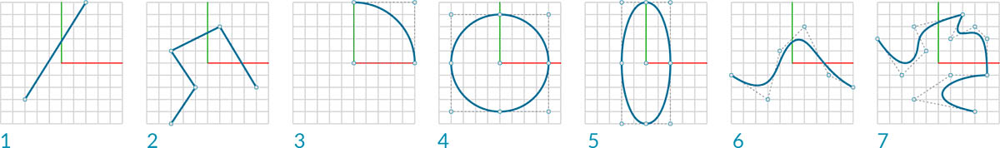
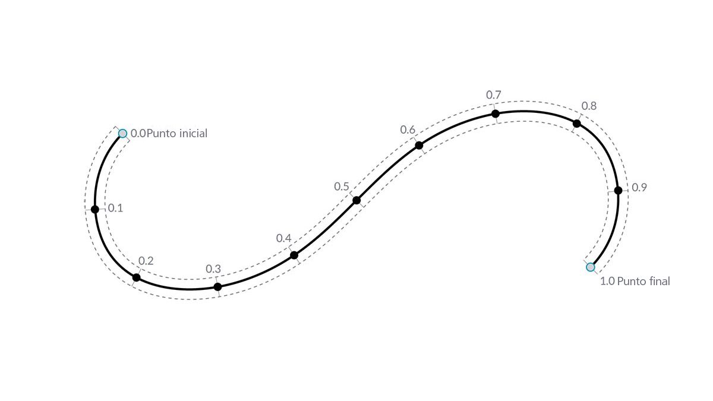
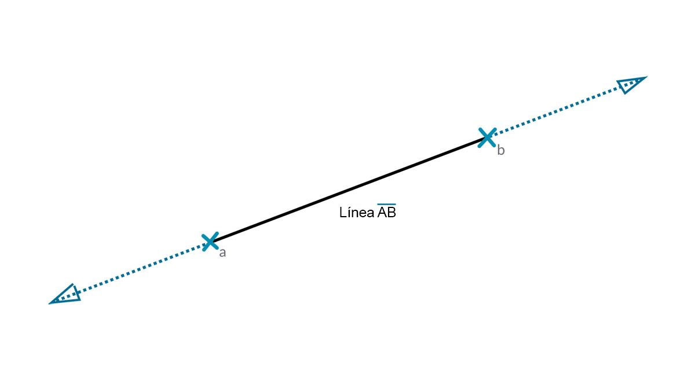

## Curvas

Las curvas son el primer tipo de datos geométricos abordado que presenta un conjunto más familiar de propiedades descriptivas de forma... ¿Qué grado de curvatura o rectitud? ¿Cómo de larga o corta? Recuerde que los puntos siguen siendo nuestros bloques de construcción para definir cualquier elemento, desde una línea a una spline y todos los tipos de curva intermedios.



> 1. Línea
2. Polilínea
3. Arco
4. Círculo
5. Elipse
6. Curva NURBS
7. PolyCurve

### ¿Qué es una curva?

El término **curva** suele ser un comodín parta todo tipo de formas curvas (incluso aunque adopten un aspecto recto). La curva en su sentido primordial es la categorización principal de todos estos tipos de forma: líneas, círculos, splines, etc. Desde una perspectiva más técnica, una curva describe cada punto posible que se puede encontrar introduciendo "t" en una conjunto de funciones, que pueden ir desde la sencilla función (```x = -1,26*t, y = t```) hasta funciones que implican cálculo. Independientemente del tipo de curva con el que trabajemos, este **parámetro** denominado "t" es una propiedad que se puede evaluar. Además, independientemente del aspecto de la forma, todas las curvas tienen también un punto inicial y un punto final, que se alinean de forma coincidente con los valores t mínimo y máximo utilizados para crear la curva. Esto también nos ayuda a comprender su direccionalidad.



> Es importante tener en cuenta que Dynamo presupone que el dominio de los valores "t" de una curva se entiende como de 0.0 a 1.0.

Todas las curvas también poseen una serie de propiedades o características que se pueden utilizar para describirlas o analizarlas. Cuando la distancia entre los puntos inicial y final es cero, la curva es "cerrada". Además, cada curva tiene varios puntos de control; si todos estos puntos se encuentran en el mismo plano, la curva es "plana". Algunas propiedades se aplican a la curva como un todo, mientras que otras solo se aplican a puntos específicos a lo largo de la curva. Por ejemplo, la planaridad es una propiedad global, mientras que un vector tangente en un valor t especificado es una propiedad local.

### Líneas

Las **líneas** son la forma más sencilla de las curvas. Puede que no parezcan curvadas, pero en realidad son curvas, solo que no tienen ninguna curvatura. Existen varias formas diferentes de crear líneas; el más intuitivo desde el punto A al punto B. La forma de la línea AB se dibujará entre los puntos, pero matemáticamente se extiende infinitamente en ambas direcciones.



Cuando conectamos dos líneas, tenemos una **polilínea**. Aquí tenemos una representación directa de lo que es un punto de control. Si se edita cualquiera de estas ubicaciones de punto, cambiará la forma de la polilínea. Si la polilínea está cerrada, se trata de un polígono. Si todas las longitudes de arista del polígono son iguales, se describe como normal.


### Arcos, círculos, arcos elípticos y elipses

A medida que se añade más complejidad a las funciones paramétricas que definen una forma, podemos ir un poco más allá de la línea y crear un **arco**, un **círculo**, un **arco elíptico** o una **elipse** mediante la descripción de uno o dos radios. Las diferencias entre la versión de arco y el círculo o la elipse se encuentran en si la forma está cerrada o no.


### NURBS + PolyCurves

**NURBS** (Non-uniform Rational Basis Splines, splines de base racionales no uniformes) son representaciones matemáticas que pueden modelar con precisión cualquier forma, desde líneas, círculos, arcos o rectángulos bidimensionales sencillos a la curva orgánica tridimensional de forma libre más compleja. Gracias a su flexibilidad (hay relativamente pocos puntos de control, aunque la interpolación suave se basa en parámetros de grado) y su precisión (vinculada a complejas operaciones matemáticas), los modelos NURBS se pueden utilizar en cualquier proceso, desde la ilustración y la animación hasta la fabricación.


**Grado**: el grado de la curva determina el rango de influencia que los puntos de control tienen en una curva; cuanto mayor sea el grado, mayor será el rango. El grado es un número entero positivo. Este número suele ser 1, 2, 3 o 5, pero puede ser cualquier número entero positivo. Las líneas y las polilíneas NURBS suelen ser de grado 1 y la mayoría de las curvas de forma libre son de grado 3 o 5.

**Puntos de control**: los puntos de control son una lista de puntos de al menos grado+1. Una de las formas más fáciles de cambiar la forma de una curva NURBS es desplazar sus puntos de control.

**Grosor**: los puntos de control tienen un número asociado denominado grosor. Los grosores son normalmente números positivos. Cuando todos los puntos de control de una curva tienen el mismo grosor (normalmente, 1), la curva se denomina no racional; de lo contrario, la curva se denomina racional. La mayoría de las curvas NURBS son no racionales.

**Nudos**: los nudos son una lista de números (grado+N-1), donde N es el número de puntos de control. Los nudos se utilizan junto con los grosores para controlar la influencia de los puntos de control en la curva resultante. Por ejemplo, los nudos se pueden utilizar para crear puntos de torsión en determinados puntos de la curva.


> 1. Grado = 1
2. Grado = 2
3. Grado = 3

Tenga en cuenta que cuanto mayor sea el valor de grado, más puntos de control se utilizarán para interpolar la curva resultante.

Vamos a crear una curva de seno en Dynamo mediante dos métodos diferentes para crear curvas NURBS a fin de comparar los resultados.


> 1. *NurbsCurve.ByControlPoints* utiliza la lista de puntos como puntos de control.
2. *NurbsCurve.ByPoints* dibuja una curva a través de la lista de puntos.
> Descargue el archivo de ejemplo que acompaña a esta imagen (haga clic con el botón derecho y seleccione "Guardar vínculo como..."): [Geometry for Computational Design - Curves.dyn](datasets/5-4/Geometry for Computational Design - Curves.dyn). En el Apéndice, se incluye una lista completa de los archivos de ejemplo.

