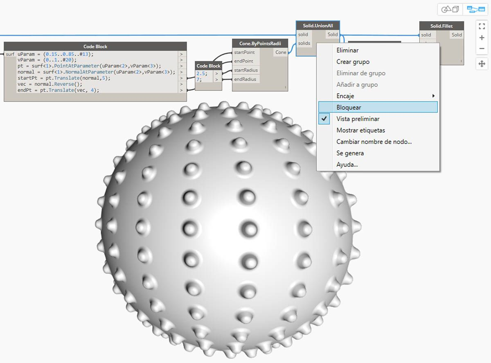
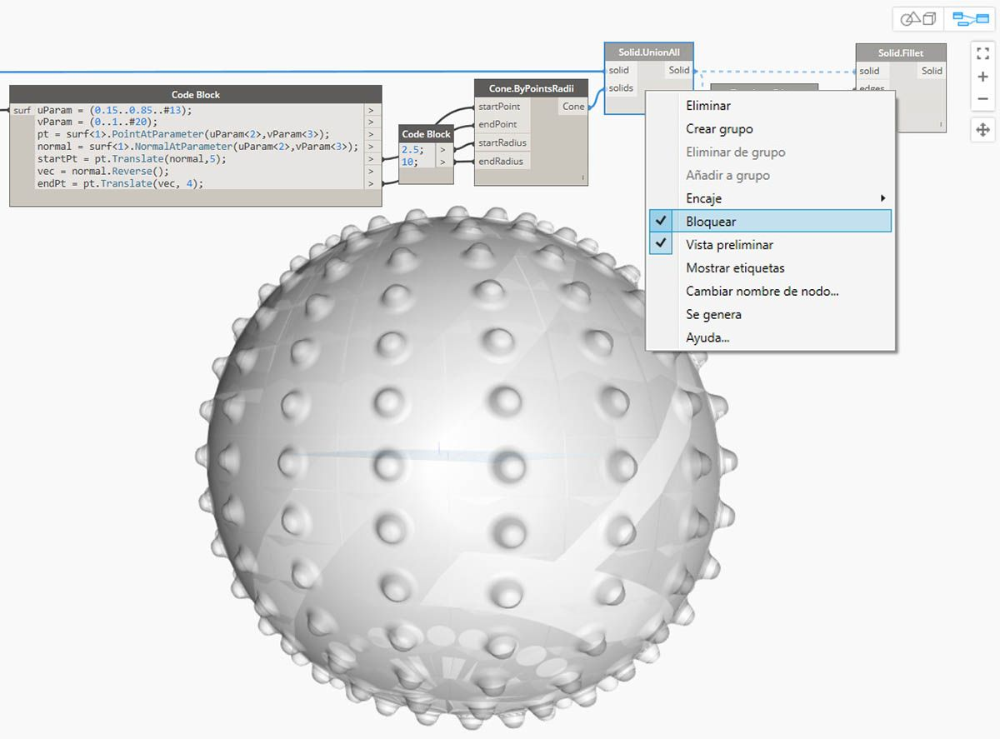

## Sólidos

Si deseamos crear modelos más complejos que no se puedan crear a partir de una única superficie o si queremos definir un volumen explícito, debemos aventurarnos en el terreno de los sólidos (y las PolySurfaces). Incluso un cubo sencillo es lo suficientemente complejo como para necesitar seis superficies, una por cara. Los sólidos proporcionan acceso a dos conceptos clave que las superficies no ofrecen: una descripción topológica más refinada (caras, aristas y vértices) y operaciones booleanas.

### ¿Qué es un sólido?

Los sólidos constan de una o varias superficies que contienen volumen a partir de un contorno cerrado que define lo que está "dentro" o "fuera". Independientemente de cuántas superficies haya, estas deben formar un volumen "hermético" para que se considere un sólido. Los sólidos se pueden crear mediante la unión de superficies o PolySurfaces, o mediante operaciones como, por ejemplo, solevación, barrido y revolución. Las primitivas de esfera, cubo, cono y cilindro también son sólidos. Un cubo con al menos una cara eliminada se considera una PolySurface, que tiene algunas propiedades similares, pero no es un sólido.

> 1. Un plano está compuesto por una única superficie y no es un sólido.
2. Una esfera está formada por una única superficie, pero *es* un sólido.
3. Un cono está formado por dos superficies unidas para crear un sólido.
4. Un cilindro está formado por tres superficies unidas para crear un sólido.
5. Un cubo está formado por seis superficies unidas para crear un sólido.

### Topología

Los sólidos se componen de tres tipos de elementos: vértices, aristas y caras. Las caras son las superficies que conforman el sólido. Las aristas son las curvas que definen la conexión entre las caras adyacentes y los vértices son los puntos inicial y final de esas curvas. Estos elementos se pueden consultar mediante los nodos de topología.

> 1. Caras
2. Aristas
3. Vértices

### Operaciones

Los sólidos se pueden modificar mediante empalmes o achaflanados de sus aristas para eliminar esquinas y ángulos agudos. La operación de chaflán crea una superficie reglada entre dos caras, mientras que un empalme se fusiona entre las caras para mantener la tangencia. 

> 1. Cubo sólido
2. Cubo achaflanado
3. Cubo empalmado

### Operaciones booleanas

Las operaciones booleanas de sólidos son métodos para combinar dos o más sólidos. Una única operación booleana implica realmente la realización de cuatro operaciones:

1. **Interseque** dos o más objetos.
2. **Divídalos** en las intersecciones.
3. **Suprima** las partes no deseadas de la geometría.
4. **Una** todo de nuevo.

De este modo, las operaciones booleanas de sólidos permiten ahorrar mucho tiempo. Existen tres operaciones booleanas de sólidos que distinguen las partes de la geometría que se conservan. 

> 1. **Unión:** elimine las partes que se solapan de los sólidos y únalas en un único sólido.
2. **Diferencia:** reste un sólido a otro. El sólido que se va a restar se conoce como herramienta. Tenga en cuenta que puede cambiar el sólido que será la herramienta para conservar el volumen inverso.
3. **Intersección:** conserve solo el volumen de intersección de los dos sólidos.

Además de estas tres operaciones, Dynamo incluye los nodos **Solid.DifferenceAll** y **Solid.UnionAll** para realizar operaciones de diferencia y unión con varios sólidos. 

> 1. **UnionAll:** operación de unión con esfera y conos orientados hacia fuera.
2. **DifferenceAll:** operación de diferencia con esfera y conos orientados hacia dentro.

Vamos a utilizar algunas operaciones booleanas para crear una bola llena de puntas.

> 1. **Sphere.ByCenterPointRadius**: cree el sólido base.
2. **Topology.Faces**, **Face.SurfaceGeometry**: consulte las caras del sólido y conviértalas en geometría de superficie; en este caso, la esfera solo tiene una cara.
3. **Cone.ByPointsRadii**: cree conos mediante puntos en la superficie.
4. **Solid.UnionAll**: una los conos y la esfera.
5. **Topology.Edges**: consulte las aristas del nuevo sólido.
6. **Solid.Fillet**: empalme las aristas de la bola llena de puntas.
> Descargue los archivos de ejemplo que acompañan a esta imagen (haga clic con el botón derecho y seleccione "Guardar enlace como..."). En el Apéndice, se incluye una lista completa de los archivos de ejemplo. [Geometry for Computational Design - Solids.dyn](datasets/5-6/Geometry for Computational Design - Solids.dyn)

### Bloqueo

Las operaciones booleanas son complejas y pueden resultar lentas de calcular. Utilice la función Bloquear para suspender la ejecución de nodos seleccionados y nodos descendentes afectados.

> Utilice el menú contextual para bloquear la operación de unión de sólidos.

> El nodo seleccionado y todos los nodos descendentes se previsualizan en modo atenuado con un color gris claro y los cables afectados se muestran como líneas continuas. La vista preliminar de la geometría afectada también se mostrará atenuada. Ahora puede cambiar los valores ascendentes sin calcular la unión booleana.

> Para desbloquear los nodos, haga clic con el botón derecho y desactive la opción Bloquear.

> Todos los nodos afectados y las vistas preliminares de la geometría asociada se actualizarán y se restablecerán al modo de vista preliminar estándar.

