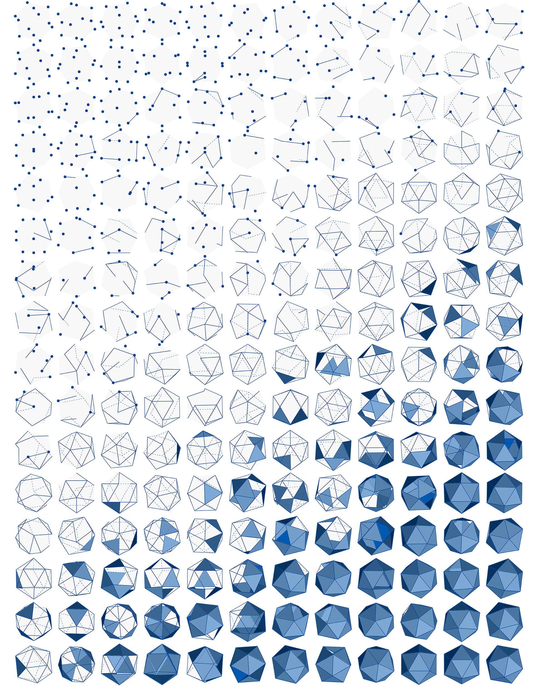

# GEOMETRÍA PARA EL DISEÑO COMPUTACIONAL

Dynamo, un entorno de programación visual, le permite diseñar la forma en que se procesan los datos. Los datos son números o texto, pero también lo es la geometría. Tal y como lo entiende el equipo, la geometría (denominada a veces geometría computacional) son los datos que se pueden utilizar para crear modelos atractivos, complejos o basados en el rendimiento. Para ello, debemos conocer los pormenores de los diversos tipos de geometría que podemos utilizar.

