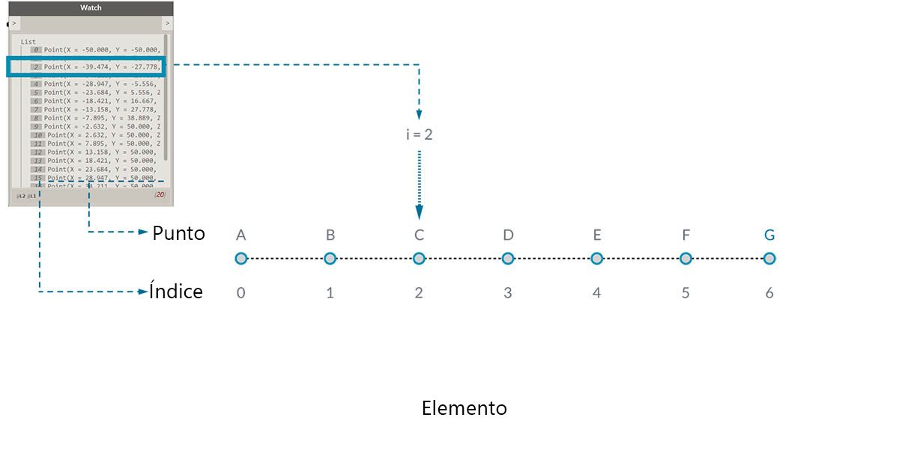
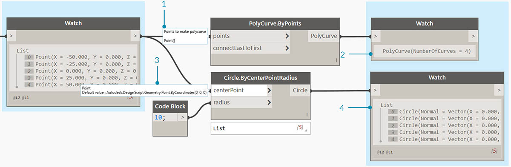
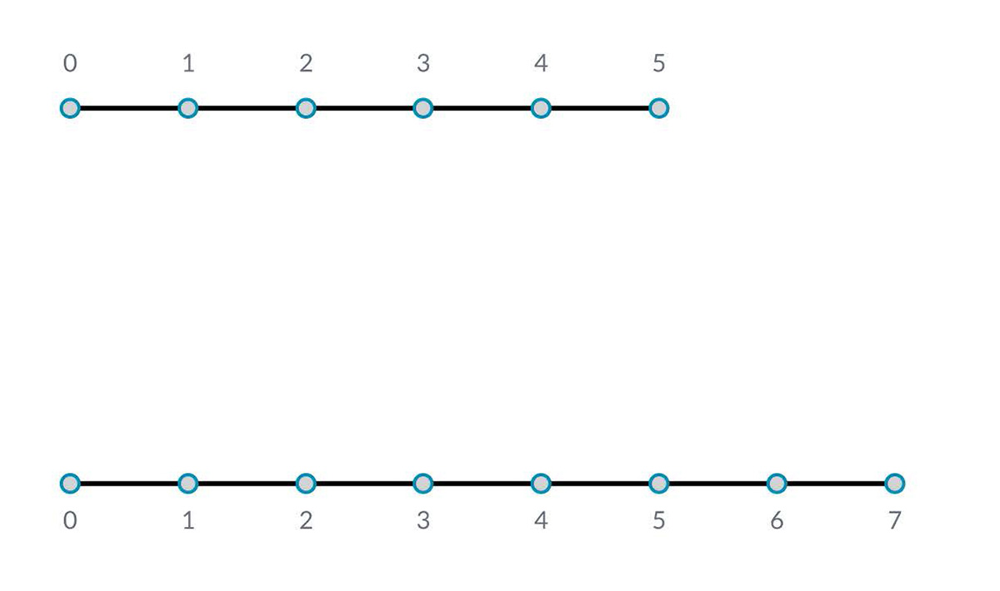
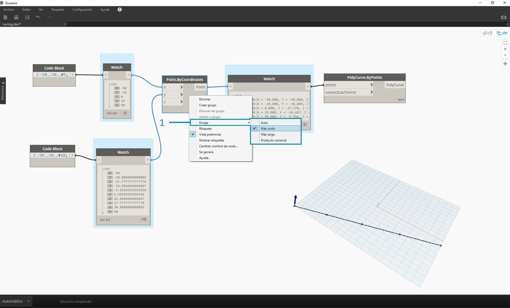
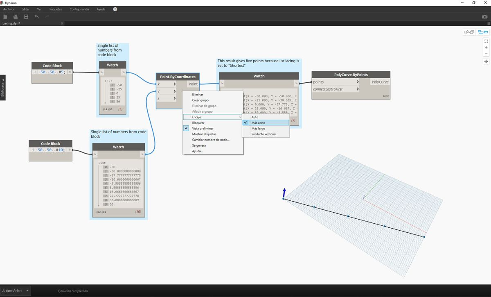
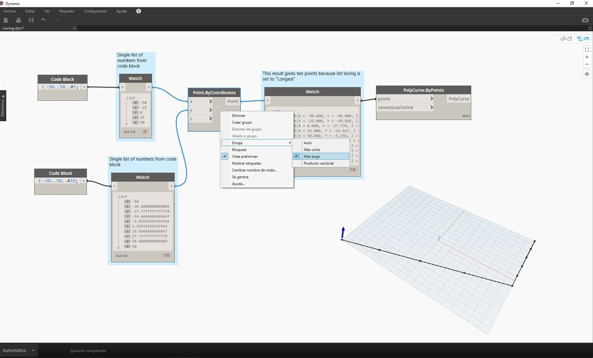
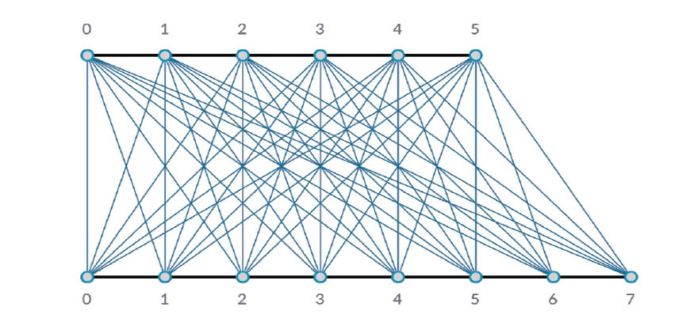
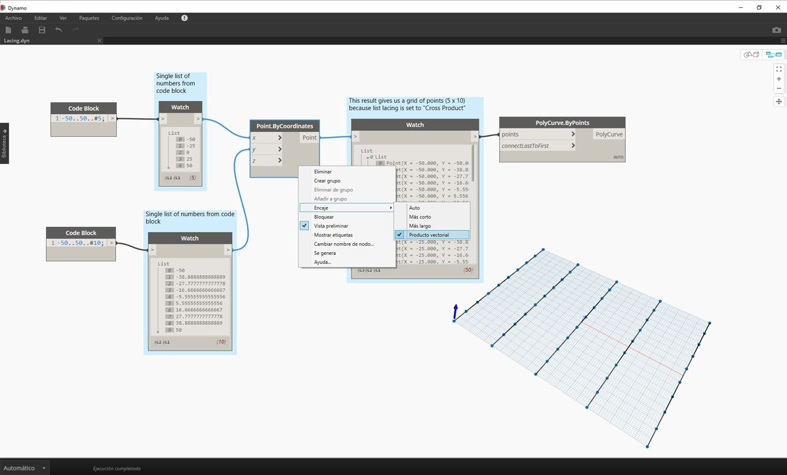

## ¿Qué es una lista?

Una lista es un conjunto de elementos o ítems. Pensemos en un racimo de plátanos, por ejemplo. Cada plátano es un elemento de la lista (o racimo). Es más fácil coger un racimo de plátanos que cada plátano individualmente, y lo mismo se aplica a la agrupación de elementos por relaciones paramétricas en una estructura de datos.

> Foto de [Augustus Binu](https://commons.wikimedia.org/wiki/File:Bananas_white_background_DS.jpg?fastcci_from=11404890&c1=11404890&d1=15&s=200&a=list).

Cuando hacemos la compra, ponemos todos los artículos comprados en una bolsa. Esta bolsa también es una lista. Si vamos a hacer pan de plátano, necesitamos tres racimos de plátanos (vamos a hacer *mucho* pan de plátano). La bolsa representa una lista de racimos de plátanos y cada racimo representa una lista de plátanos. La bolsa es una lista de listas (bidimensional) y el plátano es una lista (unidimensional).

En Dynamo, los datos de las listas se ponen en orden y el primer elemento de cada lista tiene un índice "0". A continuación, vamos a ver cómo se definen las listas en Dynamo y cómo se relacionan varias listas entre sí.

## Índices basados en cero

Algo que podría parecer extraño al principio es que el primer índice de una lista es siempre 0; no 1. Por lo tanto, cuando hablamos del primer elemento de una lista, en realidad nos referimos al elemento que corresponde al índice 0.

Por ejemplo, si tuviéramos que contar el número de dedos que tenemos en la mano derecha, es probable que contáramos del 1 al 5. Sin embargo, si tuviéramos que poner los dedos en una lista, Dynamo les asignaría los índices del 0 al 4. Aunque esto puede parecer un poco extraño para programadores principiantes, el índice de base cero es una práctica estándar en la mayoría de los sistemas de cálculo.

Tenga en cuenta que sigue habiendo cinco elementos en la lista; solo que la lista utiliza un sistema de recuento basado en cero. Y los elementos que se almacenan en la lista no solo pueden ser números. Pueden ser cualquier tipo de datos compatible con Dynamo, como puntos, curvas, superficies, familias, etc.

A menudo, la forma más sencilla de echar un vistazo al tipo de datos almacenados en una lista es conectar un nodo Watch con la salida de otro nodo. Por defecto, el nodo Watch muestra automáticamente todos los índices en el lado izquierdo de la lista y los elementos de datos en el lado derecho.

Estos índices son elementos decisivos cuando se trabaja con listas.

### Entradas y salidas

Las entradas y las salidas, que pertenecen a las listas, varían en función del nodo de Dynamo que se utilice. Como ejemplo, vamos a utilizar una lista de cinco puntos y a conectar esta salida a dos nodos de Dynamo diferentes: *PolyCurve.ByPoints* y *Circle.ByCenterPointRadius*:

> 1. La entrada *points* de *PolyCurve.ByPoints* busca *"Point[]"*. Esto representa una lista de puntos.
2. La salida de *PolyCurve.ByPoints* es una PolyCurve única creada a partir de una lista de cinco puntos.
3. La entrada *centerPoint* de *Circle.ByCenterPointRadius* solicita *"Point"*.
4. La salida de *Circle.ByCenterPointRadius* es una lista de cinco círculos cuyos centros corresponden a la lista original de puntos.

Los datos de entrada de *PolyCurve.ByPoints* y *Circle.ByCenterPointRadius* son los mismos; sin embargo, el nodo PolyCurve nos proporciona una PolyCurve, mientras que el nodo Círculo nos proporciona cinco círculos con centros en cada punto. Esto resulta intuitivo: la PolyCurve se dibuja como una curva que conecta los 5 puntos, mientras que los círculos crean un círculo distinto en cada punto. Entonces, ¿qué ocurre con los datos?

Al pasar el cursor sobre la entrada *points* de *Polycurve.ByPoints*, vemos que la entrada busca *"Point[]"*. Observe los corchetes que aparecen al final. Este elemento representa una lista de puntos y, para crear una PolyCurve, la entrada debe ser una lista para cada PolyCurve. Por tanto, este nodo condensará cada lista en una PolyCurve.

Por otra parte, la entrada *centerPoint* de *Circle.ByCenterPointRadius* solicita *"Point"*. Este nodo busca un punto, como elemento, para definir el centro del círculo. Por este motivo, se obtienen cinco círculos a partir de los datos de entrada. Reconocer esta diferencia en las entradas de Dynamo ayuda a comprender mejor cómo funcionan los nodos al administrar los datos.

### Encaje

La correspondencia de datos es un problema sin una solución definitiva. Se produce cuando un nodo tiene acceso a entradas de distinto tamaño. El cambio del algoritmo de correspondencia de datos puede dar lugar a resultados muy diferentes.

Imagine un nodo que crea segmentos de línea entre puntos (Line.ByStartPointEndPoint). Tendrá dos parámetros de entrada y ambos proporcionarán coordenadas de punto:

Como puede ver, existen diferentes métodos para dibujar líneas entre estos conjuntos de puntos. Las opciones de encaje se encuentran haciendo clic con el botón derecho en el centro de un nodo y eligiendo el menú "Encaje".

### Archivo base

> Descargue el archivo de ejemplo que acompaña a este ejercicio (haga clic con el botón derecho y seleccione "Guardar enlace como..."): [Lacing.dyn](datasets/6-1/Lacing.dyn). En el Apéndice se incluye una lista completa de los archivos de ejemplo.

Para realizar una demostración de las operaciones de encaje desarrolladas a continuación, utilizaremos este archivo base para definir la lista más corta, la más larga y el producto cartesiano.

> 1. Cambiaremos el encaje en *Point.ByCoordinates*, pero no cambiaremos nada más en el gráfico anterior.

#### Lista más corta

La forma más sencilla es conectar las entradas una a una hasta que uno de los flujos se acabe. Esto se denomina algoritmo "Lista más corta". Este es el comportamiento por defecto de los nodos de Dynamo:

> Al cambiar el encaje a la *lista más corta*, obtenemos una línea diagonal básica compuesta de cinco puntos. Cinco puntos es la longitud de la lista menor, de modo que el encaje de la lista más corta se detiene cuando alcanza el final de una lista.

#### Lista más larga

El algoritmo "Lista más larga" sigue conectando entradas, reutilizando elementos, hasta que todos los flujos se acaben:

> Al cambiar el encaje a la *lista más larga*, obtenemos una línea diagonal que se extiende verticalmente. Con el mismo método que el diagrama conceptual, el último elemento de la lista de 5 elementos se repetirá para alcanzar la longitud de la lista más larga.

#### Producto cartesiano

Por último, el método "Producto cartesiano" hace todas las conexiones posibles:

> Al cambiar el encaje a *Producto cartesiano*, obtenemos todas las combinaciones entre cada lista, lo que nos proporciona una rejilla de puntos de 5 x 10. Esta es una estructura de datos equivalente al producto cartesiano que se muestra en el diagrama de conceptos anterior, excepto que nuestros datos son ahora una lista de listas. Al conectar una PolyCurve, podemos ver que cada lista está definida por su valor X, lo que nos da una fila de líneas verticales.

